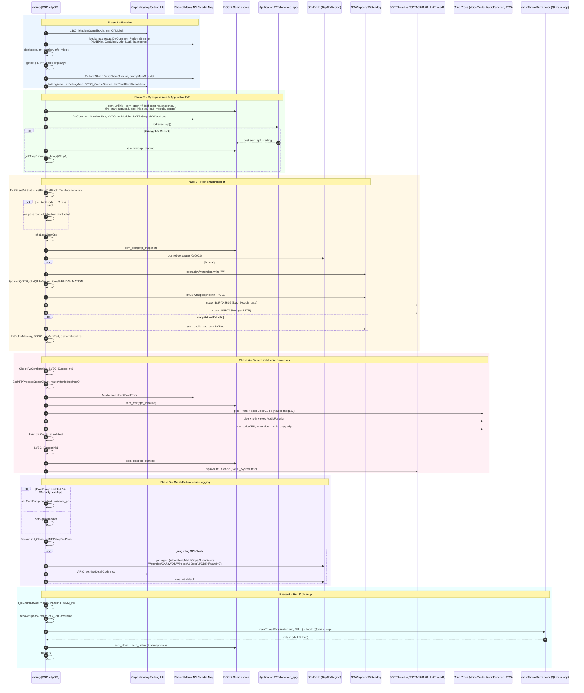

# `main` function

Dưới đây là sequence diagram mức high level của `main()` trong `main_BSP.cpp` (dòng 2275–3803), cho build thực tế trên máy (`!FUM_LINUX`). Tôi đã đọc toàn bộ hàm để vẽ.

```mermaid
sequenceDiagram
    autonumber
    participant Main as main() [BSP, mfp000]
    participant Lib as Capability/Log/Setting Lib
    participant Shm as Shared Mem / NV / Media Map
    participant Sem as POSIX Semaphores
    participant APF as Application P/F (forkexec_apf)
    participant SPI as SPI-Flash (BspThrRegion)
    participant OSW as OSWrapper / Watchdog
    participant T as BSP Threads (BSPTASK01/02, InitThread2)
    participant Child as Child Procs (VoiceGuide, AudioFunction, POS)
    participant Qt as mainThreadTerminator (Qt main loop)

    rect rgb(235,245,255)
    Note over Main,Shm: Phase 1 – Early init
    Main->>Lib: LIBG_initializeCapabilityLib, set_CPULimit
    Main->>Shm: Media map setup, DivCommon_PerformShm init<br/>(HddExist, CardLineMode, LogEnhancement)
    Main->>Main: sigaltstack, init_section, mfp_mlock
    Main->>Main: getopt (-d/-l/-f), parse argc/argv
    Main->>Shm: PerformShm / DivlibShareShm init, dmmyMemSize.dat
    Main->>Lib: InitLogArea, InitSettingArea, SYSC_CreateService, InitPanelHardResolution
    end

    rect rgb(240,255,240)
    Note over Main,APF: Phase 2 – Sync primitives & Application P/F
    Main->>Sem: sem_unlink + sem_open ×7 (apf_starting, snapshot,<br/>fire_start, appLoad, app_initialize, load_module, optapp)
    Main->>Shm: DivCommon_Shm.initShm, NVDG_InitModule, SoftDipSw.preNVDataLoad
    Main->>APF: forkexec_apf()
    alt không phải Reboot
        APF-->>Sem: post sem_apf_starting
        Main->>Sem: sem_wait(apf_starting)
        Main->>Main: getSnapShot(warp_boot) [Warp!!]
    end
    end

    rect rgb(255,248,230)
    Note over Main,OSW: Phase 3 – Post-snapshot boot
    Main->>Main: THRF_setAPStatus, setFatalCallBack, TaskMonitor event
    opt uc_BootMode == 7 (line card)
        Main->>Main: xóa pass root /etc/shadow, start sshd
    end
    Main->>Main: chkLoopBootCnt
    Main->>Sem: sem_post(mfp_snapshot)
    Main->>SPI: đọc reboot cause (0x0002)
    opt bl_warp
        Main->>OSW: open /dev/watchdog, write "W"
    end
    Main->>Main: tạo msgQ STR, chkQtLibVersion, /dev/fb ENDANIMATION
    Main->>OSW: initOSWrapper(shellInit / NULL)
    Main->>T: spawn BSPTASK02 (load_Module_task)
    Main->>T: spawn BSPTASK01 (taskSTR)
    opt warp && wdtFd valid
        Main->>OSW: start_cyclicLoop_taskSoftDog
    end
    Main->>Main: InitBufferMemory, DBGG_InitMemPart, platformInitialize
    end

    rect rgb(255,240,245)
    Note over Main,Child: Phase 4 – System init & child processes
    Main->>Main: CheckFwCombination, SYSC_SystemInit0
    Main->>Main: SetMFPProcessStatusCheck, makeMfpModuleMsgQ
    Main->>Shm: Media map checkFatalError
    Main->>Sem: sem_wait(app_initialize)
    Main->>Child: pipe + fork + exec VoiceGuide (nếu có mpg123)
    Main->>Child: pipe + fork + exec AudioFunction
    Main->>Child: set rtprio/CPU, write pipe → child chạy tiếp
    Main->>Main: kiểm tra Crypto lib self-test
    Main->>Main: SYSC_SystemInit1
    Main->>Sem: sem_post(fire_starting)
    Main->>T: spawn InitThread2 (SYSC_SystemInit2)
    end

    rect rgb(245,240,255)
    Note over Main,SPI: Phase 5 – Crash/Reboot cause logging
    alt CoreDump enabled && !SecurityLevelUp
        Main->>Main: set CoreDump path/limit, forkexec_pos
    else
        Main->>Main: setSignalHandler
    end
    Main->>Main: Backup.init_Class, setMFPMapFilePass
    loop từng vùng SPI-Flash
        Main->>SPI: get region (reboot/exit/MHU Oops/SuperWarp/<br/>Watchdog/CA72WDT/Wireless/U-Boot/LPDDR4/WarpNG)
        Main->>Lib: APIC_setNewDetailCode / log
        Main->>SPI: clear về default
    end
    end

    rect rgb(235,255,255)
    Note over Main,Qt: Phase 6 – Run & cleanup
    Main->>Main: b_isEndMainWait = True, Panelinit, WDM_init
    Main->>Main: recoverLpddr4Param, chk_RTCAvailable
    Main->>Qt: mainThreadTerminator(prio, NULL) – block (Qt main loop)
    Qt-->>Main: return (khi kết thúc)
    Main->>Sem: sem_close + sem_unlink (7 semaphores)
    Main-->>Main: return 0
    end

```