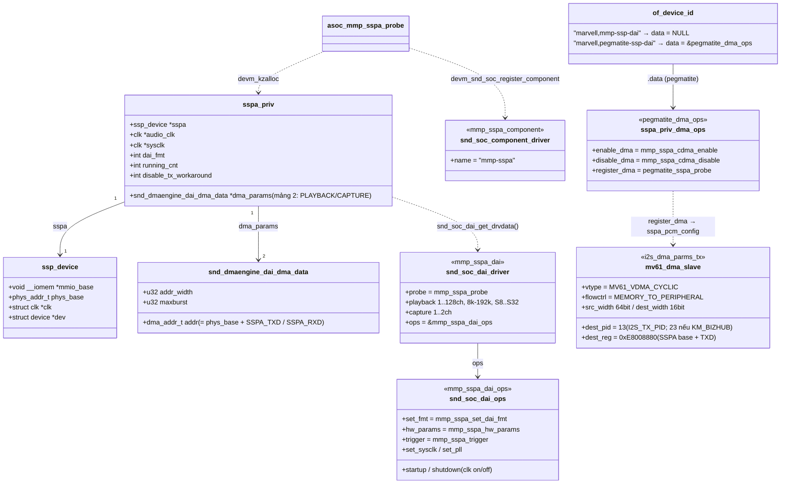
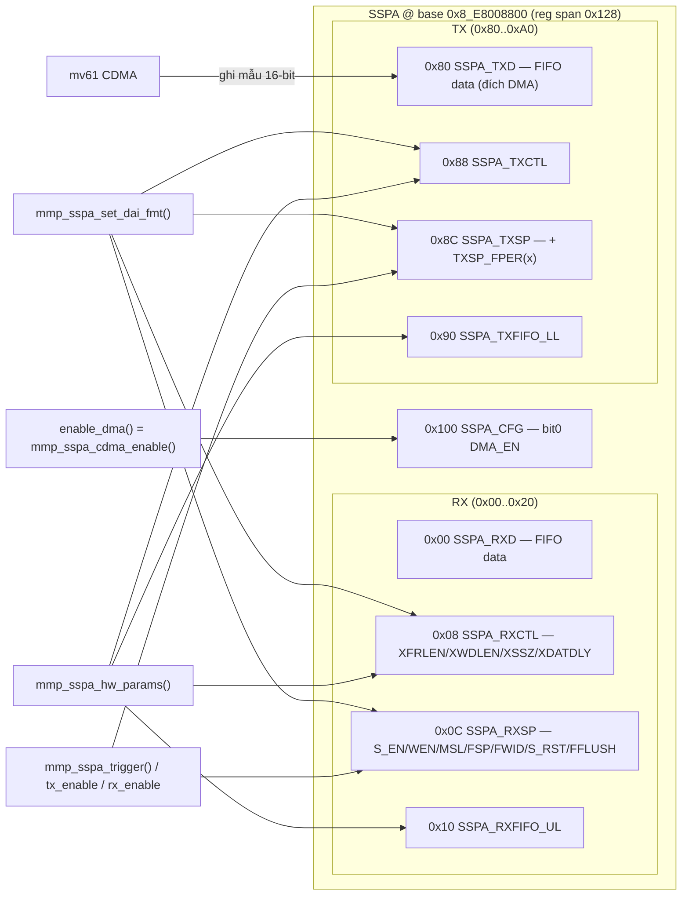

# I2S / SSPA audio driver — K-S800 (Marvell MMP "pegmatite" / quartz-sb)

> Nguồn: đọc trực tiếp source trong `Kernel/K-S800/Src/sound/soc/pxa/` + DT
> `arch/arm64/boot/dts/marvell/quartz-sb.dtsi`.
> (Chạy `/graphify query` trên graph toàn repo `IT6_Kernel` cho kết quả quá nhiễu
> — start-node fuzzy match rơi vào ivtv/ngene/BootROM — nên chuyển sang đọc code thật.)

## Kết luận nhanh

Board này **không có IP tên "i2s"** trong mainline nghĩa thông thường. Bộ điều khiển I2S
của SoC là **SSPA** (*Serial Synchronous Port for Audio*). Toàn bộ đường audio là một
card ASoC gồm 4 mảnh:

| Vai trò ASoC | File | Driver / compatible |
|---|---|---|
| Machine (sound card) | `sound/soc/pxa/s800_rt5640.c` | `s800_rt5640_driver` — `km,s800-audio-rt5640` |
| CPU DAI = **I2S controller** | `sound/soc/pxa/mmp-sspa.c` | `asoc_mmp_sspa_driver` ("mmp-sspa-dai") — `marvell,pegmatite-ssp-dai` |
| Platform (PCM/DMA) | `sound/soc/pxa/pegmatite.c` *(hoặc `mmp-pcm.c`)* | `devm_snd_dmaengine_pcm_register()` trên mv61 CDMA |
| Codec | `sound/soc/codecs/rt5640.c` | `rt5640` (I2C control + I2S data) |

Register offset SSPA: `sound/soc/pxa/mmp-sspa.h`. DMA descriptor: `platform_data/mv61_cdma.h`.

---

## 1. Kiến trúc phân lớp (graph TD)

```mermaid
graph TD
    subgraph Userspace
        APP["ứng dụng ALSA<br/>(aplay / tinyalsa / PulseAudio)"]
    end

    subgraph "Kernel — ALSA core"
        PCM["snd_pcm core<br/>(sound/core/pcm_native.c)"]
        SOCPCM["ASoC soc-pcm<br/>(sound/soc/soc-pcm.c)"]
        SOCCORE["ASoC core<br/>(soc-core.c / soc-dai.c / soc-component.c)"]
    end

    subgraph "Kernel — card ASoC K-S800"
        MACH["Machine driver<br/>s800_rt5640.c<br/>snd_soc_card snd_soc_s800_rt5640<br/>dai_link s800_rt5640_dai"]
        CPUDAI["CPU DAI (I2S controller)<br/>mmp-sspa.c<br/>snd_soc_dai_driver mmp_sspa_dai<br/>+ mmp_sspa_component"]
        PLAT["Platform / PCM<br/>pegmatite.c<br/>snd_dmaengine_pcm (COMPAT, HALF_DUPLEX)"]
        CODEC["Codec DAI<br/>rt5640.c — rt5640-aif1"]
    end

    subgraph "Kernel — bus phụ trợ"
        DMAENG["dmaengine — mv61 CDMA<br/>(cyclic, MEM→PERIPH, dest_pid 13)"]
        I2CBUS["I2C bus<br/>(điều khiển thanh ghi RT5640)"]
        CLK["clk: mmp-audio / mmp-sysclk<br/>(bus_clk trên quartz-sb)"]
        SRAM["SRAM gen_pool \"asram\"<br/>(chỉ nhánh mmp-pcm.c)"]
    end

    subgraph Hardware
        SSPA["Khối SSPA @ 0x8_E8008800<br/>TXD/RXD FIFO, TXSP/RXSP, TXCTL/RXCTL, CFG"]
        RT5640HW["RT5640 codec"]
        SPK["Loa / tai nghe + jack detect GPIO"]
    end

    APP --> PCM --> SOCPCM --> SOCCORE
    SOCCORE --> MACH
    SOCPCM --> CPUDAI
    SOCPCM --> PLAT
    SOCPCM --> CODEC
    MACH -. "phandle km,i2s-controller" .-> CPUDAI
    MACH -. "phandle km,audio-codec" .-> CODEC
    CPUDAI --> CLK
    CPUDAI --> SSPA
    PLAT --> DMAENG --> SSPA
    CPUDAI -. "chọn *_dma_ops theo compatible" .-> PLAT
    CODEC --> I2CBUS --> RT5640HW
    SSPA == "khung I2S: BCLK/LRCLK/SDATA" ==> RT5640HW
    RT5640HW --> SPK
    MACH --> SRAM
```

**Đọc thế nào:** userspace mở thiết bị PCM → ASoC `soc-pcm` fan-out mỗi thao tác xuống
*ba* driver song song: CPU DAI (`mmp-sspa`) lập trình khối SSPA, Platform (`pegmatite`)
xin kênh DMA cyclic, Codec (`rt5640`) chỉnh thanh ghi qua I2C. Machine driver
`s800_rt5640.c` chỉ ghép ba mảnh lại lúc probe qua các phandle trong Device Tree
(`km,i2s-controller`, `km,audio-codec`) và đặt định dạng khung là I2S. Dữ liệu audio
đi thẳng RAM → mv61 CDMA → FIFO `SSPA_TXD`, không qua CPU; SSPA đẩy tiếp ra dây
BCLK/LRCLK/SDATA tới RT5640.

---

## 2. Luồng probe / đăng ký (sequenceDiagram)

```mermaid
sequenceDiagram
    participant OF as "OF / platform bus"
    participant SSPA as "mmp-sspa.c<br/>asoc_mmp_sspa_probe()"
    participant PEG as "pegmatite.c<br/>pegmatite_sspa_probe()"
    participant SOC as "ASoC core"
    participant MACH as "s800_rt5640.c<br/>s800_rt5640_probe()"

    OF->>SSPA: match "marvell,pegmatite-ssp-dai"
    SSPA->>SSPA: devm_kzalloc sspa_priv / ssp_device / dma_params[2]
    SSPA->>SSPA: devm_ioremap_resource(SSPA MMIO)
    SSPA->>SSPA: devm_clk_get + clk_get("mmp-audio","mmp-sysclk")
    SSPA->>SSPA: of_id->data = &pegmatite_dma_ops
    SSPA->>PEG: priv_dma_ops->register_dma(pdev)
    PEG->>SOC: devm_snd_dmaengine_pcm_register(&sspa_pcm_config,<br/>COMPAT|NO_RESIDUE|HALF_DUPLEX|NO_DT)
    SSPA->>SSPA: priv_dma_ops->enable_dma() → set SSPA_CFG.DMA_EN
    SSPA->>SSPA: disable_tx_workaround = 1  (nhánh pegmatite)
    SSPA->>SOC: devm_snd_soc_register_component(&mmp_sspa_component,<br/>&mmp_sspa_dai, 1)

    OF->>MACH: match "km,s800-audio-rt5640"
    MACH->>MACH: sysfs_create_group (dump thanh ghi codec)
    MACH->>MACH: of_parse_phandle "km,audio-codec"  → rt5640 node
    MACH->>MACH: of_parse_phandle "km,i2s-controller" → sspa node<br/>(dùng cho cả cpus và platforms)
    MACH->>MACH: snd_soc_of_parse_card_name / _audio_routing
    MACH->>SOC: devm_snd_soc_register_card(snd_soc_s800_rt5640)
    SOC->>SOC: khớp dai_link "RT5640": cpu=sspa, codec=rt5640-aif1,<br/>platform=sspa; áp dai_fmt I2S | NB_NF | CBS_CFS
    SOC-->>MACH: card "s800-rt5640" sẵn sàng
```

**Đọc thế nào:** hai platform driver probe độc lập. `asoc_mmp_sspa_probe()` đọc
`of_id->data` — với compatible `pegmatite-ssp-dai` nó trỏ tới `pegmatite_dma_ops`,
nên gọi `register_dma` (đăng ký dmaengine PCM kiểu COMPAT) rồi `enable_dma` (bật bit
`SSPA_CFG_DMA_EN`) và bật cờ `disable_tx_workaround`. Sau đó nó đăng ký component +
DAI `mmp_sspa_dai`. Machine driver probe sau, phân giải 2 phandle DT rồi
`devm_snd_soc_register_card()`; ASoC core mới thực sự ghép cpu/codec/platform của
`dai_link` "RT5640" và nạp `dai_fmt` (I2S, clock thường, codec là slave).

---

## 3. Luồng runtime khi phát nhạc (sequenceDiagram)

```mermaid
sequenceDiagram
    participant APP as "app ALSA"
    participant SOCPCM as "soc-pcm.c"
    participant DAI as "mmp-sspa.c (CPU DAI ops)"
    participant PLAT as "pegmatite/mmp-pcm (dmaengine PCM)"
    participant CDC as "rt5640 + s800_rt5640_ops"
    participant DMA as "mv61 CDMA"
    participant HW as "SSPA regs"

    APP->>SOCPCM: open()
    SOCPCM->>PLAT: mmp_pcm_open / dmaengine open<br/>snd_dmaengine_pcm_open_request_chan(filter)
    PLAT->>DMA: dma_request_channel(DMA_CYCLIC, &i2s_dma_parms_tx)

    APP->>SOCPCM: hw_params(rate, format, channels)
    SOCPCM->>DAI: mmp_sspa_set_dai_fmt()  [nếu fmt đổi]
    DAI->>HW: TXSP/RXSP ← MSL/FSP/FPER(63)/FWID(31); TXCTL/RXCTL ← XDATDLY(1)  (I2S)
    Note over DAI,HW: báo lỗi nếu SSPA_SP_S_EN đang bật (port đang chạy)
    SOCPCM->>DAI: mmp_sspa_hw_params()
    DAI->>HW: XFRLEN1(ch-1), XWDLEN1(32), XSSZ1(size), TXFIFO_LL / RXFIFO_UL
    DAI->>DAI: dma_params->addr = phys_base + SSPA_TXD; snd_soc_dai_set_dma_data()
    SOCPCM->>PLAT: mmp_pcm_hw_params → dmaengine_slave_config()
    SOCPCM->>CDC: s800_rt5640_asoc_hw_params → snd_soc_dai_set_sysclk(RT5640_SCLK_S_PLL1, 256*rate)

    APP->>SOCPCM: prepare() → nạp buffer cyclic vào CDMA

    APP->>SOCPCM: trigger(START)
    SOCPCM->>PLAT: snd_dmaengine_pcm_trigger(START)  → CDMA chạy vòng
    SOCPCM->>DAI: mmp_sspa_trigger(START)
    DAI->>HW: nếu running_cnt==0: mmp_sspa_rx_enable() (quirk: luôn bật RX)
    DAI->>HW: playback → mmp_sspa_tx_enable() (S_EN|WEN vào TXSP)
    DAI->>DAI: running_cnt++
    DMA-->>HW: đổ mẫu MEM → SSPA_TXD FIFO
    HW-->>CDC: BCLK / LRCLK / SDATA (khung I2S 64-bit/frame)

    APP->>SOCPCM: trigger(STOP)
    SOCPCM->>DAI: mmp_sspa_trigger(STOP)
    DAI->>HW: running_cnt--; playback → tx_disable(); nếu ==0 → rx_disable()
    APP->>SOCPCM: close() → snd_dmaengine_pcm_close_release_chan()
```

**Đọc thế nào:** `hw_params` là nơi việc nặng xảy ra — `set_dai_fmt` viết kiểu khung I2S
(delay 1 bit = `XDATDLY(1)`, 64 BCLK/frame = `FPER(63)`), `hw_params` viết số kênh và
kích thước mẫu, rồi tính địa chỉ FIFO đích cho DMA (`SSPA_TXD`/`SSPA_RXD`) và gắn vào
`snd_soc_dai_set_dma_data`. `trigger(START)` chỉ bật/tắt bit `S_EN` trên `TXSP`/`RXSP`;
có quirk phần cứng: **luôn phải bật RX** (đếm bằng `running_cnt`) kể cả khi chỉ playback.
Machine `hw_params` chỉ khóa PLL của codec ở `256×fs`.

---

## 4. Quan hệ struct (classDiagram)



**Đọc thế nào:** `sspa_priv` là drvdata trung tâm — giữ con trỏ `ssp_device` (chứa
`mmio_base`/`phys_base` để đọc/ghi thanh ghi), mảng 2 phần tử `dma_params` (một cho
playback, một cho capture), các `clk`, và trạng thái runtime (`dai_fmt`, `running_cnt`).
`of_device_id` quyết định hành vi: compatible `pegmatite-ssp-dai` gắn `pegmatite_dma_ops`
→ dùng dmaengine PCM COMPAT với mô tả DMA `i2s_dma_parms_tx` (cyclic, đích là thanh ghi
`SSPA_TXD` tuyệt đối `0xE8008880`).

---

## 5. Bản đồ thanh ghi SSPA (graph LR) — `mmp-sspa.h`



**Đọc thế nào:** khối SSPA đối xứng TX/RX, TX bắt đầu từ offset `0x80`. `*SP` (Serial
Port) là thanh ghi định dạng khung + enable; `*CTL` là độ dài word/frame/sample; `CFG`
chỉ có bit `DMA_EN`. `set_dai_fmt` cấu hình `*SP`/`*CTL` (phải làm khi port tắt),
`hw_params` tinh chỉnh `*CTL` + ngưỡng FIFO, còn `trigger` chỉ chạm bit `S_EN` trên
`*SP`. DMA không đi qua CPU — nó ghi thẳng vào `SSPA_TXD` (`0xE8008880`).

---

## 6. Máy trạng thái enable của `mmp_sspa_trigger` (stateDiagram-v2)

```mermaid
stateDiagram-v2
    [*] --> Idle : running_cnt = 0, TX off, RX off

    Idle --> RxOnly : START (capture)\nrx_enable(); running_cnt=1
    Idle --> TxRx : START (playback)\nrx_enable() + tx_enable(); running_cnt=1

    RxOnly --> TxRx : START (playback thứ 2)\ntx_enable(); running_cnt=2\n(RX đã bật — không bật lại)
    TxRx --> RxOnly : STOP (playback)\ntx_disable(); running_cnt=1\n(RX vẫn giữ vì cnt>0)

    RxOnly --> Idle : STOP (capture)\nrunning_cnt=0 → rx_disable()
    TxRx --> Idle : STOP khi chỉ còn playback\nrunning_cnt=0 → tx_disable()+rx_disable()

    note right of TxRx
        Quirk phần cứng: RX phải luôn bật
        khi có bất kỳ stream nào chạy.
        running_cnt đếm số stream để biết
        khi nào được tắt RX.
        PAUSE_RELEASE ~ START, PAUSE_PUSH ~ STOP.
    end note
```



**Đọc thế nào:** `running_cnt` là bộ đếm tham chiếu cho cổng RX. Stream đầu tiên (bất kể
playback hay capture) bật RX; playback bật thêm TX. Chỉ khi `running_cnt` về 0 thì RX
mới được tắt. Đây là workaround cho lỗi phần cứng SSPA nơi TX không chạy nếu RX chưa
được kích hoạt.

---

## Fallback ASCII (khi không render được Mermaid)

```
 userspace:   aplay / tinyalsa
                  |  ioctl(SNDRV_PCM_*)
 ALSA core:   snd_pcm  ->  ASoC soc-pcm  ------------------------------+
                  |                 |                 |               |
                  v                 v                 v               v
            machine card       CPU DAI          platform/PCM       codec DAI
          s800_rt5640.c       mmp-sspa.c        pegmatite.c        rt5640.c
          (ghép DT phandle)   (lập trình SSPA)  (dmaengine PCM)    (I2C ctrl)
                  |                 |                 |               |
                  |                 v                 v               |
                  |          [SSPA regs]        mv61 CDMA (cyclic)    |
                  |           TXD/RXD FIFO   MEM --> 0xE8008880 (TXD) |
                  |                 |                 |               |
                  |                 +--------+--------+               |
                  |                          v                       |
                  |                 BCLK / LRCLK / SDATA  ----------> RT5640 --> loa/tai nghe
                  |                                                   ^
                  +------------------ I2C (thanh ghi codec) ----------+
```

---

## Con trỏ file (để tra nhanh)

| Thành phần | Đường dẫn |
|---|---|
| CPU DAI / I2S controller | `Kernel/K-S800/Src/sound/soc/pxa/mmp-sspa.c` |
| Register map SSPA | `Kernel/K-S800/Src/sound/soc/pxa/mmp-sspa.h` |
| Platform PCM (pegmatite/quartz-sb) | `Kernel/K-S800/Src/sound/soc/pxa/pegmatite.c` |
| Platform PCM (nhánh mmp-tdma + SRAM) | `Kernel/K-S800/Src/sound/soc/pxa/mmp-pcm.c` |
| Machine / sound card | `Kernel/K-S800/Src/sound/soc/pxa/s800_rt5640.c` |
| Kconfig (`SND_MMP_SOC_SSPA`, `SND_SSPA_SOC_KM_RT5640`) | `Kernel/K-S800/Src/sound/soc/pxa/Kconfig` |
| Makefile (`snd-soc-mmp-sspa-objs += pegmatite.o`) | `Kernel/K-S800/Src/sound/soc/pxa/Makefile` |
| Device Tree (`sspa@8E8008800`, `sound`) | `Kernel/K-S800/Src/arch/arm64/boot/dts/marvell/quartz-sb.dtsi` |
