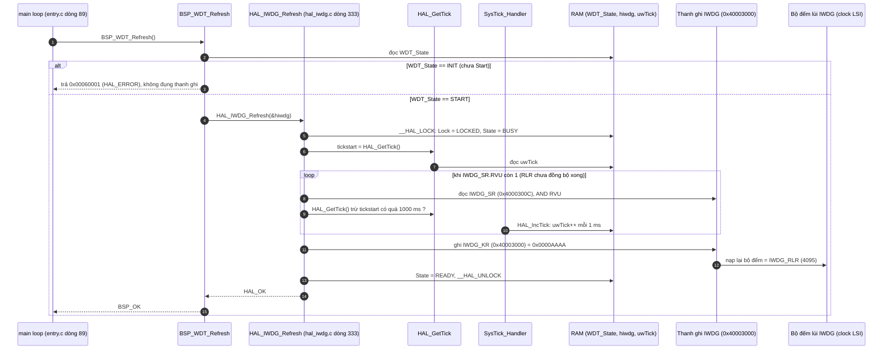
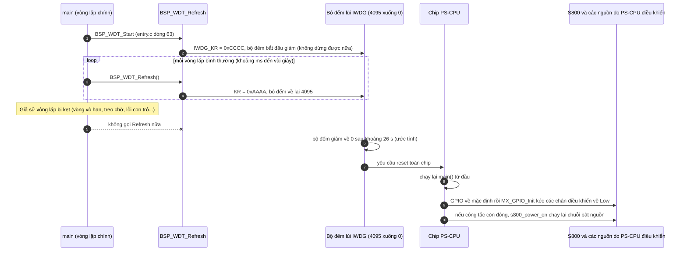

Đây là phân tích của `BSP_WDT_Refresh()`: [BSP_WDT_STM32F03x_Nucleo.c:53](vscode-webview://1bvn9deljhs67bs6tdc4nttro6fasb6a3o9dsbsr0n55qjrijoej/PS-CPU/pscpu_s800/common/Drivers/BSP/Src/BSP_WDT_STM32F03x_Nucleo.c#L53), kèm phần giải thích vì sao phải gọi hàm này mỗi vòng lặp. Các diagram chưa được render thử.

## Cây lời gọi

```
BSP_WDT_Refresh
├─ (đọc RAM) WDT_State
└─ HAL_IWDG_Refresh
     ├─ __HAL_LOCK / __HAL_UNLOCK       →  RAM hiwdg.Lock
     ├─ __HAL_IWDG_GET_FLAG(RVU)        →  IWDG_SR
     ├─ HAL_GetTick                     →  RAM uwTick  (do ISR SysTick tăng)
     └─ __HAL_IWDG_RELOAD_COUNTER       →  IWDG_KR = 0xAAAA
```

## Diagram A: một lần gọi (đường bình thường)



## Diagram B: tại sao phải gọi (watchdog chạy hết giờ nếu không gọi)



## Giải thích từng bước

1. **Chốt `WDT_State`.** `[SOURCE]` Nếu `Start` chưa chạy, hàm trả lỗi mà không đụng thanh ghi. Có hai lý do hợp lý: không nạp lại bộ đếm cho một watchdog chưa chạy, và cho phép phát hiện lỗi thứ tự gọi qua mã trả về.
2. **Khóa và trạng thái.** `[SOURCE]` `__HAL_LOCK` chặn gọi lồng nhau. `State = BUSY` rồi `READY` chỉ là cờ phần mềm.
3. **Chờ cờ `RVU`.** `[SOURCE]` Trước khi nạp lại, HAL đợi cờ `RVU` hạ xuống (nghĩa là giá trị `IWDG_RLR` đã đồng bộ sang miền clock LSI). Nếu quá 1000 ms (đo bằng `HAL_GetTick`, dựa vào ngắt SysTick) thì trả `HAL_TIMEOUT` và **không** refresh. Khi đó `BSP_WDT_Refresh` trả lỗi, nhưng `main()` bỏ qua mã trả về (xem mục "Điểm đáng chú ý").
4. **Ghi `IWDG_KR = 0xAAAA`.** `[SOURCE]` `0xAAAA` là hằng `IWDG_KEY_RELOAD` ([stm32f0xx_hal_iwdg.h:227](vscode-webview://1bvn9deljhs67bs6tdc4nttro6fasb6a3o9dsbsr0n55qjrijoej/PS-CPU/pscpu_s800/common/Drivers/STM32F0xx_HAL_Driver/Inc/stm32f0xx_hal_iwdg.h#L227)). Phần cứng nạp lại bộ đếm bằng `RLR`. Đây là lệnh thanh ghi duy nhất của hàm này.

## Vì sao phải gọi hàm này (mục đích)

**1. Phát hiện treo của vòng lặp chính.** `[SOURCE]` Firmware là một vòng lặp đơn (không có RTOS, không có luồng giám sát khác). Nếu một hàm trong vòng lặp bị kẹt, không có ai khác phát hiện. Watchdog là cơ chế duy nhất bắt được điều đó: **nếu vòng lặp không quay về chỗ `BSP_WDT_Refresh`, chip tự reset**. Trong [entry.c:132-143](vscode-webview://1bvn9deljhs67bs6tdc4nttro6fasb6a3o9dsbsr0n55qjrijoej/PS-CPU/pscpu_s800/main/App/entry.c#L132-L143) còn có sẵn đoạn `#ifdef DEBUG_WDT` cố ý treo vòng lặp để thử cơ chế này, xác nhận đây là mục đích thiết kế (macro đang `#undef`).

**2. Phục hồi không cần người can thiệp.** `[INFERENCE]` PS-CPU là vi điều khiển quản lý nguồn cho cả hệ thống. Nếu nó treo, S800 không thể được tắt/bật đúng quy trình, công tắc nguồn chính mất tác dụng, và không có người vận hành tại chỗ để reset. Reset tự động đưa hệ thống về trạng thái biết trước.

**3. Chỉ chứng minh "vòng lặp còn quay", không chứng minh "mọi thứ đúng".** `[SOURCE]` Lời gọi nằm ở đầu vòng lặp, không gắn với điều kiện kiểm tra sức khỏe nào. Nó bắt được "treo", không bắt được "chạy sai logic" (ví dụ bật nhầm nguồn nhưng vẫn quay đủ nhanh).

**4. Đặt giữa vòng lặp, không chặn các thao tác dài.** `[SOURCE]` Mọi thao tác chờ dài đều **không chặn**, mà dựa vào timer RAM: chuỗi tắt nguồn chờ tối đa 60 s + 60 s (`PWROFF_MAXTIME1/2`) vẫn để vòng lặp quay và refresh đều. Những chỗ có chặn đều ngắn hơn nhiều so với 26 s: `HAL_Delay(500)` trong `s800_power_off`, `HAL_Delay(2)` trong `i2c_sw_reset`, chu kỳ STOP 2 s (`set_cycle_time(2)`).

**5. Watchdog không có cửa sổ nên refresh nhiều lần là an toàn.** `[SOURCE]` `MX_IWDG_Init` đặt `Window = 4095` (vô hiệu hóa). Nhờ vậy refresh ở mọi lúc, kể cả mỗi vài micro giây khi vòng lặp chạy nhanh, đều hợp lệ. Nếu bật cửa sổ thì refresh quá sớm cũng gây reset.

**6. Phải đi cùng STOP mode.** `[INFERENCE]` `[RM0091]` IWDG chạy bằng LSI nên vẫn đếm khi CPU ngủ STOP. Chu kỳ thức 2 s của `set_cycle_time` (mô tả ở tài liệu trước) giữ cho vòng lặp tiếp tục chạy và refresh. Nếu STOP dài hơn timeout, chip sẽ bị reset giữa lúc đang ngủ.

**7. Bootloader cũng cần.** `[SOURCE]` IWDG không tắt được sau khi bật, và `jump2iap()` không động đến nó. Vì vậy vòng lặp bootloader ([entry_iap.c:73-77](vscode-webview://1bvn9deljhs67bs6tdc4nttro6fasb6a3o9dsbsr0n55qjrijoej/PS-CPU/pscpu_s800/iap/App/entry_iap.c#L73-L77)) cũng gọi `BSP_WDT_Refresh()` mỗi vòng, nếu không firmware đang nạp sẽ bị reset giữa chừng.

**8. Khi debug phải đóng băng watchdog.** `[SOURCE]` `DBGMCU.ini` (script Keil) ghi `0x40015808 = 0x1800`. `[RM0091]` Đó là thanh ghi `DBGMCU_APB1_FZ` bật cờ đóng băng `IWDG` và `WWDG` khi lõi dừng ở breakpoint. Nếu không, mỗi lần dừng debug quá 26 s chip sẽ tự reset.

## Hệ quả của việc watchdog reset (nếu xảy ra)

- `[INFERENCE]` Reset PS-CPU kéo các chân điều khiển nguồn về trạng thái mặc định rồi `MX_GPIO_Init` đặt chúng Low. Về hiệu quả đó là **mất nguồn đột ngột** cho các khối do PS-CPU điều khiển (`SB_PWR_EN`, `MC_P_ON`, `_RESET`...), tức S800 bị cắt không qua quy trình tắt nguồn bình thường. Sau đó `main()` chạy lại và, nếu công tắc còn đóng, bật lại từ đầu.
- `[SOURCE]` Tôi không tìm thấy mã nào kiểm tra cờ reset do watchdog (`IWDGRSTF` trong `RCC_CSR`) hay ghi nguyên nhân này vào nhật ký (`poweroff_factor_save`). Reset do watchdog **không để lại dấu vết** trong firmware hiện tại.

## Điểm đáng chú ý

- **Mã trả về bị bỏ qua.** `[SOURCE]` [entry.c:89](vscode-webview://1bvn9deljhs67bs6tdc4nttro6fasb6a3o9dsbsr0n55qjrijoej/PS-CPU/pscpu_s800/main/App/entry.c#L89) gọi `BSP_WDT_Refresh()` mà không kiểm tra. Nếu `HAL_IWDG_Refresh` timeout (cờ `RVU` kẹt), lỗi bị im lặng và watchdog sẽ reset chip sau đó.
- **`Refresh` không có nhánh xử lý riêng khi `HAL_TIMEOUT`.** Mọi lỗi HAL đều bị gộp thành `HAL_ERROR`.
- **Timeout 26 s là ước tính.** Từ LSI danh định 40 kHz, chia 256, `RLR` = 4095. Tần số LSI thực khác nhau theo chip và nhiệt độ.

## Chưa xác minh

- Offset thanh ghi IWDG (`KR`, `SR`) và vị trí bit `RVU` là kiến thức reference manual; base address `0x40003000` đọc từ `stm32f031x6.h`.
- Tôi không xác minh được rằng IWDG chạy liên tục trong STOP trên chip này (option byte có thể thay đổi), và chưa thử reset thực tế bằng `DEBUG_WDT`.