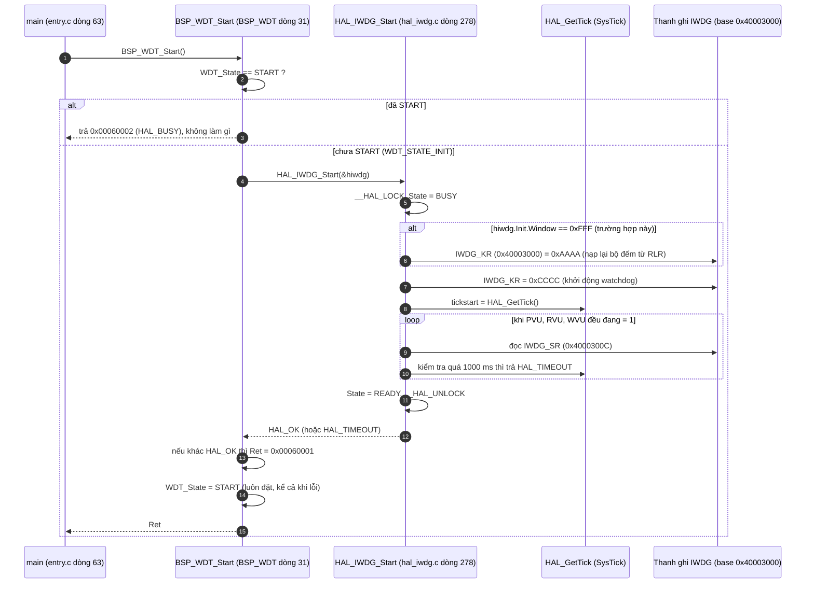
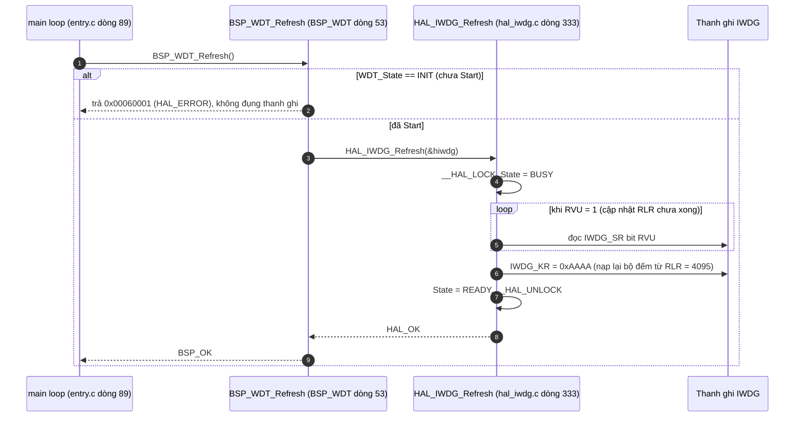

`BSP_WDT_Start()` **bật watchdog IWDG và đặt cờ "đã bật"**. Trước đó `MX_IWDG_Init` mới chỉ cấu hình nó. Tôi đã đọc các hàm HAL mà nó gọi xuống tới thanh ghi, và cả `BSP_WDT_Refresh()` cùng file vì hai hàm đi đôi với nhau.

## Diagram 1: `BSP_WDT_Start()`

## Diagram 2: `BSP_WDT_Refresh()` (gọi mỗi vòng lặp chính)

## Giải thích từng bước

1. **Chốt chặn `WDT_State`.** `[SOURCE]` Biến `WDT_State` là biến toàn cục, khởi đầu `INIT`. `Start` chỉ chạy được một lần, lần hai trả `BUSY`. `Refresh` ngược lại: từ chối nếu chưa `Start`. Mục đích là tránh nạp lại bộ đếm cho một watchdog chưa chạy.
2. **Nạp bộ đếm trước khi chạy.** `[SOURCE]` `Window` là `0xFFF` (cửa sổ tắt), nên HAL ghi `KR = 0xAAAA` để nạp bộ đếm bằng `RLR` (4095) rồi mới ghi `KR = 0xCCCC`. Hằng số `0xAAAA`, `0xCCCC` lấy từ `stm32f0xx_hal_iwdg.h`.
3. **`KR = 0xCCCC` là bước không đảo ngược.** `[RM0091]` Sau khi ghi giá trị này, watchdog không tắt được nữa trừ khi reset chip. `[RM0091]` Phần cứng cũng tự bật LSI khi IWDG được khởi động, nên không cần chờ `LSIRDY` ở đây. HAL ghi chú đúng điều này trong tài liệu đầu file `hal_iwdg.c`.
4. **Vòng chờ cờ `SR`.** `[SOURCE]` HAL chờ các cờ `PVU/RVU/WVU` hạ xuống (nghĩa là các thanh ghi `PR/RLR/WINR` đã đồng bộ sang miền LSI). Timeout là 1000 ms đo bằng `HAL_GetTick()`, tức dựa vào ngắt SysTick đã thiết lập ở `HAL_Init`.
5. **`Refresh` chỉ ghi `0xAAAA`.** `[SOURCE]` Mỗi lần gọi, hàm chờ `RVU = 0` rồi ghi `KR = 0xAAAA`. Đây chính là việc "đá chó" (kick the dog): bộ đếm về lại 4095 và đếm lùi lại từ đầu.
6. **Chu kỳ gọi.** `[SOURCE]` `main` gọi `BSP_WDT_Refresh()` ở đầu mỗi vòng lặp. Nếu một vòng bị treo quá timeout, chip tự reset. Timeout ước tính là 26 giây, tính từ LSI danh định 40 kHz và `PR = /256`, `RLR = 4095`. Con số này chưa kiểm chứng trên chip thật.

## Điều đáng chú ý

- **Giá trị trả về bị bỏ qua.** `[SOURCE]` `entry.c:63` và `:89` không kiểm tra kết quả của `BSP_WDT_Start/Refresh`. Nếu `Start` lỗi, chương trình vẫn đi tiếp.
- **`WDT_State = START` được đặt cả khi `Start` lỗi.** `[SOURCE]` Dòng 41 nằm ngoài khối `if`. Hệ quả: một lần lỗi làm `Start` không bao giờ chạy lại được (lần sau trả `BUSY`).
- **Điều kiện chờ dùng `&&`.** `[SOURCE]` Vòng `while` ở `HAL_IWDG_Start` (và kiểm tra đầu `HAL_IWDG_Init`) chỉ chờ khi cả ba cờ cùng bằng 1. Chỉ cần một cờ bằng 0 là thoát ngay. `[INFERENCE]` Đây có vẻ là điều kiện lỏng hơn ý định (có thể muốn dùng `||`), nhưng tôi chưa đánh giá hậu quả thực tế.
- **Watchdog sống qua lần nhảy sang bootloader.** `[SOURCE]` `jump2iap()` ([entry.c:159](vscode-webview://1bvn9deljhs67bs6tdc4nttro6fasb6a3o9dsbsr0n55qjrijoej/pscpu_s800/main/App/entry.c#L159)) không động đến IWDG, còn `entry_iap.c:51,63` gọi lại `BSP_WDT_Start()` và `BSP_WDT_Refresh()`. `[INFERENCE]` Vì không tắt được IWDG, bootloader buộc phải tự refresh, đúng như code của nó làm.
- **Quan hệ với chế độ STOP.** `[INFERENCE]` Firmware vào STOP với chu kỳ thức 2 giây (`set_cycle_time(2)`), ngắn hơn nhiều so với 26 giây. Có khả năng đó là để vòng lặp chính kịp chạy và refresh watchdog. Tôi chưa đọc `set_cycle_time` và chưa kiểm tra option byte `IWDG_STOP`, nên đây mới chỉ là phỏng đoán.

Giá trị `0x00060001/0x00060002` tôi tính từ `HALERR_TO_BSPERR` (`BSP_WDT_ERR_BASE | (0xFF & mã HAL)`), giả định `HAL_ERROR = 1`, `HAL_BUSY = 2` theo quy ước HAL chuẩn. Tôi chưa mở header định nghĩa `HAL_StatusTypeDef` để xác nhận.