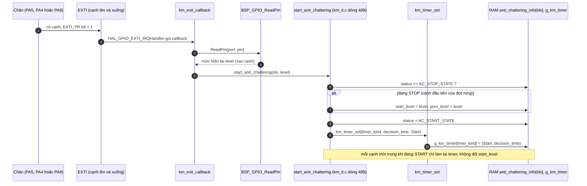
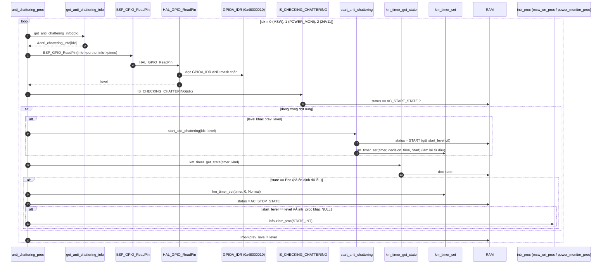
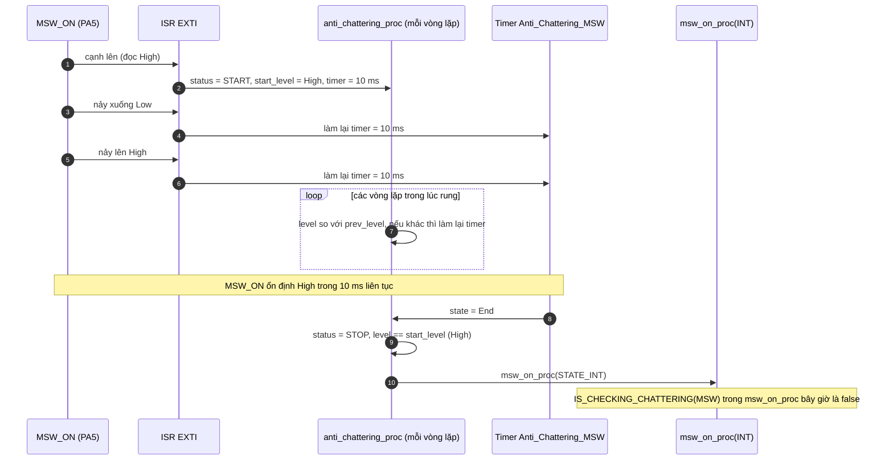

"Hàm tiếp theo" là `anti_chattering_proc()`: [km_extend_io.c:1438](vscode-webview://1bvn9deljhs67bs6tdc4nttro6fasb6a3o9dsbsr0n55qjrijoej/PS-CPU/pscpu_s800/main/App/km_extend_io.c#L1438), gọi ở [entry.c:118](vscode-webview://1bvn9deljhs67bs6tdc4nttro6fasb6a3o9dsbsr0n55qjrijoej/PS-CPU/pscpu_s800/main/App/entry.c#L118). Đây là **bộ lọc rung tín hiệu không chặn** cho ba chân (công tắc chính, `POWER_MONITOR`, `MONI_24V11`). Hàm này phối hợp với phần mở đầu chạy trong ISR (`start_anti_chattering`), nên tôi vẽ cả hai nửa. Các diagram chưa được render thử.

## Cây lời gọi

```
anti_chattering_proc
├─ get_anti_chattering_info(idx)               →  RAM anti_chattering_info[idx]
├─ BSP_GPIO_ReadPin(info->portno, info->pinno) →  HAL_GPIO_ReadPin  →  GPIOA_IDR
├─ IS_CHECKING_CHATTERING(idx)                 →  RAM status
├─ start_anti_chattering(idx, level)           →  RAM + km_timer_set
├─ km_timer_get_state / km_timer_set           →  RAM g_km_timer
└─ info->intr_proc(STATE_INT)                  →  msw_on_proc / power_monitor_proc / (NULL)

Phía ISR (km_exti_callback):
  start_anti_chattering(idx, level)            →  RAM + km_timer_set
```

Bảng cấu hình `[SOURCE]` ([km_it.c:20-54](vscode-webview://1bvn9deljhs67bs6tdc4nttro6fasb6a3o9dsbsr0n55qjrijoej/PS-CPU/pscpu_s800/main/App/km_it.c#L20-L54), [km_it.h:6-10](vscode-webview://1bvn9deljhs67bs6tdc4nttro6fasb6a3o9dsbsr0n55qjrijoej/PS-CPU/pscpu_s800/main/Inc/km_it.h#L6-L10)):

|idx|Tín hiệu|Chân|Thời gian ổn định|Timer|Hàm khi ổn định|
|---|---|---|---|---|---|
|0|`MSW_ON`|PA5 (`IDR` bit5)|10 ms|`Anti_Chattering_MSW`|`msw_on_proc`|
|1|`POWER_MONITOR`|PA4 (`IDR` bit4)|10 ms|`Anti_Chattering_PMON`|`power_monitor_proc`|
|2|`MONI_24V11`|PA8 (`IDR` bit8)|30 ms|`Anti_Chattering_24V`|`NULL` (không gọi gì)|

## Diagram A: nửa ISR, mở đầu việc chống rung



## Diagram B: nửa vòng lặp chính (`anti_chattering_proc`)



## Diagram C: một ví dụ rung của công tắc chính (gạt ON)



## Giải thích từng bước

1. **Hai nửa chia việc.** `[SOURCE]` ISR (nửa 1) chỉ bắt đầu đợt kiểm tra: chụp mức, ghi `start_level`, đặt `status = START` và hẹn timer. Vòng lặp chính (nửa 2) theo dõi và kết luận. Không có lệnh chờ/`delay` nào, chip tiếp tục làm việc khác trong lúc chờ.
2. **Tiêu chí "ổn định".** `[SOURCE]` Tín hiệu được coi là ổn định khi **không đổi mức trong `decision_time` ms liên tục**. Mỗi lần mức đổi (cạnh ngắt hoặc `level != prev_level` phát hiện ở vòng lặp), timer được đặt lại từ đầu.
3. **Điều kiện gọi hàm xử lý.** `[SOURCE]` Khi timer hết (`End`), hàm chỉ gọi `intr_proc` nếu mức hiện tại **bằng `start_level`**, tức mức đọc được ở cạnh đầu tiên của đợt. `[INFERENCE]` Nghĩa là nếu đợt rung bắt đầu bằng một xung nhiễu rồi tín hiệu trở lại mức cũ, `level != start_level` và hàm xử lý **không** được gọi (xung nhiễu bị loại bỏ). Nếu thay đổi là thật, `start_level` và mức ổn định cuối cùng trùng nhau và hàm xử lý được gọi.
4. **Hàm xử lý chạy ở vòng lặp chính, không phải ISR.** `[SOURCE]` `info->intr_proc(STATE_INT)` được gọi từ `anti_chattering_proc` ở vòng lặp chính. Chữ `INT` trong `STATE_INT` là tên cũ của cuộc gọi "do sự kiện", không có nghĩa nó chạy trong ngắt.
5. **Hàng thứ ba (24V11) không gọi hàm.** `[SOURCE]` `intr_proc = NULL`. Nó chỉ duy trì cờ `status` để các hàm khác dùng qua `IS_CHECKING_CHATTERING(24V11_MONI)` (ví dụ `_MC_P_ON_OK`, `s800_power_on`, `sb_reset_proc`).
6. **`prev_level` luôn cập nhật.** `[SOURCE]` Cuối mỗi vòng cho mỗi tín hiệu, kể cả khi không đang kiểm tra, nên khi ISR mở đầu đợt mới, `start_level` và `prev_level` đều lấy mức hiện tại.

## Vì sao phải có hàm này (mục đích)

1. **Loại rung cơ khí và nhiễu.** `[SOURCE]` Comment trong `km_it.h` giải thích: 10 ms của `MSW_ON` được tính "từ thông số phần cứng của công tắc thật" (搭載されているMSWのHW仕様より算出); `POWER_MONITOR` 10 ms "tương đương IT5" (một model trước); 24V11 là 30 ms. Nếu không lọc, mỗi lần nảy tiếp điểm sẽ bị coi là một lần bật/tắt nguồn.
2. **Một cơ chế dùng chung cho ba tín hiệu.** Cùng một bảng và một hàm, thay vì ba bộ lọc riêng.
3. **Không chặn vòng lặp.** Lọc bằng timer phần mềm 1 ms (`km_tim_callback`) và máy trạng thái, nên các hàm khác (kể cả refresh watchdog) vẫn chạy trong lúc chờ.
4. **Đáng tin cho các hàm điều khiển nguồn.** `[SOURCE]` Gần như mọi điều kiện quan trọng trong code (`!IS_CHECKING_CHATTERING(...) && ReadPin(...)`) dựa trên trạng thái mà hàm này duy trì. Nó là nền tảng cho việc "chỉ tin tín hiệu đã ổn định".

## Bảng chân tri (mỗi tín hiệu, mỗi vòng lặp)

|`status`|`level` so với `prev_level`|Timer|Hành động|
|---|---|---|---|
|STOP|bất kỳ|bất kỳ|Chỉ cập nhật `prev_level`|
|START|khác|bất kỳ|Làm lại timer, `status` giữ START|
|START|giống|chưa End|Chờ|
|START|giống|End, `level == start_level`, có callback|Về STOP, gọi `intr_proc(STATE_INT)`|
|START|giống|End, `level == start_level`, callback NULL|Về STOP, không gọi gì|
|START|giống|End, `level != start_level`|Về STOP, không gọi (loại nhiễu)|

## Điểm đáng chú ý

- **Chỉ phát hiện khi đã có ngắt.** `[SOURCE]` Hàm chỉ xử lý khi `status == START`, và `status` chỉ được đặt `START` bởi ISR. Nếu ngắt bị bỏ lỡ (ví dụ trong lúc EXTI bị tắt tạm bởi `get_pending_factor`, xem phân tích trước; cờ `EXTI_PR` vẫn giữ nên ngắt sẽ vào ngay khi bật lại, nên thực tế khó mất), mức thay đổi sẽ không được ghi nhận cho tới khi có cạnh kế tiếp.
- **`start_level` là mức SAU cạnh đầu tiên**, không phải mức trước. `[SOURCE]` ISR đọc `level` ngay khi cạnh xảy ra rồi truyền vào `start_anti_chattering`.
- **Timer tính theo xung TIM3 1 ms.** `[INFERENCE]` Sau khi thức từ STOP bằng RTC mà chưa dựng lại PLL (xem phân tích `msw_on_proc`), "10 ms" có thể thực tế dài khoảng 60 ms. Đó là suy luận, chưa đo.
- **Ba lần đọc `GPIOA_IDR` mỗi vòng lặp.** Cả ba chân đều ở cổng A nên mỗi vòng đọc cùng một thanh ghi ba lần (có thể gộp thành một nhưng code không làm vậy).
- **Hàm đọc chân thô bằng `BSP_GPIO_ReadPin`** rồi mới kiểm tra trạng thái chống rung, không có điều kiện đặc biệt cho ba chỉ số.

## Chưa xác minh

- Offset `IDR` (`GPIOA` `0x48000010`) là kiến thức reference manual; base address đọc từ `stm32f031x6.h`, số chân đọc từ `mxconstants.h`.
- Hành vi chống rung với dạng xung cụ thể (ví dụ rung dài hơn 10 ms) là kết quả suy luận từ mã, chưa kiểm chứng bằng oscilloscope hay mô phỏng.