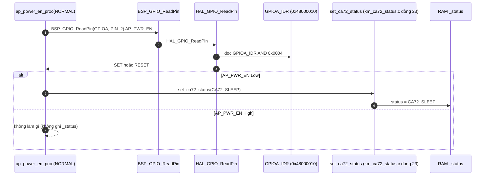
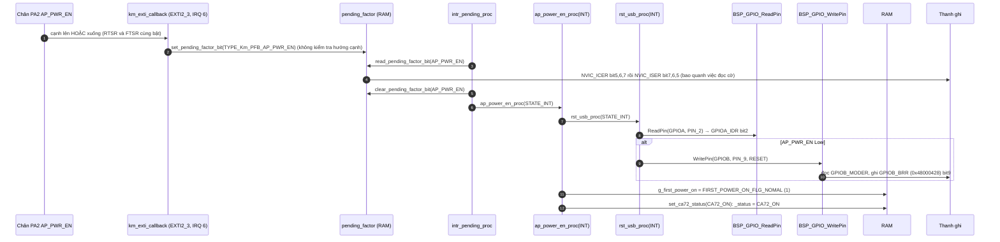
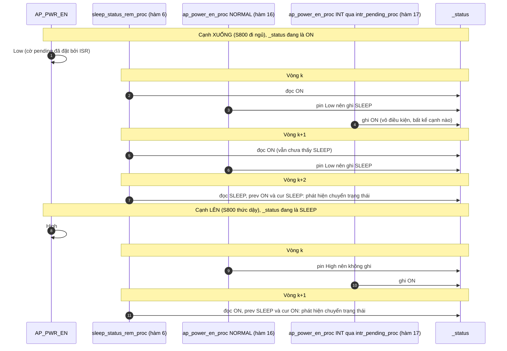

Đây là phân tích của `ap_power_en_proc(state)`: [km_extend_io.c:658](vscode-webview://1bvn9deljhs67bs6tdc4nttro6fasb6a3o9dsbsr0n55qjrijoej/PS-CPU/pscpu_s800/main/App/km_extend_io.c#L658), gọi ở [entry.c:114](vscode-webview://1bvn9deljhs67bs6tdc4nttro6fasb6a3o9dsbsr0n55qjrijoej/PS-CPU/pscpu_s800/main/App/entry.c#L114) với `STATE_NORMAL` và từ `intr_pending_proc` với `STATE_INT`. Hàm **không lái chân nào của riêng nó**; nó duy trì hai biến trạng thái về S800 (`_status` của CA72 và `g_first_power_on`) cho các hàm khác dùng. Các diagram chưa được render thử.

## Cây lời gọi

```
ap_power_en_proc(state)
├─ STATE_INT
│    ├─ rst_usb_proc(STATE_INT)               →  nếu AP_PWR_EN Low: GPIOB_BRR bit9 (PB9 xuống Low)
│    ├─ g_first_power_on = FIRST_POWER_ON_FLG_NOMAL   →  RAM
│    └─ set_ca72_status(CA72_ON)              →  RAM _status
└─ STATE_NORMAL
     ├─ BSP_GPIO_ReadPin(AP_PWR_EN)           →  GPIOA_IDR bit2
     └─ set_ca72_status(CA72_SLEEP)           →  RAM _status
```

## Diagram A: nhánh `STATE_NORMAL` (mỗi vòng lặp)



## Diagram B: nhánh `STATE_INT` và đường dẫn tới nó



## Diagram C: giá trị `_status` qua từng vòng lặp (hiện tượng cần biết)

Thứ tự trong vòng lặp `[SOURCE]` (entry.c): `sleep_status_rem_proc` (hàm 6) → ... → `ap_power_en_proc(NORMAL)` (hàm 16) → `intr_pending_proc` (hàm 17).



## Giải thích từng bước

1. **Hai nhánh dùng hai kiểu thông tin khác nhau.** `[SOURCE]` Nhánh INT dựa vào **sự kiện** (có cạnh), nhánh NORMAL dựa vào **mức** (chân đang Low). Kết hợp lại tạo ra máy trạng thái ba giá trị `OFF`, `ON`, `SLEEP`.
2. **Nhánh INT luôn ghi `ON`, bất kể cạnh nào.** `[SOURCE]` ISR chỉ đặt cờ pending, không phân biệt cạnh lên hay xuống, và nhánh INT ghi `CA72_ON` không đọc lại mức chân. Với cạnh xuống, `_status` bị đặt về `ON` một nhịp ngắn rồi nhánh NORMAL ở vòng kế tiếp sửa lại thành `SLEEP` (Diagram C). Hệ quả: việc phát hiện "ON → SLEEP" ở `sleep_status_rem_proc` chậm hơn việc phát hiện "SLEEP → ON" khoảng một vòng lặp.
3. **Nhánh NORMAL chỉ ghi `SLEEP`, không ghi `ON`.** `[SOURCE]` `AP_PWR_EN` High không đủ để đặt `ON`; chỉ cạnh lên (qua nhánh INT) mới làm được. Nhờ vậy `ON` đại diện cho "đã thấy S800 báo sẵn sàng".
4. **`g_first_power_on`.** `[SOURCE]` Biến này đặt về `NOMAL` (đã khởi động xong) ở nhánh INT và về `START` trong `s800_power_off`. `power_monitor_proc(INT)` dùng nó để phân biệt hai trường hợp: nếu mất nguồn trước khi S800 từng báo sẵn sàng thì tắt ngay, nếu sau đó thì chờ failsafe 2 s.
5. **`rst_usb_proc(INT)` gọi sớm nhất có thể.** `[SOURCE]` Khi S800 vừa đi ngủ, `_RST_SLP2` được kéo Low ngay trong nhánh INT, không đợi nhánh NORMAL của `rst_usb_proc` ở vòng lặp sau.

## Vì sao phải có hàm này (mục đích)

1. **Cho PS-CPU biết S800 đang ở trạng thái nào.** `[SOURCE]` `AP_PWR_EN` là đầu ra từ S800 (nhãn "AP POWER" trên sơ đồ khối bạn gửi). PS-CPU gom nó thành biến `_status` để `sleep_status_rem_*_proc` quyết định mức chân `SLEEP_STATUS_REM`.
2. **Biến mức thành sự kiện đã lọc.** Phân biệt "đang ngủ" (mức Low khi đang chạy) với "vừa thức dậy" (cạnh lên) cần cả hai nguồn thông tin: mức và cạnh.
3. **Đánh dấu "đã khởi động xong lần đầu".** `[SOURCE]` `g_first_power_on` quyết định cách `power_monitor_proc` phản ứng khi mất nguồn.
4. **Kéo `_RST_SLP2` Low sớm.** Giữ phần cứng USB trong reset ngay khi S800 ngủ (xem phân tích `rst_usb_proc`).

## Bảng trạng thái của `_status`

|Sự kiện|`_status` trước|`_status` sau|
|---|---|---|
|Khởi động PS-CPU (giá trị khởi tạo)||`OFF`|
|Cạnh `AP_PWR_EN` (bất kỳ hướng)|bất kỳ|`ON` (nhánh INT)|
|`AP_PWR_EN` đang Low (mỗi vòng)|bất kỳ|`SLEEP` (nhánh NORMAL)|
|`s800_power_off()`|bất kỳ|`OFF`|

## Điểm đáng chú ý

- **Nhánh INT không phân biệt cạnh.** `[SOURCE]` Như nêu ở bước 2. Đây là hành vi hiện tại, không phải lỗi gây hỏng chức năng vì nhánh NORMAL tự sửa; tuy nhiên `_status = ON` có thể sai trong một hai vòng lặp sau cạnh xuống.
- **Nếu `AP_PWR_EN` đã High lúc PS-CPU khởi động, `_status` có thể kẹt ở `OFF`.** `[INFERENCE]` `_status` khởi đầu `OFF` và nhánh NORMAL chỉ ghi `SLEEP`; chỉ có cạnh mới đặt `ON`. Nếu PS-CPU bị reset (ví dụ do watchdog) trong lúc S800 đang chạy thì không có cạnh nào, `_status` giữ `OFF` và `g_first_power_on` giữ `START` cho tới khi có cạnh kế tiếp. Tôi chưa mô phỏng kịch bản này.
- **`AP_PWR_EN` đọc thô** (không qua chống rung) ở cả hai nhánh.
- **Hàm không `static`**, được khai báo trong `km_extend_io.h`, và `intr_pending_proc` cùng `main()` là hai nơi gọi duy nhất.

## Chưa xác minh

- Offset thanh ghi (`IDR`, `BRR`, `MODER`, `NVIC_ISER/ICER`) là kiến thức reference manual; base address đọc từ `stm32f031x6.h`, số chân đọc từ `mxconstants.h`.
- Thứ tự vòng lặp tôi dùng cho Diagram C lấy từ `entry.c`; chuỗi giá trị `_status` là kết quả mô phỏng bằng tay, chưa chạy thử trên phần cứng.