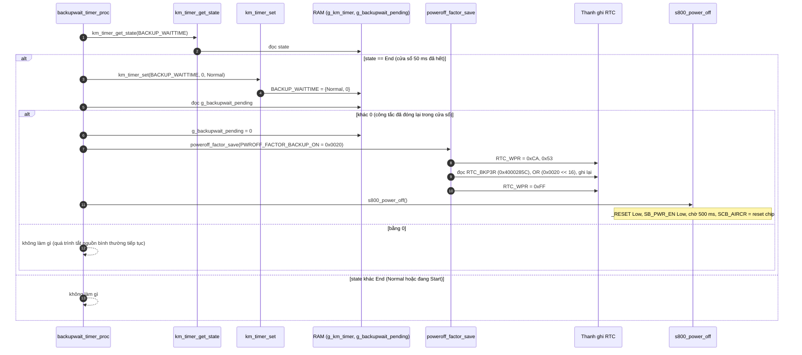
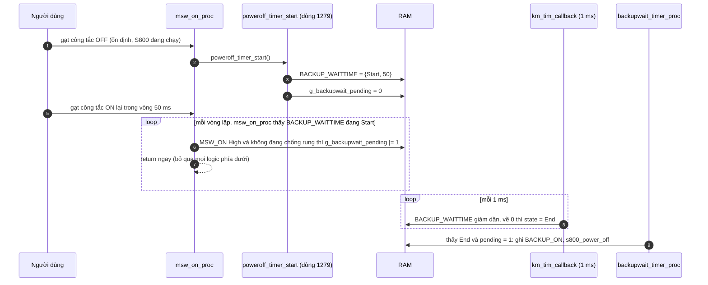
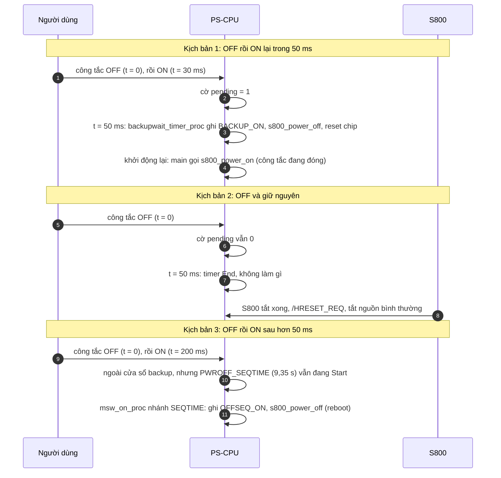

"Hàm tiếp theo" là `backupwait_timer_proc()`: [km_extend_io.c:1350](vscode-webview://1bvn9deljhs67bs6tdc4nttro6fasb6a3o9dsbsr0n55qjrijoej/PS-CPU/pscpu_s800/main/App/km_extend_io.c#L1350), gọi ở [entry.c:123](vscode-webview://1bvn9deljhs67bs6tdc4nttro6fasb6a3o9dsbsr0n55qjrijoej/PS-CPU/pscpu_s800/main/App/entry.c#L123). Hàm rất ngắn: **sau khi cửa sổ chờ 50 ms kết thúc, nếu trong cửa sổ đó công tắc chính đã được đóng lại thì ép khởi động lại**. Nó là nửa "kết luận" của cơ chế mà `msw_on_proc` mở đầu. Các diagram chưa được render thử.

## Cây lời gọi

```
backupwait_timer_proc
├─ km_timer_get_state(BACKUP_WAITTIME)     →  RAM g_km_timer
├─ km_timer_set(BACKUP_WAITTIME, 0, Normal)→  RAM
├─ g_backupwait_pending                    →  RAM (uint16_t, bit0 = BACKUPWAIT_PENDING_MSW_ON)
├─ poweroff_factor_save(BACKUP_ON)         (khi cờ pending khác 0)
│    ├─ RTC_WRITEPROTECT_DISABLE           →  RTC_WPR (0x40002824) = 0xCA, 0x53
│    ├─ đọc rồi ghi RTC_BKP3R (0x4000285C), OR 0x0020 << 16
│    └─ RTC_WRITEPROTECT_ENABLE            →  RTC_WPR = 0xFF
└─ s800_power_off()                        (kết thúc bằng reset chip)

Phía tạo ra dữ liệu:
  poweroff_timer_start()    đặt BACKUP_WAITTIME = 50 ms, g_backupwait_pending = 0
  msw_on_proc()             trong cửa sổ 50 ms, nếu MSW_ON High ổn định thì g_backupwait_pending |= 1
```

## Diagram A: luồng của `backupwait_timer_proc`



## Diagram B: bên tạo dữ liệu (`poweroff_timer_start` và `msw_on_proc`)



## Diagram C: ba kịch bản



## Giải thích từng bước

1. **Cửa sổ 50 ms.** `[SOURCE]` `poweroff_timer_start` hẹn `BACKUP_WAITTIME` = 50 ms mỗi khi bắt đầu quy trình tắt có kiểm soát.
2. **Trong cửa sổ, `msw_on_proc` chỉ ghi nhớ.** `[SOURCE]` Nếu `MSW_ON` High ổn định, nó đặt bit0 của `g_backupwait_pending` rồi `return`, không bật nguồn, không tắt nguồn (comment: "バックアップ中は、電源抑止").
3. **Hết cửa sổ, hàm này kết luận.** `[SOURCE]` Khi timer `End`, hàm đưa timer về `Normal`, đọc cờ. Có cờ thì ghi nguyên nhân rồi `s800_power_off()`. Không có cờ thì quy trình tắt nguồn bình thường (các timer `WDGTIME`, `MAXTIME`) tiếp tục.
4. **Dọn cờ trước khi tắt.** `[SOURCE]` Hàm đặt `g_backupwait_pending = 0` trước khi gọi `poweroff_factor_save`, nhưng `s800_power_off` cũng gọi `poweroff_timer_init` nên cờ được xóa hai lần.
5. **Kết quả là một lần khởi động lại sạch.** `[SOURCE]` `s800_power_off` kết thúc bằng reset chip, rồi `main()` chạy `s800_power_on()` nếu công tắc đang đóng.

## Vì sao phải có hàm này (mục đích)

1. **Xử lý gạt công tắc OFF rồi ON nhanh.** `[SOURCE]` Comment ở `entry.c:43` và `km_it.h` đều dùng cùng ý: "主電源OFFON時、瞬断バックアップを待った後に再起動" (khi nguồn chính OFF rồi ON, chờ hết khoảng backup tức thời rồi khởi động lại). Nếu không có cơ chế này, PS-CPU sẽ bị kẹt giữa hai trạng thái.
2. **Tránh xung đột giữa hai lệnh trái ngược.** `[INFERENCE]` Trên sơ đồ khối bạn gửi, tín hiệu `MAINSW_ON` còn đi **thẳng sang S800** qua một buffer. Nghĩa là S800 tự biết công tắc đã OFF và bắt đầu tắt, trong khi PS-CPU thấy công tắc ON lại. Tiếp tục chạy bình thường sẽ để S800 đang tắt dở mà nguồn vẫn được giữ; không tắt thì S800 không biết đã bật lại. Hướng giải quyết của code là buộc tắt hẳn rồi bật lại.
3. **Phân biệt với chuỗi tắt dài.** `[SOURCE]` Khoảng 50 ms đầu dành cho trường hợp chớp nhanh (khớp tên "backup 瞬断"); sau đó `PWROFF_SEQTIME` (9,35 s) xử lý trường hợp bật lại muộn hơn (nguyên nhân `OFFSEQ_ON` khác `BACKUP_ON` trong nhật ký, xem `PWROFF_FACTOR_*`).
4. **Ghi dấu vết.** `[SOURCE]` Bit `PWROFF_FACTOR_BACKUP_ON` (bit 5, `0x0020`) cho S800 và kỹ thuật viên biết lần khởi động lại này do công tắc bật lại trong khoảng backup, không phải lỗi.

## Bảng chân tri

|Timer BACKUP|Cờ pending|Hành động|
|---|---|---|
|Normal hoặc Start|bất kỳ|Không làm gì|
|End|0|Đưa timer về Normal, không làm gì thêm|
|End|khác 0|Về Normal, xóa cờ, ghi `BACKUP_ON`, `s800_power_off()`|

## Điểm đáng chú ý

- **Trong cửa sổ 50 ms, `msw_on_proc` bỏ qua mọi sự kiện khác.** `[SOURCE]` Vì nó `return` sớm, kể cả việc công tắc OFF lần thứ hai cũng không được xử lý riêng; cờ chỉ phản ánh việc `MSW_ON` từng ở High ổn định tại một lần gọi nào đó.
- **Cờ chỉ có một bit hữu ích.** `[SOURCE]` `BACKUPWAIT_PENDING_MSW_ON` = `0x0001` là bit duy nhất được định nghĩa, và hàm kiểm tra "khác 0" chứ không kiểm tra bit cụ thể.
- **Không có race với ISR.** `[SOURCE]` `msw_on_proc` và hàm này đều chạy trong vòng lặp chính (hàm chống rung gọi `msw_on_proc` từ vòng lặp chính), nên biến `g_backupwait_pending` chỉ bị truy cập từ một ngữ cảnh.
- **Ý nghĩa vật lý của 50 ms.** `[INFERENCE]` Có thể là thời gian giữ điện (hold-up) của bộ nguồn AC-LV hoặc thời gian đủ để loại gạt công tắc bằng tay; code không ghi lý do, cần tài liệu phần cứng.
- **Hàm không `static`** và chỉ được gọi từ `entry.c`.

## Chưa xác minh

- Offset `RTC_WPR`, `RTC_BKP3R` là kiến thức reference manual; địa chỉ lấy từ `RTC_BASE + 0x24` và `0x5C` (đọc ở `km_i2c.h`).
- Việc S800 nhận trực tiếp tín hiệu `MAINSW_ON` rút ra từ sơ đồ khối bạn gửi (đường `MAINSW_ON` → `GPIOB` của S800), tôi chưa đối chiếu schematic.
- Tôi chưa xác định được kịch bản người dùng thực sự có thể gạt công tắc OFF rồi ON trong dưới 50 ms (cần xem đặc tính cơ khí của công tắc `MSW` trong tài liệu phần cứng).