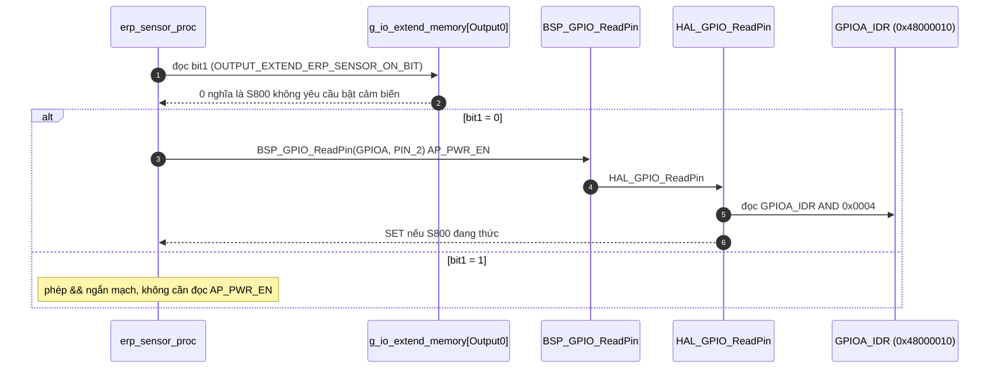
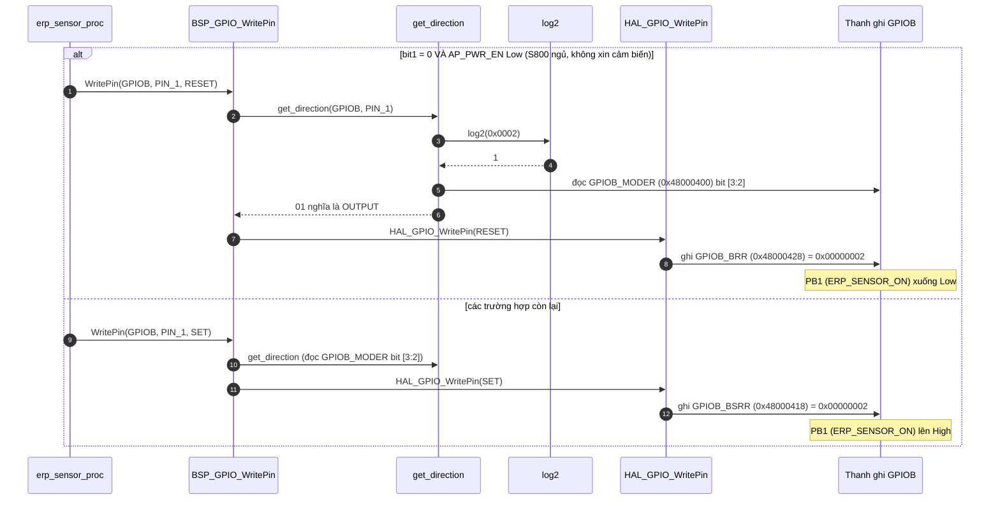
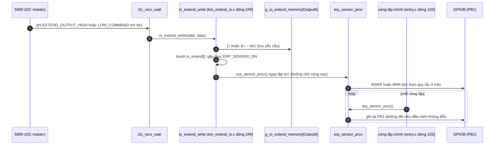

Đây là phân tích của `erp_sensor_proc()`: [km_extend_io.c:687](vscode-webview://1bvn9deljhs67bs6tdc4nttro6fasb6a3o9dsbsr0n55qjrijoej/PS-CPU/pscpu_s800/main/App/km_extend_io.c#L687), gọi ở [entry.c:103](vscode-webview://1bvn9deljhs67bs6tdc4nttro6fasb6a3o9dsbsr0n55qjrijoej/PS-CPU/pscpu_s800/main/App/entry.c#L103) và cả trong `io_extend_write()`. Hàm điều khiển **một chân duy nhất** (PB1, `ERP_SENSOR_ON`) theo quy tắc ngắn. Các diagram chưa được render thử.

## Cây lời gọi

```
erp_sensor_proc
├─ g_io_extend_memory[Output0] bit1             →  RAM (S800 có yêu cầu bật cảm biến không)
├─ BSP_GPIO_ReadPin(AP_PWR_EN)                   →  HAL_GPIO_ReadPin  →  GPIOA_IDR bit2
└─ BSP_GPIO_WritePin(ERP_SENSOR_ON, RESET/SET)
     ├─ get_direction  →  log2  +  GPIOB_MODER bit [3:2]
     └─ HAL_GPIO_WritePin  →  GPIOB_BRR hoặc GPIOB_BSRR
```

## Diagram A: tầng điều kiện



## Diagram B: tầng hành động



## Diagram C: hai đường dẫn tới hàm (vòng lặp chính và lệnh I2C)



## Giải thích từng bước

1. **Quy tắc duy nhất.** `[SOURCE]` PB1 chỉ xuống Low khi **cả hai** đúng: S800 không yêu cầu bật cảm biến (bit1 = 0) và `AP_PWR_EN` Low (S800 đang ngủ). Mọi trường hợp khác (bit1 = 1, hoặc `AP_PWR_EN` High) thì PB1 lên High.
2. **Hai nguồn quyết định.** `[SOURCE]` (a) bit yêu cầu do S800 ghi qua I2C, (b) mức thực của chân `AP_PWR_EN`. Comment lịch sử xác nhận: "2016/10/13 ERP_SENSOR_ONは電文の指示に従うように変更" (theo lệnh từ S800) và "2017/05/01 電文の指示とAP_PWR_EN信号の状態で判断するように変更" (xét cả lệnh lẫn trạng thái `AP_PWR_EN`).
3. **Đường I2C có phản hồi tức thì.** `[SOURCE]` `io_extend_write` có nhánh đặc biệt riêng cho chân này (dòng 276-278): ngay sau khi cập nhật RAM, nó gọi thẳng `erp_sensor_proc()` thay vì ghi chân theo kiểu chung (HIGH/LOW). Nhờ vậy lệnh của S800 có tác dụng ngay trong lần xử lý I2C đó, không cần chờ vòng lặp tiếp theo.
4. **Vòng lặp chính duy trì trạng thái.** `[SOURCE]` Mỗi vòng, hàm đọc lại `AP_PWR_EN` và ghi lại PB1, nên khi S800 chuyển giữa thức và ngủ, PB1 theo kịp mà không cần sự kiện ngắt riêng.
5. **Ghi mỗi vòng, kể cả khi không đổi.** `[SOURCE]` Mỗi lần ghi gồm một lần đọc `GPIOB_MODER` và một lần ghi `BSRR/BRR`. Ghi lặp không gây hại vì `BSRR/BRR` là thao tác nguyên tử và idempotent.

## Vì sao phải có hàm này (mục đích)

1. **Tắt nguồn cảm biến khi S800 ngủ để tiết kiệm điện.** `[INFERENCE]` Trên sơ đồ khối bạn gửi, đường `ERP (sensor off)` từ PS-CPU đi qua một transistor (`Tr`) và FET để đóng/mở rail `5V00` cấp cho các cảm biến. Tên `ERP` có vẻ liên quan đến chế độ tiết kiệm điện (code dùng cụm "Sleep2/ERP" ở nhiều chỗ). Khi S800 ngủ (`AP_PWR_EN` Low) và không cần cảm biến thì cắt nguồn cảm biến.
2. **Cho S800 quyền giữ cảm biến sống khi ngủ.** `[INFERENCE]` Nếu S800 cần cảm biến vẫn hoạt động trong lúc ngủ (ví dụ để đánh thức hệ thống), nó ghi bit1 = 1 qua I2C và PS-CPU giữ PB1 ở High.
3. **Tách khỏi `io_extend_write` kiểu chung.** `[SOURCE]` Các chân khác (như `_RST_SLP2`) được ghi trực tiếp theo lệnh HIGH/LOW. Chân này phải kết hợp thêm `AP_PWR_EN`, nên có hàm riêng mà `io_extend_write` gọi lại.

## Bảng chân tri

|Bit1 (S800 yêu cầu)|`AP_PWR_EN`|PB1 (`ERP_SENSOR_ON`)|
|---|---|---|
|0|Low (S800 ngủ)|Low (`GPIOB_BRR`)|
|0|High (S800 thức)|High (`GPIOB_BSRR`)|
|1|Low|High|
|1|High|High|

## Điểm đáng chú ý

- **Giá trị bit1 ở lần khởi động đầu.** `[SOURCE]` `io_extend_memory_write()` chụp mức các chân vào RAM lúc khởi động. PB1 được `MX_GPIO_Init` kéo Low trước đó, nên bit1 khởi đầu bằng 0. Vì vậy sau khi S800 thức dậy (`AP_PWR_EN` High) PB1 lên High, và khi S800 ngủ lại (nếu không ghi bit1 = 1) PB1 xuống Low.
- **`AP_PWR_EN` đọc thô**, không qua kiểm tra chống rung. Một xung nhiễu ngắn trên `AP_PWR_EN` có thể làm PB1 nhấp nháy trong một vòng lặp.
- **Cực tính điện của PB1 chưa rõ.** `[INFERENCE]` Code gọi mức High là "ON". Nhưng sơ đồ khối ghi nhãn `ERP (sensor off)` và có một transistor `Tr` (có thể đảo mức) trước FET. Tôi không xác định được High ở PB1 thực sự bật hay tắt 5V00, cần schematic để biết.
- **`s800_power_off()` cũng tắt chân này.** `[SOURCE]` `extend_output_init()` ghi `GPIOB_BRR` bit1 (dòng 407) trước khi chip reset, nên tắt nguồn S800 cũng cắt nguồn cảm biến.

## Chưa xác minh

- Offset thanh ghi (`IDR`, `MODER`, `BSRR`, `BRR`) là kiến thức reference manual; base address đọc từ `stm32f031x6.h`, số chân đọc từ `mxconstants.h`.
- Ý nghĩa chính xác của chữ "ERP" và cực tính thực của PB1 không có trong code.