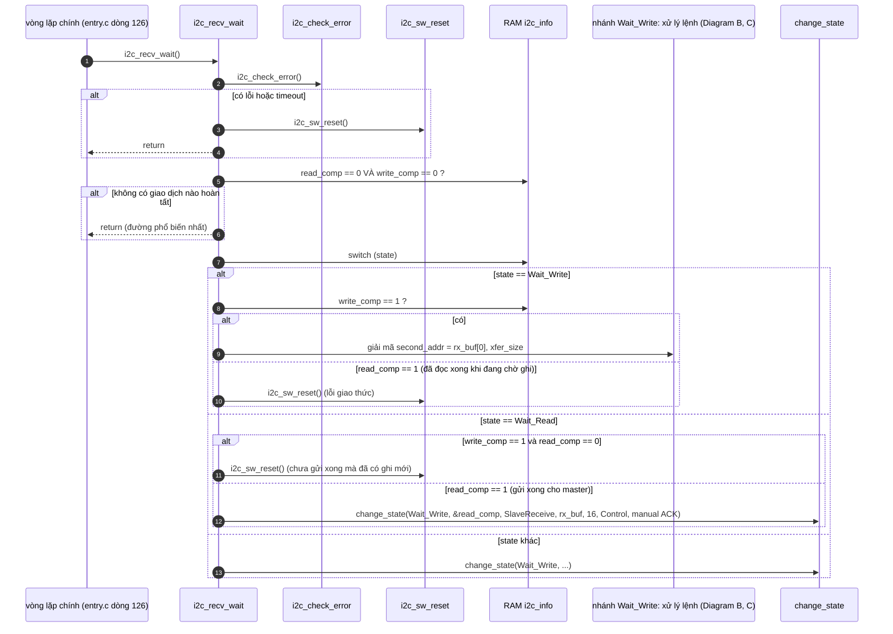
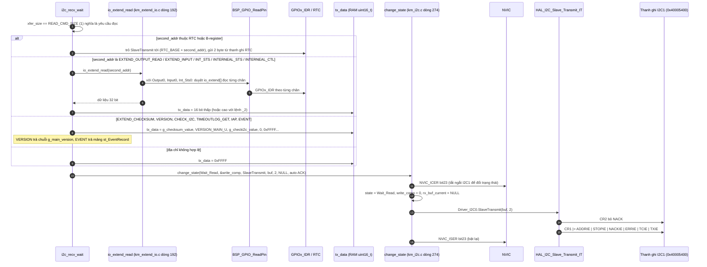
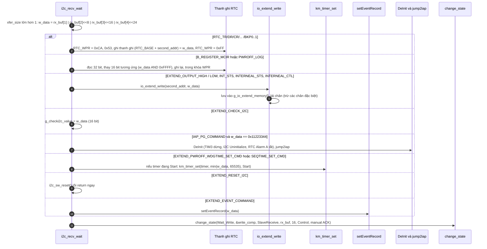
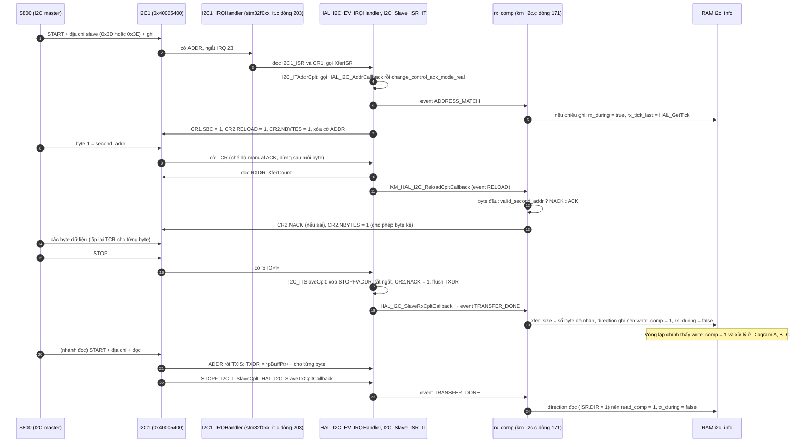

"Hàm tiếp theo" là `i2c_recv_wait()`: [km_i2c.c:485](vscode-webview://1bvn9deljhs67bs6tdc4nttro6fasb6a3o9dsbsr0n55qjrijoej/PS-CPU/pscpu_s800/main/App/km_i2c.c#L485), gọi ở [entry.c:126](vscode-webview://1bvn9deljhs67bs6tdc4nttro6fasb6a3o9dsbsr0n55qjrijoej/PS-CPU/pscpu_s800/main/App/entry.c#L126). Đây là hàm lớn nhất của vòng lặp, và là **cầu nối duy nhất giữa S800 và toàn bộ trạng thái của PS-CPU**: nó biến mỗi giao dịch I2C thành thao tác trên RAM, GPIO, RTC hoặc bootloader. Các diagram chưa được render thử.

## Cây lời gọi

```
i2c_recv_wait
├─ i2c_check_error                                  (km_i2c.c dòng 379)
│    ├─ HAL_NVIC_DisableIRQ / EnableIRQ (I2C1)       →  NVIC_ICER / ISER bit23
│    ├─ HAL_GetTick                                  →  RAM uwTick
│    └─ Driver_I2C0.GetStatus                        →  RAM hi2c1.State, I2C1_ISR.DIR
├─ i2c_sw_reset                                      (dòng 356)
│    ├─ __HAL_RCC_I2C1_FORCE_RESET / RELEASE_RESET   →  RCC_APB1RSTR bit I2C1RST
│    ├─ HAL_Delay(2)
│    ├─ Driver_I2C0.Uninitialize  →  HAL_I2C_DeInit  →  PE=0, MspDeInit
│    ├─ MX_I2C1_Init                                 →  (như mx_init_sequence.md mục 5)
│    └─ i2c_recv_first                               →  (đã phân tích)
├─ nhánh READ: chọn dữ liệu rồi change_state(Wait_Read, SlaveTransmit)
│    ├─ io_extend_read  →  BSP_GPIO_ReadPin  →  GPIOx_IDR
│    ├─ truy cập trực tiếp RTC_BASE + địa chỉ
│    └─ change_state  →  Driver_I2C0.SlaveTransmit  →  HAL_I2C_Slave_Transmit_IT
├─ nhánh WRITE: ghi theo second_addr
│    ├─ RTC / B-register     →  RTC_WPR, RTC_xx, RTC_BKPxR
│    ├─ io_extend_write      →  RAM + BSP_GPIO_WritePin  →  GPIOx_BSRR/BRR
│    ├─ km_timer_set         →  RAM
│    ├─ DeInit + jump2iap    →  MSP và PC nhảy sang bootloader
│    ├─ setEventRecord       →  RAM
│    └─ change_state  →  Driver_I2C0.SlaveReceive  →  HAL_I2C_Slave_Receive_IT
└─ change_state(Wait_Write, SlaveReceive)            (nhánh hoàn tất đọc)
```

## Giao thức mà hàm này triển khai `[SOURCE]`

|Giao dịch của S800|PS-CPU hiểu là|Kích thước|
|---|---|---|
|Ghi **1 byte** (địa chỉ lệnh) rồi đọc|Yêu cầu đọc một thanh ghi ảo|Trả về 2 byte (`COMMAND_TX_SIZE`) hoặc chuỗi phiên bản/nhật ký|
|Ghi **1 byte địa chỉ + dữ liệu**|Ghi một thanh ghi ảo|Dữ liệu 32 bit, byte thấp trước (`rx_buf[1..4]`)|

Bộ đệm nhận 16 byte (`COMMAND_RWC_BUF_SIZE`). Các nhóm địa chỉ lệnh chính: RTC `0x00..0x5E`, trạng thái ngắt/nội bộ `0x60..0x6E`, đọc/ghi chân `0x70..0x82`, checksum/version `0x88..0x8E`, IAP `0x90..0xA0`, hẹn giờ tắt nguồn `0xB0..0xBC`, sự kiện `0xC0`, kiểm tra I2C `0xFC`, reset I2C `0xFE`.

## Diagram A: khung máy trạng thái của `i2c_recv_wait`



## Diagram B: nhánh ĐỌC (master ghi 1 byte rồi muốn đọc)



## Diagram C: nhánh GHI (master ghi địa chỉ và dữ liệu)



## Diagram D: phía ngắt, nơi các cờ `write_comp` và `read_comp` được đặt



## Giải thích từng bước

1. **Ngắt chỉ báo cờ; vòng lặp chính xử lý.** `[SOURCE]` ISR I2C1 (HAL) chỉ đọc/ghi `RXDR`/`TXDR` và đặt `write_comp`/`read_comp`. Toàn bộ giải mã lệnh, ghi RTC, lái GPIO, nhảy bootloader nằm ở `i2c_recv_wait` trong vòng lặp chính.
2. **Máy trạng thái hai pha.** `[SOURCE]` `Wait_Write` (chờ master gửi lệnh) và `Wait_Read` (đã chuẩn bị dữ liệu, chờ master đọc). Sau mỗi giao dịch, `change_state` nạp lại bộ nhận cho giao dịch kế. Nếu thứ tự không đúng (có cờ đọc khi đang chờ ghi, hoặc ngược lại), coi là lỗi giao thức và reset I2C.
3. **`change_state` tắt ngắt I2C1 khi đổi cấu hình.** `[SOURCE]` Ghi `NVIC_ICER` bit23 trước, `NVIC_ISER` bit23 sau, vì cờ và con trỏ buffer dùng chung với ISR.
4. **Manual ACK để NACK địa chỉ lệnh sai.** `[SOURCE]` Byte đầu được kiểm tra bằng `valid_second_addr` (bảng các dải địa chỉ hợp lệ); sai thì `CR2.NACK` = 1 để master biết lệnh không tồn tại.
5. **Phát hiện lỗi và tự phục hồi.** `[SOURCE]` `i2c_check_error` báo lỗi khi: trạng thái đang truyền kéo dài quá 2000 ms (`BUSY_TX`), nhận hoặc truyền kéo dài quá 1000 ms, mã lỗi phần cứng (`BERR`, `ARLO`, `OVR`), hoặc sai chiều giao dịch. Khi đó `i2c_sw_reset` reset I2C1 bằng `RCC_APB1RSTR`, rồi khởi tạo lại.
6. **Lệnh I2C có tác dụng thực.** Ví dụ ghi `EXTEND_OUTPUT_HIGH_COMMAND` với bit5 là yêu cầu bật `MC_P_ON`; ghi `INTERNEAL_CTL_COMMAND` là yêu cầu `SLEEP_STATUS_REM`; ghi `EXTEND_PWROFF_WDGTIME_SET_CMD` là gia hạn đồng hồ tắt nguồn; ghi `IAP_PG_COMMAND` với `0x11223344` là chuyển sang bootloader (các hàm đã phân tích ở trên đều có "người cung cấp dữ liệu" tại đây).

## Vì sao phải có hàm này (mục đích)

1. **Là cổng giao tiếp duy nhất với S800.** `[INFERENCE]` PS-CPU là slave I2C (địa chỉ 0x3D và 0x3E); S800 (LPPP, Linux) là master. Mọi thứ S800 muốn làm với phần cứng nguồn (bật MC/IR, đọc trạng thái, đặt giờ, gia hạn tắt nguồn, nạp lại firmware) đều đi qua hàm này.
2. **Nguyên tắc "S800 xin, PS-CPU quyết định".** Hàm chỉ ghi yêu cầu vào `g_io_extend_memory[]` (và một số chân không nguy hiểm); các hàm khác (`mc_p_on_proc`, `ir_p_on_proc`...) mới thực sự lái chân sau khi kiểm tra điều kiện an toàn.
3. **Tự phục hồi bus.** Vì bus I2C có thể bị treo (master reset giữa chừng, nhiễu), timeout và reset phần cứng giúp PS-CPU không bao giờ kẹt vĩnh viễn trong một giao dịch dở.
4. **Cập nhật firmware.** Nhánh `IAP_PG_COMMAND` cho phép S800 nạp phiên bản mới của PS-CPU mà không cần công cụ ngoài.
5. **Truyền sự kiện chẩn đoán.** Đọc `EXTEND_EVENT_COMMAND` trả mảng `st_EventRecord[]` (mốc thời gian `SwitchOn`, `LPPPStart`...) và ghi nguyên nhân tắt nguồn qua RTC backup register.

## Điểm đáng chú ý

- **Dữ liệu cũ có thể lẫn vào khi ghi ít hơn 4 byte.** `[SOURCE]` `w_data` luôn ghép từ `rx_buf[1..4]` bất kể `xfer_size`, và `rx_buf` không được xóa giữa các giao dịch. Nếu master ghi 1 byte địa chỉ + 2 byte dữ liệu, `rx_buf[3..4]` còn nội dung của lần trước. Phần lớn lệnh tự che 16 bit (`w_data & 0xFFFF`) nhưng `io_extend_write` nhận toàn bộ 32 bit. `[INFERENCE]` Nếu S800 luôn ghi đủ 4 byte dữ liệu thì không vấn đề; tôi chưa kiểm tra phía S800.
- **Độ trễ phụ thuộc vòng lặp chính.** `[INFERENCE]` Vì xử lý lệnh chỉ diễn ra ở vòng lặp, thời gian S800 phải chờ phụ thuộc vào thời gian một vòng. I2C không tắt kéo giãn xung (`NoStretchMode = DISABLE`), nên phần cứng giữ SCL ở mức thấp khi chưa có dữ liệu. Các thao tác chặn lâu (ví dụ `HAL_Delay(500)` trong `s800_power_off`, `HAL_Delay(2)` trong `i2c_sw_reset`) làm chậm đáp ứng I2C.
- **Không phục vụ I2C khi PS-CPU ngủ STOP.** `[INFERENCE]` `CR1.WUPEN` không được đặt nên khớp địa chỉ không đánh thức từ STOP; khi đó S800 cũng đang tắt nên không gây vấn đề.
- **Reset I2C khi nhận lệnh `EXTEND_RESET_I2C` rồi `return` ngay.** `[SOURCE]` Không gọi `change_state` sau đó vì `i2c_sw_reset` đã gọi `i2c_recv_first` để nạp lại bộ nhận.
- **Chiều của `direction`.** `[SOURCE]` `GetStatus().direction` bằng 0 khi master đọc (PS-CPU truyền), bằng 1 khi master ghi, ngược với quy ước thường gặp nên dễ đọc nhầm.

## Chưa xác minh

- Offset thanh ghi I2C (`ISR`, `RXDR`, `TXDR`, `CR1`, `CR2`) là kiến thức reference manual; base address `0x40005400` đọc từ `stm32f031x6.h`.
- Tôi chưa đọc `valid_second_addr` đầy đủ (chỉ thấy các dải trả 0), `I2C_ITListenCplt`, và các hàm RTC read ở nhánh đọc; việc S800 gửi STOP hay repeated-start giữa pha ghi địa chỉ và pha đọc là phía S800, tôi không đọc.
- Giá trị `EXTEND_PWROFF_*` mặc định và hành vi của phần mềm S800 khi gia hạn `WDGTIME` là phía S800.