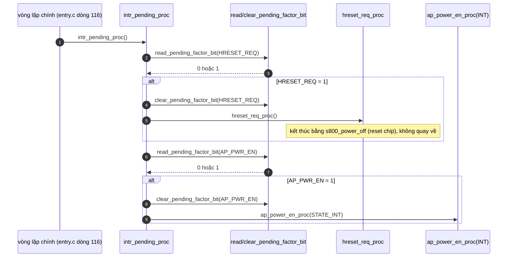
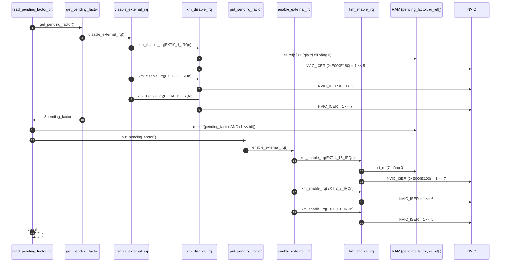
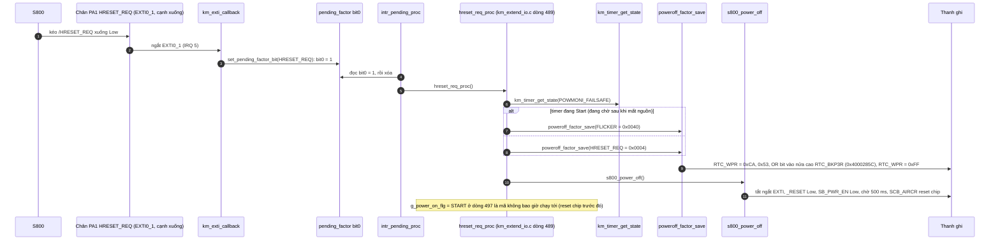

"Hàm tiếp theo" trong vòng lặp là `intr_pending_proc()`: [km_extend_io.c:1416](vscode-webview://1bvn9deljhs67bs6tdc4nttro6fasb6a3o9dsbsr0n55qjrijoej/PS-CPU/pscpu_s800/main/App/km_extend_io.c#L1416), gọi ở [entry.c:116](vscode-webview://1bvn9deljhs67bs6tdc4nttro6fasb6a3o9dsbsr0n55qjrijoej/PS-CPU/pscpu_s800/main/App/entry.c#L116). Đây là **điểm bàn giao từ ngắt sang vòng lặp chính**: ISR chỉ đặt cờ, hàm này lấy cờ ra và gọi việc xử lý thật. Các diagram chưa được render thử.

## Cây lời gọi

```
intr_pending_proc
├─ read_pending_factor_bit(bit)      (km_it.c dòng 226)
│    ├─ get_pending_factor
│    │    └─ disable_external_irq
│    │         └─ km_disable_irq(EXTI0_1 / EXTI2_3 / EXTI4_15)  →  NVIC_ICER bit5, 6, 7
│    ├─ đọc bit trong pending_factor (RAM)
│    └─ put_pending_factor
│         └─ enable_external_irq
│              └─ km_enable_irq(EXTI4_15 / EXTI2_3 / EXTI0_1)    →  NVIC_ISER bit7, 6, 5
├─ clear_pending_factor_bit(bit)     (cùng cơ chế tắt/bật ngắt, xóa bit)
├─ hreset_req_proc()                 (khi bit HRESET_REQ đặt)
│    ├─ km_timer_get_state(POWMONI_FAILSAFE)
│    ├─ poweroff_factor_save(FLICKER hoặc HRESET_REQ)   →  RTC_WPR, RTC_BKP3R
│    └─ s800_power_off()                                 →  kết thúc bằng reset chip
└─ ap_power_en_proc(STATE_INT)       (khi bit AP_PWR_EN đặt; đã phân tích ở trước)
```

## Diagram A: luồng chính



## Diagram B: bên trong `read_pending_factor_bit` (xuống thanh ghi NVIC)



`clear_pending_factor_bit(bit)` có cấu trúc giống hệt, chỉ thay thao tác giữa hai lần chặn ngắt bằng `CLEAR_BIT(pending_factor, 1 << bit)`. Với `TYPE_Km_PFB_All` nó ghi `pending_factor = 0`.

## Diagram C: nhánh `hreset_req_proc` (S800 yêu cầu reset)



## Giải thích từng bước

1. **Bàn giao từ ISR sang vòng lặp chính.** `[SOURCE]` `km_exti_callback` chỉ gọi `set_pending_factor_bit` cho hai chân (`_HRESET_REQ` và `AP_PWR_EN`); `intr_pending_proc` chạy ở vòng lặp chính và làm phần nặng. Hai chân còn lại có bit trong enum (`POWER_MONITOR`, `MSW_ON`) nhưng **không được dùng**: chúng đi qua cơ chế chống rung, không qua cờ pending.
2. **Mỗi lần truy cập cờ bao quanh bởi chặn ngắt.** `[SOURCE]` Cả ba ngắt EXTI (IRQ 5, 6, 7) bị tắt rồi bật lại quanh mỗi thao tác đọc/xóa/đặt cờ. `[GENERAL]` Cortex-M0 không có lệnh đọc-ghi độc quyền, nên thao tác `|=`/`&=` trên biến dùng chung với ISR không nguyên tử. Chặn ngắt là cách bảo vệ.
3. **Đếm tham chiếu.** `[SOURCE]` `km_disable_irq`/`km_enable_irq` dùng `ei_ref[IRQn]` để chỉ tắt NVIC lần đầu và bật lại lần cuối, an toàn cho lời gọi lồng nhau. Trong hàm này mỗi cặp tắt/bật là độc lập nên mỗi lần đều chạm `NVIC_ICER` và `NVIC_ISER`.
4. **Đọc rồi xóa là hai bước tách rời.** `[SOURCE]` Dù mỗi bước tự chặn ngắt, giữa hai bước ngắt được bật lại. Xem mục "Điểm đáng chú ý".
5. **Thứ tự ưu tiên.** `[SOURCE]` `HRESET_REQ` được kiểm tra **trước** `AP_PWR_EN`. Nếu cả hai cùng đặt, `hreset_req_proc` chạy trước và reset chip nên `AP_PWR_EN` không bao giờ được xử lý.
6. **Hai nguyên nhân ghi vào nhật ký.** `[SOURCE]` Khi `hreset_req_proc` thấy timer failsafe sau khi mất nguồn đang `Start` (xem phân tích `power_monitor_proc`), nguyên nhân là `FLICKER` (mất nguồn chớp nháy, S800 phản hồi kịp); ngược lại là `HRESET_REQ` (S800 chủ động yêu cầu).

## Vì sao phải có hàm này (mục đích)

1. **Không làm việc nặng trong ngắt.** `[SOURCE]` Mọi ưu tiên ngắt trong `MX_GPIO_Init` đều bằng 0 (cao nhất, bằng nhau), nên một ngắt không chen được ngang ngắt khác. `s800_power_off` gọi `HAL_Delay(500)`, mà `HAL_Delay` cần ngắt SysTick chạy. `[INFERENCE]` Nếu gọi `s800_power_off` thẳng từ ISR EXTI (cùng mức ưu tiên 0 với SysTick), SysTick không thể chen vào để tăng `uwTick` và `HAL_Delay` sẽ treo mãi. Bàn giao sang vòng lặp chính tránh được tình huống này.
2. **Giữ ISR ngắn.** ISR chỉ ghi một bit; phần xử lý logic, ghi RTC, tắt nguồn nằm ngoài ngắt.
3. **Tạo một "nơi duy nhất" quyết định phản ứng với yêu cầu của S800.** `HRESET_REQ` là cách S800 yêu cầu PS-CPU khởi động lại nó (chân `HRESET_REQn` từ S800 sang PS-CPU trên sơ đồ khối bạn gửi).
4. **Chặn ngủ khi còn việc.** `[SOURCE]` `sleep_mode()` kiểm tra `!pending_factor` trước khi vào ngủ nhẹ ([dòng 1400](vscode-webview://1bvn9deljhs67bs6tdc4nttro6fasb6a3o9dsbsr0n55qjrijoej/PS-CPU/pscpu_s800/main/App/km_extend_io.c#L1400)): còn cờ chưa xử lý thì không ngủ.

## Bảng chân tri

|`HRESET_REQ`|`AP_PWR_EN`|Kết quả|
|---|---|---|
|1|bất kỳ|Xóa cờ, `hreset_req_proc` rồi reset chip|
|0|1|Xóa cờ, `ap_power_en_proc(STATE_INT)`|
|0|0|Không làm gì (chỉ tốn 2 lần tắt/bật ngắt)|

## Điểm đáng chú ý

- **Sự kiện có thể bị mất giữa lúc đọc và xóa.** `[INFERENCE]` Nếu có một cạnh `AP_PWR_EN` mới đến _sau_ lệnh đọc nhưng _trước_ lệnh xóa, ISR đặt lại bit đã bằng 1 rồi `clear_pending_factor_bit` xóa luôn, mất thông tin về cạnh thứ hai. Với `AP_PWR_EN` hậu quả nhẹ vì nhánh `NORMAL` của `ap_power_en_proc` vẫn đọc lại mức chân, nhưng một dãy lên-xuống-lên rất nhanh có thể làm `_status` sai trong một thời gian ngắn.
- **Chi phí cố định mỗi vòng lặp.** `[SOURCE]` Dù không có cờ nào, hàm vẫn thực hiện hai lần đọc cờ, mỗi lần gồm ba ghi `NVIC_ICER` và ba ghi `NVIC_ISER`: tổng 12 lần ghi NVIC mỗi vòng.
- **Cửa sổ ngắt bị tắt rất ngắn** (vài lệnh), nhưng ngắt của chân khác (POWER_MONITOR, MSW_ON, MONI_24V11) cũng nằm trên các IRQ 6 và 7, nên chúng cũng bị trì hoãn trong khoảng đó. Cờ ngắt của EXTI vẫn lưu sự kiện (`EXTI_PR`), nên ngắt sẽ chạy ngay khi được bật lại.
- **Hai bit không dùng.** `TYPE_Km_PFB_POWER_MONITOR` và `TYPE_Km_PFB_MSW_ON` không được đặt ở bất kỳ nơi nào trong code (đã grep).

## Chưa xác minh

- Offset thanh ghi NVIC (`ISER` `0xE000E100`, `ICER` `0xE000E180`) là kiến thức reference manual.
- Việc `HAL_Delay` trong ISR gây treo là suy luận từ cấu hình ưu tiên và nội dung `s800_power_off`; tôi chưa thử trên phần cứng.
- Ý nghĩa vật lý chính xác của `/HRESET_REQ` (S800 yêu cầu reset để làm gì) dựa vào tên tín hiệu và sơ đồ khối.