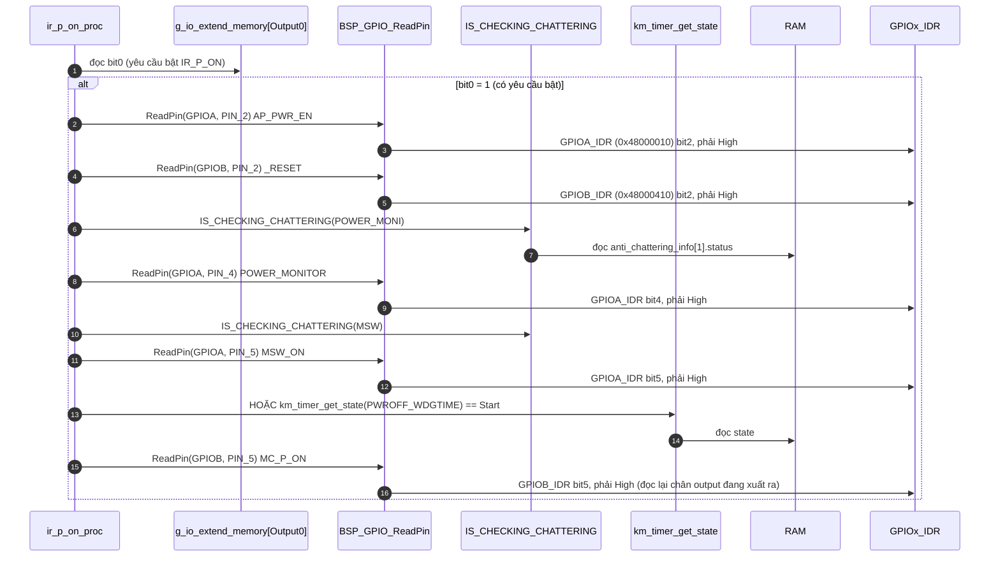
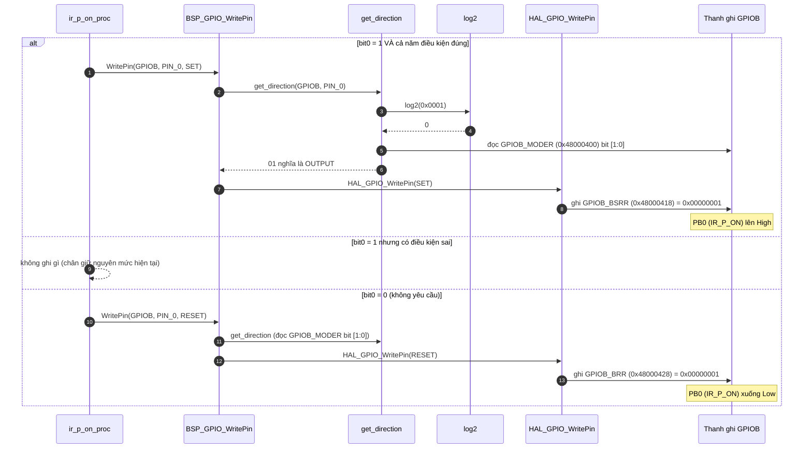
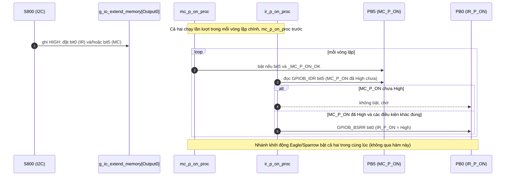

Đây là phân tích của `ir_p_on_proc()`: [km_extend_io.c:862](vscode-webview://1bvn9deljhs67bs6tdc4nttro6fasb6a3o9dsbsr0n55qjrijoej/PS-CPU/pscpu_s800/main/App/km_extend_io.c#L862), gọi ở [entry.c:99](vscode-webview://1bvn9deljhs67bs6tdc4nttro6fasb6a3o9dsbsr0n55qjrijoej/PS-CPU/pscpu_s800/main/App/entry.c#L99), ngay sau `mc_p_on_proc`. Hàm này ngắn hơn `mc_p_on_proc`: không phân phối theo model, không dùng macro `_MC_P_ON_OK`. Các diagram chưa được render thử.

## Cây lời gọi

```
ir_p_on_proc
├─ g_io_extend_memory[Output0] bit0           →  RAM (yêu cầu bật IR_P_ON)
├─ BSP_GPIO_ReadPin ×5                         →  GPIOA_IDR / GPIOB_IDR
│    (AP_PWR_EN, _RESET, POWER_MONITOR, MSW_ON, MC_P_ON)
├─ IS_CHECKING_CHATTERING ×2                   →  RAM (POWER_MONI, MSW)
├─ km_timer_get_state(PWROFF_WDGTIME)          →  RAM
└─ BSP_GPIO_WritePin(IR_P_ON, SET / RESET)
     ├─ get_direction  →  log2  +  GPIOB_MODER
     └─ HAL_GPIO_WritePin  →  GPIOB_BSRR hoặc GPIOB_BRR
```

## Diagram A: tầng điều kiện (năm điều kiện, chỉ đọc)



Phép `&&` ngắn mạch nên điều kiện sai đầu tiên dừng việc đọc các chân sau. Biểu thức MSW trong mã là `(!chống_rung && MSW) || timer_Start` nhờ độ ưu tiên của `&&` cao hơn `||`.

## Diagram B: tầng hành động



## Diagram C: vị trí trong chuỗi bật nguồn (MC trước, IR sau)



## Giải thích từng bước

1. **Cùng mô hình "S800 xin, PS-CPU quyết định" như `MC_P_ON`.** `[SOURCE]` `io_extend_write` chỉ lưu yêu cầu `IR_P_ON` vào RAM mà không ghi chân (comment: "24V11_MONIを監視する必要あるためここでは操作しない"). Hàm này là nơi duy nhất lái chân PB0 trong chế độ thường.
2. **Năm điều kiện, bớt hai so với `MC_P_ON`.** `[SOURCE]` So với `_MC_P_ON_OK()`, hàm này **không** kiểm tra `SB_PG` và **không** kiểm tra `MONI_24V11`, nhưng thêm điều kiện **`MC_P_ON` đã High**. Comment lịch sử giải thích (2018/01/18): "IR_P_ONの制御に24Vのチェックは不要。MC_P_ONがONの時だけIR_P_ONをONに制御出来るように変更" (không cần kiểm 24V, chỉ cần `MC_P_ON` đang bật). Lý do: `MC_P_ON` đã qua kiểm tra 24V rồi, nên `IR_P_ON` đi sau là đủ an toàn.
3. **Thứ tự luôn là MC trước, IR sau.** `[SOURCE]` Điều kiện đọc `GPIOB_IDR` bit5 ép thứ tự này ở mức phần cứng, kể cả khi S800 đặt hai bit yêu cầu cùng lúc: `IR_P_ON` chỉ lên sau khi chân `MC_P_ON` thực sự đã High.
4. **Ngoại lệ chờ tắt (2018/07/12).** `[SOURCE]` Điều kiện công tắc chính có ngoại lệ `PWROFF_WDGTIME` đang `Start`, giống `_MC_P_ON_OK`: cho phép bật `IR_P_ON` trong lúc S800 đang tắt máy dù công tắc đã mở.
5. **Tắt không có điều kiện.** `[SOURCE]` Khi bit yêu cầu = 0, hàm ghi `GPIOB_BRR` mỗi vòng lặp, kéo `IR_P_ON` Low ngay.
6. **Đọc `IDR` của chân output.** `MC_P_ON` là chân output của PS-CPU; đọc `GPIOB_IDR` bit5 trả mức thật trên chân (`[RM0091]`), nên điều kiện "MC_P_ON đã High" dựa vào mức vật lý chứ không chỉ vào bit RAM.

## Vì sao phải có hàm này (mục đích)

1. **Cấp nguồn khối IR sau khối MC.** `[INFERENCE]` `IR_P_ON` yêu cầu AC-LV power cấp nguồn cho khối thứ hai (theo tài liệu `PS-CPU-Documentation.html` trong repo là khối đọc ảnh "Image Reading"; tôi chưa kiểm tra phía phần cứng). Hai khối cần bật theo thứ tự để tránh dòng đột biến và trạng thái giao tiếp không xác định giữa chúng.
2. **Giữ PS-CPU là cổng cuối cùng.** Phần mềm trên S800 có thể bị treo hoặc sai; việc kiểm tra `AP_PWR_EN`, `_RESET`, `POWER_MONITOR` và `MC_P_ON` luôn nằm ở PS-CPU.
3. **Tách riêng khỏi `mc_p_on_proc` vì điều kiện khác nhau.** Gộp chung sẽ làm `IR_P_ON` phải kiểm tra thêm 24V và `SB_PG` vô ích; tách riêng cho phép điều kiện đơn giản hơn (đã ghi trong lịch sử sửa đổi).

## Bảng chân tri

|Bit yêu cầu IR|`AP_PWR_EN`, `_RESET`, `POWER_MONITOR`, MSW hoặc timer, `MC_P_ON`|PB0|
|---|---|---|
|0|bất kỳ|Kéo Low (`BRR`)|
|1|tất cả đúng|Kéo High (`BSRR`)|
|1|có điều kiện sai|Giữ nguyên (không ghi)|

## Điểm đáng chú ý

- **`IR_P_ON` có thể ở lại High sau khi `MC_P_ON` đã tắt.** `[SOURCE]` Hàm chỉ **kéo xuống** khi bit yêu cầu = 0. Nếu `MC_P_ON` bị tắt (S800 ghi LOW cho bit5, hoặc `power_monitor_proc` xử lý ngắt) mà bit0 của `IR_P_ON` còn 1, thì điều kiện `MC_P_ON` High sai và hàm **không ghi gì**, nên PB0 giữ mức cũ (High). `[INFERENCE]` Điều này chấp nhận được nếu S800 luôn tắt IR trước MC, và nửa INT của `power_monitor_proc` xóa cả hai bit cùng lúc; nhưng tôi không thấy cơ chế tự bảo vệ phía PS-CPU cho trường hợp S800 tắt MC mà quên IR.
- **Không kiểm tra `SB_PG` và 24V.** Có chủ ý (comment 2018/01/18), dựa vào `MC_P_ON`.
- **`AP_PWR_EN` và `_RESET` đọc thô** (không qua `IS_CHECKING_CHATTERING`), khác với `POWER_MONITOR` và `MSW_ON` có kiểm tra chống rung.
- **Hàm không `static`** và chỉ được gọi từ `entry.c`.
- **Nhánh bật lần đầu nằm ở nơi khác.** `[SOURCE]` Lần cấp nguồn đầu tiên cho `IR_P_ON` do `mc_p_on_eagle_proc`/`mc_p_on_sparrow_proc` làm trực tiếp (bước khởi động, bỏ qua hàm này); `ir_p_on_proc` lo các lần bật theo yêu cầu của S800 về sau và lái xuống.

## Chưa xác minh

- Offset thanh ghi (`IDR`, `MODER`, `BSRR`, `BRR`) là kiến thức reference manual; base address đọc từ `stm32f031x6.h`, số chân đọc từ `mxconstants.h`.
- Ý nghĩa vật lý của "IR" chỉ lấy từ tài liệu `PS-CPU-Documentation.html`, không có trong code.