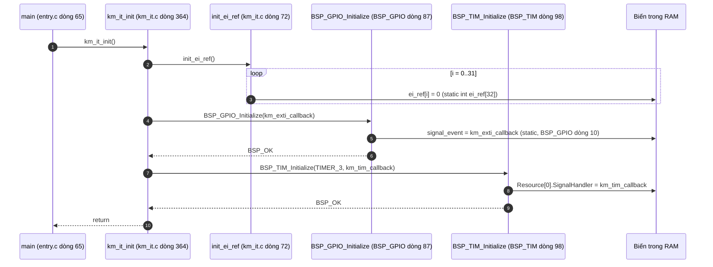
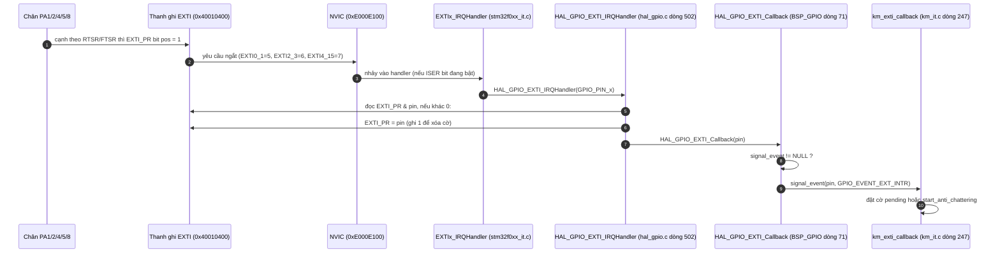
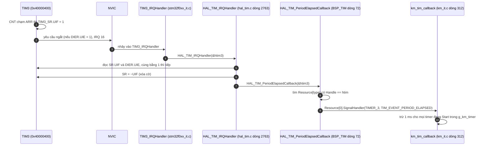

`km_it_init()` **không ghi thanh ghi phần cứng nào**. Nó chỉ ghi ba thứ vào RAM: bộ đếm `ei_ref[]`, con trỏ `signal_event` của driver GPIO và con trỏ `SignalHandler` của driver TIM. Phần phần cứng nằm ở lúc ngắt xảy ra sau này, nên tôi vẽ cả đường đó.

## Diagram 1: `km_it_init()` (chỉ ghi RAM)

## Diagram 2: đường ngắt GPIO tới thanh ghi (nơi `signal_event` được dùng)

## Diagram 3: đường ngắt TIM3 tới thanh ghi (nơi `SignalHandler` được dùng)

## Giải thích từng bước

1. **`init_ei_ref` (RAM, không phải thanh ghi).** `[SOURCE]` Xóa mảng `ei_ref[32]` về 0. Mảng này là bộ đếm tham chiếu cho cặp `km_disable_irq` / `km_enable_irq` ([km_it.c:436-460](vscode-webview://1bvn9deljhs67bs6tdc4nttro6fasb6a3o9dsbsr0n55qjrijoej/PS-CPU/pscpu_s800/main/App/km_it.c#L436-L460)). Cặp này chỉ chạm thanh ghi NVIC khi bộ đếm chuyển giữa 0 và 1:
    - `km_disable_irq`: nếu `ei_ref[IRQn]++ == 0` thì mới gọi `NVIC_DisableIRQ`, tức ghi `NVIC_ICER` bit tương ứng.
    - `km_enable_irq`: nếu `--ei_ref[IRQn] == 0` thì mới gọi `NVIC_EnableIRQ`, tức ghi `NVIC_ISER`.
    - Giá trị khởi đầu 0 khớp với trạng thái "ngắt đang bật" (do `MX_GPIO_Init` đã bật EXTI trước đó mà không qua `km_enable_irq`).
2. **`BSP_GPIO_Initialize`.** `[SOURCE]` Gán `signal_event = km_exti_callback`. Biến này là `static` trong `BSP_GPIO_...c`, khởi đầu `NULL`. Sau lệnh gán, đường Diagram 2 mới có nơi đến.
3. **`BSP_TIM_Initialize`.** `[SOURCE]` Gán `Resource[TIMER_3].SignalHandler = km_tim_callback`. Bảng `Resource[]` chỉ có một phần tử (`htim3`) vì các timer khác nằm trong `#ifdef STM32F030x8`, mà chip này là F031.
4. **Đường ngắt GPIO (Diagram 2).** `[SOURCE]` Điểm đáng chú ý là hàm `HAL_GPIO_EXTI_Callback` ở đây do dự án định nghĩa lại, thay cho bản `__weak` của HAL. Nó chuyển sự kiện cho `signal_event` nếu đã được đăng ký. Tệp [stm32f0xx_it.c](vscode-webview://1bvn9deljhs67bs6tdc4nttro6fasb6a3o9dsbsr0n55qjrijoej/PS-CPU/pscpu_s800/main/Src/stm32f0xx_it.c) gọi `HAL_GPIO_EXTI_IRQHandler` cho từng chân: `EXTI0_1` chỉ chân 1, `EXTI2_3` chỉ chân 2, `EXTI4_15` chân 4, 5 và 8 (đủ cho `POWER_MONITOR`, `MSW_ON`, `MONI_24V11`).
5. **Xóa cờ ngắt.** `[SOURCE]` `EXTI->PR = pin` (ghi 1 để xóa). Cờ phải được xóa trước khi gọi callback, nếu không ngắt sẽ vào lại liên tục.
6. **Đường ngắt TIM3 (Diagram 3).** `[SOURCE]` `HAL_TIM_IRQHandler` kiểm tra cả cờ `UIF` lẫn bit `UIE` rồi mới xóa cờ (`SR = ~UIF`) và gọi `HAL_TIM_PeriodElapsedCallback`. Bản callback này cũng do dự án định nghĩa lại, dò bảng `Resource[]` theo địa chỉ `htim` để tìm đúng `SignalHandler`.

## Điều quan trọng cần nhớ

- **Trước `km_it_init()`: ngắt đã bật nhưng chưa có người nhận.** `[SOURCE]` `MX_GPIO_Init` đã bật NVIC cho EXTI từ trước (không qua `km_enable_irq`). Nếu có cạnh nào đến trước dòng `signal_event = ...`, `HAL_GPIO_EXTI_Callback` thấy `NULL` và **bỏ qua im lặng** (xem `if(signal_event != NULL)`). Cờ `EXTI_PR` vẫn được xóa, nên sự kiện đó mất hẳn.
- **Vì sao timer cần đăng ký trước khi chạy.** `[SOURCE]` `BSP_TIM_Start(TIMER_3,1)` nằm ngay sau `km_it_init()` ở [entry.c:66](vscode-webview://1bvn9deljhs67bs6tdc4nttro6fasb6a3o9dsbsr0n55qjrijoej/PS-CPU/pscpu_s800/main/App/entry.c#L66). Thứ tự này đảm bảo `SignalHandler` đã có trước khi tick đầu tiên đến.
- **Hạn chế của `ei_ref`.** `[INFERENCE]` `km_enable_irq` giảm bộ đếm không kiểm tra chặn dưới. Nếu gọi enable nhiều hơn disable một lần, `ei_ref` thành âm và điều kiện `== 0` không bao giờ đúng trở lại, khiến ngắt không được bật lại. Tôi thấy các lời gọi trong code đều đi theo cặp (`get_pending_factor`/`put_pending_factor`), nên điều này chưa xảy ra, nhưng đó là điểm dễ vỡ nếu ai thêm lời gọi.
- **Chưa kiểm tra.** Tôi chưa mở thân hàm `HAL_GPIO_EXTI_Callback` bản `__weak` của HAL để xác nhận nó bị ghi đè bởi bản BSP (thực tế suy ra từ việc cả hai cùng tên và cùng chữ ký). Vị trí bit `UIF` (`SR` bit0) và `UIE` (`DIER` bit0) là kiến thức reference manual, tôi không đọc từ repo.