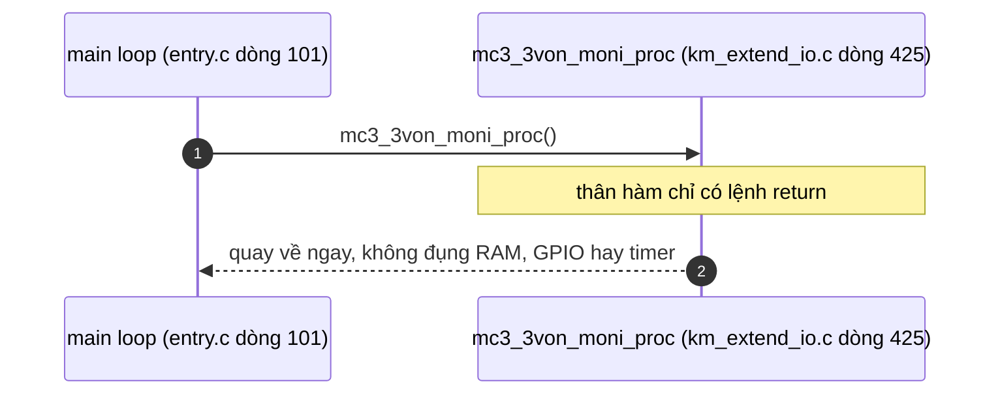
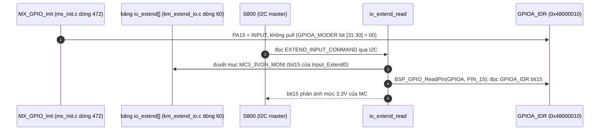

`mc3_3von_moni_proc()` là **hàm rỗng**: [km_extend_io.c:425-429](vscode-webview://1bvn9deljhs67bs6tdc4nttro6fasb6a3o9dsbsr0n55qjrijoej/PS-CPU/pscpu_s800/main/App/km_extend_io.c#L425-L429) chỉ có `return;`. Nó không đọc chân nào, không ghi thanh ghi nào và không đổi biến nào. Vì vậy không có chuỗi hàm con nào để truy vết xuống thanh ghi.

## Cây lời gọi

```
mc3_3von_moni_proc
└─ (không gọi gì)
```

## Diagram: chuỗi thực thi



Về mặt máy: một lệnh gọi hàm và một lệnh trả về. Cái giá duy nhất là vài chu kỳ CPU mỗi vòng lặp (và bộ biên dịch có thể loại bỏ hẳn lời gọi nếu bật tối ưu hóa, nhưng tôi chưa kiểm tra cấu hình biên dịch).

## Vì sao hàm tồn tại (và vì sao vẫn bị gọi)

1. **Là xác tàn của một chức năng đã bỏ.** `[SOURCE]` Comment lịch sử ngay trên hàm ghi: "2016/09/05 tạo mới" và "2017/05/01 3.3Vモニタで制御する信号が無くなったため処理を削除" (đã xóa phần xử lý vì không còn tín hiệu nào cần điều khiển theo giám sát 3.3V). Lúc đầu hàm đọc tín hiệu `MC3.3VON_MONI` rồi điều khiển một tín hiệu khác theo nó; sau khi thiết kế phần cứng đổi, tín hiệu bị điều khiển không còn, nên chỉ phần thân bị xóa, còn tên hàm và lời gọi trong `main()` vẫn giữ.
2. **Giữ nguyên khung vòng lặp.** `[INFERENCE]` Người sửa chọn giữ lời gọi để khỏi động đến `main()` và để dễ khôi phục nếu sau này cần. Tương tự `mc_oe_proc` và `adc_moni_5v_off_proc` cũng chỉ còn là hàm rỗng.

## Tín hiệu `MC3.3VON_MONI` vẫn còn dùng ở chỗ khác

`[SOURCE]` Chân PA15 vẫn được cấu hình và vẫn được đọc, chỉ không qua hàm này:



Nghĩa là PS-CPU **chỉ làm cầu nối**: S800 đọc trạng thái nguồn 3.3V_MC qua thanh ghi ảo `Input_Extend0` bit15, còn PS-CPU không phản ứng gì với tín hiệu đó nữa. Trên sơ đồ khối bạn gửi, đường `MC3.3VON_MONI` còn đi thẳng tới chân `MC_PIO` của S800 qua một buffer 3.3V_SB, cho thấy S800 cũng có thể đọc tín hiệu này trực tiếp.

## Bảng so sánh ba hàm rỗng trong vòng lặp

|Hàm|Lý do bỏ (theo comment)|Nguồn|
|---|---|---|
|`mc3_3von_moni_proc`|Không còn tín hiệu nào điều khiển theo giám sát 3.3V (2017/05/01)|[km_extend_io.c:423](vscode-webview://1bvn9deljhs67bs6tdc4nttro6fasb6a3o9dsbsr0n55qjrijoej/PS-CPU/pscpu_s800/main/App/km_extend_io.c#L423)|
|`mc_oe_proc`|Tín hiệu `MC_OE` không còn (2017/05/01)|[km_extend_io.c:1070](vscode-webview://1bvn9deljhs67bs6tdc4nttro6fasb6a3o9dsbsr0n55qjrijoej/PS-CPU/pscpu_s800/main/App/km_extend_io.c#L1070)|
|`adc_moni_5v_off_proc`|Không cần chuyển đổi ADC nữa (`#if 0`)|[km_adc.c:54](vscode-webview://1bvn9deljhs67bs6tdc4nttro6fasb6a3o9dsbsr0n55qjrijoej/PS-CPU/pscpu_s800/main/App/km_adc.c#L54)|

## Điểm đáng chú ý

- **Tên hàm gây hiểu lầm.** Đọc `main()` có thể tưởng PS-CPU đang giám sát 3.3V của MC mỗi vòng lặp, trong khi thực tế không. Cách hiểu đúng: PS-CPU chỉ _chuyển tiếp_ trạng thái cho S800.
- **Nếu cần tái dùng** (ví dụ tắt `MC_PWR_EN` khi 3.3V mất), chân PA15 đã được cấu hình input sẵn và nằm trong bảng `io_extend[]`, nên chỉ cần viết lại thân hàm. Đó là gợi ý, không phải yêu cầu từ code.

## Chưa xác minh

- Tôi chưa kiểm tra cờ tối ưu hóa của trình biên dịch nên không chắc lời gọi có bị loại bỏ khi biên dịch.
- Đường nối chính xác của `MC3.3VON_MONI` trên phần cứng (từ 3.3V_MC hay từ nguồn nào) suy ra từ sơ đồ khối và tên tín hiệu, cần schematic chi tiết để xác nhận.