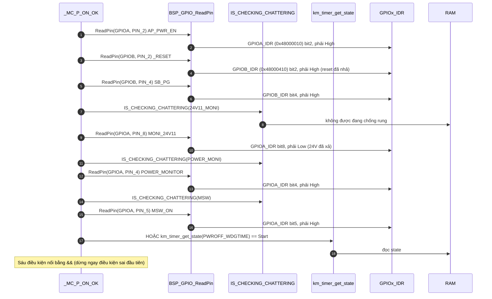
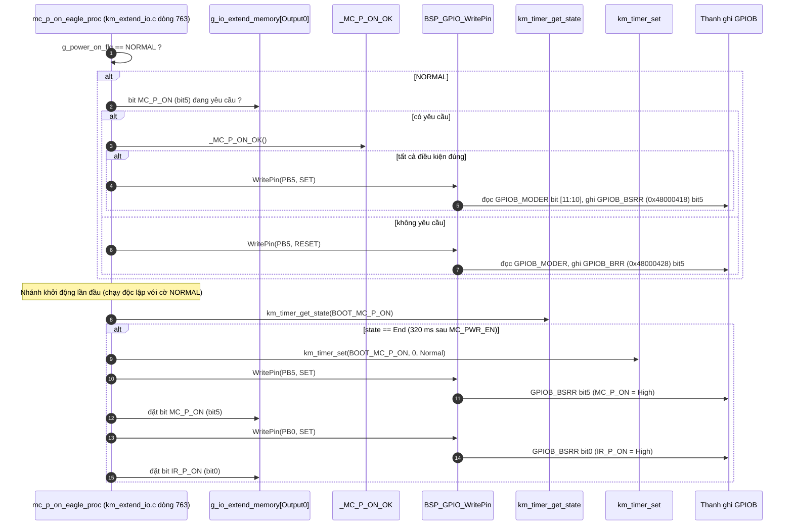
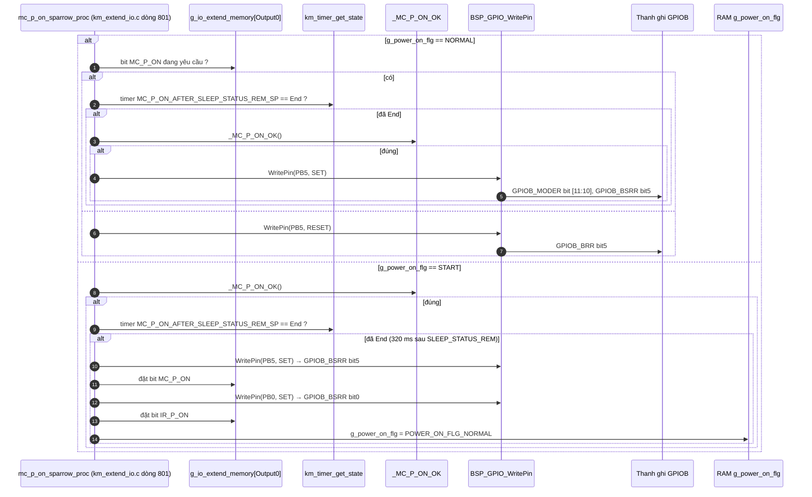
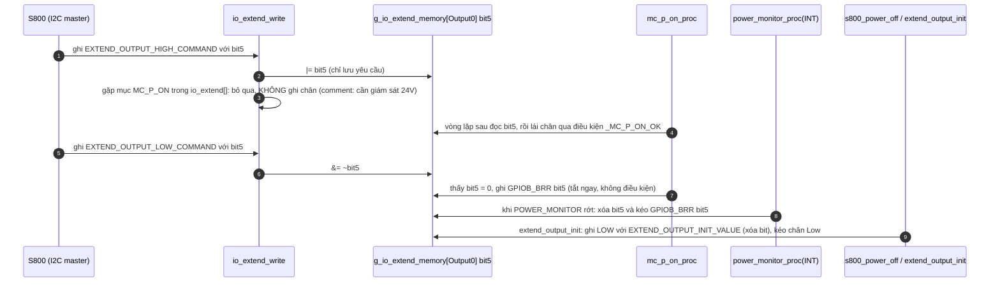

Đây là phân tích của `mc_p_on_proc(model)`: [km_extend_io.c:839](vscode-webview://1bvn9deljhs67bs6tdc4nttro6fasb6a3o9dsbsr0n55qjrijoej/PS-CPU/pscpu_s800/main/App/km_extend_io.c#L839), gọi ở [entry.c:97](vscode-webview://1bvn9deljhs67bs6tdc4nttro6fasb6a3o9dsbsr0n55qjrijoej/PS-CPU/pscpu_s800/main/App/entry.c#L97). Cấu trúc giống `sleep_status_rem_proc`: một bộ phân phối theo model, logic thật nằm ở hai hàm con. Các diagram chưa được render thử.

## Cây lời gọi

```
mc_p_on_proc(model)
└─ func[model]()            (bảng hằng: {dummy, dummy, mc_p_on_sparrow_proc, mc_p_on_eagle_proc})
     ├─ mc_p_on_eagle_proc    (model 3)
     └─ mc_p_on_sparrow_proc  (model 2)
          ├─ g_io_extend_memory[Output0] bit5      →  RAM (yêu cầu bật MC_P_ON)
          ├─ _MC_P_ON_OK()  (macro, 6 điều kiện)
          │    ├─ BSP_GPIO_ReadPin ×6              →  GPIOA_IDR / GPIOB_IDR
          │    ├─ IS_CHECKING_CHATTERING ×3        →  RAM
          │    └─ km_timer_get_state(PWROFF_WDGTIME) →  RAM
          ├─ BSP_GPIO_WritePin(MC_P_ON, SET/RESET) →  GPIOB_MODER, rồi BSRR/BRR bit5
          ├─ BSP_GPIO_WritePin(IR_P_ON, SET)       →  GPIOB_MODER, rồi BSRR bit0
          └─ km_timer_get_state / km_timer_set     →  RAM
```

Phần phân phối theo model giống hệt Diagram A của phân tích `sleep_status_rem_proc` (model 3 = Eagle, 2 = Sparrow, 0 và 1 = `dummy`).

## Diagram A: macro `_MC_P_ON_OK()` (sáu điều kiện, chỉ đọc)



## Diagram B: nhánh Eagle (model 3)



## Diagram C: nhánh Sparrow (model 2)



## Diagram D: ai đặt và ai xóa bit yêu cầu `MC_P_ON`



## Giải thích từng bước

1. **Phân phối theo model (như `sleep_status_rem_proc`).** `[SOURCE]` Bảng hằng chỉ gán hàm cho model 2 (Sparrow) và 3 (Eagle). Model 0 và 1 chạy `dummy()` và **không bao giờ cấp nguồn MC**.
2. **Chân `MC_P_ON` không do S800 trực tiếp điều khiển.** `[SOURCE]` Khi S800 ghi `EXTEND_OUTPUT_HIGH_COMMAND` qua I2C, `io_extend_write` chỉ lưu yêu cầu vào RAM và **bỏ qua** việc ghi chân (comment: "24V11_MONIを監視する必要あるためここでは操作しない"). Chỉ vòng lặp chính (hàm này) mới ghi chân, sau khi kiểm tra điều kiện an toàn.
3. **Điều kiện bật `_MC_P_ON_OK()` (Diagram A).** `[SOURCE]` Sáu điều kiện, gồm: S800 sẵn sàng (`AP_PWR_EN` High), reset đã nhả (`_RESET` High), nguồn SB tốt (`SB_PG` High), 24V đã xả (`MONI_24V11` Low), nguồn AC-LV ổn định (`POWER_MONITOR` High), công tắc chính đóng **hoặc** đang trong thời gian chờ tắt nguồn có kiểm soát (`PWROFF_WDGTIME` đang `Start`). Ba tín hiệu vào có kiểm tra chống rung.
4. **Chỉ chặn việc bật, không chặn việc tắt.** `[SOURCE]` Trong cả hai nhánh, **tắt** (`GPIOB_BRR`) chỉ cần bit yêu cầu = 0 và không kiểm tra điều kiện nào; **bật** (`GPIOB_BSRR`) phải qua `_MC_P_ON_OK()`. Thiết kế bất đối xứng này an toàn: tắt càng sớm càng tốt, bật phải đủ điều kiện.
5. **Điều kiện chỉ kiểm khi chuyển OFF → ON.** `[SOURCE]` Khi chân đã High, hàm gọi lại `_MC_P_ON_OK()` mỗi vòng nhưng nếu điều kiện sai nó chỉ **không ghi gì**, không kéo chân xuống. Vì vậy sau khi `MC_P_ON` bật, 24V sẽ lên (không còn Low) mà `MC_P_ON` vẫn giữ nguyên. Comment lịch sử xác nhận: "2017/06/05 24Vを確認するのはMC_P_ONがOFF⇒ONになった時だけ".
6. **Nhánh khởi động Eagle.** `[SOURCE]` `mc_pwr_en_proc` (Eagle) đặt `g_power_on_flg = NORMAL` và hẹn `BOOT_MC_P_ON` = 320 ms ngay khi bật `MC_PWR_EN`. Sau 320 ms, nhánh này bật `MC_P_ON` rồi `IR_P_ON` cùng lúc (`IR_P_ON` không đi qua `ir_p_on_proc` ở lần khởi động này, theo comment "電源ON制御の時だけここでIRを制御する"). Khoảng 320 ms là thời gian "LPPP nhả reset MC/UL" theo comment trong code.
7. **Nhánh khởi động Sparrow.** `[SOURCE]` Không dùng `BOOT_MC_P_ON`; thay vào đó đợi timer `MC_P_ON_AFTER_SLEEP_STATUS_REM_SP` (320 ms sau khi `SLEEP_STATUS_REM` lên High, xem phân tích hàm trước). Khi đủ cả điều kiện và timer, nó bật `MC_P_ON`, `IR_P_ON` và tự đặt `g_power_on_flg = NORMAL`.

## Vì sao phải có hàm này (mục đích)

1. **Trình tự cấp nguồn công suất có điều kiện.** `[INFERENCE]` `MC_P_ON` là yêu cầu cấp nguồn cho khối MC (MC ASIC, Driver IC, Receiver IC) qua khối AC-LV power. Cấp sai lúc (S800 chưa lên, nguồn SB chưa ổn định, 24V chưa xả hết) có thể gây dòng đột biến hoặc trạng thái không xác định cho các IC. Hàm tập trung toàn bộ điều kiện vào một chỗ.
2. **S800 chỉ "xin", PS-CPU quyết định.** Kiến trúc này là chủ ý (xem điểm 2 trên): phần mềm chạy trên S800 (Linux) không thể làm nguồn công suất mất an toàn dù có lỗi.
3. **Khác biệt phần cứng giữa Eagle và Sparrow.** `[SOURCE]` Hai model có chuỗi đánh thức khác nhau (một dùng `BOOT_MC_P_ON`, một dùng timer gắn với `SLEEP_STATUS_REM`), nên cần hai hàm.
4. **Quy trình bật khác quy trình tắt.** `[SOURCE]` Comment lịch sử của hàm ghi rõ các bước thắt chặt điều kiện qua nhiều năm (thêm `POWER_MONITOR` 2016/10, đổi `AP_PWR_EN` thành `RESET` 2017/05, chỉ kiểm 24V khi OFF→ON 2017/06, chỉ kiểm 24V sau khi SB tốt 2017/12, bật sau `AP_PWR_EN` 2018/02, bật sau `MC_PWR_EN` 2018/07). Điều đó cho thấy thứ tự này được tinh chỉnh dần từ lỗi thực tế.

## Bảng chân tri (Eagle, `g_power_on_flg == NORMAL`)

|Bit yêu cầu `MC_P_ON`|`_MC_P_ON_OK()`|Hành động trên PB5|
|---|---|---|
|0|bất kỳ|Kéo Low (`BRR`)|
|1|đúng|Kéo High (`BSRR`)|
|1|sai|Không ghi (giữ nguyên mức hiện tại)|

## Điểm đáng chú ý

- **Nhánh khởi động Eagle bỏ qua `_MC_P_ON_OK()`.** `[SOURCE]` Khi `BOOT_MC_P_ON` hết hạn, nó bật `MC_P_ON` và `IR_P_ON` **không kiểm tra lại** sáu điều kiện, chỉ dựa vào việc `_MC_PWR_EN_OK()` đã đúng 320 ms trước ở `mc_pwr_en_proc`. `[INFERENCE]` Nếu trong 320 ms đó `POWER_MONITOR` rớt (nửa INT của `power_monitor_proc` xóa bit và kéo `MC_P_ON` Low) thì khi timer hết hạn nhánh này vẫn bật lại. Tôi chưa chứng minh trường hợp này có xảy ra thật vì `s800_power_off` thường tới trước, nhưng đây là khoảng hở logic.
- **Điều kiện `MSW_ON` có ngoại lệ chờ tắt.** `[SOURCE]` `_MC_P_ON_OK` cho phép bật khi `PWROFF_WDGTIME` đang `Start` dù công tắc đã mở, để MC/IR vẫn được cấp trong lúc S800 tắt máy từ từ.
- **Hàm ghi chân mỗi vòng lặp** dù giá trị không đổi (idempotent), tương tự `mc_pwr_en_proc`.

## Chưa xác minh

- Offset thanh ghi (`IDR`, `MODER`, `BSRR`, `BRR`) là kiến thức reference manual; base address đọc từ `stm32f031x6.h`, số chân đọc từ `mxconstants.h`.
- Vai trò vật lý chính xác của `MC_P_ON` (cấp 24V hay chỉ cho phép khối MC) suy ra từ sơ đồ khối ban đầu và comment; cần schematic để xác nhận.
- Giá trị `EXTEND_OUTPUT_INIT_VALUE` chưa tra.