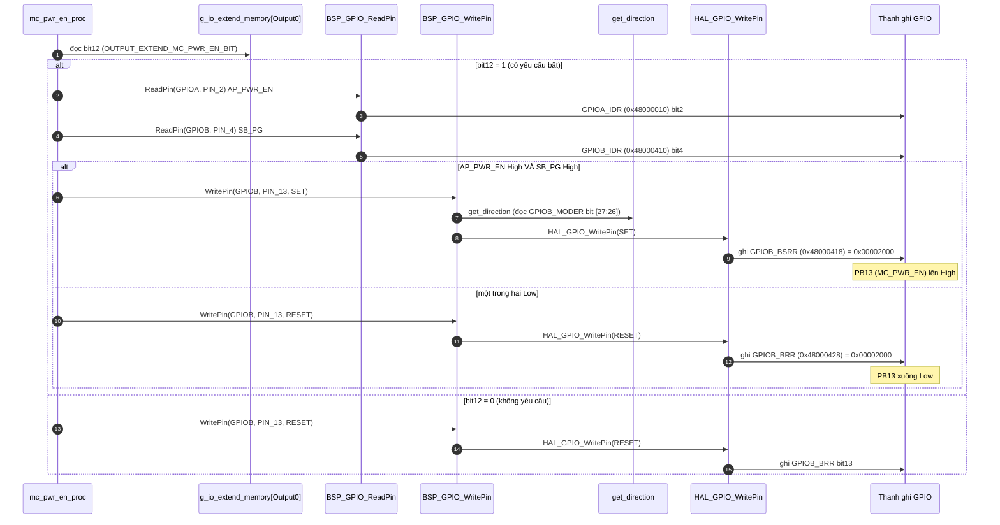
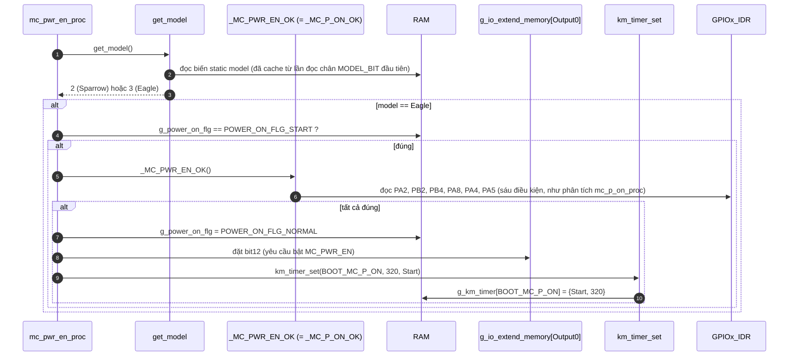
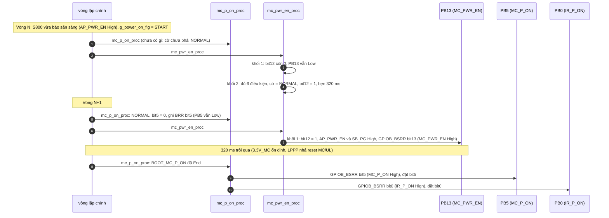

Đây là phân tích của `mc_pwr_en_proc()`: [km_extend_io.c:1096](vscode-webview://1bvn9deljhs67bs6tdc4nttro6fasb6a3o9dsbsr0n55qjrijoej/PS-CPU/pscpu_s800/main/App/km_extend_io.c#L1096), gọi ở [entry.c:107](vscode-webview://1bvn9deljhs67bs6tdc4nttro6fasb6a3o9dsbsr0n55qjrijoej/PS-CPU/pscpu_s800/main/App/entry.c#L107). Hàm có hai khối độc lập: khối 1 lái chân PB13 (`MC_PWR_EN`), khối 2 (chỉ Eagle) làm công việc chuyển trạng thái khởi động. Các diagram chưa được render thử.

## Cây lời gọi

```
mc_pwr_en_proc
├─ g_io_extend_memory[Output0] bit12          →  RAM (yêu cầu bật MC_PWR_EN)
├─ BSP_GPIO_ReadPin(AP_PWR_EN), (SB_PG)       →  GPIOA_IDR bit2, GPIOB_IDR bit4
├─ BSP_GPIO_WritePin(MC_PWR_EN, SET/RESET)
│    ├─ get_direction  →  log2  +  GPIOB_MODER bit [27:26]
│    └─ HAL_GPIO_WritePin  →  GPIOB_BSRR hoặc GPIOB_BRR bit13
├─ get_model()                                 →  RAM (biến static đã cache)
├─ _MC_PWR_EN_OK()  (= _MC_P_ON_OK, 6 điều kiện)  →  GPIOA/GPIOB_IDR, RAM chống rung, RAM timer
└─ km_timer_set(BOOT_MC_P_ON, 320, Start)      →  RAM
```

## Diagram A: khối 1, lái chân `MC_PWR_EN`



## Diagram B: khối 2, chuyển trạng thái khởi động (chỉ Eagle)



## Diagram C: chuỗi bật nguồn Eagle mà hàm này khởi động



## Giải thích từng bước

1. **Hai khối có điều kiện khác nhau.** `[SOURCE]` Khối 1 (lái chân) chỉ cần `AP_PWR_EN` và `SB_PG`. Khối 2 (chuyển trạng thái, chỉ Eagle) cần cả sáu điều kiện của `_MC_PWR_EN_OK` (là bí danh của `_MC_P_ON_OK`, xem phân tích `mc_p_on_proc`). Khối 2 là cổng vào khởi động; khối 1 là cơ chế duy trì.
2. **Khối 1 vừa bật vừa tắt.** `[SOURCE]` Khác với `MC_P_ON` và `IR_P_ON` (chỉ bật khi đủ điều kiện, không tự tắt khi điều kiện sai), `MC_PWR_EN` bị kéo Low **ngay khi `AP_PWR_EN` hoặc `SB_PG` rớt**, kể cả khi bit yêu cầu vẫn bằng 1, và tự lên lại khi cả hai trở về High. Tức là rail `MC_PWR_EN` bám theo trạng thái thức của S800.
3. **Độ trễ một vòng lặp.** `[SOURCE]` Trong cùng một lần gọi, khối 1 chạy **trước** khối 2. Khối 2 đặt bit12 nhưng khối 1 đã chạy xong, nên `PB13` chỉ lên High ở lần gọi kế tiếp (Diagram C). Hậu quả không đáng kể (vài micro đến vài mili giây), nhưng giải thích vì sao hai thao tác không xảy ra đồng thời.
4. **Khối 2 là "chuyển pha" duy nhất của Eagle.** `[SOURCE]` Ở Eagle, `g_power_on_flg` chuyển từ `START` sang `NORMAL` **tại đây**, kèm hai việc: yêu cầu bật `MC_PWR_EN` và hẹn 320 ms cho `BOOT_MC_P_ON`. Ở Sparrow, việc chuyển pha nằm trong `mc_p_on_sparrow_proc` và bit `MC_PWR_EN` được đặt bởi `sleep_status_rem_sparrow_proc` ([dòng 1001](vscode-webview://1bvn9deljhs67bs6tdc4nttro6fasb6a3o9dsbsr0n55qjrijoej/PS-CPU/pscpu_s800/main/App/km_extend_io.c#L1001)).
5. **Cache model.** `[SOURCE]` `get_model()` được gọi mỗi vòng lặp nhưng chỉ đọc chân `MODEL_BIT0/1` một lần (biến `static`); các lần sau chỉ đọc RAM.

## Vì sao phải có hàm này (mục đích)

1. **Cấp 3.3V cho khối MC trước, cấp công suất sau.** `[INFERENCE]` Trên sơ đồ khối bạn gửi, `MC_PWR` từ PS-CPU đi vào chân `EN` của bộ ổn áp tạo `3.3V_MC` (có tín hiệu `MC_PG` phản hồi), sau đó qua cầu chì thành `3.3V11` cấp cho MC ASIC, Driver IC, Receiver IC. Tín hiệu `MC_PWR_EN` cũng đi tới đầu nối M.2. Comment ở `mc_p_on_eagle_proc` ([dòng 777](vscode-webview://1bvn9deljhs67bs6tdc4nttro6fasb6a3o9dsbsr0n55qjrijoej/PS-CPU/pscpu_s800/main/App/km_extend_io.c#L777)) nêu rõ: chờ một lúc sau khi bật `MC_PWR_EN` cho LPPP nhả reset MC/UL rồi mới bật `MC_P_ON`. Đó là mục đích của khoảng 320 ms.
2. **Tắt 3.3V_MC khi S800 ngủ để tiết kiệm điện.** `[INFERENCE]` Vì khối 1 kéo `MC_PWR_EN` xuống khi `AP_PWR_EN` rớt.
3. **S800 chỉ xin, PS-CPU quyết định.** `[SOURCE]` `io_extend_write` không ghi chân này (comment dòng 287: "MC_PWR_ENはAP_PWRとSB_PWRを監視する必要あるためここでは操作しない"); hàm này là nơi duy nhất lái chân trong chế độ thường.
4. **Lịch sử sửa đổi cho thấy các ràng buộc được thêm dần.** `[SOURCE]` Header ghi: 2017/10/23 `MC_PWR_EN` bật cùng `MC_P_ON`, 2018/02/16 chuyển sang bật sau `AP_PWR_EN` ("AP起動後はメインCPUからの指示に従う"), 2018/07/07 `MC_P_ON` bật sau `MC_PWR_EN`.

## Bảng chân tri (khối 1)

|Bit12 yêu cầu|`AP_PWR_EN`|`SB_PG`|PB13 (`MC_PWR_EN`)|
|---|---|---|---|
|0|bất kỳ|bất kỳ|Low (`GPIOB_BRR`)|
|1|High|High|High (`GPIOB_BSRR`)|
|1|Low hoặc|High hoặc|Low|

## Điểm đáng chú ý

- **Không có timeout cho khối 2.** `[SOURCE]` Nếu `_MC_PWR_EN_OK()` không bao giờ đúng, `g_power_on_flg` ở `START` mãi và `MC_PWR_EN` không bao giờ được yêu cầu bật, không có báo lỗi.
- **Ghi chân mỗi vòng lặp** (idempotent), mỗi lần kèm một lần đọc `GPIOB_MODER`.
- **Bit12 không bị xóa bởi hàm này.** `[SOURCE]` Chỉ `extend_output_init()` trong `s800_power_off` (dòng 410, kèm lệnh LOW với `EXTEND_OUTPUT_INIT_VALUE`) hoặc lệnh LOW từ S800 xóa nó. Nhờ đó khi S800 ngủ rồi thức dậy, `MC_PWR_EN` tự lên lại mà không cần S800 xin lại.
- **S800 đọc trạng thái thật, không đọc bit RAM.** `[SOURCE]` `io_extend_read` cho `Output_Extend0` đọc từng chân bằng `BSP_GPIO_ReadPin`, nên S800 thấy mức vật lý của `MC_PWR_EN`.

## Chưa xác minh

- Offset thanh ghi (`IDR`, `MODER`, `BSRR`, `BRR`) là kiến thức reference manual; base address đọc từ `stm32f031x6.h`, số chân đọc từ `mxconstants.h`.
- Liên hệ giữa `MC_PWR_EN` và rail `3.3V_MC` trên sơ đồ khối là suy ra từ tên tín hiệu; tôi chưa đối chiếu schematic chi tiết.
- Giá trị `EXTEND_OUTPUT_INIT_VALUE` chưa tra.