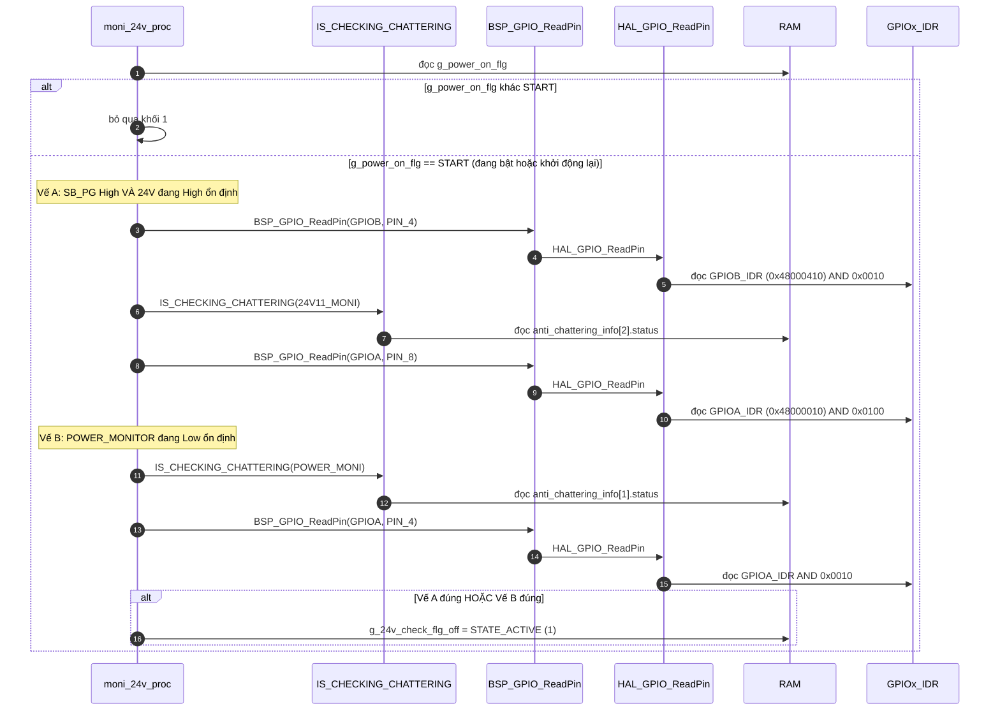
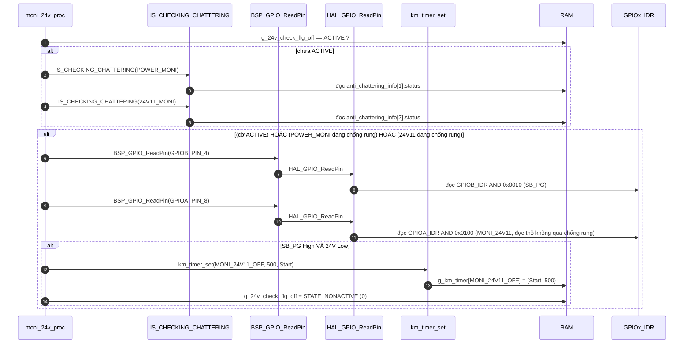

Đây là phân tích của `moni_24v_proc()`: [km_extend_io.c:575](vscode-webview://1bvn9deljhs67bs6tdc4nttro6fasb6a3o9dsbsr0n55qjrijoej/PS-CPU/pscpu_s800/main/App/km_extend_io.c#L575). Khác hai hàm trước, hàm này **không ghi thanh ghi phần cứng nào**. Nó chỉ đọc chân (`GPIOx_IDR`) và ghi RAM (cờ và timer). Các diagram chưa được render thử.

## Cây lời gọi

```
moni_24v_proc
├─ IS_CHECKING_CHATTERING(idx)  →  get_anti_chattering_info  →  RAM anti_chattering_info[idx].status
├─ BSP_GPIO_ReadPin             →  HAL_GPIO_ReadPin          →  GPIOx_IDR
└─ km_timer_set                 →  RAM g_km_timer[MONI_24V11_OFF]
(ghi RAM: g_24v_check_flg_off)
```

## Diagram A: khối 1, "có cần bắt đầu giám sát 24V không" (chỉ khi `g_power_on_flg == START`)



Phép `||` và `&&` ngắn mạch: nếu vế A đúng thì vế B không được đọc.

## Diagram B: khối 2, "24V đã xả chưa, nếu rồi thì hẹn 500 ms"



## Vị trí trong chuỗi bật nguồn

```
s800_power_off()            g_24v_check_flg_off = ACTIVE   (km_extend_io.c dòng 552: "24V監視Start")
        │
        ▼  mỗi vòng lặp
moni_24v_proc              chờ cho đến khi SB_PG High VÀ 24V Low (24V đã xả)
        │
        ▼
        km_timer_set(MONI_24V11_OFF, 500, Start), cờ = NONACTIVE
        │  (ISR TIM3 đếm lùi 500 ms)
        ▼
power_monitor_proc(NORMAL) thấy: g_power_on_flg == START, POWER_MONITOR High, timer End
        │
        ▼
s800_power_on()            bật SB_PWR_EN, hẹn 100 ms ... (xem hàm s800_power_on và sb_reset_proc)
```

## Giải thích từng bước

1. **Hàm là "máy trạng thái nhỏ" gồm một cờ và một timer.** Cờ `g_24v_check_flg_off` có hai giá trị: `ACTIVE`=1 ("đang theo dõi 24V xả") và `NONACTIVE`=0. `[SOURCE]` Cờ được đặt `ACTIVE` ở hai nơi: cuối `s800_power_off()` và khối 1 của hàm này.
2. **Khối 1 (Diagram A).** Bật cờ khi gặp một trong hai tình huống:
    - vế A: nguồn SB đang tốt **mà 24V vẫn còn High**. Nghĩa là hệ thống đang cố khởi động nhưng 24V chưa xả hết;
    - vế B: `POWER_MONITOR` rớt Low, tức nguồn AC-LV mất. Cả hai đều kết thúc bằng "cần chờ 24V xả rồi mới bật lại".
3. **Khối 2 (Diagram B).** Khi cờ đang bật (hoặc `POWER_MONITOR`/`24V11` đang trong khoảng chống rung), hàm kiểm tra điều kiện **24V đã xả**: `SB_PG` High và `MONI_24V11` Low. Đúng thì hẹn 500 ms và tắt cờ.
4. **Vì sao còn 500 ms.** Timer `MONI_24V11_OFF` không phải để chờ xả (24V đã xả rồi), mà là khoảng đệm sau khi xả trước khi `power_monitor_proc` cho phép `s800_power_on()`. `[INFERENCE]` Mục đích là tránh bật lại ngay khi điện áp vừa chạm ngưỡng của comparator (xem giải thích mạch 24V đã nói trước), nhưng code không ghi lý do cụ thể.
5. **Hàm không ghi thanh ghi phần cứng.** `[SOURCE]` Mọi tương tác với phần cứng là đọc `IDR` của PB4, PA8, PA4. Thanh ghi duy nhất bị ảnh hưởng gián tiếp là nhờ `s800_power_on` về sau.

## Bảng chân tri của khối 2

|Cờ hoặc chống rung|SB_PG|MONI_24V11|Kết quả|
|---|---|---|---|
|Không (cờ NONACTIVE, không chống rung)|bất kỳ|bất kỳ|Khối 2 không chạy|
|Có|Low|bất kỳ|Chờ SB_PG|
|Có|High|High|Chờ 24V xả|
|Có|High|Low|Hẹn 500 ms, cờ NONACTIVE|

## Điểm đáng chú ý

- **Comment ở khai báo cờ bị đảo nghĩa.** `[SOURCE]` Dòng 45 ghi `0:24V監視中 1:通常状態` (0 = đang giám sát, 1 = trạng thái thường). Nhưng code dùng ngược lại: `ACTIVE`=1 được đặt khi **bắt đầu** giám sát (dòng 552 ghi "24V監視Start"), và `NONACTIVE`=0 khi xong. Đây là comment sai, không phải lỗi logic.
- **Khối 1 dùng giá trị đã chống rung, khối 2 dùng giá trị thô.** `[SOURCE]` Khối 1 yêu cầu `!IS_CHECKING_CHATTERING` cho 24V và POWER_MONITOR; khối 2 chỉ đọc `ReadPin(MONI_24V11)` trực tiếp. `[INFERENCE]` Điều kiện `|| IS_CHECKING_CHATTERING(...)` ở đầu khối 2 cho phép khối 2 chạy ngay trong lúc tín hiệu đang chống rung, nhờ đó phản ứng kịp thời, đổi lại có thể thấy một mức chưa ổn định. Tôi chưa đánh giá hậu quả thực tế.
- **Hẹn lại 500 ms nhiều lần được.** Nếu `MONI_24V11` hoặc `POWER_MONITOR` nhấp nháy, khối 2 có thể chạy lại và đặt lại timer về 500 ms mỗi lần (vì điều kiện chống rung cho phép vào lại ngay cả khi cờ đã `NONACTIVE`).
- **Không có timeout.** Nếu `SB_PG` hoặc 24V không đạt điều kiện, hàm chờ mãi và không báo lỗi.
- **Khởi tạo.** `[SOURCE]` Cờ khởi đầu `NONACTIVE`, nên lần chạy đầu tiên sau reset không giám sát gì cho tới khi có `s800_power_off()` hoặc rơi vào vế A/B. Lần bật nguồn đầu tiên đi qua `main()` gọi `s800_power_on()` trực tiếp và tự kiểm tra 24V ở bên trong (xem phân tích `s800_power_on`).

## Chưa xác minh

- Offset `IDR` (`GPIOA` `0x48000010`, `GPIOB` `0x48000410`) là kiến thức reference manual; base address đọc từ `stm32f031x6.h`.
- Tôi chưa xác nhận 500 ms xuất phát từ yêu cầu phần cứng nào (ví dụ thời gian xả của mạch 24V); code không ghi, cần đối chiếu tài liệu phần cứng.