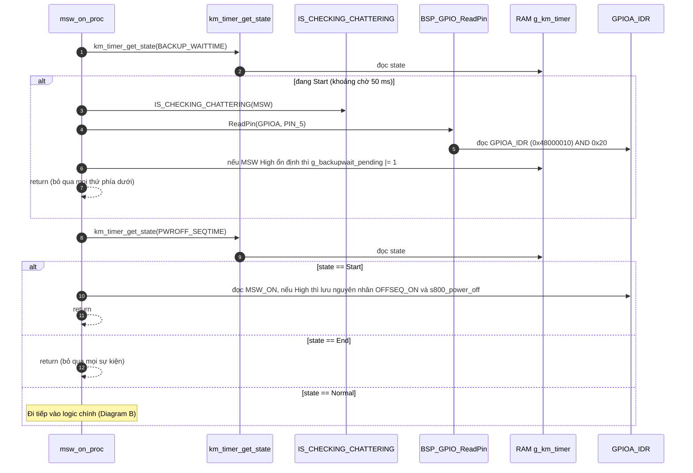
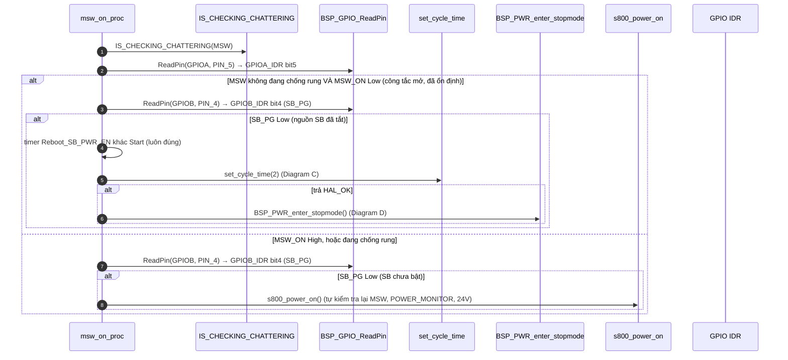
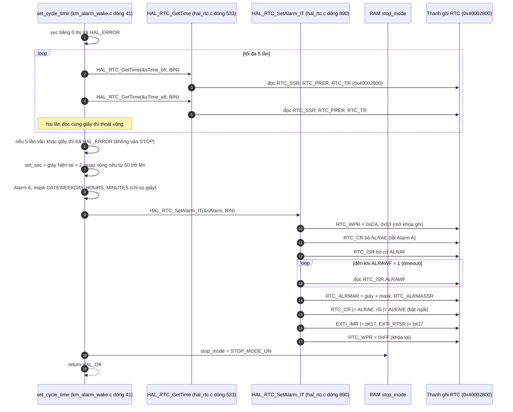
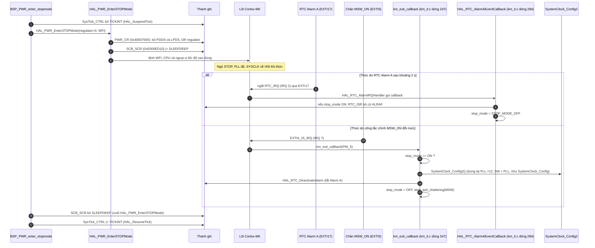

Đây là phân tích của `msw_on_proc(STATE_NORMAL)`: [km_extend_io.c:1149](vscode-webview://1bvn9deljhs67bs6tdc4nttro6fasb6a3o9dsbsr0n55qjrijoej/PS-CPU/pscpu_s800/main/App/km_extend_io.c#L1149), đường gọi từ vòng lặp chính [entry.c:91](vscode-webview://1bvn9deljhs67bs6tdc4nttro6fasb6a3o9dsbsr0n55qjrijoej/PS-CPU/pscpu_s800/main/App/entry.c#L91). Nhánh `STATE_INT` của cùng hàm (sau khi chống rung xong) đã phân tích ở trước; ở đây chỉ mổ xẻ nhánh `STATE_NORMAL`. Các diagram chưa được render thử.

## Cây lời gọi (nhánh NORMAL)

```
msw_on_proc(NORMAL)
├─ km_timer_get_state(BACKUP_WAITTIME / PWROFF_SEQTIME)      →  RAM g_km_timer
├─ IS_CHECKING_CHATTERING(MSW)                                →  RAM anti_chattering_info[0].status
├─ BSP_GPIO_ReadPin(MSW_ON / SB_PG)                           →  GPIOA_IDR / GPIOB_IDR
├─ km_timer_get_state(Reboot_SB_PWR_EN) / km_timer_set        →  RAM (nhánh chết, xem cuối)
├─ set_cycle_time(2)                                          (km_alarm_wake.c dòng 41)
│    ├─ HAL_RTC_GetTime ×2                                    →  RTC_SSR, RTC_PRER, RTC_TR
│    └─ HAL_RTC_SetAlarm_IT                                   →  RTC_WPR, CR, ISR, ALRMAR, ALRMASSR, EXTI_IMR/RTSR
├─ BSP_PWR_enter_stopmode
│    ├─ HAL_SuspendTick / HAL_ResumeTick                      →  SysTick_CTRL
│    └─ HAL_PWR_EnterSTOPMode                                 →  PWR_CR, SCB_SCR, lệnh WFI
└─ s800_power_on                                              (đã vẽ ở phân tích trước)
```

## Diagram A: hai "cổng chặn" đầu hàm (chỉ đọc RAM)



## Diagram B: logic chính của nhánh NORMAL



Hằng `MSWOFF_STOP_MODE` được định nghĩa ngay trước hàm ([dòng 1126](vscode-webview://1bvn9deljhs67bs6tdc4nttro6fasb6a3o9dsbsr0n55qjrijoej/PS-CPU/pscpu_s800/main/App/km_extend_io.c#L1126)) nên `#ifdef` chọn nhánh STOP; nhánh `BSP_PWR_enter_sleepmode` (ngủ nhẹ) trong `#else` không được biên dịch.

## Diagram C: `set_cycle_time(2)` xuống thanh ghi RTC



## Diagram D: vào STOP và hai cách thức dậy



## Giải thích từng bước

1. **Hai cổng chặn đầu hàm (Diagram A).** `[SOURCE]` Hai khoảng thời gian bảo vệ (backup 50 ms và chuỗi tắt nguồn 9,35 s) **ưu tiên hơn** logic bình thường. Trong lúc đó hàm chỉ ghi nhớ sự kiện hoặc bỏ qua, không bật/ngủ gì.
2. **Phân nhánh theo công tắc (Diagram B).**
    - Công tắc **mở** (`MSW_ON` Low ổn định) và `SB_PG` Low (hệ thống đã tắt hẳn): chuẩn bị ngủ.
    - Công tắc **đóng**, hoặc đang chống rung, và `SB_PG` Low (SB chưa bật): gọi `s800_power_on()` để bật.
    - `SB_PG` High (đang chạy hoặc đang tắt dở): hàm **không làm gì**, giao cho các hàm khác (`power_monitor_proc`, `poweroff_timer_proc`...).
3. **Hẹn giờ thức (Diagram C).** `[SOURCE]` `set_cycle_time` đọc giờ hiện tại 2 lần liên tiếp cho đến khi giây trùng nhau (tránh đọc đúng lúc chuyển giây), rồi đặt Alarm A tại `giây + 2`. Alarm chỉ so khớp **trường giây**, nên sẽ nổ mỗi phút ở giây đó, chứ không phải đúng "2 s sau". Hàm tính `giây_hiện_tại + 2`, nên với cách đặt này lần nổ đầu tiên cách 2 s, và vì alarm chỉ mask giây nên sẽ lặp mỗi 60 s nếu không được đặt lại. Mỗi vòng lặp `msw_on_proc` lại gọi `set_cycle_time` để đặt lại, nên thực tế chu kỳ là khoảng 2 s.
4. **Vào STOP (Diagram D).** `[SOURCE]` `HAL_SuspendTick` tắt ngắt SysTick (nếu không, SysTick 1 ms sẽ đánh thức ngay). `Regulator = 0` nên `PWR_CR.LPDS` = 0: giữ bộ ổn áp chính trong STOP (`[RM0091]`, tức tiêu thụ cao hơn nhưng thức nhanh hơn). `SLEEPDEEP` = 1 rồi `WFI` đưa chip vào STOP. Mã đặt `SLEEPDEEP` về 0 và bật lại SysTick sau khi thức.
5. **Thức bằng RTC.** `[SOURCE]` `HAL_RTC_AlarmAEventCallback` xóa cờ `ALRAF` và đặt `stop_mode = OFF`. Nó **không** gọi `SystemClock_Config2`.
6. **Thức bằng công tắc.** `[SOURCE]` `km_exti_callback` (chân `MSW_ON`) dựng lại PLL và hủy alarm, rồi bắt đầu chống rung. Chỉ làm vậy khi `stop_mode == ON`.

## Vì sao phải gọi hàm này mỗi vòng lặp (mục đích)

1. **Là trung tâm điều khiển nguồn theo công tắc ở trạng thái ổn định.** `[SOURCE]` Nhánh `STATE_INT` chỉ chạy một lần khi công tắc đổi mức. Nhánh `STATE_NORMAL` chạy liên tục để **duy trì** trạng thái đúng: nếu công tắc đóng mà nguồn chưa lên thì bật, nếu công tắc mở mà nguồn đã tắt thì ngủ. Nhờ vậy hệ thống tự phục hồi dù bỏ lỡ một sự kiện ngắt (ví dụ ngắt đến khi đang trong khoảng bảo vệ).
2. **Tiết kiệm điện khi máy tắt.** `[SOURCE]` Comment ở `km_alarm_wake.c` và `MSWOFF_STOP_MODE` cho thấy ý đồ: khi công tắc chính tắt, PS-CPU vào STOP, chỉ thức mỗi 2 s. Lịch sử sửa đổi trong code còn có mục `OP_BTS-21266` liên quan đến dòng tiêu thụ khi nguồn chính tắt, cho thấy đây là yêu cầu có thật.
3. **Vẫn phải thức theo chu kỳ.** `[INFERENCE]` Thức mỗi 2 s để vòng lặp tiếp tục refresh watchdog (timeout khoảng 26 s, xem phân tích `BSP_WDT_Refresh`) và để kiểm tra lại công tắc phòng khi ngắt bị sót.
4. **Là cầu nối giữa khởi động lạnh và khởi động lại.** `[SOURCE]` Khi `s800_power_off()` kết thúc bằng `HAL_NVIC_SystemReset()`, PS-CPU khởi động lại và chạy lại hàm này; nếu công tắc đã mở và `SB_PG` Low, nó đưa chip ngay vào STOP.

## Bảng chân tri (nhánh NORMAL, sau hai cổng chặn)

|Chống rung MSW|MSW_ON|SB_PG|Hành động|
|---|---|---|---|
|Không|Low|Low|Đặt Alarm 2 s, vào STOP|
|Không|Low|High|Không làm gì (tắt dở hoặc đang chạy)|
|Không hoặc Có|High hoặc đang chống rung|Low|`s800_power_on()`|
|Không hoặc Có|High hoặc đang chống rung|High|Không làm gì|

## Điểm đáng chú ý

- **Nhánh `Reboot_SB_PWR_EN` là mã chết.** `[SOURCE]` Timer này không bao giờ được `Start` (đã nêu), nên điều kiện `!= Start` luôn đúng.
- **Rủi ro về clock sau khi thức bằng RTC. Đây là suy luận, cần kiểm chứng trên phần cứng.** `[SOURCE]` `HAL_RTC_AlarmAEventCallback` đặt `stop_mode = OFF` mà không dựng lại PLL; chỉ ngắt `MSW_ON` mới gọi `SystemClock_Config2`. `[RM0091]` Sau STOP, SYSCLK về HSI (8 MHz) và PLL tắt. Hệ quả có thể xảy ra: sau mỗi lần thức do RTC, CPU chạy ở 8 MHz trong khi `SysTick_LOAD` và `TIM3_PSC` được tính cho 48 MHz, nên các tick chậm đi 6 lần (1 ms thành 6 ms) cho đến lần STOP kế tiếp. Nếu công tắc được đóng trong khoảng ngắn lúc đang thức giữa hai lần STOP (`stop_mode` đã là OFF), ISR sẽ **không** dựng lại PLL, và PS-CPU có thể tiếp tục chạy ở 8 MHz khi đã bật nguồn. Tôi chưa chứng minh được điều này xảy ra thật, vì chưa kiểm chứng hành vi sau STOP trên phần cứng.
- **Alarm A cũng là tín hiệu `WAKEUP` phát cho S800.** `[SOURCE]` Comment trong `stm32f0xx_hal_rtc.c` (đã bị `#if 0` ở `HAL_RTC_AlarmIRQHandler`) giải thích: PS-CPU không được xóa cờ `ALRAF` vì làm vậy sẽ làm tín hiệu `WAKEUP` mất một nhịp; chủ (S800) tự xóa. `[INFERENCE]` Đó là lý do `RTC_CR.OSEL = ALARMA` được bật ở `MX_RTC_Init`. Callback riêng của dự án chỉ xóa cờ khi `stop_mode == ON`, tức là khi alarm là do PS-CPU tự đặt.
- **Mọi chân EXTI đều đánh thức STOP**, không chỉ `MSW_ON` (`POWER_MONITOR`, `MONI_24V11`, `AP_PWR_EN`, `_HRESET_REQ`). `[INFERENCE]` Với các chân khác, callback không dựng lại clock, nên chúng được xử lý ở clock HSI cho đến lần kế tiếp.

## Chưa xác minh

- Offset thanh ghi (`IDR`, `PWR_CR`, `SCB_SCR`, RTC, EXTI) là kiến thức reference manual; base address đọc từ `stm32f031x6.h`.
- Hành vi clock sau STOP (SYSCLK về HSI, PLL tắt) là kiến thức reference manual, chưa đo trên phần cứng.
- `PWR_MAINREGULATOR_ON` bằng 0: tôi giả định theo quy ước HAL, chưa mở header.
- Tôi chưa đọc `__HAL_RTC_ALARM_EXTI_CLEAR_FLAG` và `HAL_RTC_DeactivateAlarm` ở mức thanh ghi.