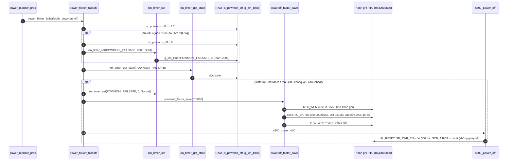
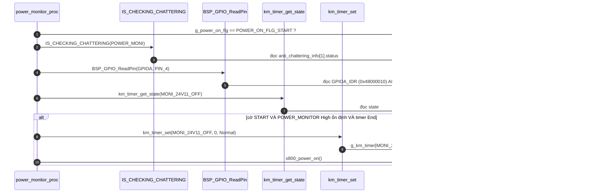
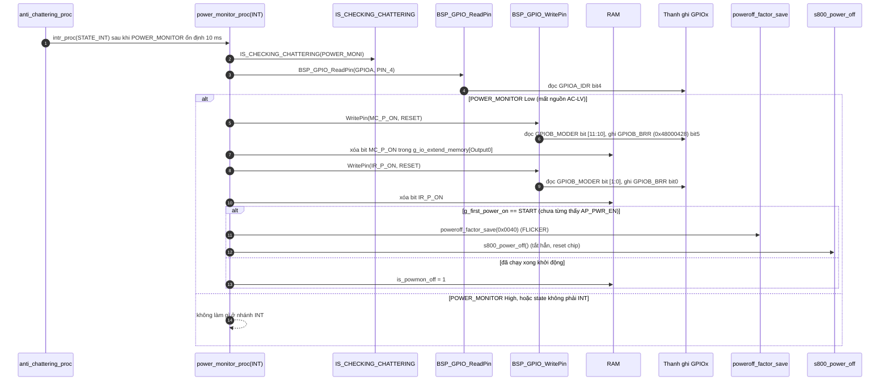

Đây là phân tích của `power_monitor_proc(STATE_NORMAL)`: [km_extend_io.c:445](vscode-webview://1bvn9deljhs67bs6tdc4nttro6fasb6a3o9dsbsr0n55qjrijoej/PS-CPU/pscpu_s800/main/App/km_extend_io.c#L445), đường gọi [entry.c:93](vscode-webview://1bvn9deljhs67bs6tdc4nttro6fasb6a3o9dsbsr0n55qjrijoej/PS-CPU/pscpu_s800/main/App/entry.c#L93). Hàm có hai nhánh (`STATE_INT` và `STATE_NORMAL`) cùng chia sẻ biến `is_powmon_off`, nên tôi vẽ cả nhánh INT để thấy toàn bộ cơ chế. Các diagram chưa được render thử.

## Cây lời gọi

```
power_monitor_proc(NORMAL)
├─ power_flicker_failsafe(&is_powmon_off)
│    ├─ km_timer_set / km_timer_get_state(POWMONI_FAILSAFE)   →  RAM
│    ├─ poweroff_factor_save(FLICKER_FAILSAFE)
│    │    ├─ RTC_WRITEPROTECT_DISABLE / ENABLE                →  RTC_WPR (0x40002824)
│    │    └─ đọc rồi ghi RTC_BKP3R (0x4000285C)               (backup register)
│    └─ s800_power_off()                                      (kết thúc bằng reset chip)
├─ IS_CHECKING_CHATTERING(POWER_MONI)                         →  RAM
├─ BSP_GPIO_ReadPin(POWER_MONITOR)                            →  GPIOA_IDR bit4
├─ km_timer_get_state / km_timer_set(MONI_24V11_OFF)          →  RAM
└─ s800_power_on()                                            (đã vẽ ở phân tích trước)
```

## Diagram A: nhánh NORMAL, phần 1 (đồng hồ bảo vệ chống treo sau khi mất nguồn)



## Diagram B: nhánh NORMAL, phần 2 (bật lại khi nguồn trở về)



## Diagram C: nhánh INT (cho thấy ai đặt `is_powmon_off`)

Nhánh này chạy khi `anti_chattering_proc` xác nhận `POWER_MONITOR` đổi mức, gọi `power_monitor_proc(STATE_INT)`.



## Giải thích từng bước

1. **Hàm là hai nửa của một cơ chế.** `[SOURCE]` Nửa INT phản ứng **ngay** khi mất nguồn (cắt `MC_P_ON`, `IR_P_ON` rồi hoặc tắt hẳn hoặc bật cờ `is_powmon_off`). Nửa NORMAL chạy **mỗi vòng lặp** để xử lý hậu quả theo thời gian (đồng hồ 2 s, và bật lại).
2. **Cờ `is_powmon_off` là sợi dây nối hai nửa.** Nó là biến `static` bên trong hàm, nên ISR chống rung đặt cờ rồi vòng lặp chính đọc, tránh phải xử lý nặng trong ngắt. Nửa NORMAL đọc cờ qua con trỏ `&is_powmon_off` mỗi lần gọi.
3. **Failsafe 2 s (Diagram A).** `[SOURCE]` Sau khi mất nguồn, PS-CPU **không tắt S800 ngay** (nếu S800 đã chạy xong khởi động) mà chờ S800 chủ động gửi `HRESET_REQ`. Nếu 2 s trôi qua mà không có, nó ép tắt và reboot, đồng thời ghi nguyên nhân `FLICKER_FAILSAFE` (bit 7) vào nhật ký. Nếu S800 gửi `HRESET_REQ` kịp thì `hreset_req_proc` thấy timer đang `Start` và ghi nguyên nhân `FLICKER` (bit 6) thay vào đó (km_extend_io.c dòng 489-496).
4. **Nhật ký nguyên nhân (Diagram A, bước 8-10).** `[SOURCE]` `B_REGISTER_PWROFF_LOG = RTC_BKP3R_CMD_2 = 0x5E`. Hàm tính `align = 0x5E & 3 = 2` và địa chỉ `RTC_BASE + 0x5C`, tức thanh ghi backup `RTC_BKP3R`. Giá trị mới được OR vào **nửa cao** (`factor_bit << 16`), nửa thấp `0x5C` (flag `B_REGISTER_MCIR`) giữ nguyên nhờ đọc-sửa-ghi. Vì dùng OR, bit chỉ **được thêm vào**; hàm này không bao giờ xóa. `[INFERENCE]` S800 xóa nhật ký qua I2C sau khi đọc (nhánh ghi `B_REGISTER_PWROFF_LOG` trong `i2c_recv_wait`). Backup register sống qua reset chip (`[RM0091]`), nên S800 đọc được nguyên nhân sau khi PS-CPU khởi động lại.
5. **Bật lại (Diagram B).** `[SOURCE]` Gọi `s800_power_on()` khi cả ba điều kiện đúng: đang ở trạng thái "bật hoặc khởi động lại" (`START`), `POWER_MONITOR` đã trở lại High ổn định, và hẹn giờ 500 ms sau khi 24V xả (`MONI_24V11_OFF`, do `moni_24v_proc` đặt).
6. **Cắt tải trước (Diagram C).** `[SOURCE]` `MC_P_ON` và `IR_P_ON` là hai đường cấp nguồn công suất cho khối MC và IR (xem trả lời đầu hội thoại). Khi `POWER_MONITOR` rớt, PS-CPU kéo cả hai về Low bằng `GPIOB_BRR` ngay trong ngắt (sau 10 ms chống rung), đồng thời xóa bit tương ứng trong `g_io_extend_memory` để vòng lặp không bật lại chúng.

## Vì sao phải có hàm này (mục đích)

1. **Bảo vệ phần cứng khi AC-LV chập chờn.** `[INFERENCE]` `POWER_MONITOR` là tín hiệu "nguồn AC-LV tốt" (trên sơ đồ khối: từ khối AC-LV, qua buffer 3.3V_LIVE vào PS-CPU, và được chuyển tiếp sang S800). Khi nó rớt, các tải công suất cần ngắt sớm trước khi điện áp xuống thấp bất thường.
2. **Cho S800 cơ hội tắt gọn.** `[INFERENCE]` S800 cũng nhận tín hiệu `POWER_MONITOR`, nên nó tự biết nguồn đang mất. 2 s là thời gian để S800 hoàn tất và phát `HRESET_REQ`.
3. **Không để hệ thống treo nửa chừng.** Nếu S800 không phản hồi (đã treo hoặc đã mất nguồn), failsafe 2 s đảm bảo PS-CPU vẫn đưa hệ thống về trạng thái biết trước, thay vì chờ mãi.
4. **Phục hồi tự động khi nguồn trở về.** Nửa NORMAL thứ hai tự bật lại hệ thống mà không cần người can thiệp.
5. **Lưu dấu vết.** Mỗi lần reboot do chập chờn đều để lại bit nguyên nhân trong backup register, phục vụ chẩn đoán.

## Bảng chân tri (nhánh NORMAL)

|`is_powmon_off`|Timer failsafe|Cờ START|POWER_MONITOR|Timer 24V `End`|Hành động|
|---|---|---|---|---|---|
|1|bất kỳ|bất kỳ|bất kỳ|bất kỳ|Đặt timer 2 s|
|0|`End`|bất kỳ|bất kỳ|bất kỳ|Ghi `FLICKER_FAILSAFE`, tắt và reboot|
|0|khác `End`|START|High ổn định|`End`|`s800_power_on()`|
|0|khác `End`|khác START hoặc|Low||Không làm gì|

## Điểm đáng chú ý

- **Phần mã sau `s800_power_off()` là mã không bao giờ chạy tới.** `[SOURCE]` `s800_power_off` kết thúc bằng `HAL_NVIC_SystemReset`, mà `NVIC_SystemReset` ([core_cm0.h:730-742](vscode-webview://1bvn9deljhs67bs6tdc4nttro6fasb6a3o9dsbsr0n55qjrijoej/PS-CPU/pscpu_s800/common/Drivers/CMSIS/Include/core_cm0.h#L730-L742)) chạy vòng `for(;;)` chờ reset và không quay về. Do đó dòng `g_power_on_flg = POWER_ON_FLG_START` trong `hreset_req_proc` ([dòng 497](vscode-webview://1bvn9deljhs67bs6tdc4nttro6fasb6a3o9dsbsr0n55qjrijoej/PS-CPU/pscpu_s800/main/App/km_extend_io.c#L497)) không bao giờ được thực thi.
- **Nhánh "bật lại" (Diagram B) có thể là phần còn sót lại của thiết kế cũ.** `[INFERENCE]` Comment lịch sử của `s800_power_off` ghi "2018/11/15 ... リセットを実施する" (từ đó mới thêm reset chip). Trước đó, sau khi tắt, hệ thống phải tự bật lại trong cùng một lần chạy, và `START` + `MONI_24V11_OFF` + `power_monitor_proc` là đường làm việc đó. Hiện tại, sau reset, `main()` gọi `s800_power_on()` trực tiếp, và `msw_on_proc` cũng gọi `s800_power_on()` mỗi vòng khi công tắc đóng và `SB_PG` Low. Nên đường trong Diagram B có thể chỉ tác dụng trong một số tình huống hẹp (khi `SB_PG` đang High và cờ `START` đang bật). Tôi chưa chứng minh được tình huống cụ thể nào kích hoạt nó.
- **Tại sao `MONI_24V11_OFF` có thể không bao giờ chạy trong một số trường hợp.** `[SOURCE]` `moni_24v_proc` chỉ đặt timer này khi `SB_PG` High và 24V Low, nhưng `SB_PG` chỉ lên sau khi `s800_power_on` bật `SB_PWR_EN`. Nếu `s800_power_on` bị chặn vì `POWER_MONITOR` Low hoặc 24V chưa xả, `SB_PG` ở Low nên timer không được hẹn, và nhánh Diagram B không bao giờ thành công. `msw_on_proc` vẫn bù lại bằng cách tự gọi `s800_power_on()` mỗi vòng.
- **Nửa INT không chạy nếu `POWER_MONITOR` đang High** dù `state == STATE_INT` (ví dụ lúc nguồn trở về). Lệnh `else if(state == STATE_NORMAL)` không thỏa nên hàm không làm gì: nguồn trở về được xử lý ở nửa NORMAL qua `IS_CHECKING_CHATTERING` và mức chân.

## Chưa xác minh

- Offset thanh ghi (`IDR`, `BRR`, `RTC_WPR`, `RTC_BKP3R`) là kiến thức reference manual; base address đọc từ `stm32f031x6.h`, còn offset `0x5C`/`0x5E`/`0x24` (`RTC_BKP3R_CMD`, `RTC_WPR_CMD`) đọc từ `km_i2c.h`.
- Việc S800 xóa nhật ký nguyên nhân qua I2C, và vai trò chính xác của `POWER_MONITOR` đối với S800, là suy luận từ sơ đồ khối và tên tín hiệu; tôi chưa đọc phía S800.