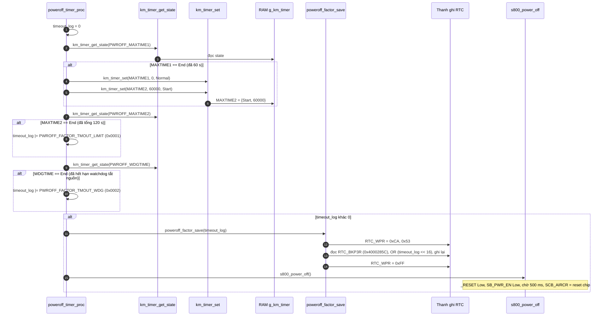
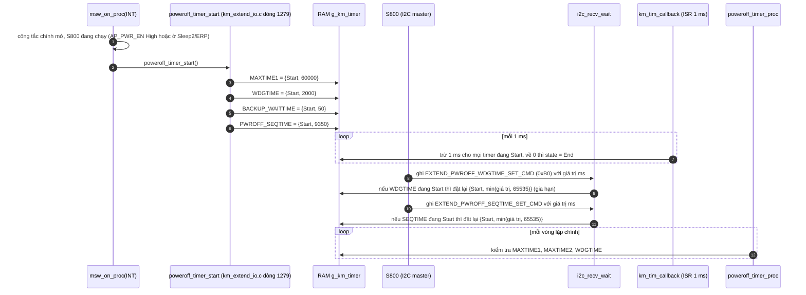
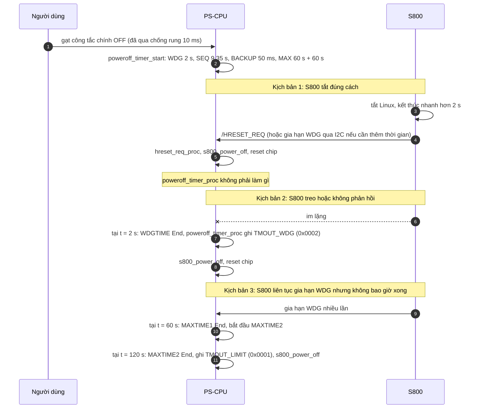

"Hàm tiếp theo" là `poweroff_timer_proc()`: [km_extend_io.c:1305](vscode-webview://1bvn9deljhs67bs6tdc4nttro6fasb6a3o9dsbsr0n55qjrijoej/PS-CPU/pscpu_s800/main/App/km_extend_io.c#L1305), gọi ở [entry.c:121](vscode-webview://1bvn9deljhs67bs6tdc4nttro6fasb6a3o9dsbsr0n55qjrijoej/PS-CPU/pscpu_s800/main/App/entry.c#L121). Đây là **bộ canh thời gian cho quá trình tắt nguồn có kiểm soát**: nếu S800 không tắt xong đúng hạn, PS-CPU ép tắt. Hàm không đọc chân GPIO nào; nó đọc timer phần mềm (RAM) và chỉ khi có quá hạn mới chạm RTC backup register và reset chip. Các diagram chưa được render thử.

## Cây lời gọi

```
poweroff_timer_proc
├─ km_timer_get_state(PWROFF_MAXTIME1)     →  RAM g_km_timer
├─ km_timer_set(MAXTIME1, 0, Normal)       →  RAM
├─ km_timer_set(MAXTIME2, 60000, Start)    →  RAM
├─ km_timer_get_state(PWROFF_MAXTIME2)     →  RAM
├─ km_timer_get_state(PWROFF_WDGTIME)      →  RAM
├─ poweroff_factor_save(timeout_log)       (khi có quá hạn)
│    ├─ RTC_WRITEPROTECT_DISABLE           →  RTC_WPR (0x40002824) = 0xCA, 0x53
│    ├─ đọc rồi ghi RTC_BKP3R (0x4000285C), OR vào nửa cao
│    └─ RTC_WRITEPROTECT_ENABLE            →  RTC_WPR = 0xFF
└─ s800_power_off()                        (kết thúc bằng reset chip)

Nơi đặt các timer (không thuộc hàm này):
  poweroff_timer_start()   (km_extend_io.c dòng 1279, gọi từ msw_on_proc nhánh INT)
  I2C: EXTEND_PWROFF_WDGTIME_SET_CMD, EXTEND_PWROFF_SEQTIME_SET_CMD (km_i2c.c dòng 696-718)
```

## Diagram A: luồng của `poweroff_timer_proc`



## Diagram B: ai đặt và gia hạn các timer này



## Diagram C: dòng thời gian hai kịch bản



## Giải thích từng bước

1. **Hai lớp canh giờ.** `[SOURCE]` `WDGTIME` (mặc định 2 s) là lớp **ngắn và gia hạn được**: S800 có thể ghi giá trị mới (tối đa 65 535 ms) qua I2C, chỉ khi timer đang `Start`. `MAXTIME1`/`MAXTIME2` là lớp **tuyệt đối và không gia hạn được**: tổng 120 s.
2. **Vì sao hai timer nối tiếp cho 120 s.** `[SOURCE]` `KM_TIMER_MAX_TIME` là 65 535 ms. Một timer không đủ cho 120 s, nên `MAXTIME1` (60 s) hết thì khởi động `MAXTIME2` (60 s nữa).
3. **Gom nguyên nhân rồi ghi một lần.** `[SOURCE]` `timeout_log` là mặt nạ bit; nếu cả hai timer cùng hết trong một lần gọi, cả hai bit (`0x0003`) cùng ghi vào nhật ký. Không có nhánh `else`: hàm không bao giờ tắt riêng một timer.
4. **Sau khi quá hạn, mọi thứ kết thúc bằng reset chip.** `[SOURCE]` `s800_power_off` gọi `poweroff_timer_init` để đặt lại cả sáu timer, nên `MAXTIME2` ở trạng thái `End` không bị gọi lại. Sau reset, các timer về trạng thái khởi tạo của RAM.
5. **Hàm chạy mỗi vòng lặp nhưng thường không làm gì.** `[SOURCE]` Khi các timer ở `Normal` (không có tắt nguồn nào đang chạy), hàm chỉ đọc ba trạng thái từ RAM rồi thoát.

## Vì sao phải có hàm này (mục đích)

1. **Đảm bảo luôn tắt được.** `[INFERENCE]` Khi công tắc mở mà S800 đang chạy, PS-CPU để S800 tự tắt gọn (tránh hỏng dữ liệu) nhưng không thể chờ vô hạn: nếu S800 treo, nguồn sẽ không bao giờ tắt. Hàm này đặt giới hạn cứng.
2. **Cho S800 thêm thời gian khi cần.** Cơ chế gia hạn `WDGTIME` qua I2C để S800 báo "tôi vẫn đang tắt, đừng ép". Nếu không có cơ chế này, giá trị 2 s sẽ quá ngắn cho một lần tắt Linux đầy đủ.
3. **Giới hạn cho cả trường hợp S800 "giả vờ sống".** `MAXTIME` là lưới an toàn cuối cùng: nếu S800 gia hạn mãi không xong (lỗi phần mềm), 120 s sau PS-CPU vẫn ép tắt.
4. **Ghi dấu vết chẩn đoán.** Hai bit `TMOUT_WDG` và `TMOUT_LIMIT` giúp phân biệt lỗi "S800 không phản hồi" với "S800 quá chậm". Comment lịch sử ghi mục đích: "2018/12/17 A.Ishiga 通電OFF要因のログ出力対応" (hỗ trợ nhật ký nguyên nhân tắt nguồn).
5. **Hỗ trợ tăng tốc khởi động.** `[SOURCE]` Các timer được thêm vào theo ghi chú "2017/10/23 G.Ishitake 起動時間短縮対応" (rút ngắn thời gian khởi động), `[INFERENCE]` có thể liên quan đến việc không phải chờ thời gian cố định dài mỗi lần tắt.

## Bảng chân tri

|MAXTIME1|MAXTIME2|WDGTIME|Hành động|
|---|---|---|---|
|End|||Đặt MAXTIME1 Normal, MAXTIME2 = 60 s Start (chưa tắt)|
|bất kỳ|End|bất kỳ|Ghi `TMOUT_LIMIT`, tắt nguồn|
|bất kỳ|bất kỳ|End|Ghi `TMOUT_WDG`, tắt nguồn|
|bất kỳ|End|End|Ghi cả hai (`0x0003`), tắt nguồn|
|không|không|không|Không làm gì|

## Điểm đáng chú ý

- **`SEQTIME` không được hàm này canh.** `[SOURCE]` `PWROFF_SEQTIME` (9,35 s) chỉ được `msw_on_proc` đọc (bỏ qua sự kiện khi `End`) và S800 chỉnh qua I2C; không có mã nào xử lý lúc nó hết hạn. `[INFERENCE]` `WDGTIME` (mặc định 2 s) hết trước nên thực tế `SEQTIME` hết hạn chỉ khi S800 đã gia hạn `WDGTIME` dài hơn.
- **`MAXTIME` chỉ có tác dụng khi S800 liên tục gia hạn.** `[INFERENCE]` Với `WDGTIME` mặc định 2 s, nếu S800 không gia hạn thì `WDGTIME` luôn hết trước (2 s so với 60 s). `MAXTIME` chỉ đến lượt khi S800 chủ động giữ `WDGTIME` sống lâu.
- **`MAXTIME2` ở trạng thái `End` không tự xóa.** `[SOURCE]` Hàm không đặt lại nó về `Normal` vì ngay sau đó `s800_power_off` reset toàn bộ.
- **Không kiểm tra mức chân.** Hàm này không cần: quyết định chạy hay không đã nằm ở `poweroff_timer_start` (gọi từ `msw_on_proc`).

## Chưa xác minh

- Offset thanh ghi (`RTC_WPR`, `RTC_BKP3R`) là kiến thức reference manual; địa chỉ `RTC_BKP3R` tính từ `RTC_BASE + 0x5C` (đọc ở `km_i2c.h`).
- Cách S800 gửi lệnh gia hạn `WDGTIME` (thời điểm, giá trị điển hình) là phía S800, tôi không đọc nên chỉ biết cơ chế phía PS-CPU.
- Đã grep thấy `PWROFF_SEQTIME` chỉ được dùng ở `msw_on_proc`, `poweroff_timer_start/init` và I2C; tôi chưa kiểm tra phía S800 xem nó có dựa vào giá trị này không.