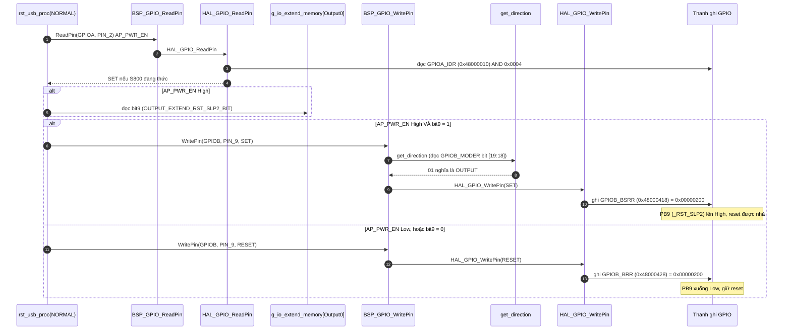
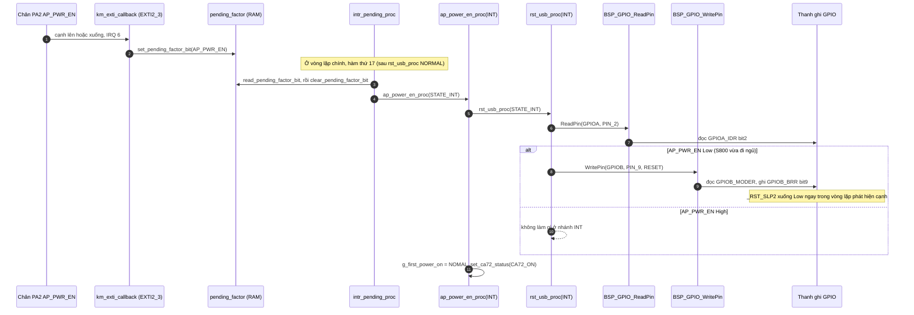
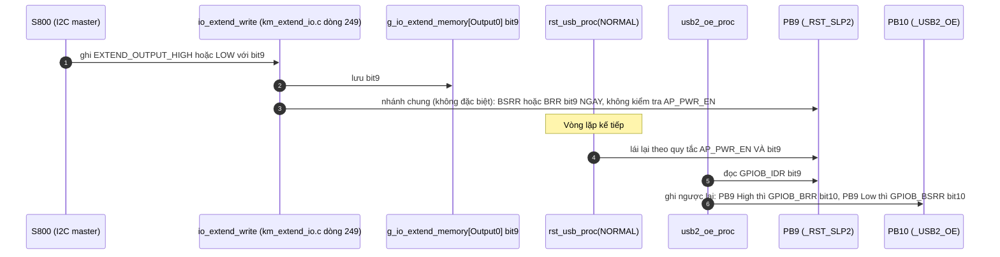

Đây là phân tích của `rst_usb_proc(state)`: [km_extend_io.c:711](vscode-webview://1bvn9deljhs67bs6tdc4nttro6fasb6a3o9dsbsr0n55qjrijoej/PS-CPU/pscpu_s800/main/App/km_extend_io.c#L711), gọi ở [entry.c:111](vscode-webview://1bvn9deljhs67bs6tdc4nttro6fasb6a3o9dsbsr0n55qjrijoej/PS-CPU/pscpu_s800/main/App/entry.c#L111) với `STATE_NORMAL`, và ở `ap_power_en_proc(STATE_INT)` với `STATE_INT`. Hàm lái **một chân** (PB9, `_RST_SLP2`). Các diagram chưa được render thử.

## Cây lời gọi

```
rst_usb_proc(state)
├─ BSP_GPIO_ReadPin(AP_PWR_EN)               →  HAL_GPIO_ReadPin  →  GPIOA_IDR bit2
├─ g_io_extend_memory[Output0] bit9          →  RAM (yêu cầu nhả reset từ S800)
└─ BSP_GPIO_WritePin(_RST_SLP2, SET/RESET)
     ├─ get_direction  →  log2  +  GPIOB_MODER bit [19:18]
     └─ HAL_GPIO_WritePin  →  GPIOB_BSRR hoặc GPIOB_BRR bit9

Người gọi:
  main loop (NORMAL)            entry.c dòng 111
  ap_power_en_proc(INT)         km_extend_io.c dòng 662  (do intr_pending_proc gọi khi AP_PWR_EN đổi mức)
```

## Diagram A: nhánh `STATE_NORMAL` (mỗi vòng lặp)



## Diagram B: nhánh `STATE_INT` và đường dẫn tới nó



## Diagram C: nơi khác cũng ghi PB9 và hàm phụ thuộc vào nó



## Giải thích từng bước

1. **Quy tắc chân.** `[SOURCE]` `_RST_SLP2` chỉ lên High khi **cả hai** đúng: `AP_PWR_EN` High (S800 đang thức) và S800 đã xin (bit9 = 1). Mọi trường hợp khác chân Low. Với tên có tiền tố `_` và hậu tố `n` trên sơ đồ khối (`RST_SL2n`), Low là trạng thái "giữ reset" và High là "nhả reset".
2. **Nhánh INT làm nhanh một vòng.** `[SOURCE]` `ap_power_en_proc(STATE_INT)` gọi `rst_usb_proc(STATE_INT)` ngay khi xử lý cạnh `AP_PWR_EN`, chỉ để kéo chân Low khi S800 đi ngủ (không bao giờ bật). `[INFERENCE]` Vì `rst_usb_proc(NORMAL)` ở vị trí thứ 14 trong vòng lặp, còn `intr_pending_proc` ở vị trí 17, nhánh INT chỉ sớm hơn nhánh NORMAL tối đa một vòng lặp. Tác dụng thực tế rất nhỏ nhưng nhất quán với ý đồ "phản ứng ngay với cạnh".
3. **Nhánh NORMAL duy trì trạng thái.** `[SOURCE]` Mỗi vòng, hàm đọc lại `AP_PWR_EN` và ghi lại PB9. Bit9 không bị xóa khi S800 ngủ, nên khi `AP_PWR_EN` về High chân tự lên lại mà không cần S800 xin lại.
4. **S800 ghi qua I2C cũng đẩy chân ngay.** `[SOURCE]` Khác với `MC_P_ON`, `IR_P_ON`, `MC_PWR_EN`, `SB_PWR_EN` và `ERP_SENSOR_ON` (có nhánh đặc biệt trong `io_extend_write`), `_RST_SLP2` đi qua nhánh chung (dòng 292-311): lệnh HIGH ghi `BSRR` ngay, lệnh LOW ghi `BRR` ngay, không qua kiểm tra `AP_PWR_EN`. Vòng lặp kế tiếp `rst_usb_proc(NORMAL)` sẽ lái lại theo quy tắc ở điểm 1.
5. **`_USB2_OE` lấy từ `_RST_SLP2`.** `[SOURCE]` `usb2_oe_proc` đọc PB9 rồi đặt PB10 là mức đảo. Trừ khi S800 đã tự ghi chân `_USB2_OE` qua I2C (cờ `is_usb2_oe_from_main_cpu_ctrl`).

## Vì sao phải có hàm này (mục đích)

1. **Giữ USB hub (và mạch liên quan) trong reset khi S800 ngủ.** `[INFERENCE]` Trên sơ đồ khối bạn gửi, tín hiệu `RST_SL2n` đi tới "USB2.0 hub etc." Khi S800 ngủ (`AP_PWR_EN` Low), chip hub không có lý do hoạt động, nên giữ reset để tiết kiệm điện và tránh chip hub dao động khi phía S800 mất nguồn.
2. **Chỉ nhả reset khi S800 thật sự sẵn sàng.** `[INFERENCE]` Thứ tự đúng là S800 thức xong rồi mới đưa hub ra khỏi reset, nếu không hub có thể liệt kê thiết bị lên một host chưa khởi tạo xong.
3. **S800 vẫn kiểm soát được qua bit9.** S800 có thể giữ hub trong reset (bit9 = 0) dù đang thức, ví dụ khi cần tắt USB.
4. **Khớp với `_USB2_OE`.** `[SOURCE]` Chân này đảo của `_RST_SLP2`, cho thấy hai tín hiệu thuộc cùng một khối USB (nhả reset thì mở đầu ra, giữ reset thì tắt).

## Bảng chân tri

|`AP_PWR_EN`|Bit9|PB9 (`_RST_SLP2`)|
|---|---|---|
|Low|bất kỳ|Low (giữ reset)|
|High|0|Low|
|High|1|High (nhả reset)|

## Điểm đáng chú ý

- **Hai tên cho cùng một tín hiệu.** `[SOURCE]` Hàm tên `rst_usb_proc` và comment `/* RST_USB 信号処理*/` nhưng chân trong `mxconstants.h` tên `_RST_SLP2` (PB9), còn sơ đồ khối ghi `RST_SL2n`. Tôi giả định đây là cùng một tín hiệu; code không ghi định nghĩa "SLP2" hay "USB".
- **Đường I2C trực tiếp không kiểm tra `AP_PWR_EN`.** `[SOURCE]` Lệnh HIGH từ S800 có thể kéo chân lên ngay cả khi `AP_PWR_EN` Low, rồi bị vòng lặp kéo xuống ở lần sau. Trong thực tế S800 chỉ gửi I2C khi đang thức nên khoảng hở này gần như không xảy ra.
- **`AP_PWR_EN` đọc thô**, không qua kiểm tra chống rung.
- **`state` chỉ có hai giá trị hợp lệ.** `[SOURCE]` `STATE_INT` = 0 và `STATE_NORMAL` = 1; giá trị khác không làm gì.

## Chưa xác minh

- Offset thanh ghi (`IDR`, `MODER`, `BSRR`, `BRR`) là kiến thức reference manual; base address đọc từ `stm32f031x6.h`, số chân đọc từ `mxconstants.h`.
- Tín hiệu `RST_SL2n` đi tới thiết bị nào thật sự (và có đúng là PB9 không) cần schematic để xác nhận.