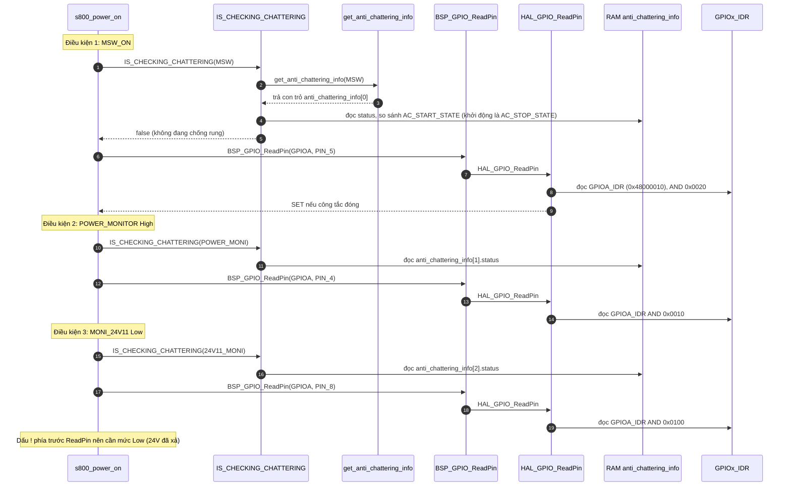
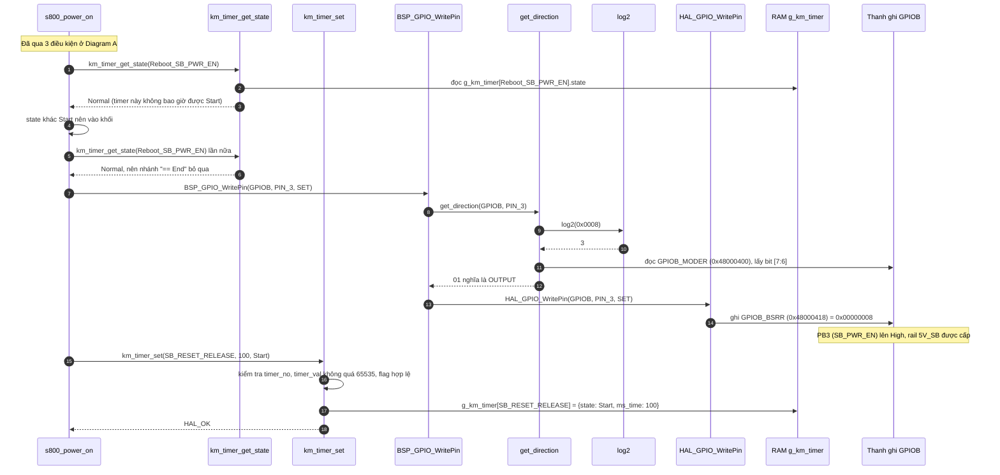
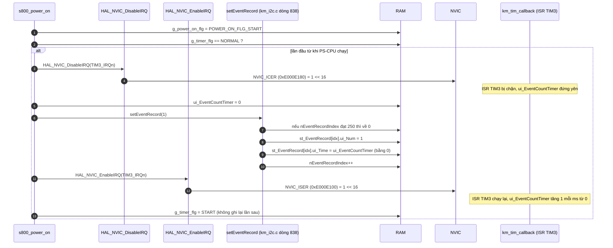

Đây là phân tích của `s800_power_on()`: [km_extend_io.c:607](vscode-webview://1bvn9deljhs67bs6tdc4nttro6fasb6a3o9dsbsr0n55qjrijoej/PS-CPU/pscpu_s800/main/App/km_extend_io.c#L607). Tôi đã đọc toàn bộ chuỗi hàm con xuống thanh ghi: `km_timer_*`, `BSP_GPIO_*`, `HAL_GPIO_*`, `HAL_NVIC_*`, `setEventRecord`. Các diagram chưa được render thử.

## Cây lời gọi

```
s800_power_on
├─ IS_CHECKING_CHATTERING(idx)  →  get_anti_chattering_info(idx)  →  RAM anti_chattering_info[idx].status
├─ BSP_GPIO_ReadPin             →  HAL_GPIO_ReadPin               →  GPIOx_IDR
├─ km_timer_get_state           →  RAM g_km_timer[n].state
├─ km_timer_set                 →  RAM g_km_timer[n].state / ms_time
├─ BSP_GPIO_WritePin
│    ├─ get_direction  →  log2  +  GPIOx_MODER
│    └─ HAL_GPIO_WritePin  →  GPIOx_BSRR
├─ HAL_NVIC_DisableIRQ          →  NVIC_DisableIRQ                →  NVIC_ICER
├─ setEventRecord               →  RAM st_EventRecord[], nEventRecordIndex
└─ HAL_NVIC_EnableIRQ           →  NVIC_EnableIRQ                 →  NVIC_ISER
```

## Diagram A: tầng điều kiện (đọc trạng thái, chưa ghi gì)



## Diagram B: tầng hành động (bật nguồn SB và hẹn nhả reset)



## Diagram C: cờ trạng thái và khối đo thời gian khởi động



## Điều gì xảy ra tiếp theo (ngoài hàm này)

```
t = 0 ms       PB3 (SB_PWR_EN) High, timer SB_RESET_RELEASE = 100 ms bắt đầu
t = 1 ms..100  km_tim_callback giảm ms_time mỗi ms
t = 100 ms     state chuyển Start sang End
               vòng lặp chính: sb_reset_proc() thấy End, MSW High, 24V Low, SB_PG High
                  → GPIOB_BSRR = 0x04 (PB2 _RESET High) → S800 bắt đầu boot
```

Phần này nằm ở `sb_reset_proc()` ([km_extend_io.c:1231](vscode-webview://1bvn9deljhs67bs6tdc4nttro6fasb6a3o9dsbsr0n55qjrijoej/PS-CPU/pscpu_s800/main/App/km_extend_io.c#L1231)), xem tài liệu [main_loop_sequence.md](vscode-webview://1bvn9deljhs67bs6tdc4nttro6fasb6a3o9dsbsr0n55qjrijoej/docs_vi/main_loop_sequence.md) mục 3.1.

## Giải thích từng bước

1. **Ba điều kiện ở Diagram A.** Mỗi điều kiện gồm một cặp: kiểm tra RAM "tín hiệu có đang trong khoảng chống rung không" và đọc chân thật `GPIOA_IDR`. Cặp đầu tiên chỉ đọc RAM, không chạm thanh ghi; cặp thứ hai đọc một bit của `IDR`. `[SOURCE]` Trạng thái chống rung khởi đầu là `AC_STOP_STATE` ([km_it.c:23](vscode-webview://1bvn9deljhs67bs6tdc4nttro6fasb6a3o9dsbsr0n55qjrijoej/PS-CPU/pscpu_s800/main/App/km_it.c#L23)), nên ở lúc khởi động điều kiện chỉ phụ thuộc mức chân.
2. **Dấu `!` trước `ReadPin(MONI_24V11)`.** Cần chân ở mức **Low**. Nghĩa là 24V phải đã xả xong (đã giải thích ở các trả lời trước).
3. **Hai lần gọi `km_timer_get_state(Reboot_SB_PWR_EN)`.** `[SOURCE]` Timer này không bao giờ được đặt thành `Start` ở đâu trong code, nên luôn trả `Normal`. Cả hai nhánh `if` đều vô hiệu: khối "chờ 500 ms sau khi `SB_PWR_EN` xuống Low" thực tế không có tác dụng. Khoảng 500 ms đó do `HAL_Delay(500)` trong `s800_power_off()` đảm nhận.
4. **Ghi `SB_PWR_EN`.** `BSP_GPIO_WritePin` đọc `GPIOB_MODER` bit [7:6] của PB3 trước. Chỉ khi chân là output (`01`) nó mới ghi `GPIOB_BSRR`. `[RM0091]` Ghi `BSRR` bit3 là thao tác nguyên tử: không đọc-sửa-ghi, nên ISR không thể chen vào làm hỏng các chân khác của cổng B.
5. **Hẹn 100 ms.** `km_timer_set` chỉ ghi RAM. Việc đếm lùi do ISR TIM3 làm. Hàm này không chờ: nó trả về ngay, còn `_RESET` chỉ được nhả sau khi `sb_reset_proc()` thấy timer đã `End`.
6. **`g_power_on_flg = START` đặt ngoài khối 24V/POWER_MONITOR.** Cờ này được đặt khi chỉ cần `MSW_ON` đúng, kể cả khi `POWER_MONITOR` hoặc 24V chưa đạt. `[INFERENCE]` Mục đích là đánh dấu "đang chờ bật nguồn" để `power_monitor_proc` và `moni_24v_proc` biết cần thử lại (xem đường gọi ở [km_extend_io.c:467](vscode-webview://1bvn9deljhs67bs6tdc4nttro6fasb6a3o9dsbsr0n55qjrijoej/PS-CPU/pscpu_s800/main/App/km_extend_io.c#L467)); code không ghi comment về điều này.
7. **Khối đo thời gian.** Tắt ngắt TIM3 (`NVIC_ICER` bit16) để việc `ui_EventCountTimer = 0` và `setEventRecord` diễn ra trọn vẹn, nếu không ISR có thể tăng bộ đếm giữa hai lệnh làm sự kiện `SwitchOn` ghi nhầm 1 ms. `[INFERENCE]` Với Cortex-M0, ghi 32 bit là nguyên tử, nên mục đích chính không phải tránh ghi dở mà là đảm bảo thứ tự "đặt về 0 rồi ghi mốc". `g_timer_flg` chỉ được đặt về `NORMAL` khi chip reset (khởi tạo static), nên mỗi lần bật nguồn chỉ ghi một sự kiện `SwitchOn`.
8. **Ghi sự kiện.** `setEventRecord` là vòng bộ đệm 250 mục (`THRD_EVENT_BUFFER_MAX_NUM`): khi đầy sẽ ghi đè từ đầu. Mỗi mục lưu `{số sự kiện, thời gian ms}`. S800 đọc lại qua I2C bằng lệnh `EXTEND_EVENT_COMMAND`.

## Bảng chân tri

|MSW_ON|POWER_MONITOR|MONI_24V11|Kết quả|
|---|---|---|---|
|Low|bất kỳ|bất kỳ|Không làm gì (không đặt cờ nào)|
|High|High|Low|Bật `SB_PWR_EN`, hẹn 100 ms, đặt `START`, ghi `SwitchOn` (lần đầu)|
|High|Low hoặc|High|Không bật `SB_PWR_EN`, nhưng vẫn đặt `START` và ghi `SwitchOn` (lần đầu)|

Hàng cuối là điểm dễ gây hiểu lầm: **sự kiện `SwitchOn` có thể được ghi dù nguồn SB chưa được bật thật**. `[INFERENCE]` Nó ghi mốc lúc người dùng đóng công tắc, không phải lúc nguồn SB lên.

## Chưa xác minh

- Offset thanh ghi (`IDR`, `MODER`, `BSRR`, `NVIC_ISER/ICER`) là kiến thức reference manual. Chỉ base address `GPIOA/GPIOB` được đọc từ `stm32f031x6.h`.
- Tôi chưa đọc đủ thân `HAL_NVIC_DisableIRQ`: chỉ thấy dòng đầu và comment "Disable interrupt"; việc nó gọi `NVIC_DisableIRQ` rồi ghi `NVIC_ICER` là suy ra từ `core_cm0.h`.