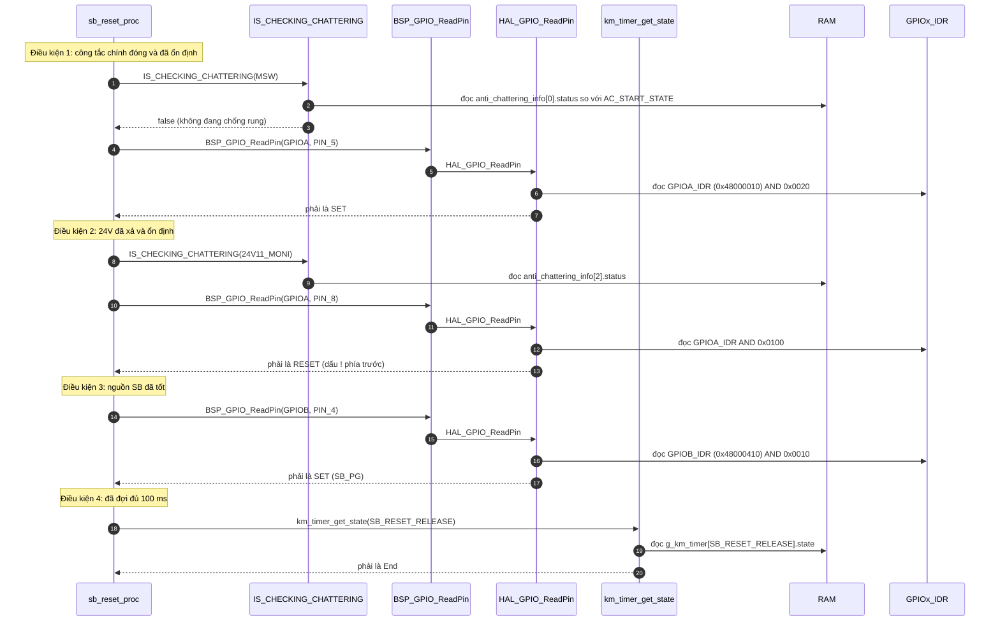
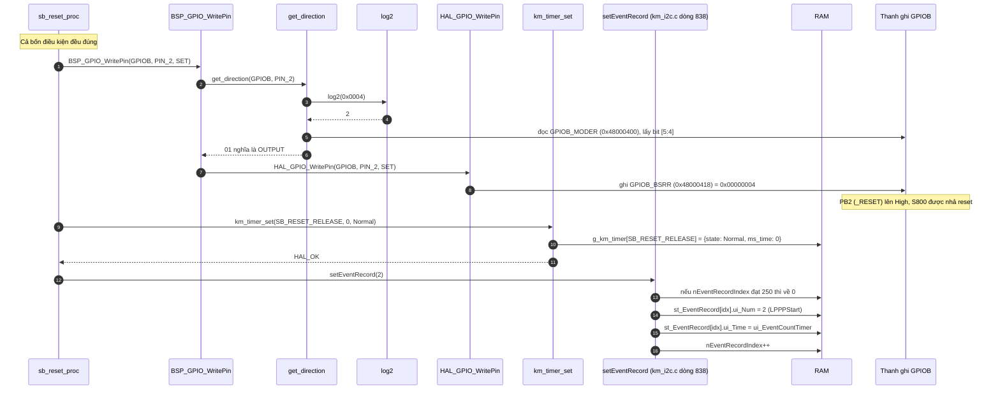

Đây là phân tích của `sb_reset_proc()`: [km_extend_io.c:1231](vscode-webview://1bvn9deljhs67bs6tdc4nttro6fasb6a3o9dsbsr0n55qjrijoej/PS-CPU/pscpu_s800/main/App/km_extend_io.c#L1231). Hàm này là nửa còn lại của `s800_power_on()`: một bên bật nguồn SB và hẹn giờ, một bên nhả reset khi hết giờ. Các diagram chưa được render thử.

## Cây lời gọi

```
sb_reset_proc
├─ IS_CHECKING_CHATTERING(idx)  →  get_anti_chattering_info  →  RAM anti_chattering_info[idx].status
├─ BSP_GPIO_ReadPin             →  HAL_GPIO_ReadPin          →  GPIOx_IDR
├─ km_timer_get_state           →  RAM g_km_timer[n].state
├─ BSP_GPIO_WritePin
│    ├─ get_direction  →  log2  +  GPIOB_MODER
│    └─ HAL_GPIO_WritePin  →  GPIOB_BSRR
├─ km_timer_set                 →  RAM g_km_timer[n]
└─ setEventRecord               →  RAM st_EventRecord[], nEventRecordIndex
```

## Diagram A: tầng điều kiện (bốn điều kiện, chỉ đọc)



Phép `&&` trong C **đánh giá từ trái sang phải và dừng ngay khi gặp điều kiện sai**. Vì vậy ở hầu hết các vòng lặp (khi chưa tới lúc nhả reset) chỉ có điều kiện 1 và có thể thêm vài bước được thực hiện.

## Diagram B: tầng hành động (nhả reset)



## Vị trí trong chuỗi bật nguồn

```
s800_power_on  (một lần)     PB3 High (SB_PWR_EN), timer SB_RESET_RELEASE = 100 ms (Start)
                               │
km_tim_callback (mỗi 1 ms)    ms_time giảm dần, hết 100 ms thì state = End
                               │
sb_reset_proc  (mỗi vòng)     thấy End VÀ MSW High VÀ 24V Low VÀ SB_PG High
                               │
                               ├─ GPIOB_BSRR bit2       →  _RESET High: S800 rời trạng thái reset
                               ├─ timer về Normal       →  điều kiện 4 sai từ vòng sau, hàm không chạy lại
                               └─ ghi sự kiện LPPPStart →  thời gian ≈ 100 ms+ kể từ SwitchOn
                               │
S800 boot Linux ...           về sau AP_PWR_EN lên, rồi MC_PWR_EN, MC_P_ON, IR_P_ON
```

## Giải thích từng bước

1. **Chạy mỗi vòng lặp nhưng chỉ có tác dụng một lần.** `[SOURCE]` Hàm được gọi ở đầu mỗi vòng ([entry.c:85](vscode-webview://1bvn9deljhs67bs6tdc4nttro6fasb6a3o9dsbsr0n55qjrijoej/PS-CPU/pscpu_s800/main/App/entry.c#L85)). Điều kiện 4 (`timer == End`) là chốt: sau khi nhả reset, hàm đặt timer về `Normal` nên từ vòng kế tiếp điều kiện 4 sai và hàm không làm gì nữa.
2. **Bốn điều kiện là bốn lớp bảo vệ cho một thao tác khó đảo ngược** (nhả reset khiến S800 chạy):
    - công tắc còn đóng (người dùng chưa gạt ra giữa chừng);
    - 24V đã xả (điện áp dư không còn);
    - `SB_PG` = High: các rail 3.3V/1.8V/1.2V/1.05V_SB đã thật sự ổn định, không chỉ "đã lệnh bật";
    - đã đợi tối thiểu 100 ms kể từ lúc bật `SB_PWR_EN`.
3. **Ghi `_RESET`.** `BSP_GPIO_WritePin` đọc `GPIOB_MODER` bit [5:4] của PB2 trước khi ghi. Nếu chân không phải output thì lệnh bị bỏ qua. Lệnh ghi `GPIOB_BSRR` bit2 là nguyên tử (`[RM0091]`).
4. **`km_timer_set(..., 0, Normal)`.** Chỉ ghi RAM. Comment trong code gọi đây là "khởi tạo cờ" (フラグ初期化).
5. **`setEventRecord(2)`.** Ghi vào vòng bộ đệm 250 mục một mục `{2, ui_EventCountTimer}`. Con số 2 là `THRD_EventRecord_LPPPStart`. Vì `ui_EventCountTimer` đã được đặt về 0 ở `s800_power_on` (sự kiện `SwitchOn`), hiệu của hai mốc thời gian là thời gian từ lúc đóng công tắc đến lúc nhả reset, tối thiểu khoảng 100 ms.

## Bảng chân tri (lúc timer đã `End`)

|MSW_ON|24V11_MONI|SB_PG|Hành động|
|---|---|---|---|
|High|Low|High|Nhả `_RESET`, đặt timer `Normal`, ghi sự kiện|
|High|Low|Low|Chờ (timer vẫn `End`, vòng sau kiểm tra lại)|
|High|High|bất kỳ|Chờ 24V xả|
|Low|bất kỳ|bất kỳ|Chờ công tắc đóng|

## Điểm đáng chú ý

- **Không có timeout cho việc chờ `SB_PG`.** `[SOURCE]` Nếu timer đã `End` mà `SB_PG` không bao giờ lên, hàm chờ mãi và không báo lỗi. Việc phát hiện lỗi nguồn SB (nếu có) nằm ở nơi khác, không ở hàm này.
- **Khởi động lại timer mỗi khi `s800_power_on()` được gọi.** Mỗi lần `s800_power_on` đặt `SB_RESET_RELEASE = 100 ms (Start)`, kể cả khi `_RESET` chưa nhả, thời gian chờ được tính lại từ đầu.
- **Timer `End` được dọn ở `s800_power_off()`.** `[SOURCE]` Dòng 544 đặt `SB_RESET_RELEASE` về `Normal` khi tắt, nên trạng thái `End` cũ không sót lại sang lần bật sau.
- **Tên tín hiệu.** `[INFERENCE]` Trên sơ đồ khối bạn gửi, đường từ PS-CPU là `RESETn` đi qua một buffer 1.8V_SB thành `SB_RESETn` rồi tới chân `nRESET` của S800. Tôi giả định `_RESET` (PB2) chính là chân này. Mức "High = nhả reset" khớp với tên `nRESET` tích cực thấp, nhưng tôi chưa đối chiếu schematic chi tiết.
- **Lỗi chính tả nhỏ trong comment.** `[SOURCE]` Dòng cuối của khối ghi sự kiện (dòng 1243) lặp lại chữ `start` thay vì `end`. Không ảnh hưởng chạy.

## Chưa xác minh

- Offset thanh ghi (`IDR`, `MODER`, `BSRR`) là kiến thức reference manual; chỉ base address đọc từ `stm32f031x6.h`.
- Tôi chưa trace phần S800 phía sau `_RESET`, nên chưa nói được thời gian boot thực tế của S800 sau khi nhả reset.