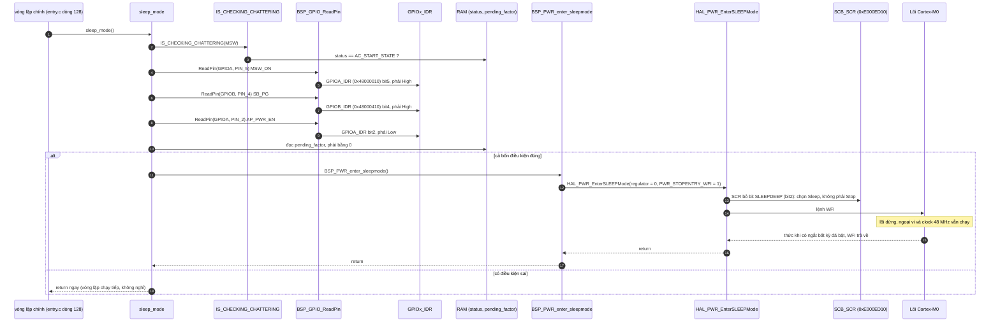
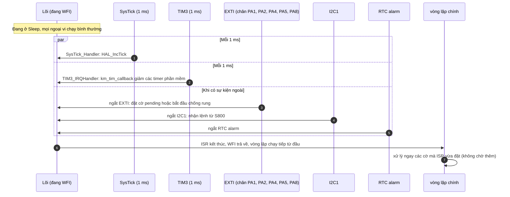

Hàm kế tiếp trong vòng lặp là `sleep_mode()`: [km_extend_io.c:1395](vscode-webview://1bvn9deljhs67bs6tdc4nttro6fasb6a3o9dsbsr0n55qjrijoej/PS-CPU/pscpu_s800/main/App/km_extend_io.c#L1395), gọi ở [entry.c:128](vscode-webview://1bvn9deljhs67bs6tdc4nttro6fasb6a3o9dsbsr0n55qjrijoej/PS-CPU/pscpu_s800/main/App/entry.c#L128). Đây là hàm cuối của vòng lặp, và là chỗ duy nhất vòng lặp "nghỉ" khi hệ thống đang bật. Các diagram chưa được render thử.

## Cây lời gọi

```
sleep_mode
├─ IS_CHECKING_CHATTERING(MSW)                  →  RAM status
├─ BSP_GPIO_ReadPin(MSW_ON, SB_PG, AP_PWR_EN)   →  GPIOA_IDR bit5, GPIOB_IDR bit4, GPIOA_IDR bit2
├─ pending_factor                               →  RAM (cờ ngắt chưa xử lý)
└─ BSP_PWR_enter_sleepmode                      (BSP_PWR dòng 42)
     └─ HAL_PWR_EnterSLEEPMode(0, WFI)          (hal_pwr.c dòng 287)
          ├─ SCB->SCR &= ~SLEEPDEEP             →  SCB_SCR (0xE000ED10) bit2 = 0
          └─ __WFI()                            →  lệnh WFI, lõi dừng chờ ngắt
```

## Diagram A: luồng của `sleep_mode`



## Diagram B: những gì đánh thức CPU khỏi `WFI`



## Giải thích từng bước

1. **Bốn điều kiện mô tả đúng một trạng thái.** `[SOURCE]` Công tắc chính đóng (`MSW_ON` High ổn định), nguồn SB đã tốt (`SB_PG` High), **S800 đang ngủ** (`AP_PWR_EN` Low) và không còn cờ ngắt nào chờ xử lý. Comment trong hàm: "While in Sleep2/Erp, it is in Sleep mode". Nói cách khác, máy đang bật nhưng S800 ở trạng thái Sleep2/ErP.
2. **Chọn chế độ Sleep, không phải Stop.** `[SOURCE]` `HAL_PWR_EnterSLEEPMode` chỉ xóa bit `SLEEPDEEP` trong `SCB->SCR` rồi chạy `WFI`. Không đụng `PWR_CR`, không tắt SysTick, không đổi clock. Lõi dừng nhưng 48 MHz, ngoại vi và RAM vẫn hoạt động.
3. **Thức ngay khi có ngắt bất kỳ.** `[SOURCE]` Trong `main()` đã bật SysTick (1 ms), TIM3 (1 ms) và các ngắt EXTI, I2C, RTC. Nên CPU thức ít nhất mỗi 1 ms, và thức ngay lập tức khi có chân đổi mức hoặc lệnh I2C.
4. **Sau khi thức, vòng lặp chạy tiếp từ đầu.** `[SOURCE]` `sleep_mode` là hàm cuối, nên khi `WFI` trả về, vòng lặp quay lại `sb_reset_proc`... và các hàm kế tiếp xử lý ngay những gì ISR vừa đặt (cờ pending, chống rung, cờ I2C).
5. **Điều kiện `!pending_factor`.** `[SOURCE]` Comment lịch sử: "2018/07/15 K.Miwa 割り込みが入っていた場合は次の周期に入るように変更" (nếu đã có ngắt thì chuyển sang chu kỳ kế tiếp). `[INFERENCE]` Nếu một cạnh `HRESET_REQ` hay `AP_PWR_EN` xảy ra sau khi `intr_pending_proc` (hàm 17) đã chạy xong nhưng trước `sleep_mode` (hàm 22), cờ pending nằm chờ; thay vì ngủ, hàm bỏ qua `WFI` để vòng sau xử lý cờ ngay.

## Vì sao phải có hàm này (mục đích)

1. **Giảm tiêu thụ điện khi S800 ngủ.** `[INFERENCE]` Ở chế độ Sleep2/ErP, mục tiêu là điện năng thấp. Nếu vòng lặp quay liên tục không nghỉ, CPU 48 MHz tiêu thụ không cần thiết; `WFI` dừng lõi giữa các ngắt.
2. **Vẫn đủ tỉnh để làm nhiệm vụ.** PS-CPU còn phải: refresh watchdog, chống rung, đáp ứng I2C, theo dõi `AP_PWR_EN` để biết S800 thức dậy. Sleep (không phải Stop) giữ nguyên ngoại vi nên không mất sự kiện nào.
3. **Đơn giản hơn Stop.** Stop tắt PLL và buộc phải dựng lại clock sau khi thức (xem phân tích `msw_on_proc`); Sleep không cần việc đó nên an toàn và nhanh.
4. **Chỉ áp dụng ở đúng trạng thái.** Khi S800 đang chạy (`AP_PWR_EN` High) thì **không** ngủ, vòng lặp chạy hết tốc độ để đáp ứng nhanh các lệnh điều khiển nguồn.

## So sánh Sleep và Stop trong code

|                     | `   sleep_mode` (Sleep)         | `msw_on_proc` (Stop)         |
| ------------------- | ------------------------------- | ---------------------------- |
| Khi nào             | Máy bật, S800 ngủ               | Công tắc mở, nguồn SB đã tắt |
| `SCB_SCR.SLEEPDEEP` | 0                               | 1                            |
| `PWR_CR`            | không đổi                       | bỏ `PDDS`, `LPDS`            |
| SysTick             | vẫn chạy                        | tắt tạm (`TICKINT` = 0)      |
| Clock sau khi thức  | 48 MHz (không đổi)              | HSI, phải dựng lại PLL       |
| Nguồn đánh thức     | mọi ngắt, thức ít nhất mỗi 1 ms | RTC alarm 2 s hoặc chân EXTI |
| Mức tiết kiệm điện  | thấp                            | cao                          |

## Điểm đáng chú ý

- **Không tiết kiệm được nhiều.** `[INFERENCE]` Vì SysTick và TIM3 cùng phát ngắt mỗi 1 ms, CPU thức khoảng 1000 lần mỗi giây. Phần tiết kiệm chủ yếu là thời gian lõi bị dừng giữa hai ngắt liên tiếp, không phải ngủ sâu. Tôi chưa đo dòng thực tế.
- **Khi S800 chạy, vòng lặp quay liên tục.** `[SOURCE]` Điều kiện `AP_PWR_EN` Low vắng mặt nên `sleep_mode` thoát ngay; PS-CPU chạy hết tốc độ polling các chân và timer. Đây là hành vi thiết kế, không phải lỗi.
- **Biến `pending_factor` không khai báo `volatile`.** `[SOURCE]` `uint32_t pending_factor` trong `km_it.c` và `extern uint32_t pending_factor` trong `km_extend_io.c` không có `volatile`, dù ISR thay đổi nó. `[INFERENCE]` Trong trường hợp này đọc xảy ra sau các lời gọi hàm nên bộ biên dịch khó tối ưu thành giá trị cũ, nhưng nó không được đảm bảo theo ngôn ngữ C.
- **`WFI` trả về ngay nếu ngắt đã chờ sẵn.** `[RM0091]` Đây là hành vi của Cortex-M khi có ngắt đã bật và đang pending lúc thực thi `WFI`.
- **Nhánh `WFE` không dùng.** `[SOURCE]` `BSP_PWR_enter_sleepmode` luôn truyền `PWR_STOPENTRY_WFI` (cùng giá trị 0x01 với `PWR_SLEEPENTRY_WFI`), nên nhánh `__SEV(); __WFE(); __WFE();` trong HAL không chạy.

## Chưa xác minh

- Offset thanh ghi (`IDR`, `SCB_SCR`) là kiến thức reference manual; base address đọc từ `stm32f031x6.h`, vị trí bit `SLEEPDEEP` là chuẩn Cortex-M0.
- Mức tiết kiệm điện thực tế chưa đo.
- Tôi chưa xác nhận trạng thái "Sleep2/ErP" trong tài liệu của S800; tên chỉ lấy từ comment trong code.