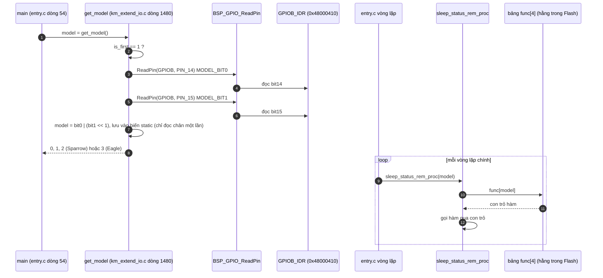
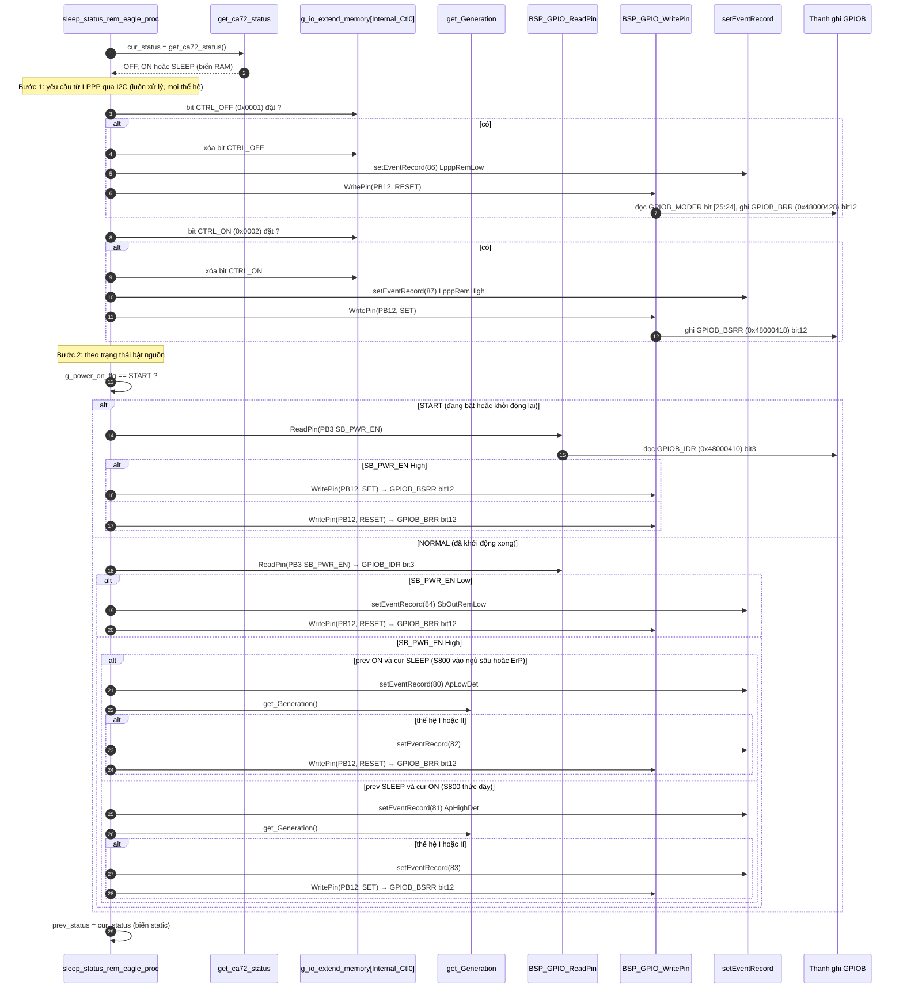
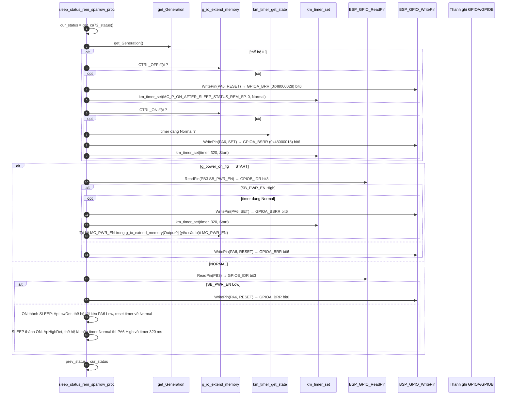
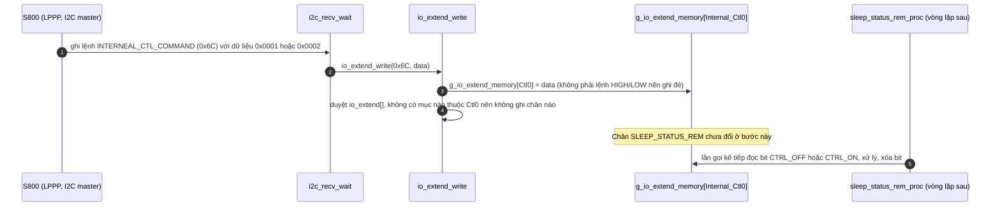

Đây là phân tích của `sleep_status_rem_proc(model)`: [km_extend_io.c:1055](vscode-webview://1bvn9deljhs67bs6tdc4nttro6fasb6a3o9dsbsr0n55qjrijoej/PS-CPU/pscpu_s800/main/App/km_extend_io.c#L1055), gọi ở [entry.c:95](vscode-webview://1bvn9deljhs67bs6tdc4nttro6fasb6a3o9dsbsr0n55qjrijoej/PS-CPU/pscpu_s800/main/App/entry.c#L95) và cả trong `s800_power_off()`. Hàm chỉ là bộ **phân phối theo model**; phần logic thật nằm ở hai hàm con (Eagle và Sparrow). Các diagram chưa được render thử.

## Cây lời gọi

```
sleep_status_rem_proc(model)
└─ func[model]()          (bảng hằng: {dummy, dummy, sparrow, eagle})
     ├─ dummy                          →  không làm gì (model 0, 1)
     ├─ sleep_status_rem_sparrow_proc  (model 2) →  PA6 (GPIOA_BSRR/BRR bit6)
     └─ sleep_status_rem_eagle_proc    (model 3) →  PB12 (GPIOB_BSRR/BRR bit12)
          ├─ get_ca72_status                     →  RAM _status
          ├─ get_Generation                      →  RAM g_io_extend_memory[Internal_Sts0]
          ├─ BSP_GPIO_ReadPin(SB_PWR_EN)         →  GPIOB_IDR bit3
          ├─ BSP_GPIO_WritePin(SLEEP_STATUS_REM) →  GPIOx_MODER, rồi BSRR hoặc BRR
          ├─ km_timer_get_state / km_timer_set   →  RAM (chỉ nhánh Sparrow)
          └─ setEventRecord                      →  RAM st_EventRecord[]
```

## Diagram A: phân phối theo model



Giá trị model `[SOURCE]` ([km_extend_io.h:6-12](vscode-webview://1bvn9deljhs67bs6tdc4nttro6fasb6a3o9dsbsr0n55qjrijoej/PS-CPU/pscpu_s800/main/Inc/km_extend_io.h#L6-L12)): `-1` None, `0` RESERVED0, `1` RESERVED1, `2` Sparrow, `3` Eagle. `get_model()` chỉ trả `0..3`, nên không có truy cập ngoài mảng `func[]`.

## Diagram B: nhánh Eagle (model 3), điều khiển PB12



## Diagram C: nhánh Sparrow (model 2), điều khiển PA6 và có thêm timer 320 ms



## Diagram D: nguồn của các yêu cầu từ LPPP (`Internal_Ctl0`)



## Giải thích từng bước

1. **Một tín hiệu, hai chân, chọn theo model.** `[SOURCE]` `SLEEP_STATUS_REM` là **một tín hiệu logic** nhưng ra ở hai chân tùy model của bo mạch: `PB12` (`SLEEP_STATUS_REM_EG`) cho Eagle, `PA6` (`SLEEP_STATUS_REM_SP`) cho Sparrow. Model đọc từ hai chân strap `MODEL_BIT0/1` (PB14, PB15) một lần rồi cache.
2. **Ba "người lái" cho cùng một chân.** `[SOURCE]` Mỗi lần gọi, chân có thể bị ghi bởi: (a) **yêu cầu từ LPPP qua I2C** (`CTRL_ON/OFF`), (b) **mức của `SB_PWR_EN`** (khi đang `START`), (c) **chuyển trạng thái của S800** (`ON` thành `SLEEP` hoặc ngược lại). Thứ tự trong mã quyết định ai thắng khi nhiều điều kiện cùng đúng: bước (a) chạy trước, (b)/(c) chạy sau và có thể ghi đè.
3. **Hai hằng chống lặp.** `[SOURCE]` Mỗi yêu cầu LPPP **xóa bit sau khi xử lý** (`&= ~CTRL_xxx`), nên chỉ tác dụng một lần dù vòng lặp quay hàng nghìn lần.
4. **Thế hệ I/II so với III.** `[SOURCE]` Với thế hệ I/II, PS-CPU **tự** lái chân theo trạng thái S800 (`ON` thành `SLEEP` kéo xuống, ngược lại kéo lên). Với thế hệ III, comment trong code giải thích: LPPP gửi yêu cầu `ON/OFF` riêng khoảng 100 ms sau, nên PS-CPU **không tự lái** ở bước (c) mà chờ yêu cầu từ LPPP.
5. **Timer 320 ms của Sparrow.** `[SOURCE]` Sau khi kéo `SLEEP_STATUS_REM` lên High, Sparrow hẹn 320 ms (`MC_P_ON_AFTER_SLEEP_STATUS_REM_SP`); chỉ khi hết giờ `mc_p_on_sparrow_proc` mới cho bật `MC_P_ON`. Đây là bản Sparrow của khoảng chờ 320 ms sau `MC_PWR_EN` ở Eagle (`BOOT_MC_P_ON`).
6. **Ghi nhật ký sự kiện.** `[SOURCE]` Mỗi bước đổi chân kèm `setEventRecord` với các số 80-88 (`ApLowDet`, `ApHighDet`, `ApOutRemLow`, `ApOutRemHigh`, `SbOutRemLow`, `SbOutRemHigh`, `LpppRemLow`, `LpppRemHigh`, `ResumeRequest`), đọc ra qua I2C để đo thời gian khởi động và chuyển trạng thái.
7. **Gọi từ `s800_power_off()`.** `[SOURCE]` Dòng 555 gọi hàm này sau khi `SB_PWR_EN` đã bị kéo Low (dòng 546), để chân `SLEEP_STATUS_REM` về Low ("SLEEP_STATUS_REM H⇒L" theo comment) trước khi chip reset.

## Vì sao phải có hàm này (mục đích)

`[INFERENCE]` Tên và comment cho thấy `SLEEP_STATUS_REM` là tín hiệu **báo trạng thái ngủ của S800 cho một bên khác** (có vẻ là phía LPPP hoặc bo chính), với quy ước:

- High khi S800 đang chạy (hoặc khi nguồn SB vừa lên);
- Low khi S800 vào ngủ sâu/ErP hoặc nguồn SB đã tắt. Comment ghi thêm: bật `SLEEP_STATUS_REM` "tương đương một xung `/H_RESET_REQ`" (dòng 906). Nhu cầu tồn tại vì trong lúc S800 ngủ (`AP_PWR_EN` Low) chỉ PS-CPU còn tỉnh: nó cần cho phía kia biết trạng thái mà không phải đánh thức S800. Code không mô tả bên nhận tín hiệu này, và nó không có trên sơ đồ khối bạn gửi, nên tôi không xác định được bên nhận.

## Bảng chân tri (nhánh Eagle, thế hệ I/II, đang chạy NORMAL)

|`SB_PWR_EN`|prev → cur|PB12|
|---|---|---|
|Low|bất kỳ|Low (ghi sự kiện 84)|
|High|ON → SLEEP|Low|
|High|SLEEP → ON|High|
|High|không đổi|giữ nguyên|

## Điểm đáng chú ý

- **Comment ngược với code ở hai chỗ.** `[SOURCE]` Dòng 914 ghi "SB_PWR_EN=1になったら落とす" (khi `SB_PWR_EN`=1 thì **hạ** xuống) nhưng code kéo chân lên khi `SB_PWR_EN` High (dòng 916). Dòng 924 ghi "SB_PWR_ENが落ちたらH" (khi `SB_PWR_EN` rớt thì **High**) nhưng code kéo xuống Low (dòng 927). Hai chỗ khác nhau của comment nhất quán với nhau (ngược code), nên có thể comment mô tả mức **logic** của tín hiệu ở đầu kia (nếu có đảo mức ngoài chip). Tôi không xác định được bên nào đúng; cần đối chiếu với schematic.
- **Chân điều khiển đọc `GPIOB_IDR` của chính chân output.** `SB_PWR_EN` đọc qua `IDR` dù là output; hợp lệ trên STM32.
- **`prev_status` và `cur_status` là biến `static` riêng của mỗi hàm.** Hai hàm Eagle và Sparrow có hai cặp biến độc lập, nhưng chỉ một hàm được gọi nên không xung đột.
- **Model 0 và 1 hoàn toàn không điều khiển `SLEEP_STATUS_REM`.** `[SOURCE]` Hai model này trỏ tới `dummy`.

## Chưa xác minh

- Offset thanh ghi (`IDR`, `BSRR`, `BRR`, `MODER`) là kiến thức reference manual; base address đọc từ `stm32f031x6.h`, số chân đọc từ `mxconstants.h`.
- Bên nhận `SLEEP_STATUS_REM` và polarity điện thật của tín hiệu cần schematic.
- Tôi chưa xác nhận vị trí `get_Generation()` đọc thế hệ nào (bit `INTERNEAL_STS_COMMAND_MODEL_TYPE` trong `Internal_Sts0`) được S800 ghi vào lúc nào.