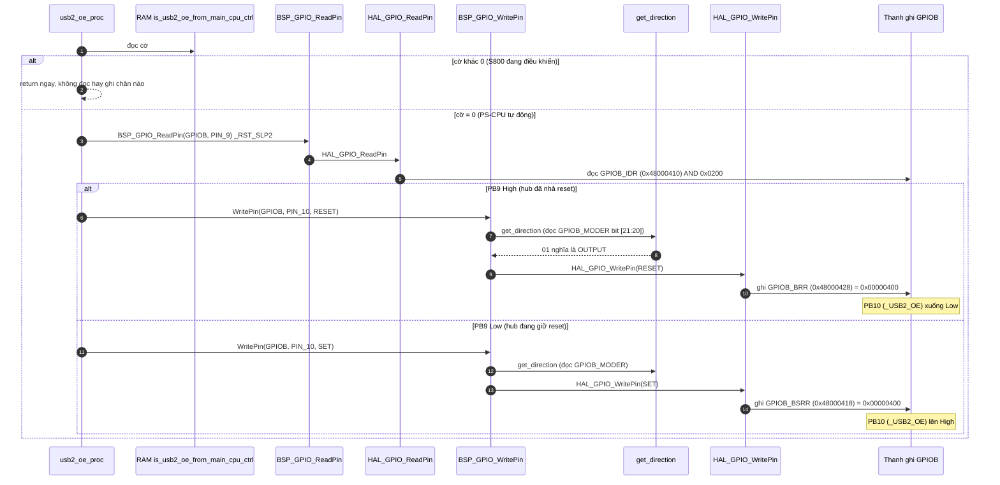
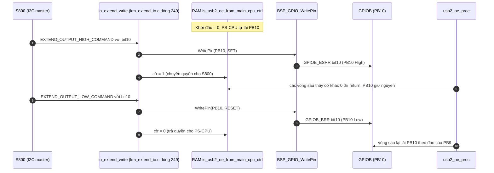
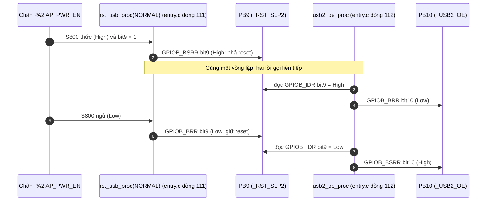

Đây là phân tích của `usb2_oe_proc()`: [km_extend_io.c:1373](vscode-webview://1bvn9deljhs67bs6tdc4nttro6fasb6a3o9dsbsr0n55qjrijoej/PS-CPU/pscpu_s800/main/App/km_extend_io.c#L1373), gọi ở [entry.c:112](vscode-webview://1bvn9deljhs67bs6tdc4nttro6fasb6a3o9dsbsr0n55qjrijoej/PS-CPU/pscpu_s800/main/App/entry.c#L112), ngay sau `rst_usb_proc`. Hàm làm một việc: **đặt chân `_USB2_OE` (PB10) bằng đảo mức của `_RST_SLP2` (PB9)**, trừ khi S800 đã giành quyền điều khiển chân này. Các diagram chưa được render thử.

## Cây lời gọi

```
usb2_oe_proc
├─ is_usb2_oe_from_main_cpu_ctrl                 →  RAM (cờ quyền điều khiển)
├─ BSP_GPIO_ReadPin(_RST_SLP2)                   →  HAL_GPIO_ReadPin  →  GPIOB_IDR bit9
└─ BSP_GPIO_WritePin(_USB2_OE, RESET/SET)
     ├─ get_direction  →  log2  +  GPIOB_MODER bit [21:20]
     └─ HAL_GPIO_WritePin  →  GPIOB_BRR hoặc GPIOB_BSRR bit10
```

## Diagram A: luồng thực thi



## Diagram B: chuyển quyền điều khiển cho S800 (nơi cờ được đặt và xóa)



## Diagram C: chuỗi phụ thuộc từ S800 tới `_USB2_OE`



## Giải thích từng bước

1. **Cờ quyền điều khiển.** `[SOURCE]` `is_usb2_oe_from_main_cpu_ctrl` là biến `static` ([dòng 48](vscode-webview://1bvn9deljhs67bs6tdc4nttro6fasb6a3o9dsbsr0n55qjrijoej/PS-CPU/pscpu_s800/main/App/km_extend_io.c#L48)); comment: `0` = chưa bị CPU chính (S800) điều khiển, `1` = đã bị điều khiển. Khi cờ bằng 1 hàm thoát ngay, nên PS-CPU không ghi đè lên quyết định của S800.
2. **Phép đảo.** `[SOURCE]` PB9 High thì PB10 Low, PB9 Low thì PB10 High. Hàm chỉ đọc **một** chân (PB9) và ghi **một** chân (PB10).
3. **Đọc `IDR` của chân output.** `[SOURCE]` `_RST_SLP2` là chân output của PS-CPU; đọc `GPIOB_IDR` trả mức thực trên chân (`[RM0091]`). Nhờ vậy `usb2_oe_proc` bám theo mức **thực** của PB9, kể cả khi PB9 vừa bị S800 ghi trực tiếp qua I2C.
4. **Chuyển quyền (Diagram B).** `[SOURCE]` Chỉ hai lệnh I2C đổi cờ: lệnh HIGH có bit `_USB2_OE` đặt cờ lên 1 (dòng 297-298), lệnh LOW có bit `_USB2_OE` đặt cờ về 0 (dòng 305-306). Lệnh ghi dạng khác (nhánh `else` dòng 309-311) ghi chân nhưng **không đổi cờ**.
5. **Thứ tự trong vòng lặp.** `[SOURCE]` `rst_usb_proc(NORMAL)` rồi `usb2_oe_proc` gọi liền nhau (dòng 111-112), nên trong trường hợp bình thường PB10 theo PB9 ngay trong cùng một vòng lặp. Khi PB9 bị kéo Low bởi nhánh `STATE_INT` (ở hàm thứ 17), PB10 theo ở vòng kế tiếp.

## Vì sao phải có hàm này (mục đích)

1. **Giữ đầu ra USB2 khớp với trạng thái reset của hub.** `[INFERENCE]` Hậu tố `OE` thường là _output enable_. Tiền tố `_` cho thấy tích cực mức thấp: Low là bật đầu ra, High là tắt. Khi hub được nhả reset (PB9 High), mở đầu ra (PB10 Low); khi hub đang bị giữ reset (PB9 Low), tắt đầu ra (PB10 High). Mục đích có vẻ là không để tín hiệu được đẩy vào một chip đang trong reset. Code không giải thích, đây là suy luận từ tên tín hiệu.
2. **Chỉ một công thức cho cả hai chân.** Thay vì hai quy tắc riêng, `_USB2_OE` luôn suy ra từ `_RST_SLP2`, nên chỉ cần một nơi (`rst_usb_proc`) quyết định điều kiện thức/ngủ.
3. **Cho S800 một đường ngoại lệ.** `[INFERENCE]` Cờ quyền điều khiển cho phép S800 mở hoặc tắt riêng `_USB2_OE` khi cần (ví dụ chuyển cổng USB giữa hai chế độ) mà không bị vòng lặp PS-CPU ghi đè.

## Bảng chân tri

|Cờ S800 giữ quyền|PB9 (`_RST_SLP2`)|PB10 (`_USB2_OE`)|
|---|---|---|
|1|bất kỳ|Do S800 quyết định (hàm không ghi)|
|0|High|Low (`GPIOB_BRR`)|
|0|Low|High (`GPIOB_BSRR`)|

## Điểm đáng chú ý

- **S800 giữ quyền cho đến khi chủ động trả.** `[SOURCE]` Cờ chỉ về 0 khi S800 ghi lệnh LOW có bit `_USB2_OE`, hoặc khi chip reset (biến `static` khởi đầu 0). `s800_power_off()` kết thúc bằng reset chip nên mọi lần tắt máy đều trả quyền cho PS-CPU.
- **Khi S800 giữ quyền, PB10 không theo PB9 nữa.** `[INFERENCE]` Nếu S800 đặt `_USB2_OE` rồi ngủ (PB9 xuống Low), PB10 vẫn giữ giá trị S800 đã đặt, không tự đổi sang "tắt đầu ra". Tôi không thấy cơ chế tự bảo vệ cho trường hợp này; có thể là chủ ý (S800 chịu trách nhiệm).
- **Lệnh ghi dạng "không phải HIGH/LOW" không đổi cờ.** `[SOURCE]` Nhánh `else` của `io_extend_write` ghi chân trực tiếp nhưng không động đến cờ, nên nó có thể bị ghi đè ở vòng lặp kế tiếp nếu cờ đang là 0.
- **Hàm không `static`** và chỉ được gọi từ `entry.c`.

## Chưa xác minh

- Offset thanh ghi (`IDR`, `MODER`, `BSRR`, `BRR`) là kiến thức reference manual; base address đọc từ `stm32f031x6.h`, số chân đọc từ `mxconstants.h`.
- Cực tính thực và nơi đến của `_USB2_OE` (cổng nào, thiết bị nào) cần schematic để xác nhận.