# `MX_Init()`: sequence diagram đệ quy tới tận thanh ghi

Nguồn: `pscpu_s800/main/Src/mx_init.c` ([mx_init.c:81](../pscpu_s800/main/Src/mx_init.c#L81)).
Chip: **STM32F031C6Tx** (`PowerSubCPU.ioc`: `Mcu.UserName=STM32F031C6Tx`), HCLK = 48 MHz.

Quy ước tag:

| Tag           | Nghĩa                                                                                                           |     |
| ------------- | --------------------------------------------------------------------------------------------------------------- | --- |
| `[SOURCE]`    | Đã đọc trong code của repo (HAL, CMSIS, mx_init.c, hal_msp.c)                                                   |     |
| `[RM0091]`    | Kiến thức chung về STM32F0 (reference manual), **chưa** đọc trong repo. Dùng cho vị trí bit và offset thanh ghi |     |
| `[INFERENCE]` | Suy luận, code không nói thẳng                                                                                  |     |

---

## 0. Bản đồ địa chỉ thanh ghi

Base address đọc từ `stm32f031x6.h` `[SOURCE]`. Offset thanh ghi lấy từ `[RM0091]`.

| Khối | Base | Thanh ghi dùng trong `MX_Init` (offset) |
|---|---|---|
| RCC | `0x40021000` | CR `+00`, CFGR `+04`, AHBENR `+14`, APB2ENR `+18`, APB1ENR `+1C`, BDCR `+20`, CSR `+24`, CFGR2 `+2C`, CFGR3 `+30` |
| FLASH (interface) | `0x40022000` | ACR `+00` |
| PWR | `0x40007000` | CR `+00` |
| GPIOA / B / C / F | `0x48000000` / `0x48000400` / `0x48000800` / `0x48001400` | MODER `+00`, OTYPER `+04`, OSPEEDR `+08`, PUPDR `+0C`, BSRR `+18`, AFRL `+20`, AFRH `+24`, BRR `+28` |
| SYSCFG | `0x40010000` | EXTICR1..4 `+08..+14` |
| EXTI | `0x40010400` | IMR `+00`, EMR `+04`, RTSR `+08`, FTSR `+0C` |
| I2C1 | `0x40005400` | CR1 `+00`, CR2 `+04`, OAR1 `+08`, OAR2 `+0C`, TIMINGR `+10` |
| RTC | `0x40002800` | TR `+00`, DR `+04`, CR `+08`, ISR `+0C`, PRER `+10`, ALRMAR `+1C`, WPR `+24`, TAFCR `+40`, ALRMASSR `+44`, BKP0R `+50`, BKP1R `+54` |
| TIM3 | `0x40000400` | CR1 `+00`, CR2 `+04`, SMCR `+08`, DIER `+0C`, SR `+10`, EGR `+14`, PSC `+28`, ARR `+2C` |
| IWDG | `0x40003000` | KR `+00`, PR `+04`, RLR `+08`, SR `+0C`, WINR `+10` |
| SysTick (core) | `0xE000E010` | CTRL `+00`, LOAD `+04`, VAL `+08` |
| NVIC (core) | `0xE000E100` | ISER `+00`, IPR0..7 tại `0xE000E400` |
| SCB (core) | `0xE000ED00` | SHPR2 `0xE000ED1C` (SVC), SHPR3 `0xE000ED20` (PendSV, SysTick) |

Số ngắt `[SOURCE]` (`stm32f031x6.h`): RTC=2, EXTI0_1=5, EXTI2_3=6, EXTI4_15=7, TIM3=16, I2C1=23; SVC=-5, PendSV=-2, SysTick=-1.

---

## 1. Tổng quan: thứ tự `MX_Init()`

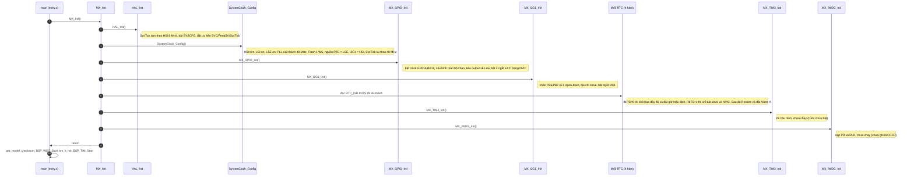

**Giải thích bước.**

| # | Bước | Vì sao ở vị trí này |
|---|---|---|
| 1 | `HAL_Init` | Dựng nền tảng thời gian (SysTick) và ưu tiên ngắt hệ thống. Mọi hàm HAL sau đó dùng `HAL_GetTick()` để chờ timeout |
| 2 | `SystemClock_Config` | Đưa CPU lên 48 MHz và bật LSE/LSI. Phải có trước khi cấu hình ngoại vi vì các ngoại vi (RTC, I2C) cần đúng nguồn clock |
| 3 | `MX_GPIO_Init` | Đặt trạng thái an toàn cho các chân điều khiển nguồn (tất cả Low) trước khi các khối khác chạy |
| 4 | `MX_I2C1_Init` | Mở cổng giao tiếp slave để S800 có thể nói chuyện |
| 5 | Khối RTC | Cần LSE (bước 2) và PWR/backup domain |
| 6 | `MX_TIM3_Init` | Chuẩn bị timer 1 ms. Việc chạy do `BSP_TIM_Start` làm sau |
| 7 | `MX_IWDG_Init` | Chuẩn bị watchdog. Việc chạy do `BSP_WDT_Start` làm sau |

---

## 2. `HAL_Init()`

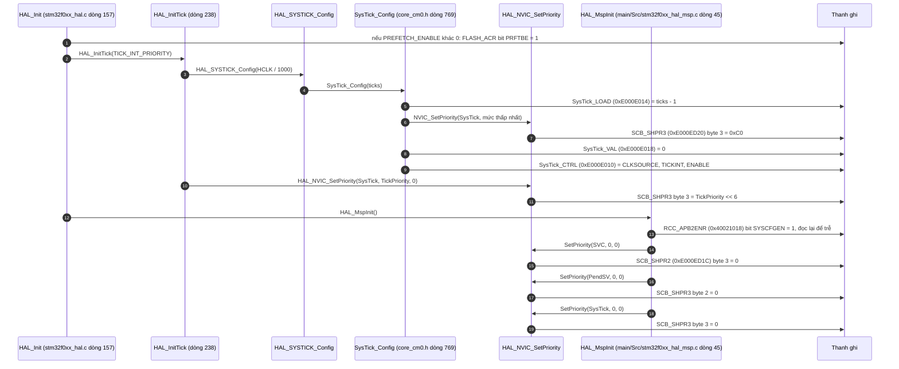

**Giải thích.**

1. `[SOURCE]` `HAL_Init` chỉ làm 3 việc: bật prefetch (nếu cấu hình bật), `HAL_InitTick`, `HAL_MspInit`. Tôi chưa kiểm tra giá trị `PREFETCH_ENABLE`.
2. `[SOURCE]` `HAL_InitTick` lấy `HAL_RCC_GetHCLKFreq()/1000`. Ở lúc này CPU còn chạy HSI (mặc định sau reset). `[RM0091]` HSI = 8 MHz, nên `LOAD = 7999` cho nhịp 1 ms. Tôi chưa đọc thân `HAL_RCC_GetHCLKFreq` nên giá trị cụ thể là suy ra.
3. `[SOURCE]` `SysTick_Config` ghi 3 thanh ghi SysTick: LOAD, VAL, CTRL. CTRL bật nguồn clock = HCLK, bật ngắt, bật đếm. Bit nào ở CTRL: `[RM0091]` bit0 ENABLE, bit1 TICKINT, bit2 CLKSOURCE.
4. `[SOURCE]` `NVIC_SetPriority` cho ngắt lõi (số âm) ghi vào `SCB->SHP[]`. Với số dương ghi vào `NVIC->IP[]`. Cortex-M0 có 2 bit ưu tiên (`__NVIC_PRIO_BITS = 2`), nên giá trị được dịch trái `8 - 2 = 6` bit.
5. `[SOURCE]` `HAL_MspInit` do dự án định nghĩa lại ở `main/Src/stm32f0xx_hal_msp.c:45`: bật clock SYSCFG (cần cho EXTI sau này) và đặt SVC, PendSV, SysTick đều ưu tiên 0 (cao nhất).

---

## 3. `SystemClock_Config()`

### 3a. `HAL_RCC_OscConfig` (osc: HSI + LSI + LSE + PLL)

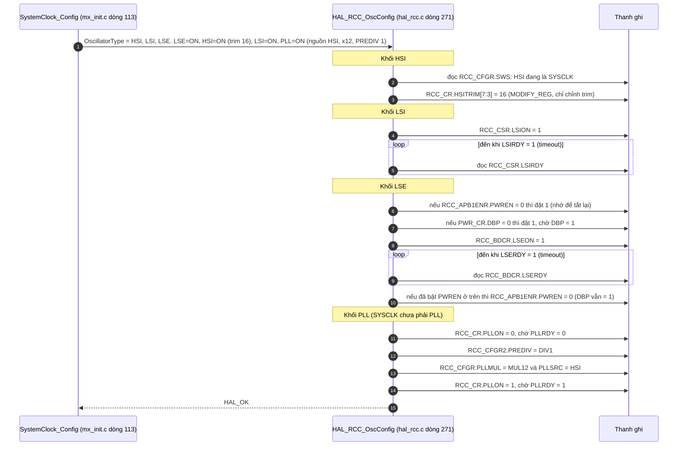

**Giải thích.**

1. `[SOURCE]` HSI: vì lúc gọi SYSCLK đang là HSI (`SWS == HSI`), HAL đi vào nhánh "HSI đang làm clock hệ thống: chỉ cho phép chỉnh calibration". Nó không tắt/bật HSI mà chỉ ghi `HSITRIM`. Giá trị 16 là mặc định của chip nên thực chất không đổi.
2. `[SOURCE]` LSI: `CSR.LSION`, rồi poll `LSIRDY`. LSI là clock 40 kHz nội dùng cho watchdog IWDG.
3. `[SOURCE]` LSE: ghi vào `BDCR` cần được phép ghi vào backup domain, nên HAL bật clock PWR rồi đặt `PWR_CR.DBP`. Sau khi bật LSE, HAL tắt lại clock PWR nếu chính nó bật, **nhưng `DBP` vẫn giữ 1**, nên các ghi RTC về sau không bị chặn.
4. `[SOURCE]` PLL: không được sửa khi PLL đang chạy, nên HAL tắt trước, cấu hình, bật, chờ khóa. Hệ số `PLLMUL = ×12`.
5. `[INFERENCE]` Tôi **chưa giải mã** bit `PLLSRC` thực tế (`HSI/2` hay `HSI/PREDIV`) vì macro `RCC_PLLSOURCE_HSI` có nhiều định nghĩa tùy dòng chip. Kết quả cuối được `.ioc` ghi là 48 MHz (`RCC.SYSCLKFreq_VALUE=48000000`), khớp với 8 MHz / 2 × 12.

### 3b. `HAL_RCC_ClockConfig` (SYSCLK = PLL, 1 wait state)

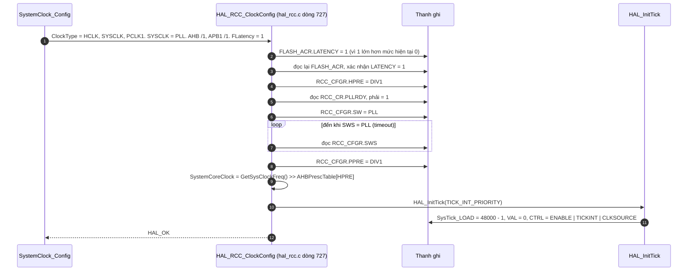

**Giải thích.**

1. `[SOURCE]` Thứ tự an toàn: **tăng wait state của Flash trước khi tăng tần số**. 48 MHz cần 1 wait state (`FLASH_LATENCY_1`). Nếu chuyển clock trước, CPU đọc Flash sai.
2. `[SOURCE]` Chỉ khi `PLLRDY = 1` HAL mới cho đổi `SW = PLL`, sau đó poll `SWS` để chắc chắn chuyển xong.
3. `[SOURCE]` Cuối hàm cập nhật biến `SystemCoreClock` và gọi lại `HAL_InitTick`. Từ giờ `SysTick_LOAD` được nạp theo 48 MHz, nên SysTick vẫn ngắt mỗi 1 ms dù clock đã nhanh gấp 6.
4. `[SOURCE]` `HPRE`/`PPRE` đều /1, vậy PCLK1 = HCLK = 48 MHz.

### 3c. `HAL_RCCEx_PeriphCLKConfig` (RTC = LSE, I2C1 = HSI)

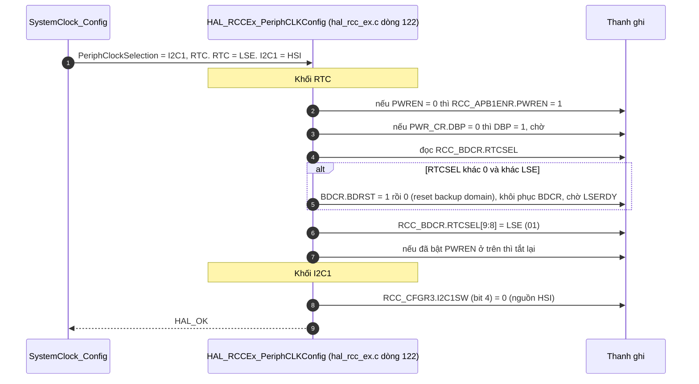

**Giải thích.**

1. `[SOURCE]` Chỉ được đổi nguồn clock RTC khi RTC chưa chọn nguồn hoặc đã reset backup domain. Nếu lần boot trước RTC đã chọn LSE (trường hợp thường gặp khi nguồn được cắm lại), `RTCSEL` đã bằng LSE nên HAL **không reset**, và ghi lại cùng giá trị (an toàn).
2. `[SOURCE]` Chỉ khi `RTCSEL` khác 0 và khác LSE mới xóa backup domain (điều này sẽ xóa toàn bộ trạng thái RTC).
3. `[SOURCE]` I2C1 lấy clock từ HSI (không phải SYSCLK). `[INFERENCE]` Lựa chọn này giúp I2C có clock độc lập với PLL (HSI vẫn hoạt động khi chip thức dậy từ STOP, xem `SystemClock_Config2` trong cùng file). Chưa tìm thấy comment xác nhận.

### 3d. SysTick (lần cuối)

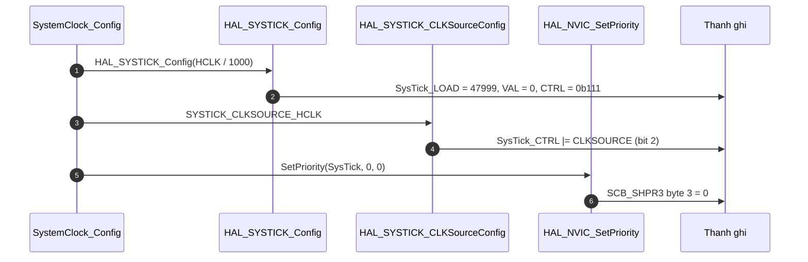

`[SOURCE]` Đây là bước lặp lại cố ý do code CubeMX sinh ra: giá trị LOAD cuối cùng bằng `HCLK/1000 - 1 = 47999` và ưu tiên SysTick đặt về 0.

---

## 4. `MX_GPIO_Init()` (và `HAL_GPIO_Init` ở mức thanh ghi)

### 4a. Thuật toán chung của `HAL_GPIO_Init` `[SOURCE]` (hal_gpio.c:188)

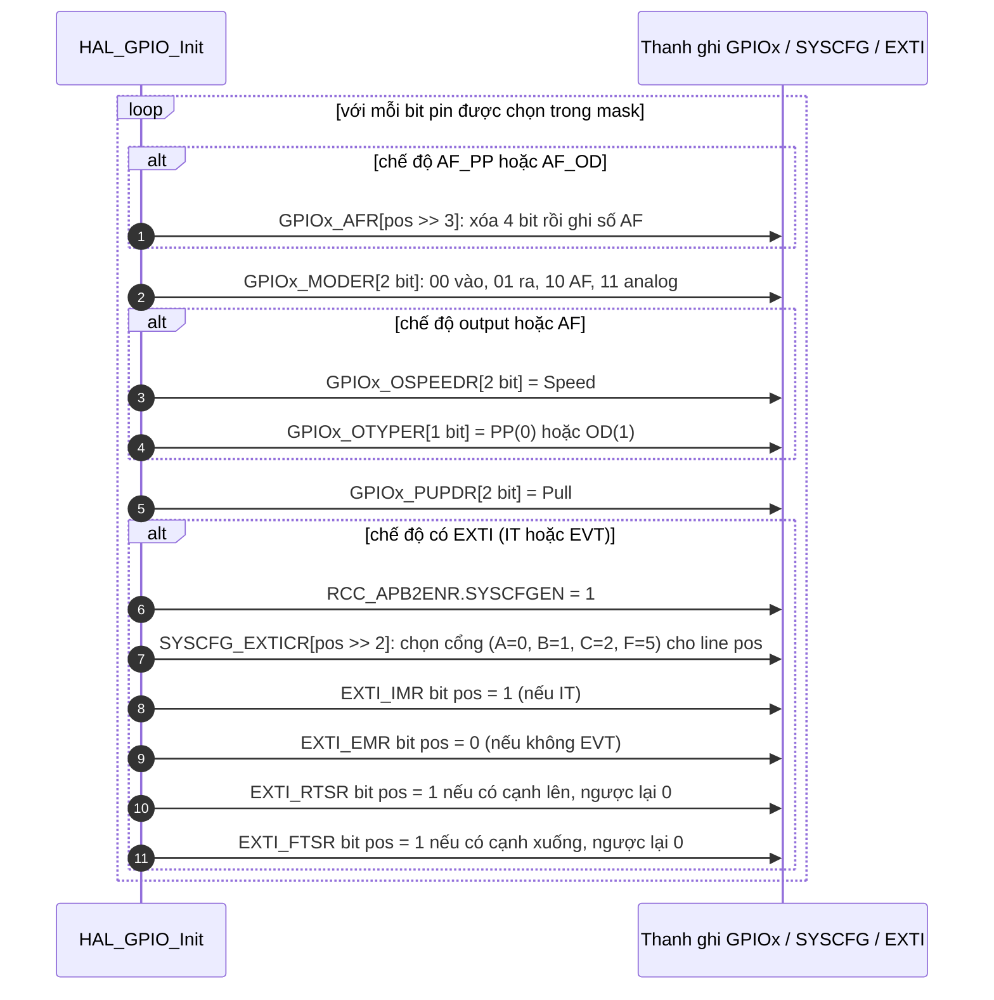

Giá trị cấu hình `[SOURCE]` (`stm32f0xx_hal_gpio.h`): `INPUT=0x0`, `OUTPUT_PP=0x1`, `AF_OD=0x12`, `IT_FALLING=0x10210000`, `IT_RISING_FALLING=0x10310000`.

### 4b. Trình tự `MX_GPIO_Init` `[SOURCE]` (mx_init.c:419)

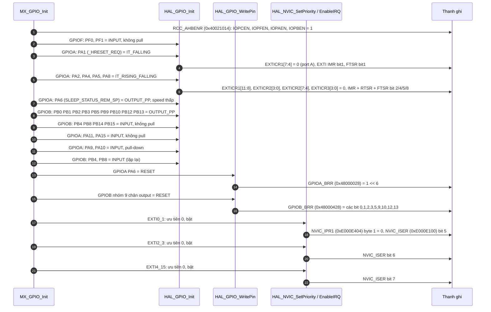

**Bảng chân sau `MX_GPIO_Init`** `[SOURCE]` (`mxconstants.h`):

| Chân | Tên | Chế độ | Ghi chú |
|---|---|---|---|
| PA1 | `_HRESET_REQ` | EXTI cạnh xuống | S800 yêu cầu reset |
| PA2 | `AP_PWR_EN` | EXTI hai cạnh | S800 báo nguồn AP |
| PA4 | `POWER_MONITOR` | EXTI hai cạnh | Giám sát nguồn |
| PA5 | `MSW_ON` | EXTI hai cạnh | Công tắc nguồn chính |
| PA8 | `MONI_24V11` | EXTI hai cạnh | Giám sát 24V |
| PA6 | `SLEEP_STATUS_REM_SP` | Output | Mặc định Low |
| PB0 | `IR_P_ON` | Output | Mặc định Low |
| PB1 | `ERP_SENSOR_ON` | Output | Mặc định Low |
| PB2 | `_RESET` | Output | Mặc định Low, tức S800 đang bị reset |
| PB3 | `SB_PWR_EN` | Output | Mặc định Low, nguồn SB tắt |
| PB5 | `MC_P_ON` | Output | Mặc định Low |
| PB9 | `_RST_SLP2` | Output | Mặc định Low |
| PB10 | `_USB2_OE` | Output | Mặc định Low |
| PB12 | `SLEEP_STATUS_REM_EG` | Output | Mặc định Low |
| PB13 | `MC_PWR_EN` | Output | Mặc định Low |
| PB4 | `SB_PG` | Input | Báo nguồn SB tốt |
| PB8 | `_DISCHG` | Input | |
| PB14, PB15 | `MODEL_BIT0/1` | Input | Đọc mã model |
| PA11 | `MC_PG` | Input | |
| PA15 | `MC3_3VON_MONI` | Input | |
| PA9, PA10 | `PA9_IN`, `PA10_IN` | Input pull-down | |
| PF0, PF1 | `PF0_IN`, `PF1_IN` | Input | |

**Giải thích.**

1. `[SOURCE]` Bật clock cổng trước: nếu clock cổng tắt, ghi vào thanh ghi `GPIOx` không có hiệu lực.
2. `[SOURCE]` Mỗi nhóm chân gọi `HAL_GPIO_Init` một lần với `Pin` là mask OR nhiều chân. HAL lặp qua từng bit.
3. `[SOURCE]` Với chân EXTI: `SYSCFG_EXTICR` chọn cổng nào nối vào đường EXTI tương ứng; sau đó `IMR` mở mask ngắt, `RTSR`/`FTSR` chọn cạnh.
4. `[RM0091]` Thanh ghi `ODR` có giá trị reset là 0, nên chân output đã ở Low ngay khi `MODER` chuyển sang output, và `BRR` sau đó chỉ khẳng định lại. Nhờ vậy `_RESET`, `SB_PWR_EN`, `MC_P_ON`... không bị xung nhiễu lúc khởi động. Đây là **nền tảng cho chuỗi bật nguồn**: mọi nguồn đều tắt, S800 đang bị giữ reset, cho tới khi firmware chủ động bật.
5. `[SOURCE]` Cả 3 ngắt EXTI được bật ngay (ưu tiên 0), **trước khi** `km_it_init()` đăng ký callback. `[INFERENCE]` Nếu có cạnh xảy ra trong khoảng này thì `signal_event` còn `NULL` và sự kiện bị bỏ. Đoạn đó rất ngắn, nhưng đáng biết.
6. `[SOURCE]` Tất cả ngắt đều ưu tiên 0, nên không ngắt nào chen ngang được ngắt khác.

---

## 5. `MX_I2C1_Init()`

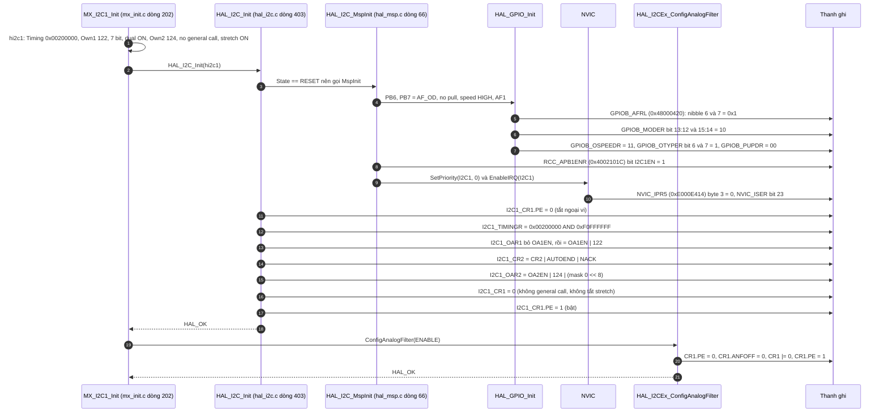

**Giải thích.**

1. `[SOURCE]` PB6 = SCL, PB7 = SDA (comment trong `MspInit`), chọn AF1, open-drain. Open-drain là bắt buộc cho I2C: chỉ kéo xuống, điện trở kéo lên bên ngoài kéo lên.
2. `[SOURCE]` `TIMINGR = 0x00200000` giá trị này không tính lại tốc độ. `[RM0091]` bit 23:20 là `SCLDEL = 2`, các trường còn lại (PRESC, SCLH, SCLL, SDADEL) = 0. Đây là slave nên SCL do S800 tạo; `SCLDEL` chỉ ảnh hưởng thời gian setup dữ liệu.
3. `[SOURCE]` Hai địa chỉ slave: `OwnAddress1 = 122 (0x7A)`, `OwnAddress2 = 124 (0x7C)`. HAL ghi thẳng vào `OAR1`/`OAR2`. `[RM0091]` trường địa chỉ 7-bit nằm ở bit [7:1], nên 7-bit address thực là **0x3D** và **0x3E** (tức byte ghi 0x7A và 0x7C). `[INFERENCE]` Tôi đoán đây là hai địa chỉ mà S800 dùng, chưa đối chiếu với phía S800.
4. `[SOURCE]` `CR2 |= AUTOEND | NACK`. Comment HAL: "NACK chỉ được tắt trong quá trình slave" — chính là ngầm giải thích vì sao `i2c_recv_first` dùng **manual ACK**.
5. `[SOURCE]` Mỗi lần đổi cấu hình, HAL tắt `PE` rồi bật lại (thay đổi `TIMINGR`, `OAR`, `ANFOFF` chỉ được phép khi `PE = 0`, `[RM0091]`).
6. `[SOURCE]` Bộ lọc nhiễu analog bật (`ANFOFF = 0`).
7. `[SOURCE]` Ngắt I2C1 (IRQ 23) được bật trong `MspInit` **trước** khi ngoại vi cấu hình xong. `[INFERENCE]` Không sao vì các bit ngắt trong `CR1` (ADDRIE, RXIE...) chưa được bật ở thời điểm này; chúng được bật sau trong `Driver_I2C0.Initialize`.

---

## 6. Khối RTC (4 hàm)

Mã trong `MX_Init`:

```c
hrtc.Instance = RTC;
if(!(hrtc.Instance->ISR & RTC_ISR_INITS)) {   // INITS: lịch chưa được khởi tạo
    MX_RTC_Init(DEF_RTC_INIT);   KM_RTC_SetDefaultTime();
} else {
    MX_RTC_Init(DEF_RTC_MSPINIT);
}
KM_RTC_Restore();
KM_RTC_ALARM_Init();
```

### 6a. Quyết định nhánh

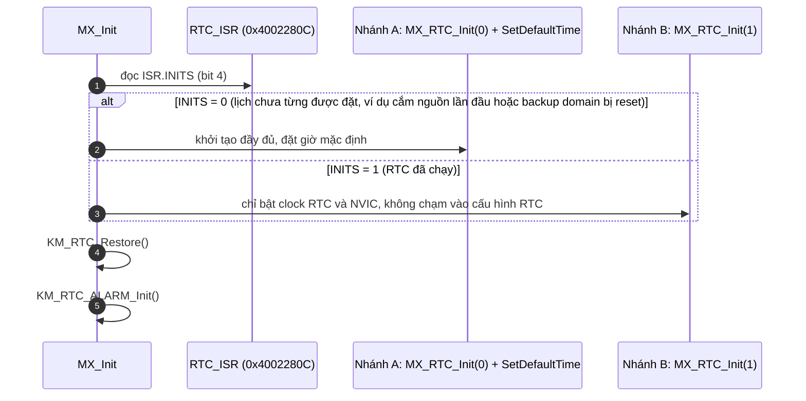

`[SOURCE]` Comment ở `mx_init.c:67` và `:93` (`OP_BTS-21266`, "主電源OFF時消費電流増加問題対策"): nhánh B tồn tại để **tránh vào init mode RTC mỗi lần khởi động**, vì việc đó từng làm tăng dòng tiêu thụ khi công tắc nguồn chính tắt. `[INFERENCE]` Cơ chế vật lý chính xác của hiện tượng này tôi không kiểm chứng.

### 6b. Nhánh A: `MX_RTC_Init(0)` → `HAL_RTC_Init`

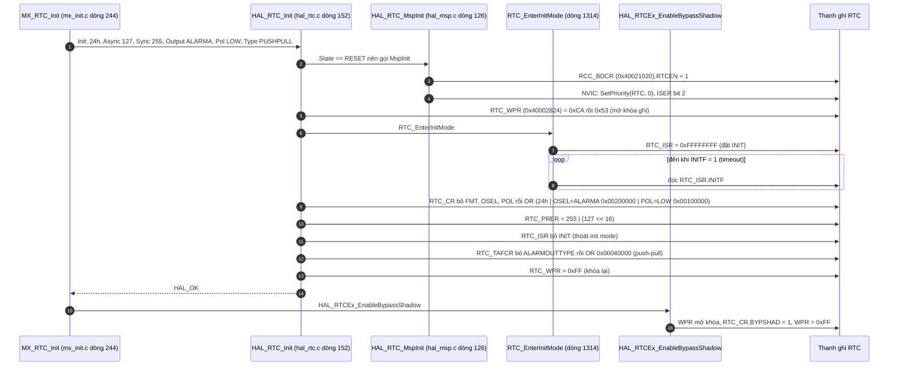

**Giải thích.**

1. `[SOURCE]` Bảo vệ ghi RTC: phải ghi tuần tự `0xCA` rồi `0x53` vào `WPR` mới ghi được các thanh ghi RTC. Ghi `0xFF` (HAL) hoặc `0xFE` rồi `0x64` (code KM) để khóa lại.
2. `[SOURCE]` `PRER`: prescaler bất đồng bộ 127, đồng bộ 255. `[RM0091]` Với LSE 32,768 kHz: 32768 / (127+1) / (255+1) = 1 Hz, đúng 1 giây.
3. `[SOURCE]` `OSEL = ALARMA` và `POL = LOW` nghĩa là chân đầu ra RTC phát tín hiệu Alarm A, tích cực Low. `[INFERENCE]` Tôi không thấy chân RTC output nào trong bảng GPIO, nên chưa rõ nó nối đi đâu hoặc có dùng không.
4. `[SOURCE]` `BYPSHAD = 1`: đọc `TR`/`DR` trực tiếp từ bộ đếm, không qua thanh ghi bóng. Hệ quả: `HAL_RTC_SetTime`/`SetDate` **bỏ qua** bước `WaitForSynchro` (nhánh `if CR_BYPSHAD == RESET`).
5. `[SOURCE]` Comment `/* !!! CubeMXでコード生成後以下をマージする事 !!! */` cảnh báo: dòng `HAL_RTCEx_EnableBypassShadow` là sửa tay, cần **giữ lại** khi sinh lại code bằng CubeMX.

### 6c. Nhánh A (tiếp): `KM_RTC_SetDefaultTime`

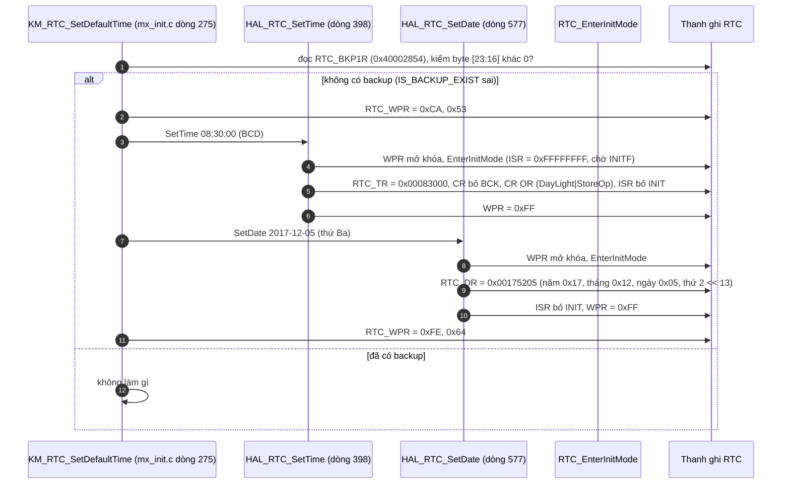

`[SOURCE]` Giá trị mặc định `2017/12/05 08:30:00` (comment trong code). `TR = 0x08<<16 | 0x30<<8 = 0x00083000`. `DR = 0x17<<16 | 0x12<<8 | 0x05 | 2<<13 = 0x00175205` theo công thức ở `hal_rtc.c:615-618`; riêng giá trị hằng `RTC_MONTH_DECEMBER = 0x12` và `RTC_WEEKDAY_TUESDAY = 2` tôi lấy từ quy ước của HAL, chưa mở header để xác nhận.

### 6d. `KM_RTC_Restore`

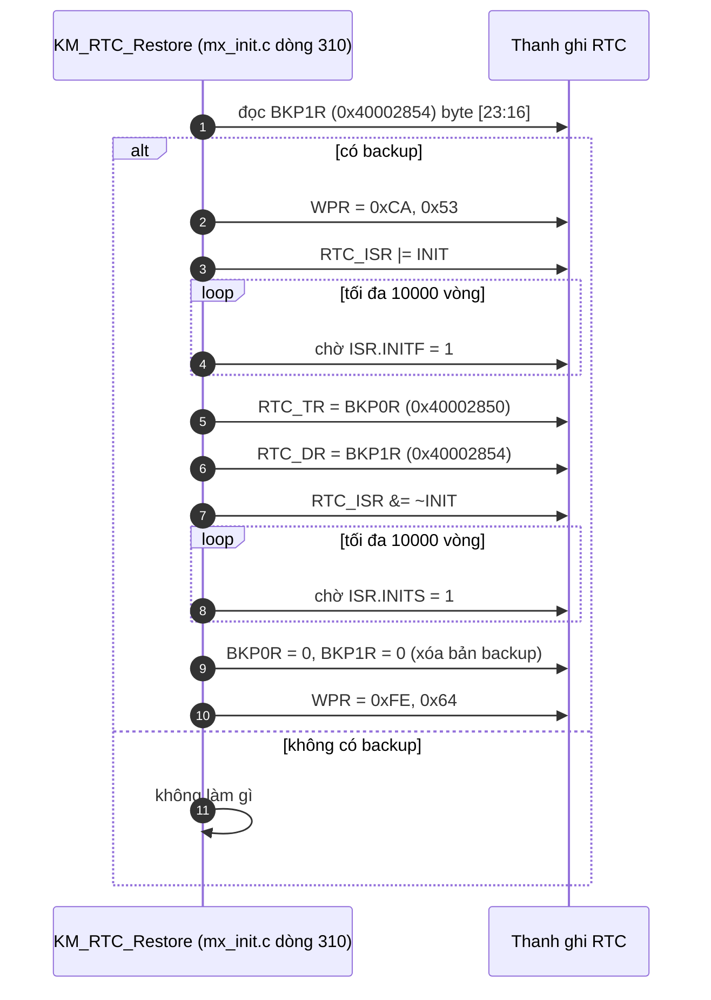

`[SOURCE]` Comment `2023/06/30 河村 OP_BTS-44141`: phía **lưu** (`save_rtc_reg`) đã bị vô hiệu hóa, nhưng phía **khôi phục** vẫn giữ để tương thích với phiên bản firmware cũ (bản cũ lưu giờ vào BKP0R/BKP1R trước khi nhảy sang IAP). Với firmware hiện tại thanh ghi này thường bằng 0 nên hàm không làm gì.

### 6e. `KM_RTC_ALARM_Init` → `HAL_RTC_SetAlarm_IT`

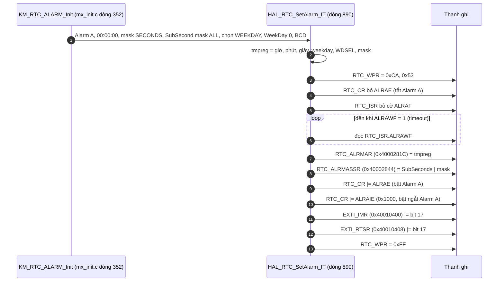

**Giải thích.**

1. `[SOURCE]` Quy trình chuẩn của RTC: phải **tắt** Alarm A rồi chờ `ALRAWF = 1` mới được ghi `ALRMAR`; xong mới bật lại.
2. `[SOURCE]` Alarm A của RTC đi qua **EXTI line 17**; HAL phải mở `IMR` và `RTSR` ở EXTI mới có ngắt tới NVIC (IRQ RTC = 2, đã bật trong `HAL_RTC_MspInit`).
3. `[SOURCE]` Comment `RTC_ALARMMASK_SECONDS` ghi rõ: đây là giá trị **sửa tay** sau khi CubeMX sinh code. Giá trị là cấu hình ban đầu. Thời điểm báo thức thực tế dùng cho chế độ STOP được nạp lại bởi `set_cycle_time()` (gọi tại `km_extend_io.c:1202`). `[INFERENCE]` Tôi chưa đọc `set_cycle_time` nên chưa xác nhận được thời gian cụ thể; và tôi chưa đánh giá liệu báo thức khởi tạo này (đặt `weekday = 0`) có bao giờ khớp hay không.

---

## 7. `MX_TIM3_Init()`

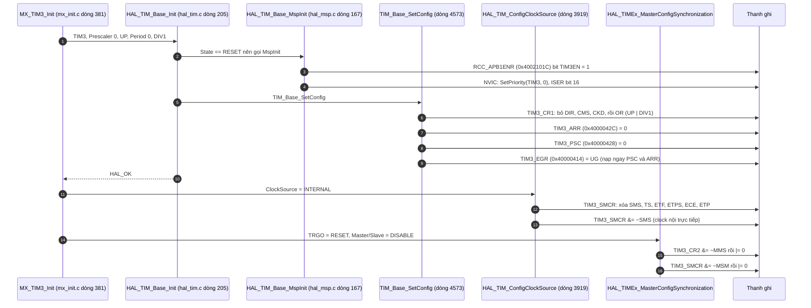

**Giải thích.**

1. `[SOURCE]` Hàm này chỉ **dựng khung** timer: bật clock, bật ngắt NVIC, ghi giá trị placeholder `PSC = 0`, `ARR = 0`.
2. `[SOURCE]` **Bộ đếm chưa chạy**: `CR1.CEN` không được set, và `DIER.UIE` không được set. Việc đặt `PSC`/`ARR` thật (tạo 1 ms) và bật chạy là của `BSP_TIM_Start(TIMER_3, 1)` (đã phân tích ở câu trả lời trước), bằng cách `DeInit` rồi `Init` lại.
3. `[SOURCE]` `TIM3_IRQn` đã được bật ở NVIC từ đây nhưng timer chưa phát ngắt vì `UIE = 0`.
4. `[SOURCE]` Clock nguồn là nội (APB1 timer clock), không dùng chế độ master/slave hay trigger ngoài.

---

## 8. `MX_IWDG_Init()`

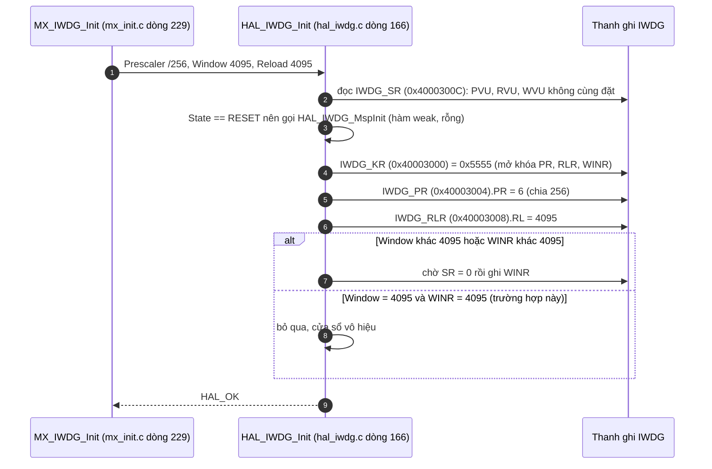

**Giải thích.**

1. `[SOURCE]` `HAL_IWDG_Init` chỉ **cấu hình** watchdog, không chạy nó. Việc chạy (ghi `KR = 0xCCCC`) nằm trong `HAL_IWDG_Start`, được gọi từ `BSP_WDT_Start()` ([entry.c:63](../pscpu_s800/main/App/entry.c#L63)). Tôi chưa đọc thân `HAL_IWDG_Start`, nên "ghi `0xCCCC`" là kiến thức `[RM0091]`.
2. `[SOURCE]` `IWDG_PRESCALER_256 = IWDG_PR_PR_2 | IWDG_PR_PR_1` tức `PR = 0b110`.
3. `[SOURCE]` `Window = 4095` bằng giá trị mặc định của `WINR`, nên nhánh ghi `WINR` bị bỏ qua: watchdog hoạt động ở chế độ thường, không có cửa sổ.
4. `[RM0091]` Với LSI danh định khoảng 40 kHz: mỗi nhịp = 256 / 40 000 ≈ 6,4 ms, nên `RL = 4095` cho timeout ≈ 26 giây. Con số này chỉ là ước tính, vì tần số LSI thực thay đổi theo chip và nhiệt độ.
5. `[SOURCE]` Vòng lặp chính gọi `BSP_WDT_Refresh()` mỗi lần lặp ([entry.c:89](../pscpu_s800/main/App/entry.c#L89)); nếu vòng lặp bị treo hơn timeout này thì chip tự reset.

---

## 9. Những gì tôi chưa xác minh

| Mục | Lý do |
|---|---|
| Giá trị `PREFETCH_ENABLE` | Chưa đọc `stm32f0xx_hal_conf.h` |
| Thân `HAL_RCC_GetHCLKFreq`, `HAL_RCC_GetSysClockFreq` | Chưa đọc. Giá trị HCLK trước và sau PLL là suy ra từ `.ioc` |
| Bit `PLLSRC` thực tế | Macro `RCC_PLLSOURCE_HSI` có nhiều định nghĩa theo dòng chip |
| Vị trí bit và offset thanh ghi | Lấy từ `[RM0091]` (kiến thức chung), chỉ **base address** và **số IRQ** là đọc từ `stm32f031x6.h` |
| `HAL_IWDG_Start` | Chưa đọc thân hàm |
| `set_cycle_time` | Chưa đọc, nên chưa kết luận về chu kỳ Alarm A thực dụng |
| Ý nghĩa của hai địa chỉ I2C (0x3D, 0x3E) | Cần đối chiếu với phía S800 |
