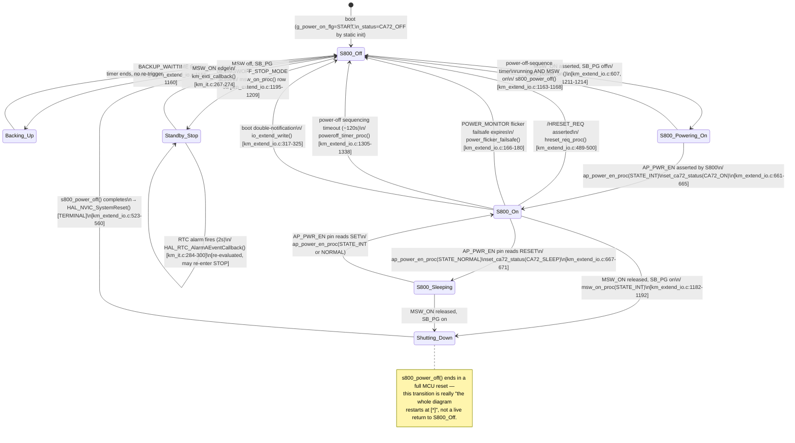

 # Sơ đồ trạng thái — Hệ thống (Trình tự cấp nguồn S800)

**Danh mục: State machine cấp Hệ thống.** Đây là một tổ hợp `[INFERRED]` —
source biểu diễn hành vi này dưới dạng thứ tự nhánh if/else của
`msw_on_proc()` cộng với hai cờ độc lập (`g_power_on_flg`,
`TYPE_Km_CA72_Status`), chứ không phải một enum duy nhất
(`07_state_machines.md` §2.2 đã nêu rõ điều này). Các state bên dưới được
đặt tên để dễ đọc; mọi transition đều là một nhánh hoặc phép gán thực tế
đã được trích dẫn trong `07_state_machines.md`.

## Ghi chú

- **Không có bảng transition có điều kiện bảo vệ (guard) nào tồn tại
  trong source** cho `_status` (`TYPE_Km_CA72_Status`) —
  `set_ca72_status()` ghi đè vô điều kiện từ bất kỳ giá trị hiện tại nào
  (`07_state_machines.md` §1.4). Các mũi tên ở trên phản ánh *các điều
  kiện mà bên gọi tình cờ kiểm tra* trước khi gọi hàm này, không phải một
  state machine được thực thi cưỡng chế.
- **Hành động entry/exit:** khi vào `Shutting_Down` luôn tắt trực tiếp 3
  đường EXTI (`km_extend_io.c:538-540`, một hình thức bỏ qua thô đã được
  gắn cờ trong `08_concurrency.md` §3); khi vào `S800_Powering_On` luôn
  khởi động một bộ đếm thời gian `SB_RESET_RELEASE` 100ms.
- **Timeout:** `Backing_Up`→`S800_Off` ở 50ms (`BACKUP_WAITTIME`);
  `S800_On`→`S800_Off` thông qua failsafe của trình tự ở khoảng ~120s
  (chuỗi `PWROFF_MAXTIME1`+`MAXTIME2`, `09_timing.md` §3).
- **Retry:** không có — mọi transition `S800_On`→`S800_Off` do lỗi kích
  hoạt đều chỉ xảy ra một lần (one-shot).
- **Recovery:** mọi đường quay về `S800_Off` từ một điều kiện lỗi đều đi
  qua một MCU reset toàn bộ (`HAL_NVIC_SystemReset()` cuối cùng của
  `s800_power_off()`), vì vậy "S800_Off" sau một lỗi thực chất là "PS-CPU
  vừa được khởi động lại với S800 cũng vừa được tắt nguồn", chứ không phải
  một transition trạng thái thực tế bên trong một thực thể firmware đang
  chạy.

## Truy vết

| Transition | Function | File:Line |
|---|---|---|
| S800_Off → S800_Powering_On | `s800_power_on` | `main/App/km_extend_io.c:607` |
| S800_Powering_On → S800_On | `ap_power_en_proc` | `main/App/km_extend_io.c:658,661-665` |
| S800_On ↔ S800_Sleeping | `ap_power_en_proc` | `main/App/km_extend_io.c:667-671` |
| * → Shutting_Down/S800_Off | `msw_on_proc`, `s800_power_off` | `main/App/km_extend_io.c:1149,523` |
| S800_On → S800_Off (HRESET) | `hreset_req_proc` | `main/App/km_extend_io.c:489` |
| S800_Off ↔ Standby_Stop | `msw_on_proc`, `HAL_RTC_AlarmAEventCallback`, `km_exti_callback` | `km_extend_io.c:1195-1209`, `km_it.c:284,267` |
