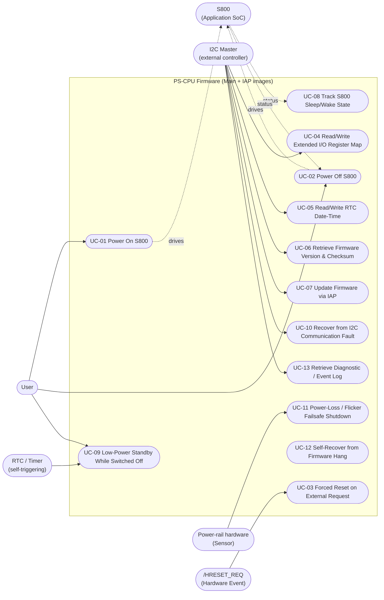

# PS-CPU (pscpu_s800) — Mô hình Use Case

**Phạm vi tài liệu này:** hành vi hướng ra bên ngoài của firmware, được
diễn đạt dưới dạng use case — những gì một actor bên ngoài MCU có thể
*khiến firmware thực hiện*, chứ không phải là bản liệt kê lại các hàm nội
bộ. Được xây dựng từ `docs/00_project_scope.md` đến `docs/10_error_recovery.md`;
cột Functions/Files của mỗi use case là một trích dẫn vào phần phân tích
đó, không phải một khẳng định mới. Ở những nơi danh tính thực tế của một
actor không hoàn toàn chắc chắn chỉ dựa vào source (ví dụ: chính xác board
nào phát lệnh I2C), nó được gắn nhãn `[INFERRED]` thay vì khẳng định như
một sự thật — nhất quán với quy ước gắn nhãn bằng chứng được dùng xuyên
suốt các phase phân tích.

---

## 1. Actor (tác nhân)

| Actor | Bản chất | Bằng chứng |
|---|---|---|
| **User** | vận hành Công tắc Nguồn Chính vật lý (chân MSW_ON) | `main/Inc/mxconstants.h:56`, tín hiệu vào có debounce, `07_state_machines.md` §1.2 |
| **I2C Master** (bộ điều khiển bên ngoài — comment trong code gọi là "LPPP"; danh tính chính xác của board `[UNKNOWN]`) | actor giao tiếp duy nhất — đọc/ghi toàn bộ bảng thanh ghi I2C, khởi tạo cập nhật firmware, yêu cầu vào chế độ IAP | `main/App/km_i2c.c`, I2C1 slave tại địa chỉ 122/124 |
| **S800 (Application SoC)** | bộ xử lý mà firmware này điều khiển trình tự cấp nguồn và giám sát trạng thái — vừa là Actuator (điều khiển các đầu vào của nó: `/RESET`, `SB_PWR_EN`, `MC_P_ON`, `IR_P_ON`, `MC_PWR_EN`) vừa là Sensor (firmware này đọc các đầu ra của nó: `AP_PWR_EN`, `SLEEP_STATUS_REM`, `SB_PG`, `MC_PG`, `MC3_3V_ON_MONI`) | `main/App/km_extend_io.c`, bảng `io_extend[]` |
| **Phần cứng nguồn điện (Sensor)** | tín hiệu `POWER_MONITOR` và `MONI_24V11` — bộ giám sát tình trạng đường nguồn vật lý, không phải thiết bị lập trình được | bảng anti-chattering trong `km_it.c`, `km_extend_io.c` |
| **RTC/Timer (nội bộ, tự kích hoạt)** | alarm RTC đánh thức MCU định kỳ khỏi chế độ STOP mà không cần kích thích bên ngoài | `km_alarm_wake.c`, `03_execution_model.md` §4.5 |
| **Sự kiện phần cứng — `/HRESET_REQ`** | tín hiệu yêu cầu reset từ bên ngoài, nguồn gốc `[UNKNOWN]` (có khả năng là một board khác trên cùng connector với S800, không được xác định riêng trong source) | `km_extend_io.c:489-500` |

`Host MCU`, `PC`, `Peripheral`, và `DMA` từ danh sách actor tổng quát
không áp dụng như những actor *riêng biệt* ở đây: DMA không bao giờ được
sử dụng (`03_execution_model.md` §6), và vai trò "PC" trong quá trình cập
nhật firmware là không thể phân biệt được với actor I2C Master ở tầng
giao thức — firmware không thể phân biệt một máy nạp firmware của nhà máy
với bất kỳ I2C master nào khác phát ra cùng chuỗi lệnh.

---

## 2. Sơ đồ use case tổng quan

---

## 3. Đặc tả chi tiết use case

### UC-01 — Power On S800 (Bật nguồn S800)
- **Actor:** User (MSW_ON được kích hoạt)
- **Trigger:** chân `MSW_ON` sau debounce chuyển lên mức cao (`07_state_machines.md` §1.2), hoặc MCU khởi động mới với MSW đã bật sẵn
- **Precondition:** POWER_MONITOR tốt, MONI_24V11 không được kích hoạt (24V đã xả), `SB_PG` hiện đang ở mức thấp (S800 chưa được cấp nguồn)
- **Main flow:**
  1. Debounce xác nhận MSW_ON ổn định (10ms) → `msw_on_proc(STATE_INT)`/`(STATE_NORMAL)` quan sát thấy MSW bật, SB_PG tắt
  2. `s800_power_on()` kích hoạt `SB_PWR_EN`, khởi động bộ đếm thời gian 100ms `SB_RESET_RELEASE`, đặt `g_power_on_flg`
  3. `mc_p_on_*_proc()` theo model cụ thể sắp xếp trình tự `MC_P_ON`/`IR_P_ON` tùy theo model (Eagle so với Sparrow, `04_call_graph.md` §3.5), được kiểm soát bởi các điều kiện `_MC_P_ON_OK()` (POWER_MONITOR/24V/SB_PG/MSW đều tốt)
  4. `ap_power_en_proc()` quan sát thấy `AP_PWR_EN` lên mức cao khi S800 khởi động xong → `set_ca72_status(CA72_ON)`
- **Alternative flow:** nếu trình tự này được thực hiện thông qua lời gọi `s800_power_on()` lúc khởi động trong `main()` (`entry.c:75`) thay vì một cạnh MSW thực tế, thì cùng một hàm sẽ chạy với MSW đã được kích hoạt sẵn từ một lần khởi động nguội
- **Error flow:** nếu điều kiện POWER_MONITOR/24V/SB_PG không được thỏa mãn, `_MC_P_ON_OK()` sẽ chặn việc kích hoạt `MC_P_ON`/`IR_P_ON` vô thời hạn cho đến khi điều kiện được đáp ứng — không có timeout/lỗi nào được phát sinh cho trường hợp chờ cụ thể này (mục `mc_p_on_*_proc` trong `04_call_graph.md` §2.9)
- **Postcondition:** `SB_PWR_EN`/`MC_P_ON`/`IR_P_ON` được kích hoạt, `_status == CA72_ON` khi S800 báo hiệu `AP_PWR_EN`
- **Firmware modules:** Application (`km_extend_io.c`)
- **Functions/Files:** `msw_on_proc` `km_extend_io.c:1149`; `s800_power_on` `km_extend_io.c:607`; `mc_p_on_eagle_proc`/`mc_p_on_sparrow_proc` `km_extend_io.c:763,801`; `ap_power_en_proc` `km_extend_io.c:658`

### UC-02 — Power Off S800 (Tắt nguồn S800)
- **Actor:** User (MSW_ON được thả ra) — cũng có thể được kích hoạt lại nội bộ bởi UC-10/UC-11/UC-12/các đường lỗi (`10_error_recovery.md` §3)
- **Trigger:** chân `MSW_ON` sau debounce xuống mức thấp, hoặc bất kỳ vị trí nào trong số 4 vị trí gọi `s800_power_off()` bổ sung (`04_call_graph.md` §2.9, `06_event_flow.md` sửa đổi E23)
- **Precondition:** thay đổi tùy theo vị trí gọi; đường đi do MSW kích hoạt yêu cầu `SB_PG` hiện đang ở mức cao
- **Main flow:**
  1. `msw_on_proc()` quan sát thấy MSW tắt, SB_PG bật → hoặc `HAL_NVIC_SystemReset()` trực tiếp (nếu điều kiện 24V/SB_PG khớp với một mẫu cụ thể, `07_state_machines.md` §2.2 dòng 4a) hoặc `s800_power_off()`
  2. `s800_power_off()`: `set_ca72_status(CA72_OFF)`, xóa các interrupt đang chờ, **tắt trực tiếp 3 đường EXTI** (bỏ qua NVIC ở mức thấp, `08_concurrency.md` §3), hủy kích hoạt `/RESET` và `SB_PWR_EN`, ghi lại bit boot-state-reboot, khởi tạo lại các đầu ra, đánh giá `sleep_status_rem_proc(model)`, `HAL_Delay(500ms)` chặn luồng, sau đó `HAL_NVIC_SystemReset()`
- **Alternative flow:** việc tắt nguồn có thể thay vào đó đi qua đường vào chế độ STOP (`msw_on_proc()` dòng 5a, `07_state_machines.md` §1.5) nếu bộ đếm thời gian tắt nguồn không đang chạy và `MSWOFF_STOP_MODE` đang hoạt động — đây là **standby**, không phải shutdown+reset (xem UC-09)
- **Error flow:** không có trong chính use case này — mọi trigger vào `s800_power_off()` xuất phát từ một điều kiện lỗi đều là use case riêng của nó (UC-11 bao gồm các điểm vào flicker/failsafe)
- **Postcondition:** MCU reset toàn bộ — mọi trạng thái cấp module đều khởi tạo lại (`03_execution_model.md` §2.1)
- **Firmware modules:** Application (`km_extend_io.c`)
- **Functions/Files:** `msw_on_proc` `km_extend_io.c:1149`; `s800_power_off` `km_extend_io.c:523`

### UC-03 — Forced Reset on External Request (Reset cưỡng bức theo yêu cầu bên ngoài) (`/HRESET_REQ`)
- **Actor:** Sự kiện phần cứng (chân `/HRESET_REQ`, nguồn gốc `[UNKNOWN]`)
- **Trigger:** cạnh EXTI trên PA1, **không debounce** (`10_error_recovery.md` §2.6, Observation 4)
- **Precondition:** không có
- **Main flow:** ISR của EXTI đặt bit `pending_factor` (`km_it.c:254`) → lượt super-loop tiếp theo, `intr_pending_proc()` → `hreset_req_proc()` → `poweroff_factor_save()` + `s800_power_off()`
- **Alternative flow:** nếu bộ đếm thời gian flicker-failsafe đang chạy sẵn, nguyên nhân được ghi lại là `FLICKER` thay vì `HRESET_REQ` (`km_extend_io.c:491-495`)
- **Error flow:** n/a — đây *chính là* use case xử lý lỗi của firmware cho tín hiệu này
- **Postcondition:** MCU reset toàn bộ, nguyên nhân được ghi lại trong log tắt nguồn lưu trên RTC (§1 của `10_error_recovery.md`)
- **Firmware modules:** ISR (`km_it.c`), Application (`km_extend_io.c`)
- **Functions/Files:** `km_exti_callback` `km_it.c:247`; `intr_pending_proc` `km_extend_io.c:1416`; `hreset_req_proc` `km_extend_io.c:489`

### UC-04 — Read/Write Extended I/O Register Map (Đọc/Ghi bảng thanh ghi I/O mở rộng)
- **Actor:** I2C Master
- **Trigger:** ghi I2C vào bất kỳ địa chỉ `EXTEND_OUTPUT_*`/`EXTEND_INPUT_*`/`INT_STS_*`/`INTERNEAL_STS_*`/`INTERNEAL_CTL_*`
- **Precondition:** I2C1 slave đã sẵn sàng (`i2c_recv_first()` đã chạy)
- **Main flow:** địa chỉ+dữ liệu được clock vào (ISR nạp đầy `rx_buf`) → `i2c_recv_wait()` giải mã `second_addr` → `io_extend_read()`/`io_extend_write()` chuyển đổi qua lại với bảng 14 tín hiệu `io_extend[]` → đọc/ghi GPIO
- **Alternative flow:** một lệnh ghi vào bit `_USB2_OE` cụ thể cũng đảo `is_usb2_oe_from_main_cpu_ctrl`, giao quyền điều khiển tự động của chân đó cho master cho đến khi master ghi mức ngược lại (`05_data_flow.md` §2.2)
- **Error flow:** một byte `second_addr` nằm ngoài phạm vi sẽ bị NACK ở tầng giao thức trong quá trình nhận (`valid_second_addr()`, `km_i2c.c:93-156`) — xem UC-10 để biết đường đi lỗi I2C rộng hơn
- **Postcondition:** (các) GPIO được đánh địa chỉ phản ánh giá trị đã ghi, hoặc phản hồi đọc phản ánh `g_io_extend_memory[]`/trạng thái chân trực tiếp
- **Firmware modules:** Protocol/Application (`km_i2c.c`, `km_extend_io.c`)
- **Functions/Files:** `i2c_recv_wait` `km_i2c.c:485`; `io_extend_read`/`io_extend_write` `km_extend_io.c:192,249`

### UC-05 — Read/Write RTC Date-Time (Đọc/Ghi ngày giờ RTC)
- **Actor:** I2C Master
- **Trigger:** truy cập I2C vào bất kỳ địa chỉ `RTC_*_CMD`/`B_REGISTER_*` nào
- **Precondition:** RTC đã được khởi tạo (`MX_RTC_Init()` lúc boot)
- **Main flow:** `i2c_recv_wait()` nhận diện `second_addr` nằm trong phạm vi RTC và, khác biệt so với mọi lệnh khác, trao cho driver I2C một **con trỏ trực tiếp vào `RTC_BASE + offset`** thay vì một bản sao trung gian (`05_data_flow.md` §2.5) — đọc trả về nội dung thanh ghi trực tiếp; ghi đi qua trực tiếp `RTC_WRITEPROTECT_DISABLE/ENABLE`
- **Alternative flow:** hai địa chỉ "thanh ghi B" (`B_REGISTER_MCIR`, `B_REGISTER_PWROFF_LOG`) sử dụng cùng cơ chế passthrough nhưng ánh xạ tới các thanh ghi backup của RTC được tái sử dụng lần lượt cho trạng thái MCIR và log chẩn đoán tắt nguồn (đây cũng là cơ chế đọc thực tế của **UC-13**, §1.1 của `10_error_recovery.md`)
- **Error flow:** không có gì đặc thù — thuộc về UC-10 đối với các lỗi I2C tổng quát
- **Postcondition:** thanh ghi lịch/backup của RTC được cập nhật, hoặc giá trị trực tiếp của nó được trả về
- **Firmware modules:** Protocol (`km_i2c.c`)
- **Functions/Files:** `i2c_recv_wait` `km_i2c.c:511-554,637-673`

### UC-06 — Retrieve Firmware Version & Checksum (Lấy phiên bản & checksum firmware)
- **Actor:** I2C Master
- **Trigger:** đọc I2C `EXTEND_VERSION_COMMAND(_2)` hoặc `EXTEND_CHECKSUM_COMMAND`
- **Precondition:** boot đã hoàn tất (các giá trị được tính một lần lúc khởi động `main()`)
- **Main flow:** `i2c_recv_wait()` chuẩn bị `g_main_version[]`/`g_checksum_value` (được tính lúc boot bởi `GetVersionString()`/`checksum_calc()`, `entry.c:56,60`) để truyền đi
- **Alternative flow:** cùng các lệnh này tồn tại trong image IAP, báo cáo phiên bản/checksum của chính image IAP thay vào đó
- **Error flow:** không có
- **Postcondition:** master nhận được chuỗi phiên bản 23-byte / checksum 16-bit phản ánh image đang chạy hiện tại
- **Firmware modules:** Application (`km_i2c.c`)
- **Functions/Files:** `checksum_calc` `km_i2c.c:771`; `GetVersionString` `km_i2c.c:800`

### UC-07 — Update Firmware via IAP (Cập nhật firmware qua IAP)
- **Actor:** I2C Master
- **Trigger:** ghi I2C số magic `0x11223344` vào `IAP_PG_COMMAND`
- **Precondition:** image Main đang chạy
- **Main flow:**
  1. Main: số magic khớp → `DeInit()` + `jump2iap()` (nhảy phần mềm, không reset lõi, `04_call_graph.md` §2.9/§5)
  2. IAP: master gửi lại lệnh ghi magic → `main_project_flash_erase()` xóa `0x08000000`-`0x08004FFF`
  3. Master truyền một loạt lệnh ghi `IAP_PG_COMMAND_DATA` → `flash_write_32()` lập trình 4 byte một lần, `g_dest_addr` tăng dần
  4. Master ghi `IAP_PG_COMMAND_CHANGE_INFO` với bit hoàn tất → `check_sum_calc()` xác minh, `checksum_calc()`/`GetVersionString()` đọc lại image mới
  5. User thả MSW_ON → `msw_on_proc_iap()` (ISR) → `HAL_NVIC_SystemReset()` quay trở lại Main (đã được cập nhật)
- **Alternative flow:** master có thể poll `IAP_PG_COMMAND_CHANGE_STATUS` bất cứ lúc nào để kiểm tra các bit tiến trình
- **Error flow:** sai lệch checksum hoặc ghi ngoài phạm vi đặt các bit trạng thái `CHKSUM_ERR`/`PSCPU_ERR` nhưng **không chặn** việc reset quay lại Main do MSW kích hoạt (`10_error_recovery.md` §2.9/§2.10) — master phải tự kiểm tra các bit này trước khi thả MSW
- **Postcondition:** nội dung flash của image Main được thay thế; hệ thống reset vào image mới bất kể kết quả xác minh, trừ khi master can thiệp
- **Firmware modules:** Application, Driver (image IAP: `km_i2c_iap.c`, `km_extend_io_iap.c`, `FLASH_stm32f0xx.c`)
- **Functions/Files:** `jump2iap` `entry.c:159`; `main_project_flash_erase`/`flash_write_32` `km_i2c_iap.c:435,413`; `check_sum_calc` `km_i2c_iap.c:456`; `msw_on_proc_iap` `km_extend_io_iap.c:28`

### UC-08 — Track S800 Sleep/Wake State (Theo dõi trạng thái Sleep/Wake của S800)
- **Actor:** S800 (qua chân `AP_PWR_EN`), I2C Master (qua các lệnh ghi `INTERNEAL_CTL_COMMAND`)
- **Trigger:** cạnh EXTI của `AP_PWR_EN` (trì hoãn qua `pending_factor`), hoặc kiểm tra mức tín hiệu định kỳ mỗi lượt super-loop
- **Precondition:** model đã được xác định (`get_model()` được cache lúc boot)
- **Main flow:** `ap_power_en_proc()` đặt `_status` thành `CA72_ON`/`CA72_SLEEP`; `sleep_status_rem_eagle_proc()`/`_sparrow_proc()` (tùy theo model, `04_call_graph.md` §3.5) so sánh với `prev_status` của riêng chúng để phát hiện cạnh chuyển tiếp và điều khiển `SLEEP_STATUS_REM_EG`/`_SP` tương ứng, đồng thời cũng tôn trọng các yêu cầu ghi đè trực tiếp `INTERNEAL_CTL_COMMAND` từ I2C master
- **Alternative flow:** hành vi phụ thuộc thế hệ (`TYPE_Gen_TYPEI_II` so với `TYPE_Gen_TYPEIII`, `get_Generation()`) thay đổi việc điều khiển do LPPP trì hoãn 100ms hay điều khiển tức thời theo cạnh sẽ được áp dụng
- **Error flow:** không có gì đặc thù — tình trạng dữ liệu trạng thái cũ đi một vòng lặp được ghi nhận trong `05_data_flow.md`/`07_state_machines.md` là một đặc điểm về thứ tự, không phải một đường lỗi
- **Postcondition:** chân `SLEEP_STATUS_REM_*` phản ánh trạng thái sleep/wake CA72 được biết cuối cùng
- **Firmware modules:** Application (`km_extend_io.c`, `km_ca72_status.c`)
- **Functions/Files:** `ap_power_en_proc` `km_extend_io.c:658`; `sleep_status_rem_eagle_proc`/`_sparrow_proc` `km_extend_io.c:890,966`

### UC-09 — Low-Power Standby While Switched Off (Standby tiết kiệm điện khi đã tắt)
- **Actor:** User (MSW tắt), RTC/Timer (tự kích hoạt)
- **Trigger:** MSW tắt **và** SB_PG tắt (S800 đã tắt nguồn hoàn toàn)
- **Precondition:** tùy chọn build `MSWOFF_STOP_MODE` đang hoạt động (xác nhận đã được định nghĩa, `km_extend_io.c:1126`)
- **Main flow:** `msw_on_proc()` → `set_cycle_time(2)` khởi động một alarm RTC 2 giây → `BSP_PWR_enter_stopmode()` — clock CPU gần như dừng hẳn; alarm RTC kích hoạt sau 2s → `HAL_RTC_AlarmAEventCallback()` xóa `stop_mode`, lượt super-loop tiếp theo đánh giá lại và vào lại STOP nếu điều kiện vẫn còn đúng
- **Alternative flow:** một cạnh MSW_ON thực tế thay vì alarm sẽ thoát khỏi chế độ STOP ngay lập tức, đồng thời khóa lại PLL (`km_it.c:267-274`)
- **Error flow:** không có
- **Postcondition:** MCU luân phiên vào/ra chế độ STOP khoảng mỗi 2 giây cho đến khi MSW được kích hoạt lại
- **Firmware modules:** Application (`km_alarm_wake.c`, `km_extend_io.c`), BSP (`BSP_PWR_STM32F03x_Nucleo.c`)
- **Functions/Files:** `set_cycle_time` `km_alarm_wake.c:41`; `BSP_PWR_enter_stopmode` `BSP_PWR_STM32F03x_Nucleo.c:21`; `HAL_RTC_AlarmAEventCallback` `km_it.c:284`

### UC-10 — Recover from I2C Communication Fault (Phục hồi sau lỗi giao tiếp I2C)
- **Actor:** I2C Master (gián tiếp, bằng cách gây ra lỗi), Sự kiện phần cứng (nhiễu bus)
- **Trigger:** BERR/ARLO/OVR, timeout busy/RX/TX, không khớp trạng thái giao thức, hoặc một lệnh ghi `EXTEND_RESET_I2C` tường minh
- **Precondition:** không có
- **Main flow:** `i2c_check_error()` (hoặc các kiểm tra không khớp inline trong `i2c_recv_wait()`) phát hiện điều kiện → `i2c_sw_reset()` reset cưỡng bức ngoại vi I2C1 và khởi động lại việc thu nhận
- **Alternative flow:** master có thể chủ động kích hoạt điều này bất cứ lúc nào qua `EXTEND_RESET_I2C`
- **Error flow:** n/a — đây *chính là* use case xử lý lỗi
- **Postcondition:** ngoại vi I2C1 và trạng thái `i2c_info` được khởi tạo lại hoàn toàn; không có bản ghi đặc thù theo nguyên nhân nào được lưu lại (không giống như log nguyên nhân tắt nguồn)
- **Firmware modules:** Protocol (`km_i2c.c`)
- **Functions/Files:** `i2c_check_error` `km_i2c.c:379`; `i2c_sw_reset` `km_i2c.c:356`

### UC-11 — Power-Loss / Flicker Failsafe Shutdown (Tắt nguồn an toàn khi mất điện/nhấp nháy)
- **Actor:** Phần cứng nguồn điện (Sensor: `POWER_MONITOR`, `MONI_24V11`)
- **Trigger:** cạnh EXTI của `POWER_MONITOR` xuống mức thấp
- **Precondition:** thay đổi tùy trường hợp (đường đi lần-boot-đầu-tiên khác với đường đi trạng thái-ổn-định)
- **Main flow:** cạnh EXTI chỉ khởi động một debounce 10ms (`start_anti_chattering`, `km_it.c:261`); một khi điều đó xác nhận sự sụt giảm, `anti_chattering_proc()` kích hoạt `power_monitor_proc(STATE_INT)` từ **ngữ cảnh main-loop** (`km_extend_io.c:1460`), việc này đặt `MC_P_ON`/`IR_P_ON` về 0; nếu đây là lần bật nguồn đầu tiên, tắt nguồn ngay lập tức; nếu không, khởi động một cửa sổ failsafe 2 giây được `power_flicker_failsafe()` giám sát (đã được sửa lại trong quá trình kiểm toán Phase-18 — xem `10_error_recovery.md` §2.5)
- **Alternative flow:** nếu `POWER_MONITOR` phục hồi trong khoảng thời gian đó, không có việc tắt nguồn nào xảy ra — đây là khả năng chịu đựng "flicker" (sụt giảm ngắn) mà cơ chế này tồn tại để phục vụ
- **Error flow:** cửa sổ hết hạn mà không phục hồi → `poweroff_factor_save(FLICKER_FAILSAFE)` + `s800_power_off()`
- **Postcondition:** hoặc hoạt động bình thường được tiếp tục (flicker được chấp nhận) hoặc một reset toàn bộ xảy ra với nguyên nhân được ghi lại
- **Firmware modules:** Application (`km_extend_io.c`)
- **Functions/Files:** `power_monitor_proc` `km_extend_io.c:445`; `power_flicker_failsafe` `km_extend_io.c:166`

### UC-12 — Self-Recover from Firmware Hang (Tự phục hồi khi firmware bị treo)
- **Actor:** không có actor bên ngoài — cơ chế tin cậy nội bộ (phần cứng IWDG)
- **Trigger:** khoảng ~26.2 giây trôi qua mà không có lệnh gọi `BSP_WDT_Refresh()` nào
- **Precondition:** `BSP_WDT_Start()` đã chạy sẵn (tức là không phải trong cửa sổ boot sớm, `10_error_recovery.md` §2.2)
- **Main flow:** bộ đếm phần cứng IWDG tràn dưới → MCU reset, không thể phân biệt được ở lần boot kế tiếp với bất kỳ nguyên nhân reset nào khác
- **Alternative flow:** không có
- **Error flow:** n/a — đây tự nó chính là cơ chế phục hồi lỗi cuối cùng cho mọi trường hợp treo không được xử lý khác trong hệ thống
- **Postcondition:** reset toàn bộ; **không có bản ghi nào ở mức phần mềm** cho biết lý do (`06_event_flow.md` §2, được xác nhận bằng grep toàn diện — không có đoạn code nào đọc các bit nguyên nhân reset `RCC->CSR`)
- **Firmware modules:** BSP (`BSP_WDT_STM32F03x_Nucleo.c`), phần cứng
- **Functions/Files:** `BSP_WDT_Start`/`BSP_WDT_Refresh` `BSP_WDT_STM32F03x_Nucleo.c:31,53`

### UC-13 — Retrieve Diagnostic / Event Log (Lấy log chẩn đoán/sự kiện)
- **Actor:** I2C Master
- **Trigger:** đọc I2C `EXTEND_EVENT_COMMAND` (ring buffer sự kiện) hoặc `B_REGISTER_PWROFF_LOG` (bitmask nguyên nhân tắt nguồn)
- **Precondition:** các sự kiện đã được ghi nhận (các lệnh gọi `setEventRecord()` xuyên suốt quá trình boot/trình tự cấp nguồn)
- **Main flow:** đọc `EXTEND_EVENT_COMMAND` trả về toàn bộ ring buffer `st_EventRecord[]` gồm 250 mục trong một lần truyền; đọc `B_REGISTER_PWROFF_LOG` trả về thanh ghi backup RTC trực tiếp chứa bitmask nguyên nhân tắt nguồn tích lũy
- **Alternative flow:** `EXTEND_PWROFF_TIMEOUTLOG_GET_CMD` **trông giống như** một cách thay thế để đọc log tắt nguồn nhưng thực chất là một stub hardcode luôn trả về 0 (`10_error_recovery.md` §1.1) — được đưa vào đây một cách tường minh như một cái bẫy đã được ghi nhận, không phải một alternative flow hoạt động thực sự
- **Error flow:** không có
- **Postcondition:** master nhận được dữ liệu chẩn đoán được yêu cầu (hoặc, thông qua lệnh stub, một phản hồi "không có lỗi" gây hiểu lầm)
- **Firmware modules:** Application (`km_i2c.c`, `km_extend_io.c`)
- **Functions/Files:** `setEventRecord` `km_i2c.c:838`; `poweroff_factor_save` `km_extend_io.c:144`

---

## 4. Truy vết Use Case → Module → Function

| Use Case | (Các) Module | Hàm chính | (Các) File |
|---|---|---|---|
| UC-01 Power On S800 | Application | `msw_on_proc`, `s800_power_on`, `mc_p_on_eagle_proc`, `mc_p_on_sparrow_proc`, `ap_power_en_proc` | `km_extend_io.c` |
| UC-02 Power Off S800 | Application | `msw_on_proc`, `s800_power_off` | `km_extend_io.c` |
| UC-03 Forced Reset (`/HRESET_REQ`) | ISR, Application | `km_exti_callback`, `intr_pending_proc`, `hreset_req_proc` | `km_it.c`, `km_extend_io.c` |
| UC-04 Extended I/O Register Access | Protocol, Application | `i2c_recv_wait`, `io_extend_read`, `io_extend_write` | `km_i2c.c`, `km_extend_io.c` |
| UC-05 RTC Date-Time Access | Protocol | `i2c_recv_wait` (các case thuộc phạm vi RTC) | `km_i2c.c` |
| UC-06 Version/Checksum Retrieval | Application | `checksum_calc`, `GetVersionString` | `km_i2c.c` |
| UC-07 Firmware Update (IAP) | Application, Driver | `jump2iap`, `main_project_flash_erase`, `flash_write_32`, `check_sum_calc`, `msw_on_proc_iap` | `entry.c`, `km_i2c_iap.c`, `km_extend_io_iap.c` |
| UC-08 S800 Sleep/Wake Tracking | Application | `ap_power_en_proc`, `sleep_status_rem_eagle_proc`, `sleep_status_rem_sparrow_proc` | `km_extend_io.c` |
| UC-09 Low-Power Standby | Application, BSP | `set_cycle_time`, `BSP_PWR_enter_stopmode`, `HAL_RTC_AlarmAEventCallback` | `km_alarm_wake.c`, `BSP_PWR_STM32F03x_Nucleo.c`, `km_it.c` |
| UC-10 I2C Fault Recovery | Protocol | `i2c_check_error`, `i2c_sw_reset` | `km_i2c.c` |
| UC-11 Power-Loss/Flicker Failsafe | Application | `power_monitor_proc`, `power_flicker_failsafe` | `km_extend_io.c` |
| UC-12 Watchdog Self-Recovery | BSP, Hardware | `BSP_WDT_Start`, `BSP_WDT_Refresh` | `BSP_WDT_STM32F03x_Nucleo.c` |
| UC-13 Diagnostic/Event Log Retrieval | Application, Protocol | `setEventRecord`, `poweroff_factor_save`, `i2c_recv_wait` | `km_i2c.c`, `km_extend_io.c` |

---

## 5. Ghi chú về phạm vi và các nội dung bị lược bỏ

- Các use case cố ý **không** bao gồm các cơ chế chỉ mang tính nội bộ đã
  được phân tích đầy đủ trong các phase phân tích (ví dụ: "giảm giá trị
  software timer," "debounce một cạnh GPIO") — đó là chi tiết triển khai
  nằm phía sau các use case ở trên, không phải là năng lực có thể quan sát
  được từ bên ngoài xét trên bản thân chúng.
- UC-07 và UC-13 đều thể hiện các phát hiện từ `10_error_recovery.md`
  (các bit lỗi IAP không được thực thi, và stub đọc-lại chẩn đoán đã chết)
  trực tiếp trong các luồng Error/Alternative của chúng thay vì coi đó là
  các use case riêng biệt, vì chúng là các chế độ lỗi *của* một năng lực
  đã tồn tại, không phải năng lực mới.
- Danh tính thực tế chính xác của các actor "I2C Master" và "`/HRESET_REQ`"
  không thể xác định được chỉ từ source của firmware này — cả hai được
  ghi nhận là `[UNKNOWN]`/`[INFERRED]` thay vì được đặt tên, theo đúng quy
  tắc không-bịa-đặt-sự-kiện được duy trì xuyên suốt mọi phase phân tích.
