# Activity Diagram — Khởi động & Khởi tạo phần cứng (Main image)

Các swimlane sử dụng: **Hardware**, **Startup**, **Application**. Không có
lane RTOS (không tồn tại RTOS nào, `03_execution_model.md` §8) và không có
lane ISR (interrupt chưa được bật cho phần lớn luồng này — các điểm chính
xác mà mỗi nguồn interrupt bắt đầu hoạt động được nêu rõ ràng bên dưới, vì
đó là sự thật "timing" thực sự quan trọng duy nhất trong một activity
diagram về boot của firmware này).

```mermaid
flowchart TD
    START(["START"])

    subgraph HW["Hardware"]
        RST["Reset event<br/>POR / NRST / IWDG / SW reset"]
    end

    subgraph SU["Startup"]
        RH["[Startup]<br/>Reset_Handler()<br/>startup_stm32f031x6.s:131"]
        SI["SystemInit()<br/>(CMSIS default clock)"]
        MAIN_C["__main<br/>(.data/.bss init)"]
    end

    subgraph APP["Application — main()"]
        MAINF["[main-loop entry]<br/>main()<br/>entry.c:46"]
        PWRCLK["__HAL_RCC_PWR_CLK_ENABLE()"]
        MXINIT["MX_Init()<br/>mx_init.c:81"]
        HALINIT["HAL_Init()"]
        SYSCLK["SystemClock_Config()<br/>mx_init.c:113"]
        DECCLK{"HAL_OK?"}
        ERRH["[ERROR]<br/>Error_Handler()<br/>mx_init.c:529<br/>while(1){} — NO WATCHDOG YET"]
        GPIOI["MX_GPIO_Init()"]
        I2CI["MX_I2C1_Init()<br/>mx_init.c:202"]
        RTCDEC{"RTC already<br/>initialized?<br/>(ISR bit check)"}
        RTCINIT["MX_RTC_Init(INIT)<br/>+ KM_RTC_SetDefaultTime()"]
        RTCMSP["MX_RTC_Init(MSPINIT)"]
        RTCRESTORE["KM_RTC_Restore()<br/>mx_init.c:310<br/>[UNKNOWN-precision spin-wait ~2ms]"]
        RTCALARM["KM_RTC_ALARM_Init()"]
        TIM3I["MX_TIM3_Init()<br/>(configures, does NOT start)"]
        IWDGI["MX_IWDG_Init()<br/>mx_init.c:229"]
        MODEL["get_model()<br/>km_extend_io.c:1480<br/>caches GPIO straps"]
        CKSUM["checksum_calc() / GetVersionString()<br/>km_i2c.c:771,800"]
        WDTSTART["[WATCHDOG NOW ARMED]<br/>BSP_WDT_Start()<br/>BSP_WDT_STM32F03x_Nucleo.c:31"]
        STSINIT["internal_sts_init()<br/>km_extend_io.c:366"]
        ITINIT["[EXTI armed here]<br/>km_it_init()<br/>km_it.c:364<br/>registers km_exti_callback"]
        TIM3START["[TIM3 IRQ armed here]<br/>BSP_TIM_Start(TIMER_3,1)<br/>entry.c:66"]
        ADCDEAD["adc_moni_5v_start_proc()<br/>km_adc.c:27<br/>[DEAD — #if 0 body]"]
        IOMEM["io_extend_memory_write()<br/>km_extend_io.c:339"]
        RESETPIN["assert /RESET pin"]
        PWRON["s800_power_on()<br/>km_extend_io.c:607"]
        I2CFIRST["[I2C1 IRQ armed here]<br/>i2c_recv_first()<br/>km_i2c.c:317"]
        PWROFFINIT["poweroff_timer_init()<br/>km_extend_io.c:1258"]
        LOOP(["enter while(1) super-loop<br/>→ see 02_main_application_loop.md"])
    end

    START --> RST --> RH --> SI --> MAIN_C --> MAINF --> PWRCLK --> MXINIT
    MXINIT --> HALINIT --> SYSCLK --> DECCLK
    DECCLK -- "no (any of 13 HAL init calls)" --> ERRH
    DECCLK -- yes --> GPIOI --> I2CI --> RTCDEC
    RTCDEC -- "no (fresh RTC)" --> RTCINIT --> RTCRESTORE
    RTCDEC -- "yes (backup exists)" --> RTCMSP --> RTCRESTORE
    RTCRESTORE --> RTCALARM --> TIM3I --> IWDGI
    IWDGI --> MODEL --> CKSUM --> WDTSTART --> STSINIT --> ITINIT
    ITINIT --> TIM3START --> ADCDEAD --> IOMEM --> RESETPIN --> PWRON
    PWRON --> I2CFIRST --> PWROFFINIT --> LOOP
```

## Traceability

| Node | Function | File:Line | Note |
|---|---|---|---|
| Reset_Handler | `Reset_Handler` | `main/MDK-ARM/startup_stm32f031x6.s:131` | giống hệt trong IAP image |
| main() | `main` | `main/App/entry.c:46` | |
| MX_Init | `MX_Init` | `main/Src/mx_init.c:81` | |
| SystemClock_Config | `SystemClock_Config` | `main/Src/mx_init.c:113` | 3 trong số 13 điểm gọi `Error_Handler()` nằm ở đây (`:132,142,150`) |
| Error_Handler | `Error_Handler` | `main/Src/mx_init.c:529` | xem `10_error_recovery.md` §2.2 — chưa có bảo vệ watchdog tại thời điểm này |
| MX_I2C1_Init | `MX_I2C1_Init` | `main/Src/mx_init.c:202` | 2 điểm gọi `Error_Handler()` khác (`:216,223`) |
| KM_RTC_Restore | `KM_RTC_Restore` | `main/Src/mx_init.c:310` | `09_timing.md` §6.1 |
| MX_IWDG_Init | `MX_IWDG_Init` | `main/Src/mx_init.c:229` | 1 điểm gọi `Error_Handler()` (`:238`) |
| get_model | `get_model` | `main/App/km_extend_io.c:1480` | được cache vĩnh viễn sau lần gọi đầu tiên |
| BSP_WDT_Start | `BSP_WDT_Start` | `common/Drivers/BSP/Src/BSP_WDT_STM32F03x_Nucleo.c:31` | ranh giới watchdog — mọi thứ trước dòng này không được bảo vệ |
| km_it_init | `km_it_init` | `main/App/km_it.c:364` | đăng ký các con trỏ hàm callback EXTI/TIM3, `04_call_graph.md` §3.1-3.2 |
| BSP_TIM_Start | `BSP_TIM_Start` | `common/Drivers/BSP/Src/BSP_TIM_STM32F03x_Nucleo.c:122` | kích hoạt tick 1ms |
| s800_power_on | `s800_power_on` | `main/App/km_extend_io.c:607` | xem use case UC-01 (đánh số `01`) |
| i2c_recv_first | `i2c_recv_first` | `main/App/km_i2c.c:317` | I2C1 slave RX được kích hoạt từ điểm này |
| poweroff_timer_init | `poweroff_timer_init` | `main/App/km_extend_io.c:1258` | |
