# Activity Diagram — Main Application Loop (một vòng lặp super-loop, Main image)

Swimlanes: **Hardware** (trạng thái GPIO/thanh ghi ngầm định mà mỗi bước
đọc), **Application** (thân của super-loop). Không có lane ISR/RTOS — sơ đồ
này là nửa "polling" của hệ thống; hoạt động interrupt được trình bày trong
`05_interrupt_processing_exti.md`/`06_timer_event_processing.md`.

```mermaid
flowchart TD
    START(["START of iteration<br/>(looped from END)"])

    subgraph APP["Application — entry.c:83-144"]
        SBRESET["sb_reset_proc()<br/>km_extend_io.c:1231"]
        MONI24["moni_24v_proc()<br/>km_extend_io.c:575"]
        WDTREF["BSP_WDT_Refresh()<br/>[feeds ~26.2s watchdog]"]
        MSW["msw_on_proc(STATE_NORMAL)<br/>km_extend_io.c:1149<br/>→ see 09_shutdown / UC-01/02"]
        PMON["power_monitor_proc(STATE_NORMAL)<br/>km_extend_io.c:445"]
        SLEEPREM["sleep_status_rem_proc(model)<br/>km_extend_io.c:1055<br/>⇒ jump table"]
        MCPON["mc_p_on_proc(model)<br/>km_extend_io.c:839<br/>⇒ jump table"]
        IRPON["ir_p_on_proc()<br/>km_extend_io.c:862"]
        MC33["mc3_3von_moni_proc()<br/>km_extend_io.c:425"]
        ERP["erp_sensor_proc()<br/>km_extend_io.c:687"]
        MCOE["mc_oe_proc()<br/>km_extend_io.c:1072<br/>[no-op stub]"]
        MCPWREN["mc_pwr_en_proc()<br/>km_extend_io.c:1096"]
        ADCOFF["adc_moni_5v_off_proc()<br/>km_adc.c:54<br/>[DEAD — #if 0 body]"]
        RSTUSB["rst_usb_proc(STATE_NORMAL)<br/>km_extend_io.c:711"]
        USB2["usb2_oe_proc()<br/>km_extend_io.c:1373"]
        APPWREN["ap_power_en_proc(STATE_NORMAL)<br/>km_extend_io.c:658<br/>writes _status — see Observation below"]
        INTRPEND["intr_pending_proc()<br/>km_extend_io.c:1416<br/>drains pending_factor bits"]
        ANTICHAT["anti_chattering_proc()<br/>km_extend_io.c:1438<br/>⇢ info->intr_proc() indirect call"]
        PWROFFPROC["poweroff_timer_proc()<br/>km_extend_io.c:1305<br/>→ see 08_recovery diagram"]
        BACKUPPROC["backupwait_timer_proc()<br/>km_extend_io.c:1350"]
        I2CWAIT["i2c_recv_wait()<br/>km_i2c.c:485<br/>→ see 03/04/07 diagrams"]
        SLEEPMODE["sleep_mode()<br/>km_extend_io.c:1395"]
        WFI{"conditions met?<br/>(MSW on, SB_PG on,<br/>AP_PWR_EN off,<br/>no pending factor)"}
        WFIACT["BSP_PWR_enter_sleepmode()<br/>[WFI — wakes on ANY interrupt]"]
    end

    END(["END of iteration<br/>→ loop to START"])

    START --> SBRESET --> MONI24 --> WDTREF --> MSW --> PMON --> SLEEPREM
    SLEEPREM --> MCPON --> IRPON --> MC33 --> ERP --> MCOE --> MCPWREN
    MCPWREN --> ADCOFF --> RSTUSB --> USB2 --> APPWREN --> INTRPEND
    INTRPEND --> ANTICHAT --> PWROFFPROC --> BACKUPPROC --> I2CWAIT
    I2CWAIT --> SLEEPMODE --> WFI
    WFI -- yes --> WFIACT --> END
    WFI -- no --> END
```

## Observation (dựa trên source code, không phải chi tiết của sơ đồ)

`SLEEPREM` (`sleep_status_rem_proc`) đọc `get_ca72_status()` ở đầu vòng
lặp, nhưng `APPWREN` (`ap_power_en_proc`) — người viết duy nhất của status
đó — lại chạy **13 node sau, trong cùng một lượt lặp**. Do đó giá trị mà
`SLEEPREM` sử dụng luôn là status của vòng lặp *trước đó*
(`04_call_graph.md` §2.2, `05_data_flow.md` §5.1). Điều này chỉ có thể
nhìn thấy được khi xem xét toàn bộ sơ đồ, chứ không phải từ bất kỳ node
riêng lẻ nào.

## Traceability

| Node | Function | File:Line |
|---|---|---|
| sb_reset_proc | `sb_reset_proc` | `main/App/km_extend_io.c:1231` |
| moni_24v_proc | `moni_24v_proc` | `main/App/km_extend_io.c:575` |
| msw_on_proc | `msw_on_proc` | `main/App/km_extend_io.c:1149` |
| power_monitor_proc | `power_monitor_proc` | `main/App/km_extend_io.c:445` |
| sleep_status_rem_proc | `sleep_status_rem_proc` | `main/App/km_extend_io.c:1055` |
| mc_p_on_proc | `mc_p_on_proc` | `main/App/km_extend_io.c:839` |
| ap_power_en_proc | `ap_power_en_proc` | `main/App/km_extend_io.c:658` |
| intr_pending_proc | `intr_pending_proc` | `main/App/km_extend_io.c:1416` |
| anti_chattering_proc | `anti_chattering_proc` | `main/App/km_extend_io.c:1438` |
| poweroff_timer_proc | `poweroff_timer_proc` | `main/App/km_extend_io.c:1305` |
| i2c_recv_wait | `i2c_recv_wait` | `main/App/km_i2c.c:485` |
| sleep_mode | `sleep_mode` | `main/App/km_extend_io.c:1395` |
