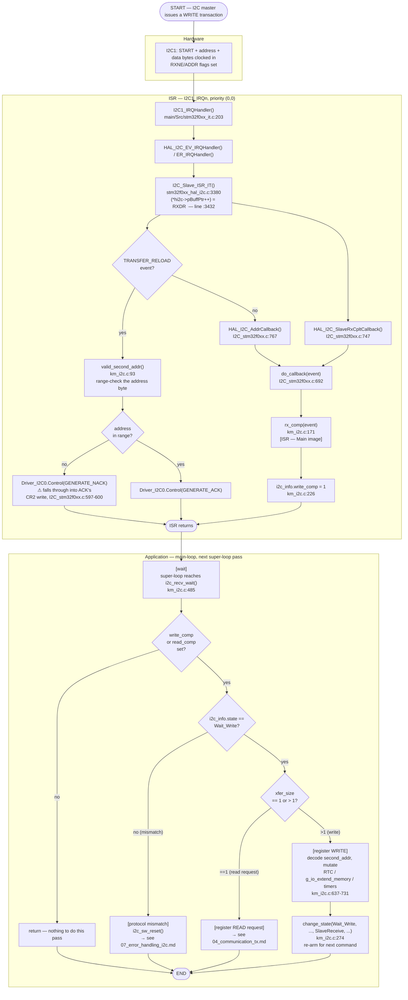

# Activity Diagram — Communication RX (ghi thanh ghi qua I2C)

Swimlanes: **Hardware**, **ISR**, **Application**. Không tồn tại node
RTOS/queue/semaphore nào trong firmware này (`03_execution_model.md` §8) —
việc chuyển giao từ ISR sang main-loop là một cờ (flag) polling đơn giản,
được thể hiện rõ ràng như một node "wait" thay vì biểu tượng queue/semaphore.

## Traceability

| Node | Function | File:Line |
|---|---|---|
| I2C1_IRQHandler | `I2C1_IRQHandler` | `main/Src/stm32f0xx_it.c:203` |
| I2C_Slave_ISR_IT (byte copy) | `I2C_Slave_ISR_IT` | `common/Drivers/STM32F0xx_HAL_Driver/Src/stm32f0xx_hal_i2c.c:3432` |
| HAL_I2C_AddrCallback | `HAL_I2C_AddrCallback` | `common/Drivers/CMSIS/.../I2C_stm32f0xx.c:767` |
| HAL_I2C_SlaveRxCpltCallback | `HAL_I2C_SlaveRxCpltCallback` | `I2C_stm32f0xx.c:747` |
| do_callback | `do_callback` | `I2C_stm32f0xx.c:692` |
| rx_comp | `rx_comp` | `main/App/km_i2c.c:171` |
| valid_second_addr | `valid_second_addr` | `main/App/km_i2c.c:93` |
| I2Cx_Control NACK/ACK fallthrough | `I2Cx_Control` | `I2C_stm32f0xx.c:597-600` — see `05_data_flow.md` §5 item 5 |
| i2c_recv_wait | `i2c_recv_wait` | `main/App/km_i2c.c:485` |
| change_state | `change_state` | `main/App/km_i2c.c:274` |
| i2c_sw_reset | `i2c_sw_reset` | `main/App/km_i2c.c:356` |
