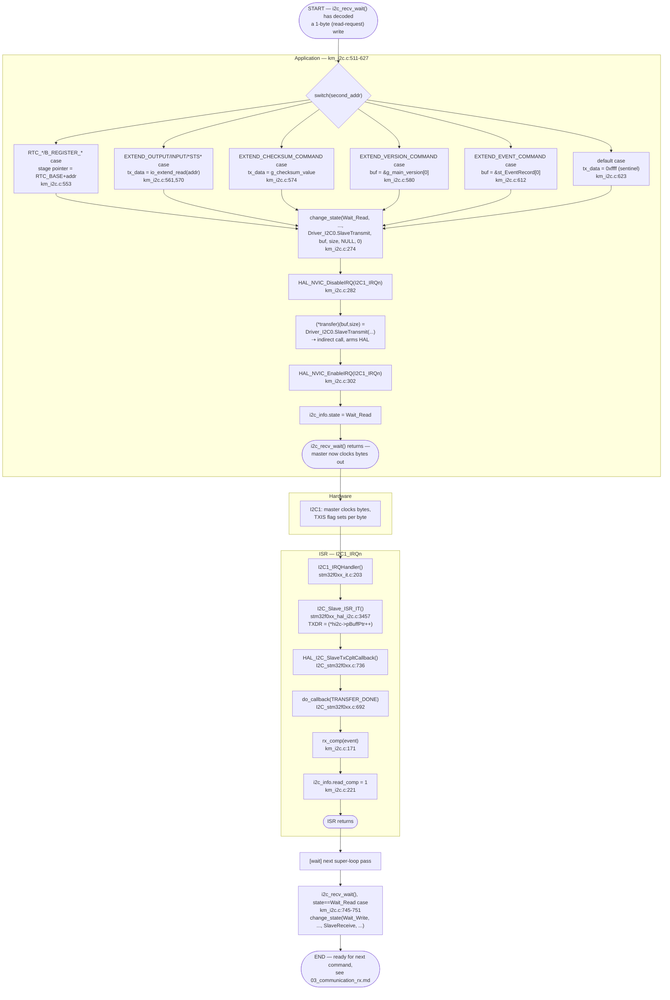

# Activity Diagram — Communication TX (phản hồi đọc thanh ghi qua I2C)

Swimlanes: **Hardware**, **ISR**, **Application**. Là phần tiếp theo của
nhánh `XFERSIZE == 1` trong `03_communication_rx.md`.

## Traceability

| Node | Function | File:Line |
|---|---|---|
| i2c_recv_wait (read dispatch) | `i2c_recv_wait` | `main/App/km_i2c.c:511-627` |
| change_state | `change_state` | `main/App/km_i2c.c:274` |
| Driver_I2C0.SlaveTransmit (indirect) | `I2C0_SlaveTransmit` via `ARM_DRIVER_I2C` struct | `common/Drivers/CMSIS/.../I2C_stm32f0xx.c:777-790` (`04_call_graph.md` §3.4) |
| I2C1_IRQHandler | `I2C1_IRQHandler` | `main/Src/stm32f0xx_it.c:203` |
| I2C_Slave_ISR_IT (TXDR write) | `I2C_Slave_ISR_IT` | `stm32f0xx_hal_i2c.c:3457` |
| HAL_I2C_SlaveTxCpltCallback | `HAL_I2C_SlaveTxCpltCallback` | `I2C_stm32f0xx.c:736` |
| rx_comp | `rx_comp` | `main/App/km_i2c.c:171` |
