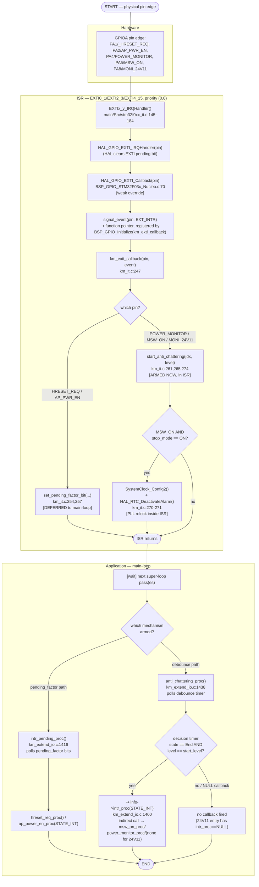

# Activity Diagram — Interrupt Processing (sự kiện tín hiệu GPIO/EXTI)

Swimlanes: **Hardware**, **ISR**, **Application**. Bao phủ cả 5 ngõ vào
vật lý có debounce/được trì hoãn xử lý (`03_execution_model.md` §4.2).

## Traceability

| Node | Function | File:Line |
|---|---|---|
| EXTIx_y_IRQHandler | `EXTI0_1_IRQHandler`/`EXTI2_3_IRQHandler`/`EXTI4_15_IRQHandler` | `main/Src/stm32f0xx_it.c:145-184` |
| HAL_GPIO_EXTI_Callback | `HAL_GPIO_EXTI_Callback` | `common/Drivers/BSP/Src/BSP_GPIO_STM32F03x_Nucleo.c:70` |
| km_exti_callback | `km_exti_callback` | `main/App/km_it.c:247` |
| set_pending_factor_bit | `set_pending_factor_bit` | `main/App/km_it.c:186` (calls at `:254,257`) |
| start_anti_chattering | `start_anti_chattering` | `main/App/km_it.c:489` |
| intr_pending_proc | `intr_pending_proc` | `main/App/km_extend_io.c:1416` |
| anti_chattering_proc | `anti_chattering_proc` | `main/App/km_extend_io.c:1438` |
