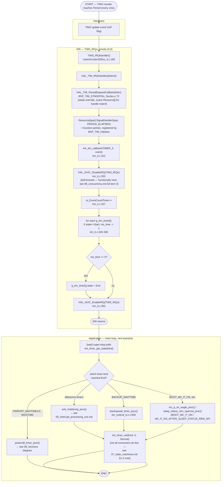

# Activity Diagram — Timer Event Processing (tick TIM3 1ms, Main image)

Swimlanes: **Hardware**, **ISR**, **Application**.

## Traceability

| Node | Function | File:Line |
|---|---|---|
| TIM3_IRQHandler | `TIM3_IRQHandler` | `main/Src/stm32f0xx_it.c:189` |
| HAL_TIM_PeriodElapsedCallback | `HAL_TIM_PeriodElapsedCallback` | `common/Drivers/BSP/Src/BSP_TIM_STM32F03x_Nucleo.c:72` |
| km_tim_callback | `km_tim_callback` | `main/App/km_it.c:312` |
| km_timer_get_state | `km_timer_get_state` | `main/App/km_it.c:417` |
| km_timer_set | `km_timer_set` | `main/App/km_it.c:384` |
| poweroff_timer_proc | `poweroff_timer_proc` | `main/App/km_extend_io.c:1305` |
| backupwait_timer_proc | `backupwait_timer_proc` | `main/App/km_extend_io.c:1350` |
