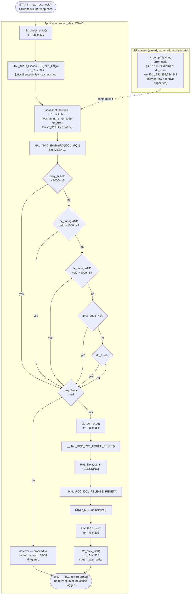

# Activity Diagram — Error Handling (lỗi giao tiếp I2C)

Swimlanes: **Hardware**, **ISR**, **Application**. Tương ứng với
`10_error_recovery.md` §2.1.

## Alternative trigger — reset do master yêu cầu (không có lỗi nào cả)

I2C master có thể đi thẳng tới cùng node `i2c_sw_reset()` này, mà không
cần đi qua bất kỳ bước kiểm tra timeout/lỗi nào, bằng cách ghi
`EXTEND_RESET_I2C` (`km_i2c.c:720-723`) — được thể hiện như một điểm vào
riêng biệt tại node `WRITEPATH` trong `03_communication_rx.md`.

## Traceability

| Node | Function | File:Line |
|---|---|---|
| i2c_check_error | `i2c_check_error` | `main/App/km_i2c.c:379` |
| i2c_sw_reset | `i2c_sw_reset` | `main/App/km_i2c.c:356` |
| i2c_recv_first | `i2c_recv_first` | `main/App/km_i2c.c:317` |
| MX_I2C1_Init | `MX_I2C1_Init` | `main/Src/mx_init.c:202` |
