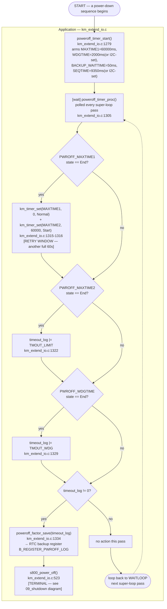

# Activity Diagram — Recovery (cơ chế failsafe timeout khi tuần tự tắt nguồn)

Swimlanes: **Application** duy nhất (toàn bộ cơ chế này được điều khiển
bởi main-loop/software timer — xem `06_timer_event_processing.md` để biết
cách `g_km_timer[]` bên dưới đếm tick). Tương ứng với `10_error_recovery.md`
§2.8 và phát hiện "chuỗi timeout ~120s" tại `09_timing.md` §3.

## Note on the "retry" node

`REARM2` là thứ duy nhất trong sơ đồ này giống một cơ chế retry — nhưng nó
không phải là việc thử lại một thao tác thất bại; đó là một **bộ đếm
ngược 60 giây độc lập, thứ hai**, được xếp chồng sau bộ đếm đầu tiên, tạo
ra một mức trần kết hợp ~120s trước khi `TMOUT_LIMIT` thực sự được ghi
nhận (`09_timing.md` §3). Không có backoff tăng dần và không có bộ đếm số
lần retry — chuỗi này chỉ có đúng một lần gia hạn, luôn cùng một độ dài.

## Traceability

| Node | Function | File:Line |
|---|---|---|
| poweroff_timer_start | `poweroff_timer_start` | `main/App/km_extend_io.c:1279` |
| poweroff_timer_proc | `poweroff_timer_proc` | `main/App/km_extend_io.c:1305` |
| poweroff_factor_save | `poweroff_factor_save` | `main/App/km_extend_io.c:144` |
| s800_power_off | `s800_power_off` | `main/App/km_extend_io.c:523` |
