# Activity Diagram — Shutdown (chuỗi tắt nguồn S800)

Swimlanes: **Application**, **Hardware** (reset cuối cùng). Đây là node
terminal duy nhất mà mọi sơ đồ error/failsafe trong bộ tài liệu này (`07`,
`08`, cộng với nhánh `hreset_req_proc` của `05`) cuối cùng đều dẫn đến.

```mermaid
flowchart TD
    START(["START — s800_power_off() called\n(4 call sites — see 04_call_graph.md §2.9\nand the 06_event_flow.md E23 amendment)"])

    subgraph APPL["Application — km_extend_io.c:523-563"]
        SETSTATUS["set_ca72_status(CA72_OFF)<br/>km_extend_io.c:528"]
        CLEARFLAG["g_first_power_on = START<br/>km_extend_io.c:530"]
        PWROFFINIT["poweroff_timer_init()<br/>km_extend_io.c:533"]
        CLEARPEND["clear_pending_factor_bit(All)<br/>km_extend_io.c:535"]
        DISABLEEXTI["NVIC_DisableIRQ ×3<br/>(EXTI0_1/2_3/4_15)<br/>km_extend_io.c:538-540<br/>[RAW BYPASS — see 08_concurrency.md §3 item 6]"]
        DEASSERT["/RESET = LOW<br/>SB_PWR_EN = LOW<br/>km_extend_io.c:543,546"]
        BOOTBIT["g_io_extend_memory[Internal_Sts0]\n|= BOOT_STATES_REBOOT<br/>km_extend_io.c:547"]
        CLEARREF["init_ei_ref()<br/>km_extend_io.c:549"]
        OUTINIT["extend_output_init()<br/>km_extend_io.c:551"]
        FLAGS["g_24v_check_flg_off = ACTIVE\ng_internal_sts_boot_flg = 0"]
        GETMODEL["get_model()<br/>km_extend_io.c:554"]
        SLEEPREM["sleep_status_rem_proc(model)<br/>km_extend_io.c:555<br/>⇒ jump table, drives SLEEP_STATUS_REM low"]
        DELAY["HAL_Delay(500ms)<br/>km_extend_io.c:558<br/>[BLOCKING — entire super-loop stalled]"]
    end

    subgraph HW["Hardware"]
        RESET["HAL_NVIC_SystemReset()<br/>km_extend_io.c:560<br/>[TERMINAL]"]
        NEXTBOOT["→ 01_boot_and_hw_init.md<br/>(reset cause NOT distinguishable\nfrom POR/pin/IWDG — 06_event_flow.md §2)"]
    end

    START --> SETSTATUS --> CLEARFLAG --> PWROFFINIT --> CLEARPEND
    CLEARPEND --> DISABLEEXTI --> DEASSERT --> BOOTBIT --> CLEARREF
    CLEARREF --> OUTINIT --> FLAGS --> GETMODEL --> SLEEPREM --> DELAY
    DELAY --> RESET --> NEXTBOOT
```

## Traceability

| Node | Function | File:Line |
|---|---|---|
| s800_power_off | `s800_power_off` | `main/App/km_extend_io.c:523` |
| set_ca72_status | `set_ca72_status` | `main/App/km_ca72_status.c:22` |
| clear_pending_factor_bit | `clear_pending_factor_bit` | `main/App/km_it.c:202` |
| sleep_status_rem_proc | `sleep_status_rem_proc` | `main/App/km_extend_io.c:1055` |
| HAL_NVIC_SystemReset | (CMSIS/HAL) | called at `main/App/km_extend_io.c:560` |
