# Activity Diagram — Cập nhật firmware qua IAP

Swimlanes: **Application (Main image)**, **Application (IAP image)**,
**ISR (IAP image)**, **Hardware**. Trải dài trên cả hai firmware image —
`04_call_graph.md` §2.9-§2.11 và §5, `10_error_recovery.md` §2.9-§2.10.

```mermaid
flowchart TD
    START(["START — I2C master writes IAP_PG_COMMAND"])

    subgraph MAIN["Application — Main image"]
        MAGICCHK{"data ==\nIAP_PG_COMMAND_MAGICNUM\n(0x11223344)?"}
        DEINIT["DeInit()<br/>entry.c:186<br/>stop TIM3, uninit I2C0 driver,\ndisable RTC alarm"]
        JUMP["jump2iap()<br/>entry.c:159<br/>[SOFTWARE JUMP — no core reset]"]
    end

    subgraph IAPAPP["Application — IAP image"]
        IAPBOOT["IAP main() runs<br/>(NOT via Reset_Handler)<br/>entry_iap.c:39"]
        VECRELOC["copy vector table to SRAM 0x20000000<br/>+ __HAL_SYSCFG_REMAPMEMORY_SRAM()<br/>entry_iap.c:55-68"]
        IAPLOOP["IAP super-loop:<br/>i2c_recv_wait() / BSP_WDT_Refresh()<br/>entry_iap.c:73-77"]
        MAGIC2["master re-sends IAP_PG_COMMAND magic<br/>km_i2c_iap.c:313-322"]
        ERASE["main_project_flash_erase()<br/>km_i2c_iap.c:435<br/>⇢ Driver_Flash0.EraseSector (indirect)"]
        SETIAP["g_iap_reg[CHANGE_STATUS] |= IAP bit"]
        DATALOOP["[loop] master streams\nIAP_PG_COMMAND_DATA writes"]
        RANGECHK{"g_dest_addr in\n[MAIN_APPLICATION_ADDRESS,\n+MAIN_APPLICATION_SIZE)?"}
        FLASHWRITE["flash_write_32()<br/>km_i2c_iap.c:413<br/>⇢ Driver_Flash0.ProgramData (indirect)"]
        PSCPUERR["g_iap_reg[CHANGE_STATUS] |= PSCPU_ERR<br/>km_i2c_iap.c:373<br/>[ERROR — recorded, not enforced]"]
        COMPLETE["master writes IAP_PG_COMMAND_CHANGE_INFO\nwith COMP bit set"]
        CHKSUM["check_sum_calc()<br/>km_i2c_iap.c:456"]
        CHKMATCH{"checksum\nmatches?"}
        CHKERR["g_iap_reg[CHANGE_STATUS] |= CHKSUM_ERR<br/>km_i2c_iap.c:339<br/>[ERROR — recorded, not enforced]"]
        REREAD["checksum_calc() / GetVersionString()<br/>re-read the new image<br/>km_i2c_iap.c:345-346"]
        WAITMSW["[wait] master releases MSW_ON"]
    end

    subgraph ISRIAP["ISR — IAP image, EXTI4_15"]
        MSWPROC["msw_on_proc_iap()<br/>km_extend_io_iap.c:28"]
        COMPCHK{"MSW_ON released AND\nCHANGE_INFO COMP bit set?<br/>⚠ CHKSUM_ERR/PSCPU_ERR\nNOT checked here"}
        SYSRESET["HAL_NVIC_SystemReset()<br/>km_extend_io_iap.c:37<br/>[TERMINAL]"]
    end

    subgraph HW["Hardware"]
        NEXTBOOT["→ 01_boot_and_hw_init.md<br/>(Main image, now updated —\nregardless of verification outcome\nunless master intervened)"]
    end

    START --> MAGICCHK
    MAGICCHK -- no --> END1(["no-op — dummy 0xffff reply"])
    MAGICCHK -- yes --> DEINIT --> JUMP --> IAPBOOT --> VECRELOC --> IAPLOOP
    IAPLOOP --> MAGIC2 --> ERASE --> SETIAP --> DATALOOP --> RANGECHK
    RANGECHK -- yes --> FLASHWRITE --> DATALOOP
    RANGECHK -- no --> PSCPUERR --> DATALOOP
    DATALOOP --> COMPLETE --> CHKSUM --> CHKMATCH
    CHKMATCH -- no --> CHKERR --> REREAD
    CHKMATCH -- yes --> REREAD
    REREAD --> WAITMSW --> MSWPROC --> COMPCHK
    COMPCHK -- yes --> SYSRESET --> NEXTBOOT
    COMPCHK -- no --> WAITMSW
```

## Traceability

| Node | Function | File:Line |
|---|---|---|
| jump2iap | `jump2iap` | `main/App/entry.c:159` |
| DeInit | `DeInit` | `main/App/entry.c:186` |
| IAP main | `main` | `iap/App/entry_iap.c:39` |
| main_project_flash_erase | `main_project_flash_erase` | `iap/App/km_i2c_iap.c:435` |
| flash_write_32 | `flash_write_32` | `iap/App/km_i2c_iap.c:413` |
| check_sum_calc | `check_sum_calc` | `iap/App/km_i2c_iap.c:456` |
| msw_on_proc_iap | `msw_on_proc_iap` | `iap/App/km_extend_io_iap.c:28` |
| HAL_NVIC_SystemReset call | — | `iap/App/km_extend_io_iap.c:37` |

## Error-flow note

Quyết định `COMPCHK` trong ISR swimlane là node quan trọng nhất trong toàn
bộ sơ đồ này: đây là cổng kiểm tra *duy nhất* giữa "một bản cập nhật
firmware vừa xảy ra" và "hệ thống reset vào bất kỳ thứ gì vừa được ghi",
và nó chỉ kiểm tra bit hoàn tất (completion bit) — không bao giờ kiểm tra
`CHKSUM_ERR` hay `PSCPU_ERR` (`10_error_recovery.md` §2.9-§2.10). Điều này
được vẽ tường minh thành một node quyết định có nhãn riêng thay vì gộp vào
`SYSRESET`, chính là để làm cho khoảng hở này hiển thị rõ ngay trong sơ đồ.
