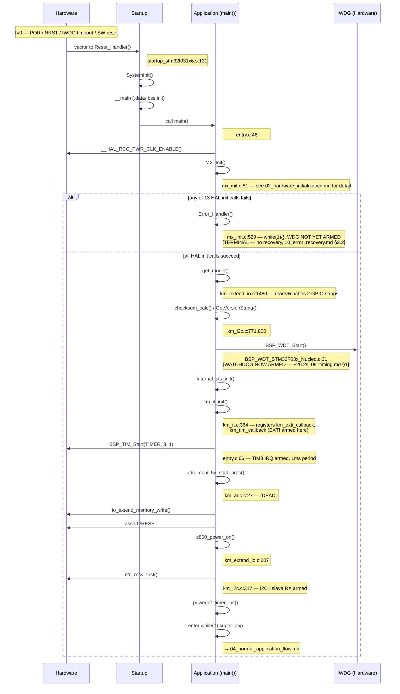

# Sequence Diagram — Boot (image Main)

Các participant được dùng: **Hardware**, **Startup**, **Application**. Các
participant `RTOS`/`Task` bị lược bỏ — xem `03_rtos_startup.md` để biết ghi
chú xác nhận-vắng-mặt rõ ràng. Timing chỉ được thể hiện khi có căn cứ từ
source (`09_timing.md`); mọi thứ khác đều là `[TIMING UNKNOWN]`.

## Traceability

| Message | Function | File:Line |
|---|---|---|
| vector to Reset_Handler | `Reset_Handler` | `main/MDK-ARM/startup_stm32f031x6.s:131` |
| call main() | `main` | `main/App/entry.c:46` |
| MX_Init() | `MX_Init` | `main/Src/mx_init.c:81` |
| Error_Handler() | `Error_Handler` | `main/Src/mx_init.c:529` |
| get_model() | `get_model` | `main/App/km_extend_io.c:1480` |
| BSP_WDT_Start() | `BSP_WDT_Start` | `common/Drivers/BSP/Src/BSP_WDT_STM32F03x_Nucleo.c:31` |
| km_it_init() | `km_it_init` | `main/App/km_it.c:364` |
| s800_power_on() | `s800_power_on` | `main/App/km_extend_io.c:607` |
| i2c_recv_first() | `i2c_recv_first` | `main/App/km_i2c.c:317` |
