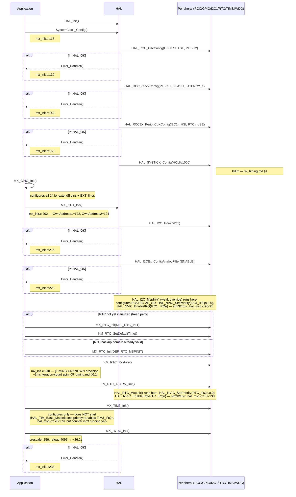

# Sequence Diagram — Hardware Initialization (chi tiết `MX_Init()`)

Các participant: **Application**, **HAL**, **Peripheral** (thanh ghi
RCC/GPIO/I2C1/RTC/TIM3/IWDG), **Hardware**. Mở rộng chi tiết khối
`MX_Init()` từ `01_boot_sequence.md`.

## Traceability

| Message | Function | File:Line |
|---|---|---|
| SystemClock_Config | `SystemClock_Config` | `main/Src/mx_init.c:113` |
| MX_I2C1_Init | `MX_I2C1_Init` | `main/Src/mx_init.c:202` |
| HAL_I2C_MspInit (EXTI/NVIC config) | `HAL_I2C_MspInit` | `main/Src/stm32f0xx_hal_msp.c:66-97` |
| MX_RTC_Init | `MX_RTC_Init` | `main/Src/mx_init.c` (declared `:70`) |
| KM_RTC_Restore | `KM_RTC_Restore` | `main/Src/mx_init.c:310` |
| HAL_RTC_MspInit | `HAL_RTC_MspInit` | `main/Src/stm32f0xx_hal_msp.c:126-144` |
| MX_TIM3_Init | `MX_TIM3_Init` | `main/Src/mx_init.c:185` (declared `:64`) |
| MX_IWDG_Init | `MX_IWDG_Init` | `main/Src/mx_init.c:229` |
