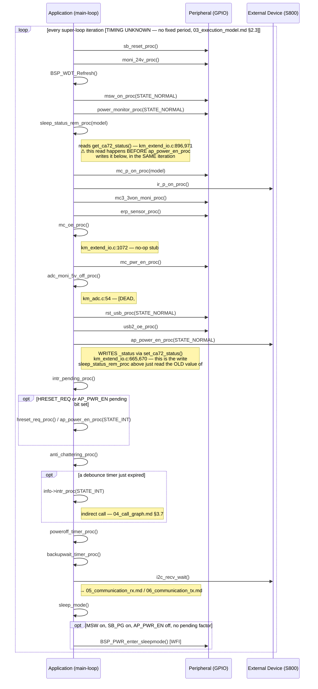

# Sequence Diagram — Normal Application Flow (một vòng lặp super-loop)

Các participant: **Application** (thân của super-loop), **Peripheral**
(các chân GPIO được đọc/ghi xuyên suốt), **External Device** (SoC S800, mà
một số giai đoạn đọc chân của nó). Chi tiết đầy đủ theo từng giai đoạn đã
có sẵn trong `docs/diagrams/04_activity/02_main_application_loop.md` — sơ
đồ này thể hiện cùng một vòng lặp đó dưới dạng trao đổi message thay vì
flowchart, nhằm làm rõ ra **hiểm hoạ về thứ tự đọc-trước-ghi (read-before-
write ordering hazard)** như một sự thật về thứ tự message.

## Traceability

| Message | Function | File:Line |
|---|---|---|
| sleep_status_rem_proc | `sleep_status_rem_proc` | `main/App/km_extend_io.c:1055` |
| ap_power_en_proc | `ap_power_en_proc` | `main/App/km_extend_io.c:658` |
| intr_pending_proc | `intr_pending_proc` | `main/App/km_extend_io.c:1416` |
| anti_chattering_proc | `anti_chattering_proc` | `main/App/km_extend_io.c:1438` |
| i2c_recv_wait | `i2c_recv_wait` | `main/App/km_i2c.c:485` |
| sleep_mode | `sleep_mode` | `main/App/km_extend_io.c:1395` |

`Note` trên `sleep_status_rem_proc`/`ap_power_en_proc` ghi lại phát hiện về
độ trễ-một-vòng-lặp (one-iteration staleness) đã được xác định lần đầu
trong `04_call_graph.md` §2.2 và `05_data_flow.md` §5.1 — được đưa vào đây
vì sequence diagram chính là loại artifact có thể làm cho một hiểm hoạ về
thứ tự message trong cùng một vòng lặp trở nên hiển hiện ngay lập tức.
