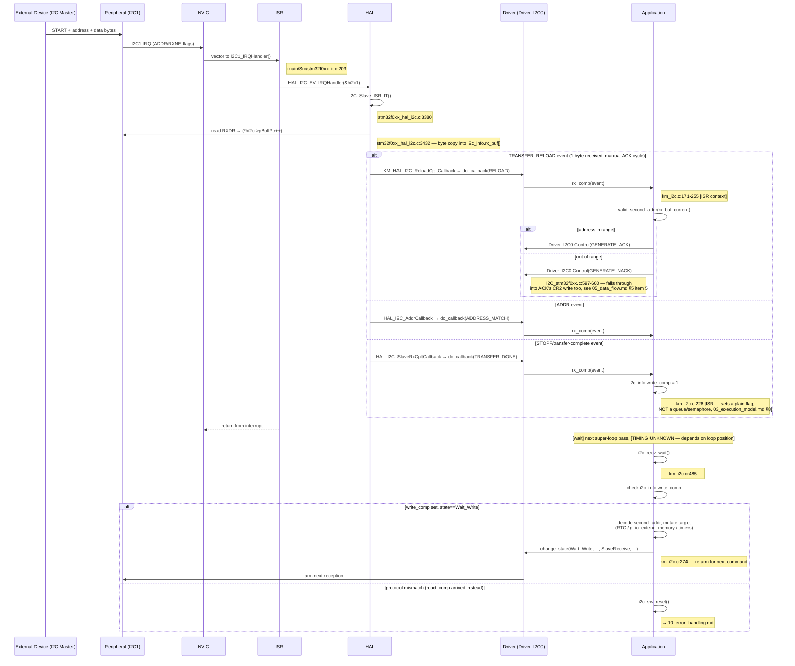

# Sequence Diagram — Communication RX (ghi thanh ghi qua I2C)

Các participant: **External Device** (I2C Master), **Peripheral** (I2C1),
**NVIC**, **ISR**, **HAL**, **Driver** (CMSIS `Driver_I2C0`), **Application**.

## Traceability

| Message | Function | File:Line |
|---|---|---|
| I2C1_IRQHandler | `I2C1_IRQHandler` | `main/Src/stm32f0xx_it.c:203` |
| I2C_Slave_ISR_IT | `I2C_Slave_ISR_IT` | `stm32f0xx_hal_i2c.c:3380,3432` |
| rx_comp | `rx_comp` | `main/App/km_i2c.c:171` |
| valid_second_addr | `valid_second_addr` | `main/App/km_i2c.c:93` |
| I2Cx_Control | `I2Cx_Control` | `I2C_stm32f0xx.c:552-608` |
| i2c_recv_wait | `i2c_recv_wait` | `main/App/km_i2c.c:485` |
| change_state | `change_state` | `main/App/km_i2c.c:274` |
