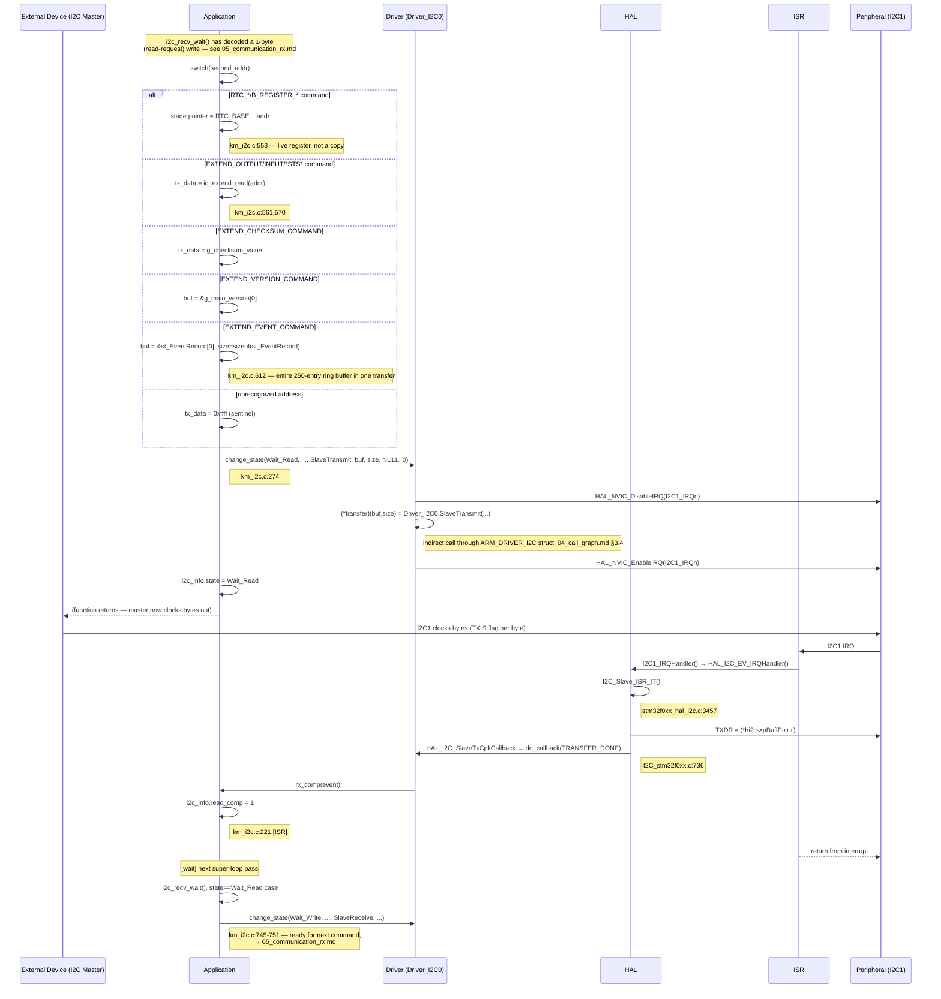

# Sequence Diagram — Communication TX (phản hồi đọc thanh ghi qua I2C)

Các participant: **External Device** (I2C Master), **Application**,
**Driver** (`Driver_I2C0`), **HAL**, **ISR**, **Peripheral** (I2C1).

## Traceability

| Message | Function | File:Line |
|---|---|---|
| change_state (arm transmit) | `change_state` | `main/App/km_i2c.c:274` |
| Driver_I2C0.SlaveTransmit | `I2C0_SlaveTransmit` (via `ARM_DRIVER_I2C`) | `I2C_stm32f0xx.c:777-790` |
| I2C_Slave_ISR_IT (TXDR write) | `I2C_Slave_ISR_IT` | `stm32f0xx_hal_i2c.c:3457` |
| HAL_I2C_SlaveTxCpltCallback | `HAL_I2C_SlaveTxCpltCallback` | `I2C_stm32f0xx.c:736` |
| rx_comp | `rx_comp` | `main/App/km_i2c.c:171` |
| i2c_recv_wait (re-arm) | `i2c_recv_wait` | `main/App/km_i2c.c:745-751` |
