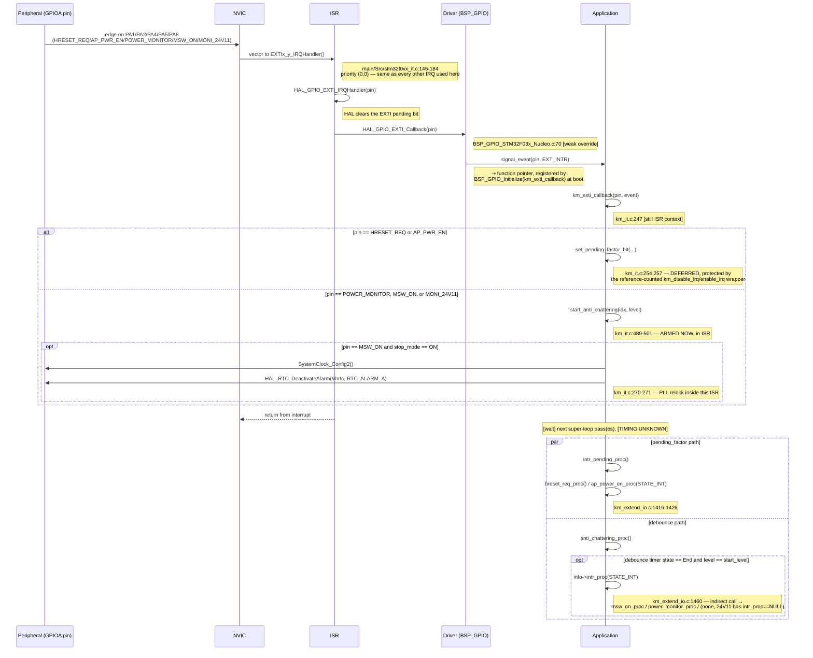

# Sequence Diagram — Interrupt Processing (GPIO/EXTI)

Các participant: **External Device / Peripheral** (chân vật lý), **NVIC**,
**ISR**, **Driver** (lớp BSP GPIO), **Application**.

## Traceability

| Message | Function | File:Line |
|---|---|---|
| EXTIx_y_IRQHandler | `EXTI0_1_IRQHandler`/`EXTI2_3_IRQHandler`/`EXTI4_15_IRQHandler` | `main/Src/stm32f0xx_it.c:145-184` |
| HAL_GPIO_EXTI_Callback | `HAL_GPIO_EXTI_Callback` | `BSP_GPIO_STM32F03x_Nucleo.c:70` |
| km_exti_callback | `km_exti_callback` | `main/App/km_it.c:247` |
| set_pending_factor_bit | `set_pending_factor_bit` | `main/App/km_it.c:186` |
| start_anti_chattering | `start_anti_chattering` | `main/App/km_it.c:489` |
| intr_pending_proc | `intr_pending_proc` | `main/App/km_extend_io.c:1416` |
| anti_chattering_proc | `anti_chattering_proc` | `main/App/km_extend_io.c:1438` |
