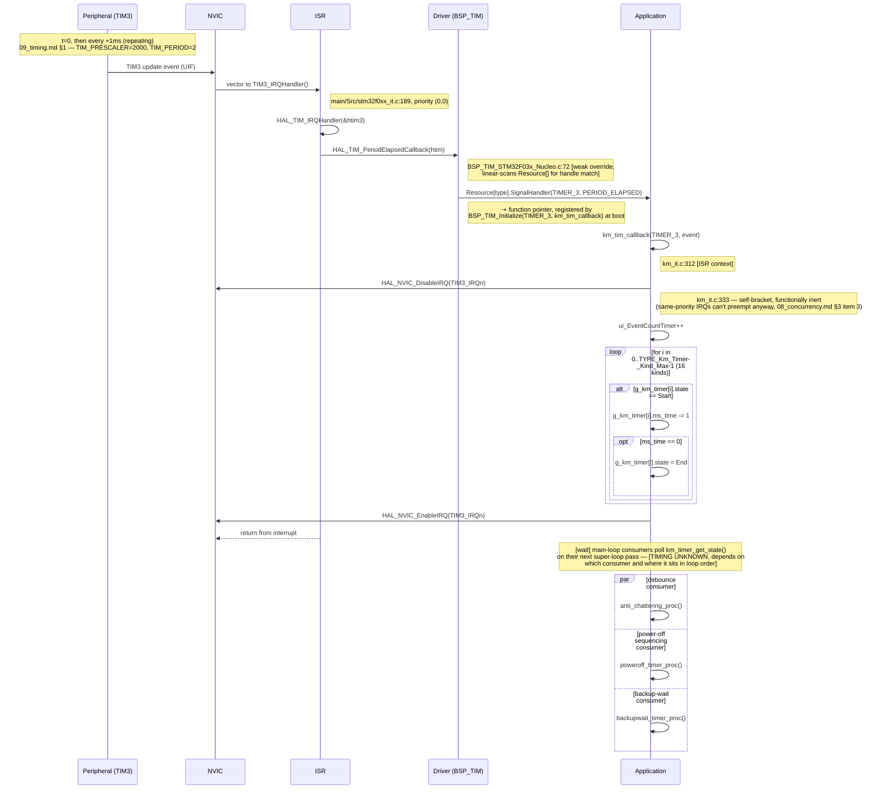

# Sequence Diagram — Timer Event (tick 1ms của TIM3, image Main)

Các participant: **Peripheral** (TIM3), **NVIC**, **ISR**, **Driver**
(BSP_TIM), **Application**.

## Traceability

| Message | Function | File:Line |
|---|---|---|
| TIM3_IRQHandler | `TIM3_IRQHandler` | `main/Src/stm32f0xx_it.c:189` |
| HAL_TIM_PeriodElapsedCallback | `HAL_TIM_PeriodElapsedCallback` | `BSP_TIM_STM32F03x_Nucleo.c:72` |
| km_tim_callback | `km_tim_callback` | `main/App/km_it.c:312` |
| km_timer_get_state (consumers) | `km_timer_get_state` | `main/App/km_it.c:417` |
| poweroff_timer_proc | `poweroff_timer_proc` | `main/App/km_extend_io.c:1305` |
| backupwait_timer_proc | `backupwait_timer_proc` | `main/App/km_extend_io.c:1350` |

**Ghi chú về image IAP:** TIM3 được bật clock và được nạp (arm) vào NVIC
giống hệt như vậy trong image IAP, nhưng `HAL_TIM_Base_Start_IT`/
`BSP_TIM_Start` không bao giờ được gọi ở đó — sequence này không bao giờ
thực sự xảy ra trong IAP
(`03_execution_model.md` §4.3).
