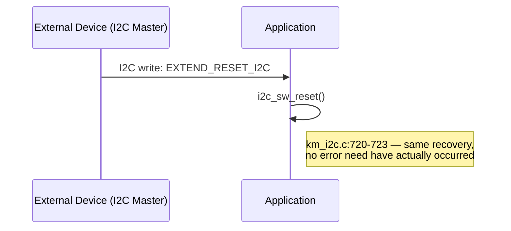

# Sequence Diagram — Error Handling (lỗi giao tiếp I2C)

Các participant: **External Device** (I2C Master, gián tiếp), **Peripheral**
(I2C1), **Application**, **Driver** (`Driver_I2C0`).

```mermaid
sequenceDiagram
    participant EXT as External Device (I2C Master)
    participant PER as Peripheral (I2C1)
    participant APP as Application
    participant DRV as Driver (Driver_I2C0)

    Note over APP: i2c_recv_wait() called this super-loop pass
    APP->>APP: i2c_check_error()
    Note right of APP: km_i2c.c:379
    APP->>PER: HAL_NVIC_DisableIRQ(I2C1_IRQn)
    Note right of APP: km_i2c.c:392 — critical section
    APP->>DRV: Driver_I2C0.GetStatus()
    APP->>APP: snapshot rx/tx_tick_last, rx/tx_during,<br/>error_code, dir_error
    APP->>PER: HAL_NVIC_EnableIRQ(I2C1_IRQn)
    Note right of APP: km_i2c.c:401

    alt busy_tx held > 2000ms
        Note right of APP: 09_timing.md §4 — I2C_ERROR_TIMEOUT_BUSY_TX
        APP->>APP: error detected
    else rx_during held > 1000ms
        APP->>APP: error detected
    else tx_during held > 1000ms
        APP->>APP: error detected
    else error_code != 0 (BERR/ARLO/OVR latched earlier by rx_comp in ISR)
        APP->>APP: error detected
    else dir_error set (protocol direction mismatch)
        APP->>APP: error detected
    else none of the above
        APP-->>APP: no error — proceed to normal dispatch<br/>(05_communication_rx.md / 06_communication_tx.md)
    end

    opt error detected
        APP->>APP: i2c_sw_reset()
        Note right of APP: km_i2c.c:356
        APP->>PER: __HAL_RCC_I2C1_FORCE_RESET()
        APP->>APP: HAL_Delay(2ms)
        Note right of APP: [BLOCKING — 09_timing.md §6]
        APP->>PER: __HAL_RCC_I2C1_RELEASE_RESET()
        APP->>DRV: Driver_I2C0.Uninitialize()
        APP->>PER: MX_I2C1_Init()
        APP->>DRV: i2c_recv_first()
        Note right of APP: km_i2c.c:317 — state=Wait_Write,<br/>fully re-armed. NO retry counter, NO cause logged<br/>(10_error_recovery.md §2.1/§3)
    end

    Note over EXT: master sees the bus reset;<br/>next transaction starts fresh
```

## Nguyên nhân kích hoạt thay thế — yêu cầu tường minh từ master



## Traceability

| Message | Function | File:Line |
|---|---|---|
| i2c_check_error | `i2c_check_error` | `main/App/km_i2c.c:379` |
| i2c_sw_reset | `i2c_sw_reset` | `main/App/km_i2c.c:356` |
| EXTEND_RESET_I2C handling | `i2c_recv_wait` | `main/App/km_i2c.c:720-723` |
