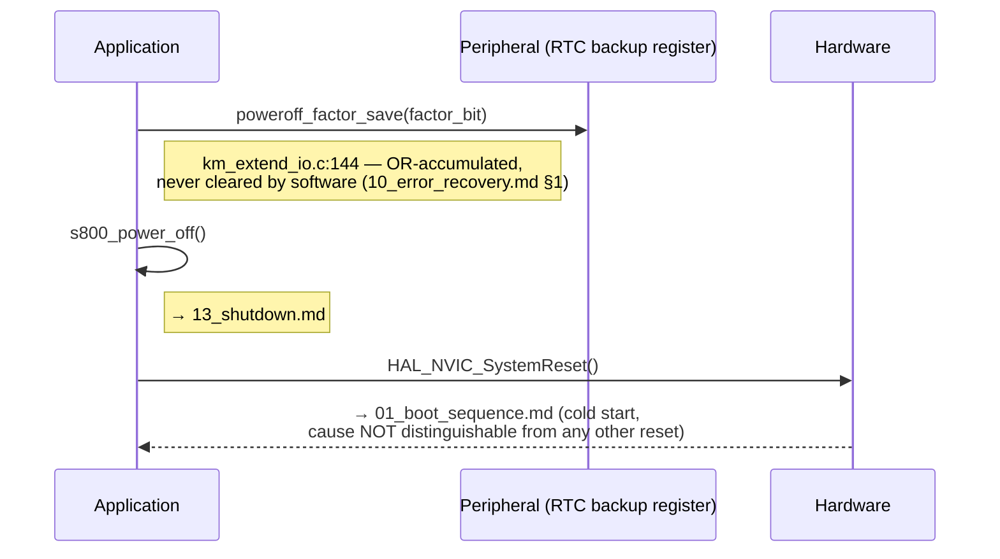

# Sequence Diagram — Recovery

Có hai cơ chế khôi phục (recovery) riêng biệt tồn tại trong firmware này,
được trình bày tách rời vì chúng hoạt động ở phạm vi hoàn toàn khác nhau
(ngoại vi so với toàn hệ thống) và vì một trong số đó (IAP) có một lỗ hổng
thực thi (enforcement gap) đã được ghi nhận.

## 12a — Khôi phục ở phạm vi ngoại vi (I2C)

```mermaid
sequenceDiagram
    participant APP as Application
    participant PER as Peripheral (I2C1)
    participant DRV as Driver (Driver_I2C0)

    APP->>APP: i2c_sw_reset() triggered (10_error_handling.md)
    APP->>PER: force-reset + release I2C1 clock
    APP->>DRV: Driver_I2C0.Uninitialize()
    APP->>PER: MX_I2C1_Init()
    APP->>DRV: i2c_recv_first()
    Note right of APP: km_i2c.c:317 — i2c_info fully re-zeroed,<br/>state=Wait_Write. Recovery is total for this<br/>peripheral; nothing else in the system is affected.
```

## 12b — Khôi phục ở phạm vi toàn hệ thống (failsafe power-off → reset toàn bộ)



## 12c — Lỗ hổng khôi phục IAP (đã phát hiện, KHÔNG được thực thi)

```mermaid
sequenceDiagram
    participant APP as Application (IAP)
    participant ISR as ISR (msw_on_proc_iap)
    participant HW as Hardware

    APP->>APP: check_sum_calc() mismatch detected
    APP->>APP: g_iap_reg[CHANGE_STATUS] |= CHKSUM_ERR
    Note right of APP: km_i2c_iap.c:339 — recorded, readable by master
    Note over ISR: later — MSW_ON released
    ISR->>ISR: msw_on_proc_iap()
    ISR->>ISR: check CHANGE_INFO's COMP bit only
    Note right of ISR: km_extend_io_iap.c:35 —<br/>⚠ CHKSUM_ERR is NEVER consulted here
    ISR->>HW: HAL_NVIC_SystemReset()
    Note right of ISR: proceeds regardless of the recorded error —<br/>10_error_recovery.md §2.9, no automatic recovery exists<br/>for this specific case; only the external master can prevent it
```

## Traceability

| Message | Function | File:Line |
|---|---|---|
| i2c_sw_reset | `i2c_sw_reset` | `main/App/km_i2c.c:356` |
| poweroff_factor_save | `poweroff_factor_save` | `main/App/km_extend_io.c:144` |
| s800_power_off | `s800_power_off` | `main/App/km_extend_io.c:523` |
| check_sum_calc | `check_sum_calc` | `iap/App/km_i2c_iap.c:456` |
| msw_on_proc_iap | `msw_on_proc_iap` | `iap/App/km_extend_io_iap.c:28` |
