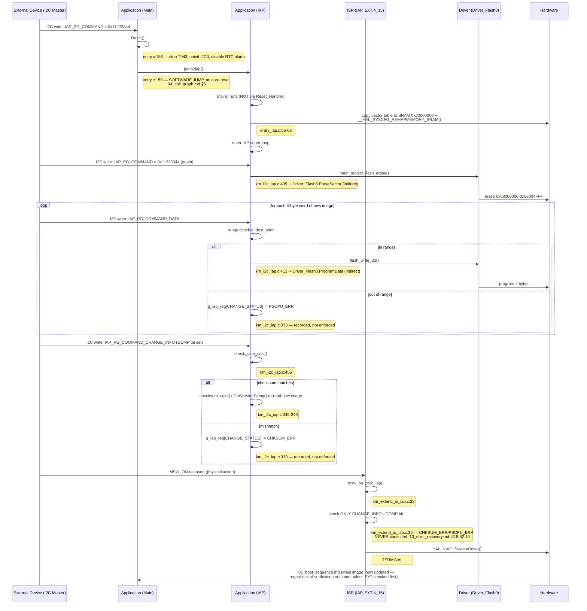

# Sequence Diagram — Cập nhật firmware qua IAP (kịch bản bổ sung, ngoài danh sách tối thiểu)

Được đưa vào vì đây là một trong những năng lực bên ngoài (external
capability) quan trọng nhất của firmware (UC-07, `03_use_cases.md`) và
trải dài trên cả hai image — không có kịch bản đơn lẻ nào trong số 13 kịch
bản mẫu (template) nắm bắt được nó từ đầu đến cuối. Các participant:
**External Device** (I2C Master), **Application (Main)**,
**Application (IAP)**, **ISR (IAP)**, **Driver** (`Driver_Flash0`),
**Hardware**.

## Traceability

| Message | Function | File:Line |
|---|---|---|
| jump2iap | `jump2iap` | `main/App/entry.c:159` |
| DeInit | `DeInit` | `main/App/entry.c:186` |
| IAP main / vector relocation | `main` | `iap/App/entry_iap.c:39,55-68` |
| main_project_flash_erase | `main_project_flash_erase` | `iap/App/km_i2c_iap.c:435` |
| flash_write_32 | `flash_write_32` | `iap/App/km_i2c_iap.c:413` |
| check_sum_calc | `check_sum_calc` | `iap/App/km_i2c_iap.c:456` |
| msw_on_proc_iap | `msw_on_proc_iap` | `iap/App/km_extend_io_iap.c:28` |
