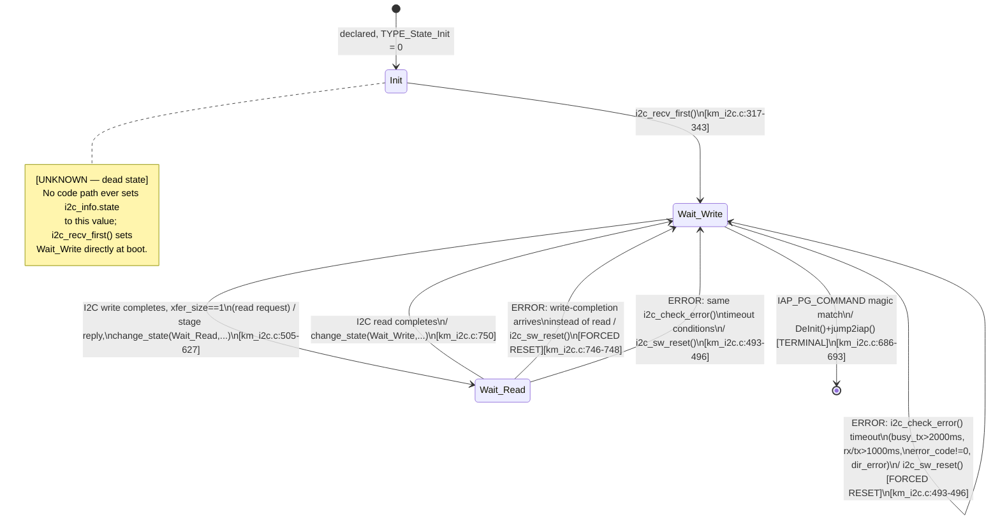

# Sơ đồ trạng thái — Giao thức giao tiếp I2C

**Danh mục: State machine Giao tiếp.** Enum tường minh
(`TYPE_State_Init/Wait_Write/Wait_Read`, `km_i2c.c:49-53`); hình dạng giống
hệt nhau ở image Main và IAP (các instance riêng biệt,
`05_data_flow.md` §2.1). Nguồn: `07_state_machines.md` §1.1.

## Ghi chú

- **Không có state Error tường minh** — mọi lỗi được phát hiện đều buộc
  một transition trực tiếp quay lại `Wait_Write` thông qua `i2c_sw_reset()`
  → `i2c_recv_first()`, chứ không đi qua một state lỗi trung gian được mô
  hình hóa.
- **Hành động entry:** mọi transition vào `Wait_Write` đều tái khởi động
  `Driver_I2C0.SlaveReceive`; mọi transition vào `Wait_Read` đều khởi động
  `Driver_I2C0.SlaveTransmit` — cả hai đều qua `change_state()`
  (`km_i2c.c:274-304`), điểm nút duy nhất cho tất cả những điều trên.
- **Timeout:** 2000ms (busy_tx) / 1000ms (rx) / 1000ms (tx),
  `i2c_check_error()` (`km_i2c.c:381-383`).
- **Retry:** không có.
- **Recovery:** `i2c_sw_reset()` (`km_i2c.c:356-364`).
- Bản sao trong image IAP có thêm hai self-loop `Wait_Write` (để xử lý
  `IAP_PG_COMMAND_DATA`/`_CHANGE_INFO`/`_CHANGE_STATUS`,
  `km_i2c_iap.c:312-378`) nhưng có cùng hình dạng tổng thể, cùng thiếu
  transition `Init`, và cùng đặc điểm không-có-state-lỗi-tường-minh.

## Truy vết

| Transition | Function | File:Line |
|---|---|---|
| Init → Wait_Write | `i2c_recv_first` | `main/App/km_i2c.c:317` |
| Wait_Write → Wait_Read | `i2c_recv_wait` | `main/App/km_i2c.c:505-627` |
| Wait_Write → [*] (IAP jump) | `jump2iap` | `main/App/entry.c:159` |
| Wait_Read → Wait_Write | `i2c_recv_wait` | `main/App/km_i2c.c:750` |
| any → Wait_Write (error) | `i2c_sw_reset` | `main/App/km_i2c.c:356` |
