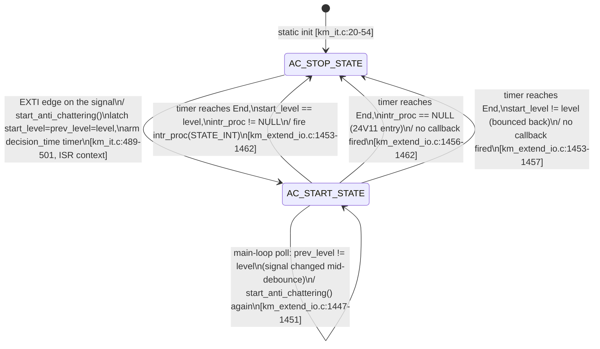
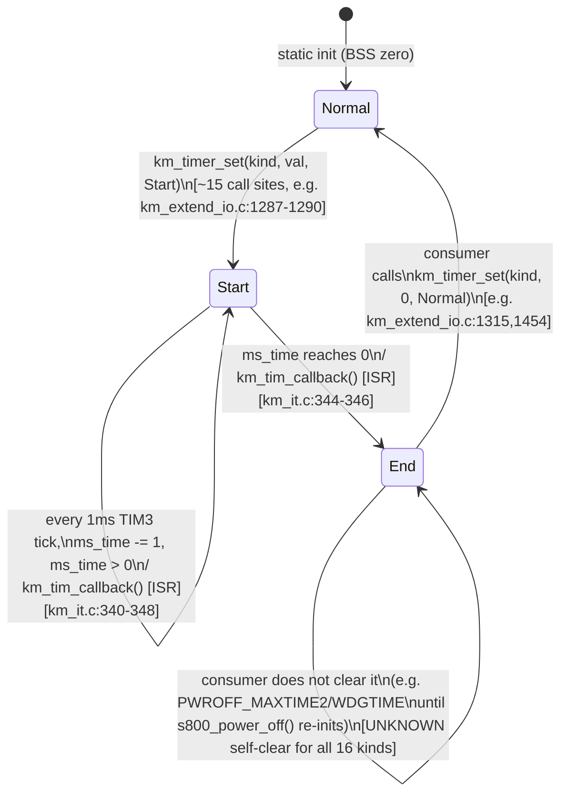
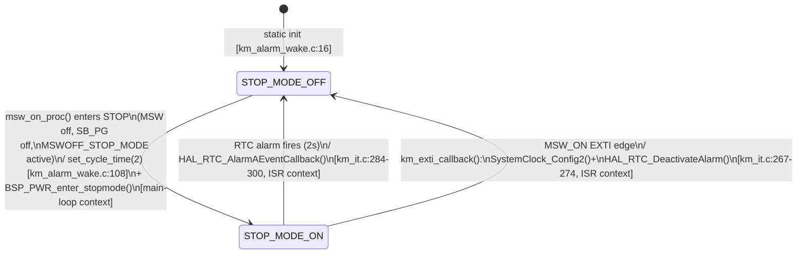
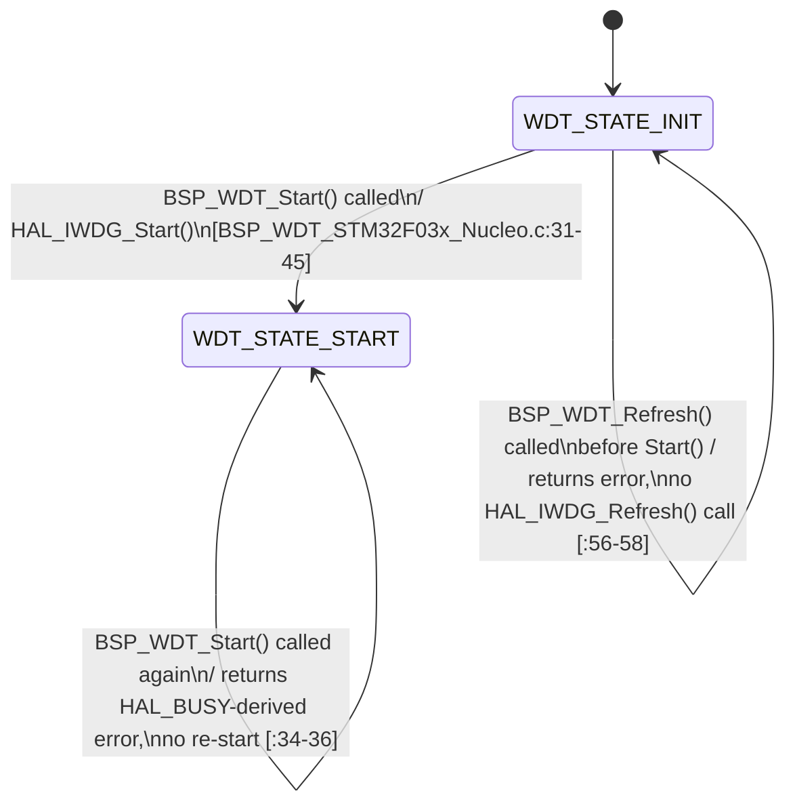

# Sơ đồ trạng thái — State Machine ngoại vi (Peripheral)

**Danh mục: State machine Ngoại vi.** Bốn state machine nhỏ, mỗi cái được
sở hữu bởi một module thuộc lớp BSP/driver chứ không phải logic ứng dụng
cấp cao nhất. Nguồn: `07_state_machines.md` §1.2, §1.3, §1.5, §1.6.

## 3a. Anti-chattering (debounce) — 3 instance (MSW_ON, POWER_MONITOR, MONI_24V11_MONI)

Timeout (decision_time): MSW=10ms, POWER_MONITOR=10ms, MONI_24V11=30ms
(`km_it.h:6-10`). Không có retry, không có state lỗi — chỉ tồn tại 2 state.

## 3b. Mẫu software timer — 1 hình dạng, 16 instance (`g_km_timer[]`)

Hai trong số mười sáu loại (`Rstusb`, `MONI_24V11_ON`) không bao giờ rời
khỏi `Normal` — được khai báo, nhưng không bao giờ được khởi động
(`09_timing.md` §3).

## 3c. Cờ chế độ STOP (`stop_mode`)

Cả hai lối thoát đều xảy ra trong ngữ cảnh ISR; lối vào xảy ra trong ngữ
cảnh main-loop — một state machine 2 trạng thái mà hai cạnh của nó sống
trong hai domain thực thi khác nhau.

## 3d. Chốt (latch) driver IWDG (`WDT_STATE`, lớp BSP)

Một chốt một chiều — không có transition nào quay trở lại
`WDT_STATE_INIT` tồn tại ở bất kỳ đâu (khớp với phần cứng: IWDG không thể
bị dừng lại một khi đã được khởi động, `[HARDWARE ASSUMPTION]`).

## Truy vết

| Machine | Function | File:Line |
|---|---|---|
| Anti-chattering | `start_anti_chattering`, `anti_chattering_proc` | `km_it.c:489`, `km_extend_io.c:1438` |
| Software timer | `km_timer_set`, `km_tim_callback` | `km_it.c:384,312` |
| STOP mode | `set_cycle_time`, `HAL_RTC_AlarmAEventCallback` | `km_alarm_wake.c:41`, `km_it.c:284` |
| IWDG latch | `BSP_WDT_Start`, `BSP_WDT_Refresh` | `BSP_WDT_STM32F03x_Nucleo.c:31,53` |
